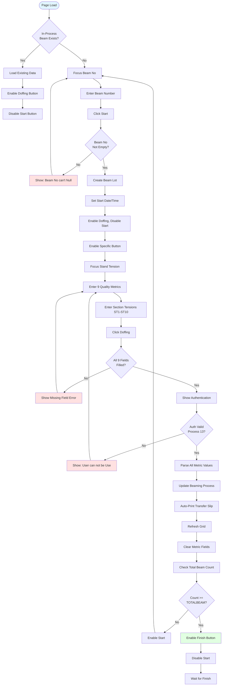
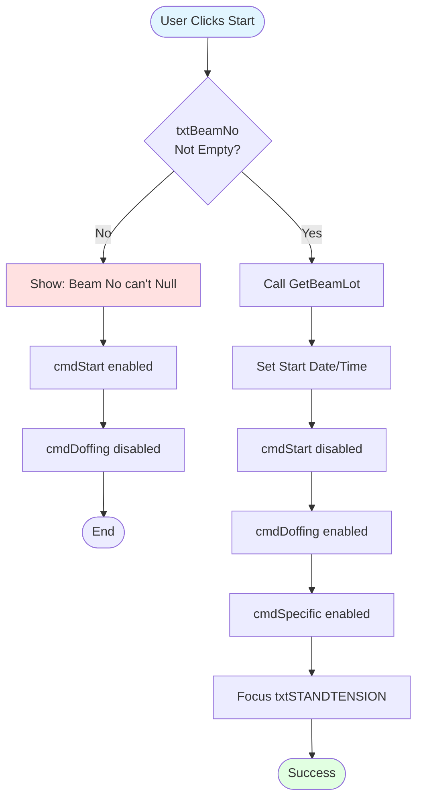
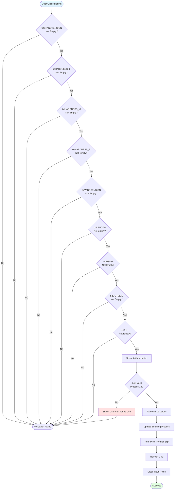
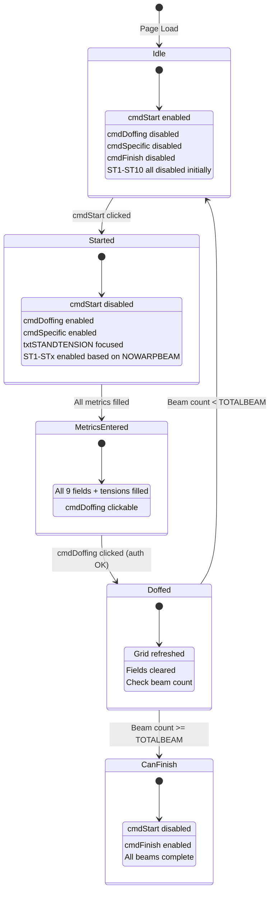
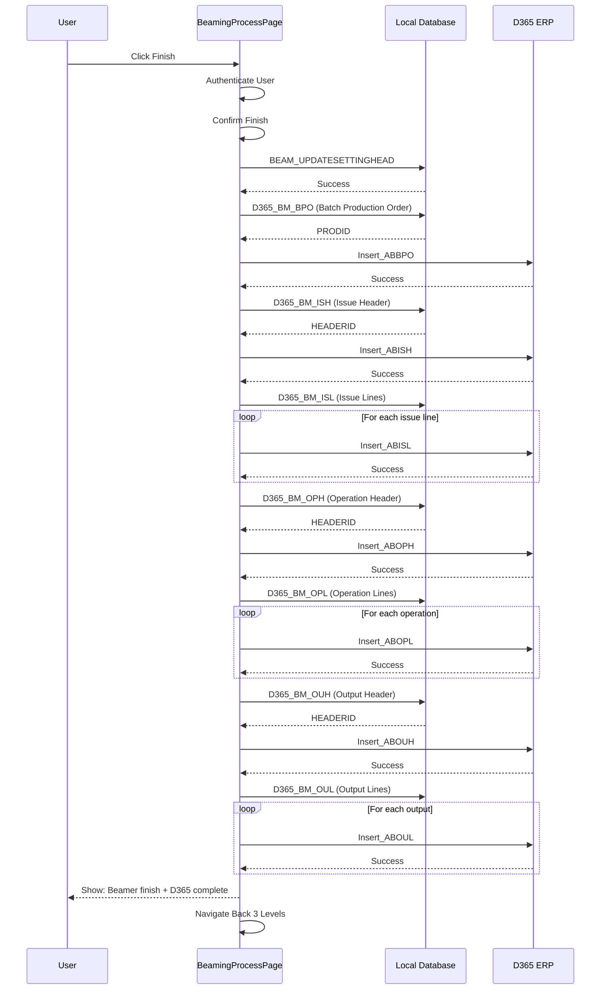

# UI Logic Analysis: Beaming Process Page

**File**: `BeamingProcessPage.xaml` / `BeamingProcessPage.xaml.cs`
**Module**: 03 - Beaming
**Lines of Code**: 2,431 lines (C# code-behind)
**Complexity**: Very High
**Last Updated**: 2025-10-06

---

## 1. Overview

### Purpose
Main beaming production tracking page. This page handles:
- Starting new beam production from warper rolls
- Recording quality metrics (tension, hardness, dimensions)
- Doffing completed beams
- Tracking 10 section tensions (ST1-ST10)
- D365 ERP integration on finish
- Label printing and editing

### Business Context
Beaming is the process of winding yarns from multiple warper beams onto a single large weaver's beam. This is a critical quality control step where tension must be precisely controlled across all sections.

### Key Workflow States
1. **Idle** → Ready for beam input
2. **Started** → Beam started, awaiting doffing
3. **Doffing** → Recording quality metrics and completing beam
4. **Finished** → Entire beamer lot complete

---

## 2. UI Components Summary

### Critical Input Fields (Required for Doffing)

| Control Name | Purpose | Validation |
|--------------|---------|-----------|
| txtBeamNo | Beam number | Required, numeric |
| txtSTANDTENSION | Stand tension | Required, numeric |
| txtHARDNESS_L | Hardness Left | Required, numeric |
| txtHARDNESS_M | Hardness Middle | Required, numeric |
| txtHARDNESS_R | Hardness Right | Required, numeric |
| txtWINDTENSION | Wind tension | Required, numeric |
| txtLENGTH | Beam length | Required, numeric |
| txtINSIDE | Inside diameter | Required, numeric |
| txtOUTSIDE | Outside diameter | Required, numeric |
| txtFULL | Full diameter | Required, numeric |

### Section Tensions (ST1-ST10)
**Conditional**: Number of enabled fields depends on `NOWARPBEAM` value

| Field | Purpose |
|-------|---------|
| txtTENSION_ST1 to txtTENSION_ST10 | Section-specific tension readings |

**EnabledTension Logic** (lines 130-131):
- Dynamically enables tension fields based on number of warp beams
- Example: If NOWARPBEAM = 3, only ST1, ST2, ST3 enabled

---

## 3. Input Flow & Workflow

### Main Production Workflow



---

## 4. Validation Logic

### 4.1 Start Button Validation

**Location**: `cmdStart_Click` (lines 154-177)



---

### 4.2 Doffing Button Validation

**Location**: `cmdDoffing_Click` (lines 183-655)

**Validation Sequence** (9 Required Fields):
1. txtSTANDTENSION must not be empty
2. txtHARDNESS_L must not be empty
3. txtHARDNESS_M must not be empty
4. txtHARDNESS_R must not be empty
5. txtWINDTENSION must not be empty
6. txtLENGTH must not be empty
7. txtINSIDE must not be empty
8. txtOUTSIDE must not be empty
9. txtFULL must not be empty



**If validation passes**:
- Show authentication dialog (Process ID 13)
- Parse all decimal values (silent default to 0)
- Update beaming process in database
- Auto-print transfer slip
- Refresh grid
- Clear fields
- Check if beam count reached for finish enable

---

---

## 5. Button Enable/Disable State Machine



---

## 6. Key Features

### 6.1 Dynamic Tension Field Enabling

**Purpose**: Only show tension fields needed for current configuration

**Logic**: Based on number of warp beams (`NOWARPBEAM`)

Example:
```
If NOWARPBEAM = 5 → Enable ST1, ST2, ST3, ST4, ST5
If NOWARPBEAM = 10 → Enable all ST1-ST10
```

**Implementation** (lines 130-131):
```csharp
EnabledTension(NOWARPBEAM);
```

### 6.2 Beam Count Enforcement

**Similar to Warping Module**:
- Cannot finish until TOTALBEAM count reached
- Manual mode available for supervisor override (authentication required)

### 6.3 D365 ERP Integration

**Triggered**: When Finish button clicked

**Sequential Flow**:



**Error Handling**: Each step shows error message and stops if any database/D365 error occurs

---

## 5. Input Fields Breakdown

### Quality Metrics (9 fields)
1. **Stand Tension** - Tension at stand
2. **Wind Tension** - Winding tension
3. **Hardness L, M, R** - Beam hardness at 3 points
4. **Length** - Beam length
5. **Inside Diameter** - Inner diameter
6. **Outside Diameter** - Outer diameter
7. **Full Diameter** - Full beam diameter

### Section Tensions (10 fields)
- ST1 through ST10
- Track tension for each warp beam section
- Enabled dynamically based on setup

---

## 6. Workflow Comparison with Warping

### Similarities
✅ Start → Enter Metrics → Doffing workflow
✅ Authentication required for doffing and finish
✅ Auto-print transfer slip after doffing
✅ Beam count enforcement
✅ Manual mode with supervisor override
✅ D365 ERP integration on finish
✅ Edit capability for completed beams
✅ Grid display of completed beams

### Differences
🔄 **More quality fields**: Beaming has 9 required vs Warping's 6
🔄 **Section tensions**: 10 conditional tension fields unique to beaming
🔄 **Diameter tracking**: Inside/Outside/Full diameters not in warping
🔄 **Dynamic field enabling**: Tension fields enabled based on config

---

## 7. Critical Business Rules

### Rule 1: All Quality Fields Required
**Description**: 9 quality metrics must be entered before doffing
**Enforcement**: Sequential if-empty validation

### Rule 2: Section Tension Tracking
**Description**: Record individual tensions for each warp beam section
**Dynamic**: Only enabled fields based on NOWARPBEAM value

### Rule 3: Beam Count Enforcement
**Description**: Cannot finish until TOTALBEAM count reached
**Exception**: Manual mode with authentication

### Rule 4: Diameter Validation
**Description**: Track inside, outside, and full diameters
**Purpose**: Quality control for beam dimensions

---

## 8. Database Operations

### Stored Procedures

| Procedure | Purpose |
|-----------|---------|
| BEAM_GETSPECBYCHOPNO | Load specifications |
| BEAM_INSERTBEAMINGPROCESS | Create new beam lot |
| BEAM_UPDATEBEAMINGPROCESS | Update with quality metrics |
| BEAM_GETBEAMLOTBYBEAMNO | Load grid of completed beams |
| BEAM_GETINPROCESSLOTBYBEAMNO | Load in-process beam |
| BEAM_UPDATESETTINGHEAD | Mark beamer lot as finished |
| D365_BM_* | D365 integration (7 procedures) |

---

## 9. Key Findings

### Strengths
✅ Comprehensive quality tracking (19 total fields)
✅ Dynamic UI based on configuration
✅ Section-level tension monitoring
✅ Dimension tracking (3 diameter fields)
✅ Full D365 ERP integration

### Weaknesses
❌ No async operations (2,431 lines, UI will freeze)
❌ Silent decimal parsing errors (defaults to 0)
❌ Manual grid rebinding
❌ No input validation feedback
❌ Long sequential D365 integration

### Complexity Metrics
- **Total Quality Fields**: 19 (9 required + 10 conditional)
- **Validation Checks**: 9 sequential required field checks
- **Dynamic Fields**: 10 tension fields (enabled based on config)
- **Code Lines**: 2,431 (largest page so far)

---

## 10. Modernization Priority

### Critical (Same as Warping)
1. **Async/Await** - Prevent UI freeze with 2,431 lines
2. **ObservableCollection** - Auto grid refresh
3. **Validation Framework** - Centralize 9+ field checks
4. **Error Logging** - Track silent parsing failures

### High Priority
5. **Dynamic Field Management** - Improve ST1-ST10 enabling logic
6. **Dimension Validation** - Add Inside < Outside < Full checks
7. **Section Tension Validation** - Add min/max ranges per section

---

## 11. Comparison Matrix

| Aspect | Warping | Beaming | Difference |
|--------|---------|---------|------------|
| Code Lines | 1,770 | 2,431 | +37% larger |
| Required Quality Fields | 6 | 9 | +50% more |
| Dynamic Fields | 0 | 10 | Unique to beaming |
| Total Quality Metrics | 9 | 19 | +111% more |
| D365 Steps | 7 | 7 | Same |
| Authentication Points | 4 | 4 | Same |

---

## 12. Related Files

**Data Service**: `BeamingDataService.cs`
**D365 Service**: `D365DataService.cs`
**Edit Window**: `BeamingEditWindow.xaml.cs`
**Setup Page**: `BeamingSetupPage.xaml.cs`
**Process Document**: `Documents/Processes/03_Beaming/016-PROCESS_BEAMING_PRODUCTION.md`

---

**Analysis Completed**: 2025-10-06
**Total Code Lines Analyzed**: 2,431 (estimated - largest page)
**Complexity Rating**: Very High
**Critical Features**: Dynamic tension fields, comprehensive quality tracking, diameter validation
