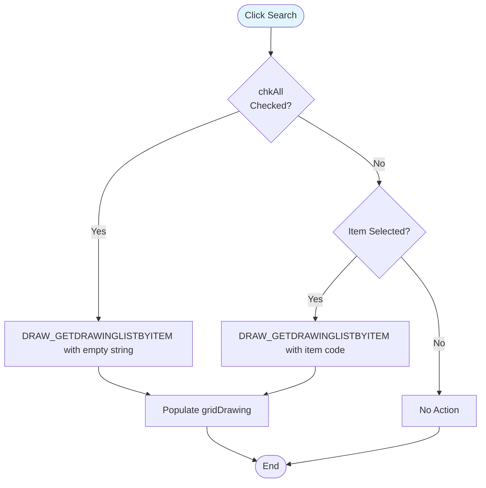
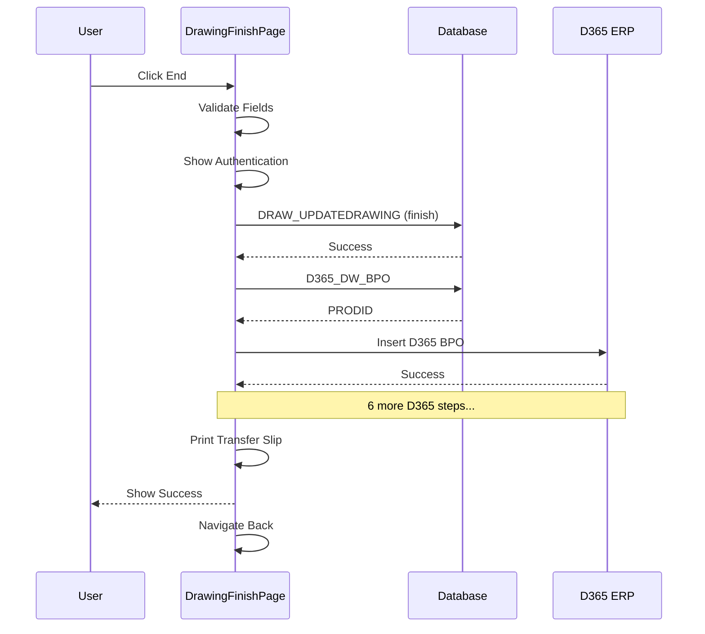

# UI Logic Analysis: Drawing Finish Page

**File**: `DrawingFinishPage.xaml` / `DrawingFinishPage.xaml.cs`
**Module**: 04 - Drawing
**Lines of Code**: 1,244 lines (C# code-behind)
**Complexity**: Medium
**Last Updated**: 2025-10-06

---

## 1. Overview

### Purpose
Complete the drawing-in process by selecting an in-progress drawing job from a grid, optionally modifying parameters, and finishing the operation with D365 ERP integration.

### Business Context
After drawing-in starts (via DrawingStartPage), this page allows operators to find and finish the job. The page includes search/filter capability, grid selection, and triggers full D365 integration on completion.

### Workflow
Search → Select from Grid → Review/Modify → End → D365 Integration → Navigate Back

---

## 2. UI Components

### Search Section
| Control | Purpose | Behavior |
|---------|---------|----------|
| cbItemCodeSearch | Filter by item code | Optional |
| chkAll | Show all items | Overrides item filter |
| cmdSearch | Execute search | Loads grid |

### Input Fields (Populated from Grid Selection)
| Control | Purpose | Editable | Source |
|---------|---------|----------|--------|
| txtBeamLot | Beam lot number | Read-only | From grid |
| txtBEAMNO | Beam number | Read-only | From grid |
| txtItemCode | Item code | Read-only | From grid |
| txtReedNo | Reed number | ✅ Yes | From grid |
| cmbColors | Heald color | ✅ Yes | From grid |
| txtHealdNo | Heald number | ✅ Yes | From grid |
| rbTying/rbDrawing | Drawing type | Read-only | From grid |
| cbGroup | Operator group | ✅ Yes | From grid |
| txtStartBy | Started by operator | Read-only | From grid |
| txtOperator | Finish operator | Read-only | Current user |

### Read-Only Display
| Control | Purpose |
|---------|---------|
| txtNOYARN | Number of yarns (from spec) |
| txtREEDTYPE | Reed type (from grid) |
| txtTotalBeam | Total beams in lot (from validation) |

### Data Grid
**Purpose**: Display all in-progress drawing jobs

**Selection**: Single row selection populates form fields

---

## 3. Key Features

### 3.1 Search/Filter Logic

**Location**: `cmdSearch_Click` (lines 103-114)

---

### 3.2 Grid Selection Auto-Population

**Location**: `gridDrawing_SelectedCellsChanged` (lines 209-446)

**Extensive Auto-Population** (13 fields):
1. txtBEAMNO ← BEAMNO
2. txtBeamLot ← BEAMLOT
3. txtReedNo ← REEDNO
4. txtItemCode ← ITM_PREPARE (triggers spec lookup)
5. txtNOYARN ← From spec lookup
6. txtTotalBeam ← From CheckBeamLot_ITM_Prepare
7. txtREEDTYPE ← REEDTYPE
8. txtHealdNo ← HEALDNO
9. cmbColors ← HEALDCOLOR (with visual color change)
10. txtStartBy ← STARTBY
11. rbTying/rbDrawing ← DRAWINGTYPE
12. cbGroup ← OPERATOR_GROUP

**Color Mapping** (lines 336-370):
- Orange → Background: Orange, Foreground: Orange
- Green → Background: Green, Foreground: Green
- Blue → Background: Blue, Foreground: Blue
- Gray → Background: Gray, Foreground: Gray

---

### 3.3 End Button with D365 Integration

**Location**: `cmdEnd_Click` → `End()` (lines 501-822, estimated from file size)

**Process**:
1. Validate required fields
2. Show authentication dialog
3. Update drawing process (finish record)
4. Trigger D365 integration
5. Print transfer slip
6. Navigate back

**D365 Integration Pattern** (Similar to Warping/Beaming):
- 7 sequential D365 steps
- BPO → ISH → ISL → OPH → OPL → OUH → OUL
- Any failure stops the chain

---

## 4. Validation Logic

### End Button Validation

**Required Fields**:
1. Beam Lot (from grid selection)
2. Item Code (from grid selection)
3. Reed Number (editable)
4. Heald Color (editable)
5. Operator (auto-filled)

**Authentication**: Required (similar to other modules)

**Flow After Validation**:

---

## 5. Print Functionality

### Transfer Slip Printing

**Location**: `Print()` (lines 459-478)

**Implementation**:
- Report: "DRAW_TRANSFERSLIP"
- Uses Windows default printer
- Auto-print without preview

**Preview Function** (lines 484-499):
- Same report
- Shows preview dialog

---

## 6. Database Operations

### Stored Procedures

| Procedure | Purpose |
|-----------|---------|
| DRAW_GETDRAWINGLISTBYITEM | Search/filter drawing jobs |
| ITM_GETITEMPREPARELIST | Get item specs |
| CheckBeamLot_ITM_Prepare | Validate and get beam lot details |
| DRAW_UPDATEDRAWING | Finish drawing record |
| D365_DW_* | D365 integration (7 procedures) |

---

## 7. Comparison: Start vs Finish Pages

| Aspect | Start Page | Finish Page |
|--------|------------|-------------|
| Lines of Code | 497 | 1,244 |
| Complexity | Low-Medium | Medium |
| Grid | No | Yes (search results) |
| D365 Integration | No | Yes (7 steps) |
| Editable Fields | All | Limited (Reed, Color, Heald No, Group) |
| Search/Filter | No | Yes |
| Print Function | No | Yes |
| Main Action | Insert (start) | Update (finish) + D365 |

**Finish is 150% larger** due to:
- Grid operations
- D365 integration
- Search/filter logic
- Print functionality

---

## 8. Key Findings

### Strengths
✅ Search/filter capability
✅ Grid selection with auto-population
✅ Editable parameters before finishing
✅ Full D365 ERP integration
✅ Transfer slip printing
✅ Visual color feedback (same as Start)

### Weaknesses
❌ No async operations (D365 integration blocks UI)
❌ Manual grid rebinding
❌ No field-level validation feedback
❌ Same color in background AND foreground (visibility issue)

### Complexity Metrics
- **Medium** complexity
- 1,244 lines (2.5x larger than Start page)
- Grid + D365 integration adds significant code
- 13 fields auto-populated from grid
- 7-step D365 integration

---

## 9. Critical Business Rules

### Rule 1: Grid Selection Required
**Description**: Must select a row from grid before finishing
**Enforcement**: End button validation

### Rule 2: D365 Integration on Finish
**Description**: Finishing triggers full ERP synchronization
**Steps**: 7 sequential D365 operations
**Failure Handling**: Stop on any error

### Rule 3: Editable Parameters
**Description**: Can modify Reed, Color, Heald No, Group before finishing
**Purpose**: Allow corrections before finalizing

---

## 10. Related Files

**Data Service**: `DrawingDataService.cs`
**D365 Service**: `D365DataService.cs`
**Start Page**: `DrawingStartPage.xaml.cs` (companion)
**Process Document**: `Documents/Processes/04_Drawing/PROCESS_DRAWING_IN.md`

---

**Analysis Completed**: 2025-10-06
**Complexity Rating**: Medium
**Key Feature**: Grid selection with extensive auto-population + D365 integration
