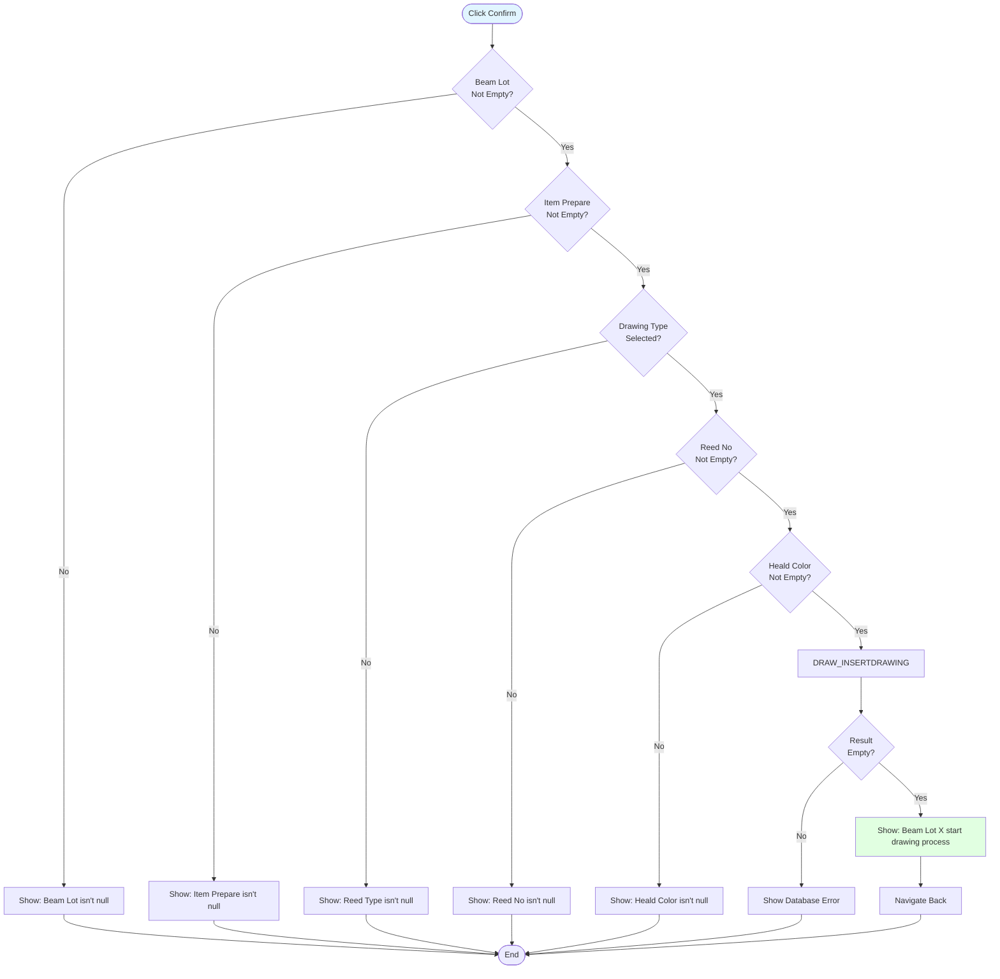

# UI Logic Analysis: Drawing Start Page

**File**: `DrawingStartPage.xaml` / `DrawingStartPage.xaml.cs`
**Module**: 04 - Drawing
**Lines of Code**: 497 lines (C# code-behind)
**Complexity**: Low-Medium
**Last Updated**: 2025-10-06

---

## 1. Overview

### Purpose
Start the drawing-in process by recording beam lot, reed configuration, and heald (heddle) setup details.

### Business Context
Drawing-in is the process of threading warp yarns through the reed and healds (heddles) to prepare the beam for weaving. This page records the setup configuration before the drawing process begins.

### Workflow
Single-page simple form → Validate → Insert record → Navigate back

---

## 2. UI Components

### Input Fields
| Control | Purpose | Validation | Default |
|---------|---------|------------|---------|
| cbItemCode | Item preparation selection | Required | Null |
| txtBeamLot | Beam lot number (barcode scan) | Required, must match item | Empty |
| txtReedNo | Reed number | Required | Empty |
| cmbColors | Heald color (Orange/Green/Blue/Gray) | Required | Null |
| txtHealdNo | Heald number | Numeric only | Empty |
| rbTying/rbDrawing | Drawing type radio buttons | Required | Tying |
| cbGroup | Operator group (A/B/C/D) | Auto-selected | A |
| txtOperator | Operator name (read-only) | Auto-filled | From setup |

### Read-Only Display Fields
| Control | Purpose | Source |
|---------|---------|--------|
| txtREEDTYPE | Reed type specification | From item spec |
| txtNOYARN | Number of yarns | From item spec |
| txtBEAMNO | Beam number | From beam lot validation |
| txtTotalBeam | Total beams in lot | From beam lot validation |

---

## 3. Key Features

### 3.1 Color Visual Feedback

**Unique Feature**: ComboBox changes background/foreground color to match selection

**Implementation** (lines 126-148):
```
Orange → Background: Orange, Foreground: Orange
Green  → Background: Green, Foreground: Green
Blue   → Background: Blue, Foreground: Blue
Gray   → Background: Gray, Foreground: Gray
```

**Purpose**: Visual confirmation of heald color selection

---

### 3.2 Beam Lot Validation

**Location**: `txtBeamLot_LostFocus` (lines 205-233)

**Process**:
1. Check beam lot not empty
2. Check item code selected
3. Call `CheckBeamLot_ITM_Prepare` (lines 309-366)
4. Validate beam lot matches item preparation
5. If invalid → Show error + clear + refocus
6. If valid → Populate BEAMNO, PRODUCTTYPEID, Total Beams

**Business Rule**: Beam lot must exist and match the selected item preparation

---

### 3.3 Tab Order

**Enter Key Navigation**:
```
txtReedNo → txtHealdNo → txtBeamLot → cmdConfirm button
```

Simple linear flow for fast data entry

---

## 4. Validation Logic

### Confirm Button Validation

**Location**: `cmdConfirm_Click` → `Confirm()` (lines 368-471)

**Required Fields** (7 total):
1. P_BEAMLOT - Beam lot number
2. P_ITMPREPARE - Item preparation
3. P_PRODUCTID - Product type ID (auto-filled)
4. P_DRAWINGTYPE - Tying or Drawing
5. P_REEDNO - Reed number
6. P_HEALDCOLOR - Heald color
7. P_OPERATOR - Operator name

**Validation Sequence**:


---

## 5. Database Operations

### Stored Procedures

| Procedure | Purpose |
|-----------|---------|
| ITM_GETITEMPREPARELIST (reused from DRAW_GETSPECBYCHOPNO) | Get item specifications |
| CheckBeamLot_ITM_Prepare | Validate beam lot and get details |
| DRAW_INSERTDRAWING | Insert drawing start record |

### Insert Parameters
1. P_BEAMLOT - Beam lot
2. P_ITMPREPARE - Item code
3. P_PRODUCTID - Product type
4. P_DRAWINGTYPE - "Tying" or "Drawing"
5. P_REEDNO - Reed number
6. P_HEALDCOLOR - Color selection
7. P_HEALDNO - Heald number (optional)
8. P_OPERATOR - Operator name
9. P_GROUP - Operator group (A/B/C/D)

---

## 6. Key Findings

### Strengths
✅ Simple, focused workflow
✅ Visual color feedback (unique feature)
✅ Beam lot validation prevents mismatches
✅ Clear tab order for fast entry
✅ Minimal required fields (7 fields)

### Weaknesses
❌ No barcode scanner integration (manual entry)
❌ Heald number is optional (may be important)
❌ No field-level validation feedback
❌ Silent decimal parsing (heald number)

### Complexity
📊 **Low-Medium** - Simplest page analyzed so far
- Only 497 lines
- Single form submission
- No grid operations
- No D365 integration
- Linear workflow

---

## 7. Business Rules

### Rule 1: Beam Lot Matching
**Description**: Beam lot must exist and match selected item preparation
**Enforcement**: txtBeamLot_LostFocus validation
**Message**: "Beam Lot is invalid" or database-specific error

### Rule 2: Drawing Type Selection
**Options**: Tying or Drawing (mutually exclusive)
**Default**: Tying
**Stored As**: String ("Tying" or "Drawing")

### Rule 3: Heald Color Required
**Options**: Orange, Green, Blue, Gray
**Visual**: ComboBox changes color to match
**Purpose**: Organizes heald frames by color coding

---

## 8. Related Files

**Data Service**: `DrawingDataService.cs`
**Finish Page**: `DrawingFinishPage.xaml.cs` (companion page)
**Process Document**: `Documents/Processes/04_Drawing/PROCESS_DRAWING_IN.md`

---

**Analysis Completed**: 2025-10-06
**Complexity Rating**: Low-Medium
**Unique Feature**: Visual color feedback on ComboBox
