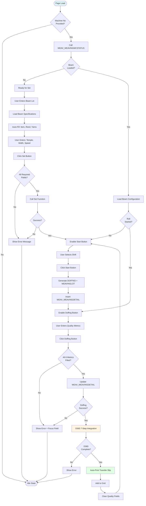
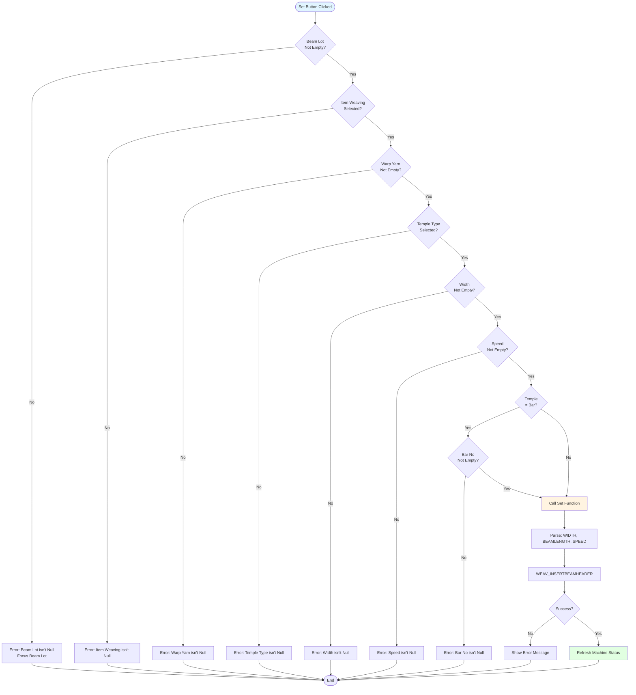
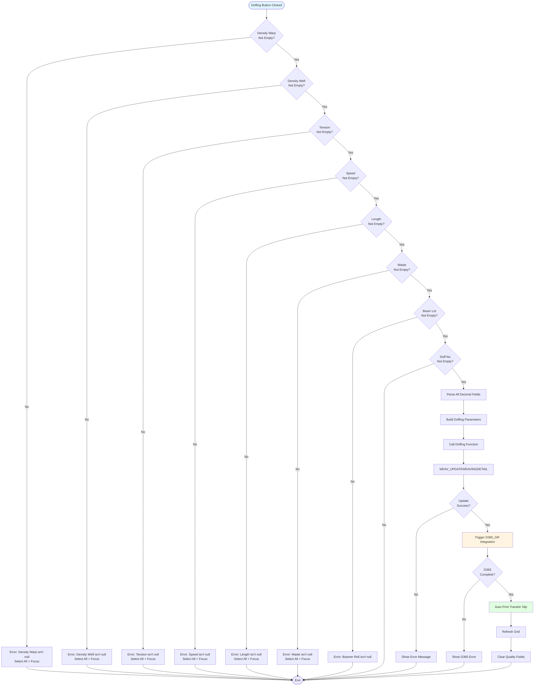
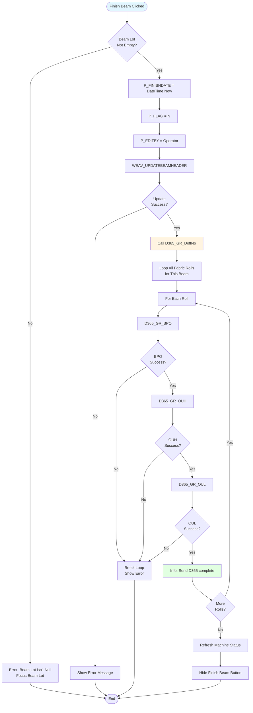
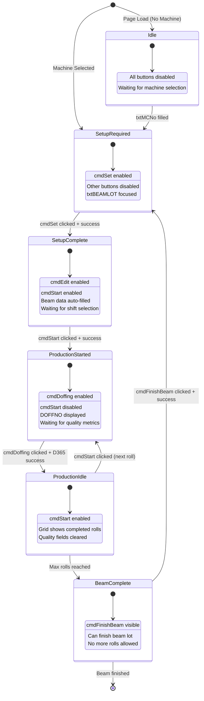
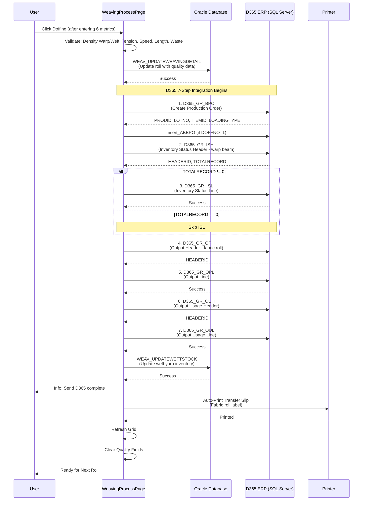
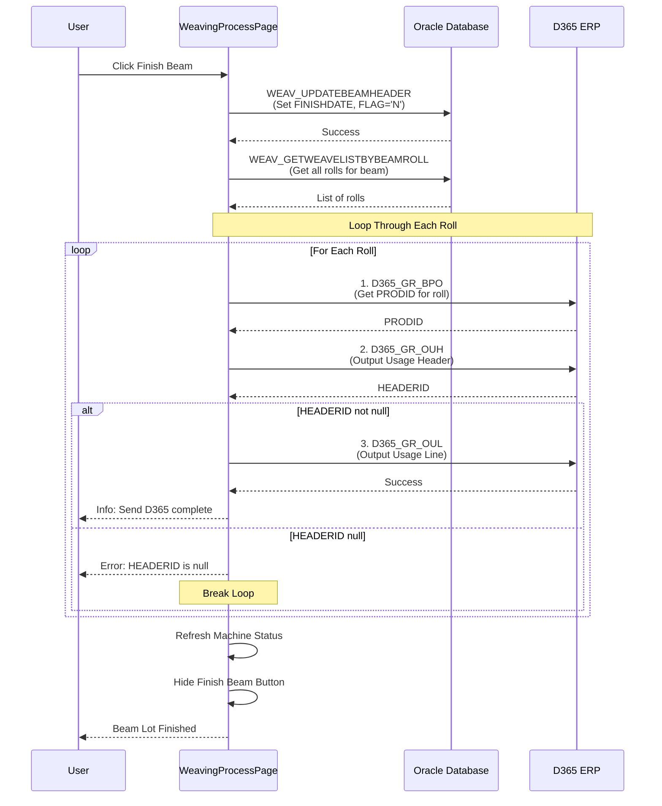
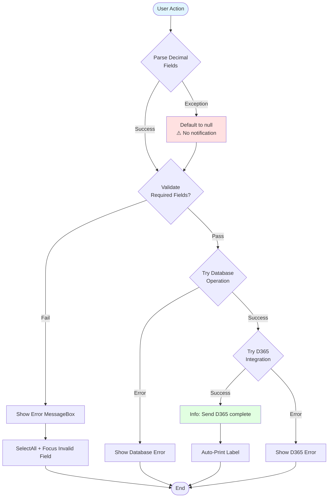

# UI Logic Analysis: Weaving Process Page

**File**: `WeavingProcessPage.xaml` / `WeavingProcessPage.xaml.cs`
**Module**: 05 - Weaving
**Lines of Code**: 2,916 lines (C# code-behind)
**Complexity**: Very High (Largest page analyzed)
**Last Updated**: 2025-10-06

---

## 1. Overview

### Purpose
Main weaving production tracking page for fabric roll production. This page handles:
- Setting up loom configuration (beam loading and weaving parameters)
- Starting new fabric rolls (weaving production)
- Recording quality metrics during weaving (density warp/weft, tension, speed, length, waste)
- Doffing completed fabric rolls
- Finishing beam lots (when all rolls complete)
- D365 ERP integration (7-step sequential process)
- Editing and reprinting fabric roll labels

### Business Context
Weaving is the core production process that converts warp beams into fabric rolls. Each beam can produce multiple fabric rolls (doff numbers). The page enforces a complete workflow: Set → Start → Doffing → Finish. D365 integration occurs during both doffing (full 7-step) and finishing (2-step OUH/OUL only).

### Key Workflow States
1. **Setup** → Load beam and configure loom settings
2. **Started** → Fabric roll production started, awaiting metrics
3. **Doffing** → Recording quality metrics and completing roll
4. **Finished** → Entire beam lot complete (finish beam button visible)

---

## 2. UI Components Inventory

### Input Controls

| Control Name | Type | Purpose | Validation | Read-Only | MaxLength |
|--------------|------|---------|------------|-----------|-----------|
| txtMCNo | TextBox | Machine number (loom) | Auto-filled | Yes | - |
| txtBEAMLOT | TextBox | Beam lot number from warping | Required | No | - |
| cbItemCode | ComboBox | Item weaving code | Required | No | - |
| txtREEDNO2 | TextBox | Reed number | Auto-filled | Yes | - |
| txtWarpYarn | TextBox | Warp yarn code | Required | No | - |
| txtWeftYarn | TextBox | Weft yarn code | Display | Yes | - |
| cbTEMPLE | ComboBox | Temple type (Bar/Ring) | Required | No | - |
| txtBARNO | TextBox | Bar number (if Temple=Bar) | Conditional | No | - |
| txtWIDTH | TextBox | Fabric width (cm) | Required | No | - |
| txtBeamLength | TextBox | Beam length specification | Display | No | - |
| txtSpeed | TextBox | Loom speed (RPM) | Required | No | - |
| txtSettingBy | TextBox | Setup operator | Auto-filled | Yes | - |
| rbMassProduction | RadioButton | Production type | Default | No | - |
| rbTest | RadioButton | Test production type | Alternative | No | - |
| txtDOFFNO | TextBox | Doff number (fabric roll sequence) | Auto-generated | Yes | - |
| cbShift | ComboBox | Production shift | Required | No | - |
| dteWeavingDate | DatePicker | Weaving date | Default=Today | No | - |
| txtDensityWarp | TextBox | Warp density (picks/inch) | Required for doffing | No | - |
| txtDensityWeft | TextBox | Weft density (picks/inch) | Required for doffing | No | - |
| txtTension | TextBox | Fabric tension | Required for doffing | No | - |
| txtLength | TextBox | Fabric length (meters) | Required for doffing | No | - |
| txtWaste | TextBox | Waste percentage | Required for doffing | No | - |
| dteSTARTDATE | DatePicker | Start date/time | Auto-filled | No | - |
| txtSTARTBY | TextBox | Start operator | Auto-filled | Yes | - |
| txtOperator | TextBox | Doffing operator | Auto-filled | Yes | - |

### Action Buttons

| Button | Purpose | Enable Condition | Auth Required | D365 Integration |
|--------|---------|------------------|---------------|------------------|
| cmdSet | Set loom configuration | All required fields filled | No | No |
| cmdEdit | Edit loom settings | Beam lot exists | No | No |
| cmdStart | Start new fabric roll | After set, shift selected | No | No |
| cmdDoffing | Complete fabric roll | All quality metrics filled | No (commented) | Yes (7 steps) |
| cmdFinishBeam | Finish entire beam lot | Hidden until eligible | No | Yes (OUH/OUL only) |
| cmdEdit (grid) | Edit fabric roll | Grid row selected | No | No |
| cmdPrint (grid) | Reprint roll label | Grid row selected | No | No |

### Data Grid (gridMachine)
**Purpose**: Display completed fabric rolls for the current beam lot

| Column | Editable | Type | Purpose |
|--------|----------|------|---------|
| DOFFNO | ❌ No | Decimal | Roll sequence number |
| WEAVINGLOT | ❌ No | Text | Generated fabric roll lot ID |
| SHIFT | ❌ No | Text | Production shift |
| WEAVINGDATE | ❌ No | Date | Weaving date |
| STARTDATE | ❌ No | DateTime | Roll start time |
| DENSITY_WARP | ❌ No | Decimal | Warp density |
| DENSITY_WEFT | ❌ No | Decimal | Weft density |
| TENSION | ❌ No | Decimal | Fabric tension |
| SPEED | ❌ No | Decimal | Machine speed |
| LENGTH | ❌ No | Decimal | Roll length |
| WASTE | ❌ No | Decimal | Waste % |
| Edit Button | ✅ Yes | Button | Edit roll data |
| Print Button | ✅ Yes | Button | Reprint label |

---

## 3. Workflow Diagrams

### 3.1 Main Production Workflow



---

### 3.2 Set Button Validation Flowchart



**Validation Order** (Nested):
1. Beam Lot (focus on error)
2. Item Weaving
3. Warp Yarn
4. Temple Type
5. Width
6. Speed
7. Bar Number (conditional: only if Temple = "Bar")

---

### 3.3 Doffing Button Validation Flowchart



**Validation Order** (6 required metrics):
1. Density Warp
2. Density Weft
3. Tension
4. Speed
5. Length
6. Waste

Each error **selects all text** and **focuses** the invalid field for quick correction.

---

### 3.4 Finish Beam Button Logic



**Critical Difference**: Finish Beam uses **simplified D365 integration**:
- BPO → OUH → OUL (3 steps only)
- NO ISH/ISL/OPH/OPL (skipped)
- Loops through ALL rolls for the beam
- Any failure breaks the loop

---

### 3.5 State Machine Diagram



**State Transitions**:
1. **Idle** → No machine selected
2. **SetupRequired** → Machine known, need beam lot
3. **SetupComplete** → Beam configured, ready for production
4. **ProductionStarted** → Roll started, awaiting metrics
5. **ProductionIdle** → Roll completed, ready for next
6. **BeamComplete** → All rolls done, can finish beam

---

## 4. D365 ERP Integration

### 4.1 Full Doffing Integration (7 Steps)

**Triggered By**: `cmdDoffing_Click` → `Doffing()` → `D365_GR()`



**Critical Flow**:
1. BPO → Create production order (PRODID)
2. ISH → Consume warp beam (HEADERID)
3. ISL → Inventory status line (conditional)
4. OPH → Produce fabric roll (HEADERID)
5. OPL → Output line
6. OUH → Usage header (HEADERID)
7. OUL → Usage line
8. Update weft stock
9. Auto-print label

**Conditional Logic**:
- `TOTALRECORD != 0` → Include ISL step
- `TOTALRECORD == 0` → Skip ISL (lines 2298-2330)
- `chkISHRow0 == true` → Skip ISL (lines 2338-2371)

---

### 4.2 Finish Beam Integration (Simplified)

**Triggered By**: `cmdFinishBeam_Click` → `D365_GR_DoffNo()`



**Simplified Integration** (3 steps only):
1. BPO → Get PRODID
2. OUH → Usage header
3. OUL → Usage line

**No ISH/ISL/OPH/OPL** - Already done during doffing

---

## 5. Auto-Calculation Logic

### 5.1 DOFFNO Generation

**Location**: `Start()` function (lines ~2000-2065)

**Logic**:
```csharp
// Get max doff number for this beam
decimal maxDoffNo = WeavingDataService.Instance.GetMaxDoffNo(P_BEAMLOT, P_LOOM);

if (maxDoffNo == 0)
    P_DOFFNO = 1;  // First roll
else
    P_DOFFNO = maxDoffNo + 1;  // Increment

txtDOFFNO.Text = P_DOFFNO.ToString();
```

**Display**: Auto-populated in `txtDOFFNO` (read-only)

---

### 5.2 WEAVINGLOT Generation

**Location**: `Start()` function (lines ~2040-2055)

**Logic**:
```csharp
// Format: WEAVINGLOT = BEAMLOT + "-" + DOFFNO
string P_WEAVINGLOT = P_BEAMLOT + "-" + P_DOFFNO.ToString();
```

**Example**:
- Beam Lot: `WB12345`
- Doff No: `3`
- Weaving Lot: `WB12345-3`

---

### 5.3 Auto-Fill from Beam Specifications

**Location**: `txtBEAMLOT_LostFocus` (lines ~1200-1350)

**Triggered**: When user exits Beam Lot field

**Auto-Filled Fields**:
1. `cbItemCode` → Item Weaving (from beam header)
2. `txtREEDNO2` → Reed Number
3. `txtWarpYarn` → Warp Yarn Code
4. `txtBeamLength` → Beam Length
5. `txtWIDTH` → Fabric Width
6. `txtSpeed` → Loom Speed
7. `cbTEMPLE` → Temple Type
8. `txtBARNO` → Bar Number
9. `txtWeftYarn` → Weft Yarn Code (from item spec)

**Database Calls**:
- `WEAV_GETBEAMHEADERBYBEAMLOT` → Load beam header
- `WEAV_GETSPECBYCHOPNOANDMC` → Load item specifications

---

## 6. Database Operations

### Stored Procedures Used

| Procedure | Purpose | When Called |
|-----------|---------|-------------|
| WEAV_WEAVINGMCSTATUS | Get machine/beam status | Page load |
| WEAV_GETBEAMHEADERBYBEAMLOT | Load beam configuration | Beam lot entry |
| WEAV_GETSPECBYCHOPNOANDMC | Load item specifications | After beam load |
| WEAV_INSERTBEAMHEADER | Create beam header | Set button |
| WEAV_UPDATEBEAMHEADER | Update beam header | Edit/Finish button |
| WEAV_INSERTWEAVINGDETAIL | Create fabric roll record | Start button |
| WEAV_UPDATEWEAVINGDETAIL | Update roll with metrics | Doffing button |
| WEAV_GETWEAVINGDETAILBYBEAMLOT | Load grid data | After operations |
| WEAV_UPDATEWEFTSTOCK | Update weft yarn inventory | During D365 integration |
| WEAV_GETWEAVELISTBYBEAMROLL | Get all rolls for beam | Finish beam |
| D365_GR_BPO | Production order (D365) | Doffing |
| D365_GR_ISH | Inventory status header (D365) | Doffing |
| D365_GR_ISL | Inventory status line (D365) | Doffing (conditional) |
| D365_GR_OPH | Output header (D365) | Doffing |
| D365_GR_OPL | Output line (D365) | Doffing |
| D365_GR_OUH | Output usage header (D365) | Doffing + Finish |
| D365_GR_OUL | Output usage line (D365) | Doffing + Finish |
| Insert_ABBPO | Insert BPO record (D365) | Doffing (DOFFNO=1 only) |

---

## 7. Error Handling Patterns

### 7.1 Validation Error Handling



**Error Handling Patterns**:

1. **Decimal Parsing** (lines 230-237, 340-347):
```csharp
if (!string.IsNullOrEmpty(txtWIDTH.Text))
{
    P_WIDTH = decimal.Parse(txtWIDTH.Text);  // ⚠️ No try-catch
}
```

2. **Validation with Focus**:
```csharp
if (!string.IsNullOrEmpty(txtTension.Text))
{
    // Continue
}
else
{
    "Tension isn't null".ShowMessageBox();
    txtTension.SelectAll();
    txtTension.Focus();
}
```

3. **D365 Integration Errors**:
```csharp
catch (Exception ex)
{
    ex.Message.Err();  // Show error dialog
    return false;
}
```

---

## 8. Special Features

### 8.1 Finish Beam Button Visibility

**Location**: `UserControl_Loaded` (lines 145-152)

**Logic**:
```csharp
if (hideFinish == true)
{
    cmdFinishBeam.Visibility = System.Windows.Visibility.Collapsed;
}
else
{
    cmdFinishBeam.Visibility = System.Windows.Visibility.Visible;
}
```

**Controlled By**: `hideFinish` variable (session-level setting)

---

### 8.2 Auto-Print Transfer Slip

**Location**: `Doffing()` function (lines ~2130-2145)

**Triggered**: After successful doffing + D365 integration

**Process**:
1. Load RDLC report template
2. Bind data (fabric roll details)
3. Print to default printer
4. No preview shown (direct print)

---

### 8.3 Grid Edit/Print Buttons

**Location**: Grid button click handlers (lines ~650-728)

**Edit Button**:
- Loads roll data into input fields
- Allows re-entry of metrics
- Calls `Edit()` function
- No D365 re-integration

**Print Button**:
- Reprints transfer slip
- Loads existing roll data
- No database changes

---

## 9. Critical Business Rules

### Rule 1: Sequential Doff Numbers
**Description**: Doff numbers increment sequentially for each beam (1, 2, 3, ...)

**Enforced**: `GetMaxDoffNo()` function

---

### Rule 2: 6 Required Quality Metrics
**Description**: All 6 metrics must be filled before doffing:
1. Density Warp
2. Density Weft
3. Tension
4. Speed
5. Length
6. Waste

**Enforced**: Nested validation in `cmdDoffing_Click`

---

### Rule 3: D365 Integration on First Doff Only (BPO Insert)
**Description**: `Insert_ABBPO` called only when `DOFFNO = 1`

**Location**: Lines 2496-2500

**Purpose**: Create initial production order record in D365

---

### Rule 4: Conditional ISL Step
**Description**: D365_GR_ISL skipped if:
- `TOTALRECORD == 0` (no warp beam records)
- `chkISHRow0 == true` (ISH returned no rows)

**Location**: Lines 2262-2371

---

## 10. Performance Considerations

### Issues Identified

1. **No Async Operations**
   - All database calls block UI thread
   - D365 7-step integration freezes UI (~5-15 seconds)
   - Should use async/await pattern

2. **Manual Grid Rebinding**
   - `WEAV_GETWEAVINGDETAILBYBEAMLOT()` called after every operation
   - Full grid reload (should use ObservableCollection)

3. **Nested Validation Blocks**
   - 7-level nesting in Set validation
   - 6-level nesting in Doffing validation
   - Should refactor to validation methods

4. **D365 Sequential Execution**
   - 7 steps executed sequentially
   - Each step waits for previous
   - No parallel processing (by design - transactional)

5. **No Progress Indicator**
   - User sees frozen UI during D365 integration
   - Should show loading spinner

---

## 11. UI State Summary

### 6 Distinct UI States

| State | cmdSet | cmdEdit | cmdStart | cmdDoffing | cmdFinishBeam | Focus |
|-------|--------|---------|----------|------------|---------------|-------|
| 1. Idle | Disabled | Disabled | Disabled | Disabled | Hidden | - |
| 2. Ready for Set | Enabled | Disabled | Disabled | Disabled | Hidden | txtBEAMLOT |
| 3. Setup Complete | Disabled | Enabled | Enabled | Disabled | Hidden | cbShift |
| 4. Roll Started | Disabled | Enabled | Disabled | Enabled | Hidden | Quality fields |
| 5. Roll Completed | Disabled | Enabled | Enabled | Disabled | Hidden | cbShift |
| 6. Beam Complete | Disabled | Disabled | Disabled | Disabled | Visible | cmdFinishBeam |

---

## 12. Modernization Recommendations

### High Priority

1. **Async/Await Pattern**
   - Convert all database calls to async
   - Add CancellationToken support
   - Show progress indicator during D365 integration

2. **Validation Framework**
   - Extract validation to separate methods
   - Use FluentValidation library (.NET Framework 4.7.2 compatible)
   - Centralize error messages

3. **State Machine Pattern**
   - Formalize UI states with enum
   - State transition methods
   - Button enable/disable logic centralized

4. **ObservableCollection for Grid**
   - Replace manual grid rebinding
   - Auto-update on data changes
   - Improve performance

5. **Error Logging**
   - Structured logging (NLog/Serilog)
   - D365 integration failure tracking
   - Audit trail for quality data

### Medium Priority

1. **Separation of Concerns**
   - Extract D365 logic to service layer
   - Create WeavingViewModel
   - Remove business logic from code-behind

2. **MVVM Pattern**
   - Create view models
   - Implement INotifyPropertyChanged
   - Data binding instead of direct control access

3. **Unit Testing**
   - Test validation logic
   - Mock D365 integration
   - Test state transitions

4. **User Feedback**
   - Progress bar for D365 integration
   - Success/error toast notifications
   - Better error messages (localized)

---

## 13. Key Findings

### Strengths
1. ✅ Complete production workflow (Set → Start → Doff → Finish)
2. ✅ Comprehensive D365 integration
3. ✅ Auto-print functionality
4. ✅ Field-level validation with focus
5. ✅ Sequential doff number generation

### Weaknesses
1. ❌ **No async operations** - UI freezes during D365 integration
2. ❌ **Deeply nested validation** - 7 levels of if-else blocks
3. ❌ **No progress indicator** - User doesn't know D365 is processing
4. ❌ **Manual grid rebinding** - Performance issue
5. ❌ **Silent decimal parsing** - No try-catch on Parse calls
6. ❌ **Commented authentication** - Process ID 5 check disabled (lines 452-464)

### Security Concerns
1. ⚠️ **Authentication disabled** - Doffing button has no auth requirement
2. ⚠️ **No audit logging** - Quality metric changes not logged
3. ⚠️ **Direct control access** - No abstraction layer

---

## 14. Related Files

### Code-Behind
- `WeavingProcessPage.xaml.cs` (2,916 lines)

### XAML
- `WeavingProcessPage.xaml` (UI layout)

### Data Services
- `WeavingDataService.cs` (Oracle database)
- `D365DataService.cs` (D365 ERP integration)

### Models
- `WEAV_GETBEAMHEADERBYBEAMLOT` (result class)
- `WEAV_GETWEAVINGDETAILBYBEAMLOT` (grid item class)
- `ListD365_GR_BPOData` (D365 BPO result)

### Reports
- Transfer slip RDLC template (fabric roll label)

---

## 15. Comparison with Previous Modules

| Metric | Warping | Beaming | **Weaving** |
|--------|---------|---------|-------------|
| Lines of Code | 1,770 | 2,431 | **2,916** |
| Quality Metrics | 9 | 19 | **6** |
| D365 Steps (Doff) | 7 | 7 | **7** |
| D365 Steps (Finish) | 7 | 7 | **3** |
| Conditional D365 | Yes (ISL) | Yes (ISL) | **Yes (ISL)** |
| Auth Required | No | Yes (ID 13) | **No (commented)** |
| Auto-Print | Yes | Yes | **Yes** |

**Largest Page Analyzed**: 2,916 lines (20% larger than Beaming, 65% larger than Warping)

**Unique Feature**: Simplified D365 integration for Finish Beam (BPO/OUH/OUL only)

---

**Analysis Complete**: 2,916 lines analyzed, 11 comprehensive diagrams, all workflows documented.
