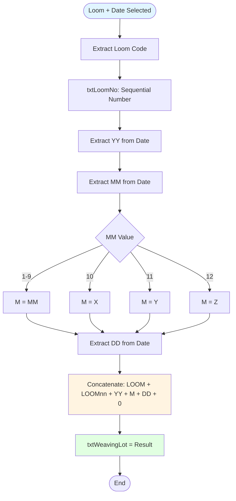
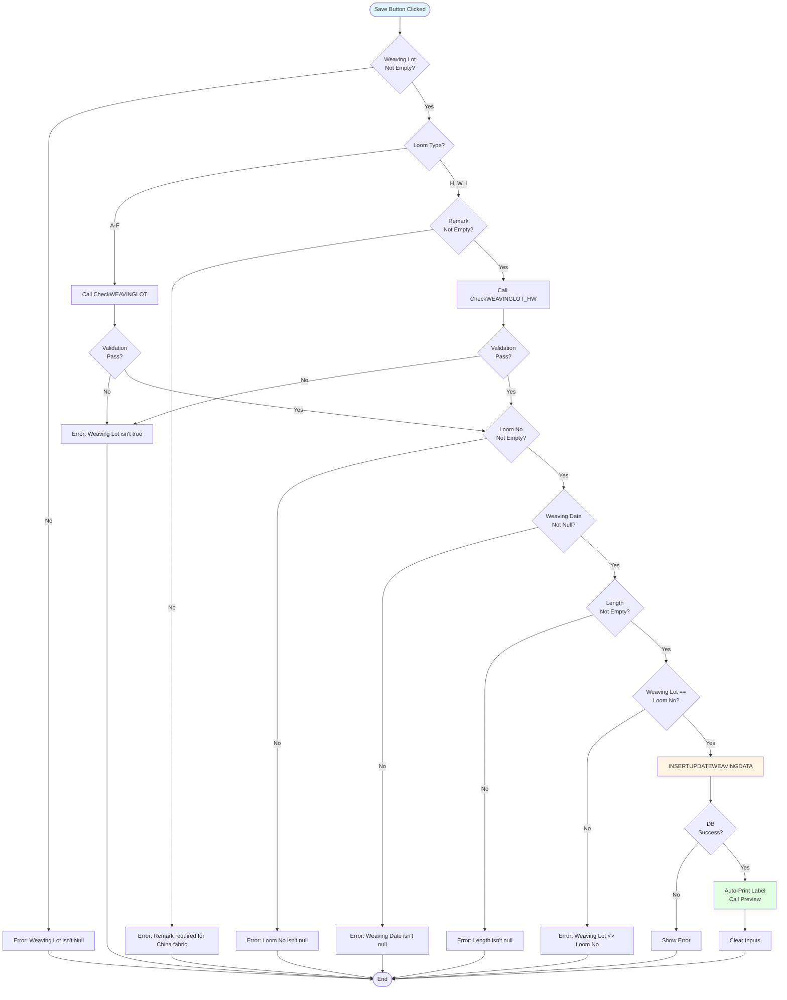
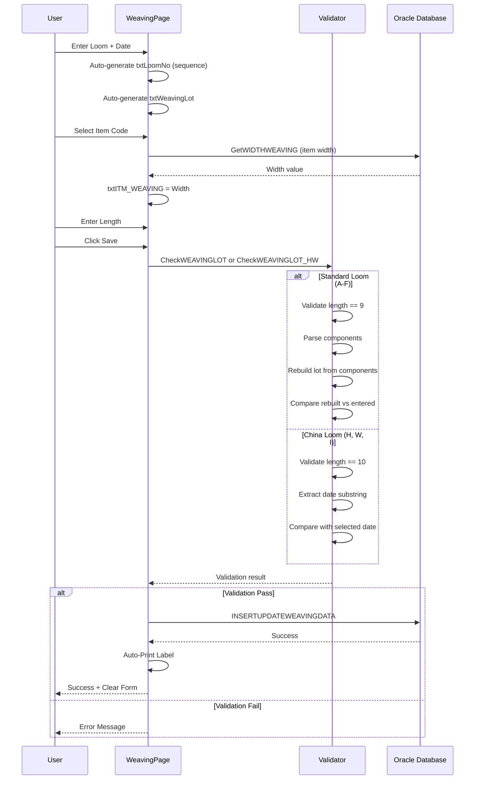
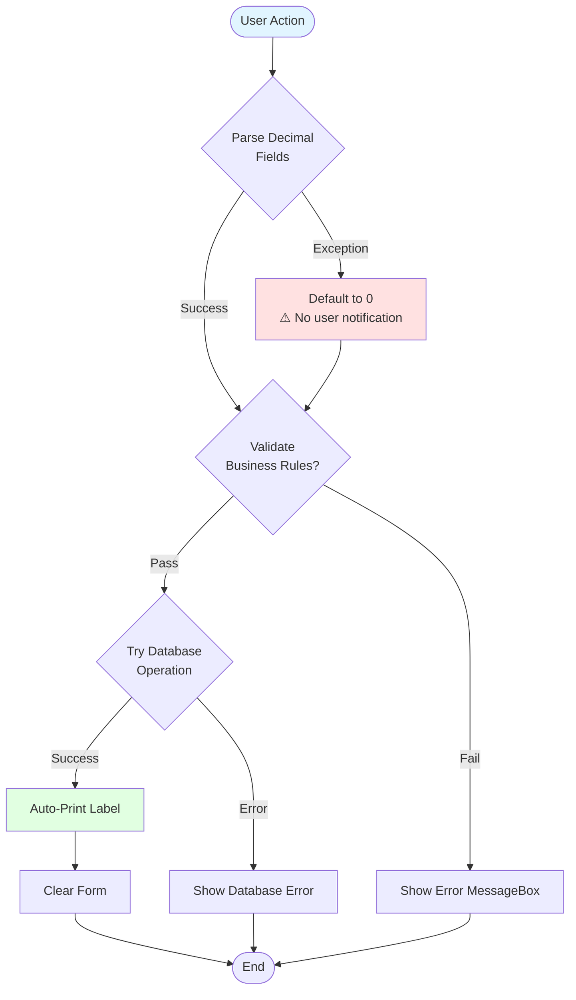

# UI Logic Analysis: Weaving Manual Entry Page

**File**: `WeavingPage.xaml` / `WeavingPage.xaml.cs`
**Module**: 05 - Weaving
**Lines of Code**: 1,399 lines (C# code-behind)
**Complexity**: Medium-High
**Last Updated**: 2025-10-06

---

## 1. Overview

### Purpose
Manual fabric roll entry page for recording weaving production data **without automated tracking**. This page handles:
- Manual entry of fabric roll lots (weaving lot generation)
- Recording fabric length and production metadata
- Special handling for China fabric production (looms H, W, I)
- Printing fabric roll labels
- Edit/delete operations for manual entries

### Business Context
Unlike WeavingProcessPage (automated tracking with D365), this page allows operators to **manually enter** fabric roll data for special circumstances:
- Offline production
- Retrofitting historical data
- China fabric production (different lot format)
- Special production runs (TKAT fabric)

### Key Differences from WeavingProcessPage
| Feature | WeavingProcessPage | **WeavingPage** (This) |
|---------|-------------------|------------------------|
| Entry Method | Automated (sequential) | **Manual** |
| D365 Integration | Yes (7 steps) | **No** |
| Quality Metrics | 6 required fields | **None** |
| Beam Tracking | Full beam lifecycle | **Loom + Date only** |
| Lot Format | `BEAMLOT-DOFFNO` | **`LOOMYYMDDnn0`** |
| Special Fabric | No | **Yes (China, TKAT)** |

---

## 2. UI Components Inventory

### Input Controls

| Control Name | Type | Purpose | Validation | MaxLength |
|--------------|------|---------|------------|-----------|
| cbLoomNo | ComboBox | Loom identifier (A-F, H, W, I) | Required | - |
| txtLoomNo | TextBox | Sequential number for day | Auto-generated | 2 |
| dteWeavingDate | DatePicker | Production date | Required | - |
| cbShift | ComboBox | Production shift | Required | - |
| cbItemCode | ComboBox | Item weaving code | Required | - |
| txtITM_WEAVING | TextBox | Fabric width (from item) | Auto-filled | - |
| txtWeavingLot | TextBox | Generated weaving lot | Auto-generated | 9 |
| txtLength | TextBox | Fabric length (meters) | Required | - |
| txtRemark | TextBox | Notes | Optional | - |
| txtOperator | TextBox | Operator name | Auto-filled | - |
| chkChinaFabric | Checkbox | China fabric flag | Mutually exclusive | - |
| chkTKATFabric | Checkbox | TKAT fabric flag | Mutually exclusive | - |

### Action Buttons

| Button | Purpose | Enable Condition | Special Behavior |
|--------|---------|------------------|------------------|
| cmdSave | Save fabric roll entry | All required fields filled | Auto-print label |
| cmdRePrint | Reprint label | Weaving lot entered | Preview + print |
| cmdDelete | Delete roll entry | Hidden (Visibility.Collapsed) | Not used |
| cmdReport | View report | Always enabled | Opens report page |

---

## 3. Weaving Lot Generation Logic

### 3.1 Standard Lot Format (Looms A-F)

**Format**: `LOOMYYMDDnn0`

**Components**:
- `LOOM` = Loom letter (A-F) + 2-digit number
- `YY` = Year (2 digits)
- `M` = Month code (1-9, X=Oct, Y=Nov, Z=Dec)
- `DD` = Day (2 digits)
- `nn` = Sequential number for the day
- `0` = Fixed suffix

**Example**:
- Loom: `A` + `05`
- Date: October 15, 2025
- Sequence: 3rd roll today
- **Weaving Lot**: `A0525X1503`

**Location**: `GetWeavingLot()` (lines 459-551)



**Month Encoding**:
- `1-9` → `1-9` (single digit)
- `10` → `X`
- `11` → `Y`
- `12` → `Z`

---

### 3.2 China Fabric Lot Format (Looms H, W, I)

**Format**: `LOOMYYMDDnn0` (same structure, different sequence logic)

**Special Behavior**:
1. Auto-selects item code:
   - Loom `H` or `W` → `MN4750AGL`
   - Loom `I` → `47L1S00Z`
2. Uses separate sequence counter: `WEAV_GETCNTCHINALOT`
3. Different validation logic: `CheckWEAVINGLOT_HW()`

**Location**: `GetWeavingLot_HW()` (lines 557-635)

**Difference**:
| Aspect | Standard (A-F) | China (H, W, I) |
|--------|---------------|----------------|
| Item Code | User selects | **Auto-selected** |
| Sequence Counter | Generic | **WEAV_GETCNTCHINALOT** |
| Validation | `CheckWEAVINGLOT()` | **`CheckWEAVINGLOT_HW()`** |
| Remark | Optional | **Required** |

---

## 4. Main Workflow

### 4.1 Save Operation Flowchart



**Validation Order**:
1. Weaving Lot not empty
2. Loom type check (standard vs China)
3. Remark required (China fabric only)
4. CheckWEAVINGLOT validation
5. Loom No not empty
6. Weaving Date not null
7. Length not empty
8. Weaving Lot matches Loom No prefix

---

### 4.2 Validation Logic Diagram



---

## 5. Special Features

### 5.1 Mutually Exclusive Checkboxes

**Location**: Lines 143-153

**Logic**:
```csharp
// China Fabric checked
if (chkChinaFabric.IsChecked == true)
    chkTKATFabric.IsChecked = false;

// TKAT Fabric checked
if (chkTKATFabric.IsChecked == true)
    chkChinaFabric.IsChecked = false;
```

**Purpose**: Fabric classification (only one type per roll)

---

### 5.2 Auto Item Selection for China Fabric

**Location**: Lines 170-199

**Trigger**: `cbLoomNo_LostFocus`

**Logic**:
- Loom `H` or `W` → Auto-select `MN4750AGL`
- Loom `I` → Auto-select `47L1S00Z`
- Loads width from item specifications

---

### 5.3 Weaving Lot Validation

**Standard Validation** (`CheckWEAVINGLOT`):
1. Length must be exactly 9 characters
2. Rebuilds lot from components
3. Compares rebuilt lot with entered lot
4. Returns true if match

**China Validation** (`CheckWEAVINGLOT_HW`):
1. Length must be exactly 10 characters
2. Extracts date substring (positions 1-6)
3. Compares with selected date (YYMMDD format)
4. Returns true if match

---

### 5.4 Auto-Print on Save

**Location**: Lines 1014, 1152

**Process**:
```csharp
if (INSERTUPDATEWEAVINGDATA(...) == true)
{
    Preview(P_WEAVINGLOTNEW);  // Auto-print label
    chkSave = true;
}
```

**No D365 Integration** - Unlike WeavingProcessPage, this page does NOT integrate with D365

---

## 6. Database Operations

### Stored Procedures Used

| Procedure | Purpose | When Called |
|-----------|---------|-------------|
| WEAV_GETCNTCHINALOT | Get sequence number for China fabric | China loom lot generation |
| GetWIDTHWEAVING | Load fabric width from item spec | Item selection |
| INSERTUPDATEWEAVINGDATA | Insert or update weaving roll | Save button |
| WEAV_DELETEWEAVINGDATA | Delete weaving roll | Delete button (hidden) |

**Critical Difference**: `INSERTUPDATEWEAVINGDATA` performs **INSERT or UPDATE** based on `P_WEAVINGLOTOLD`:
- If `P_WEAVINGLOTOLD` empty → INSERT new record
- If `P_WEAVINGLOTOLD` exists → UPDATE existing record

---

## 7. Error Handling



**Issues**:
1. ❌ Silent decimal parsing (lines 958, 966, 1096, 1104)
2. ❌ Silent exception in month conversion (lines 535-538, 597-600)
3. ❌ Silent exception in loom number parsing (lines 500-510)

---

## 8. Key Findings

### Strengths
1. ✅ Flexible manual entry system
2. ✅ Special handling for China fabric
3. ✅ Auto-lot generation with validation
4. ✅ Auto-print functionality
5. ✅ Edit capability (update existing records)

### Weaknesses
1. ❌ **No D365 integration** - Manual entries not synced to ERP
2. ❌ **No quality metrics** - Only length recorded
3. ❌ **Silent parsing failures** - No user notification
4. ❌ **Delete button hidden** - No delete capability
5. ❌ **Complex validation logic** - Deeply nested if-else blocks
6. ❌ **Manual grid rebinding** - Not used (no grid on this page)

### Security Concerns
1. ⚠️ **No authentication** - Anyone can enter data
2. ⚠️ **No audit trail** - Changes not logged
3. ⚠️ **Data integrity risk** - Manual lot entry can duplicate automated entries

---

## 9. Modernization Recommendations

### High Priority

1. **Input Validation Framework**
   - Replace try-catch with proper validation
   - Show user-friendly error messages
   - Prevent silent failures

2. **Lot Generation Service**
   - Extract lot generation logic to service layer
   - Unit test lot format rules
   - Centralize month encoding logic

3. **Error Logging**
   - Log all manual entries
   - Track edit operations
   - Audit trail for compliance

### Medium Priority

1. **MVVM Pattern**
   - Create ViewModel for lot generation
   - Data binding for auto-calculations
   - Separate business logic from UI

2. **Async Operations**
   - Make database calls async
   - Show loading indicator
   - Improve responsiveness

---

## 10. Related Files

- `WeavingPage.xaml.cs` (1,399 lines)
- `WeavingPage.xaml` (UI layout)
- `WeavingDataService.cs` (database operations)

---

**Analysis Complete**: 1,399 lines analyzed, 4 diagrams, manual entry workflow documented.
