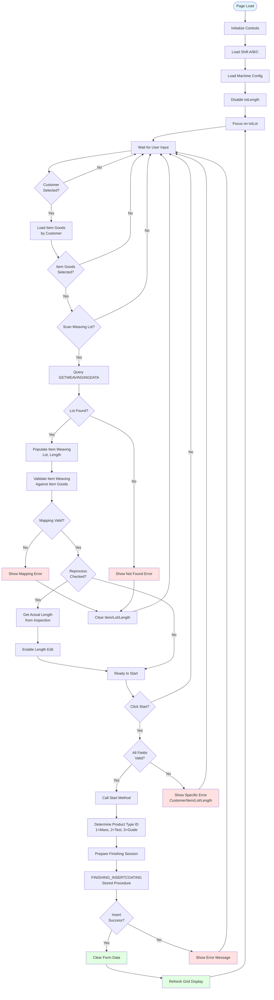
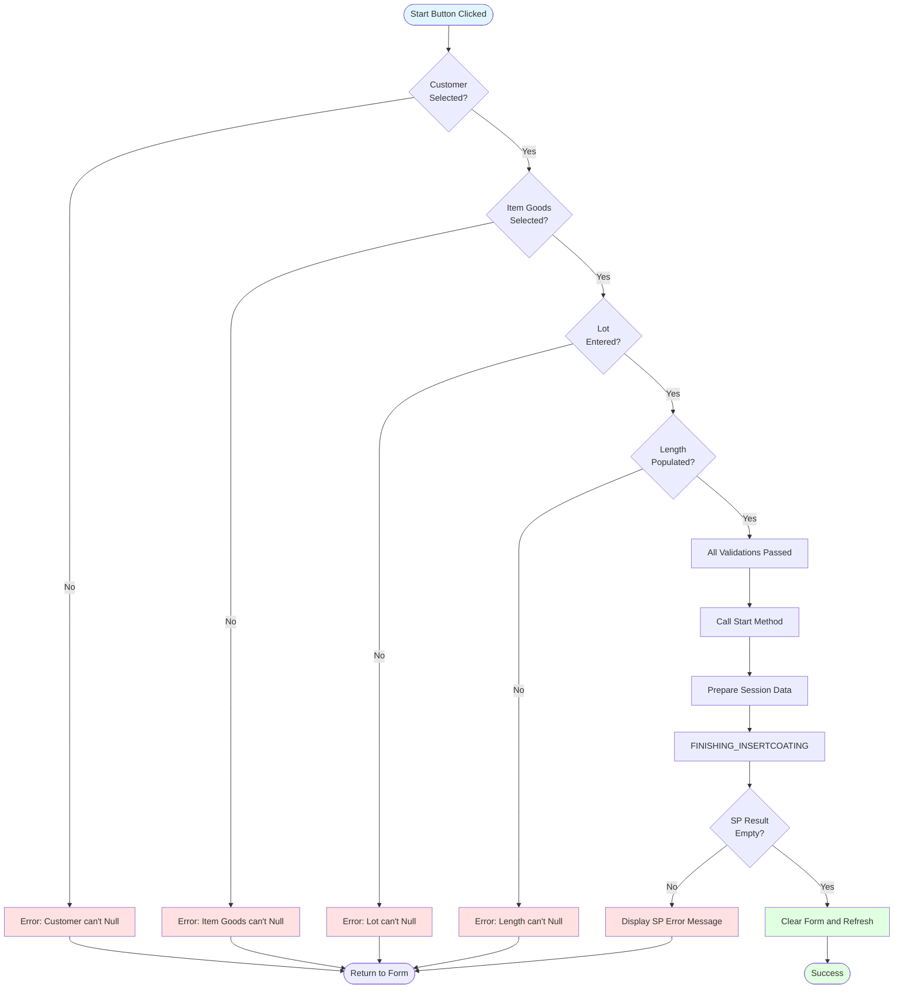
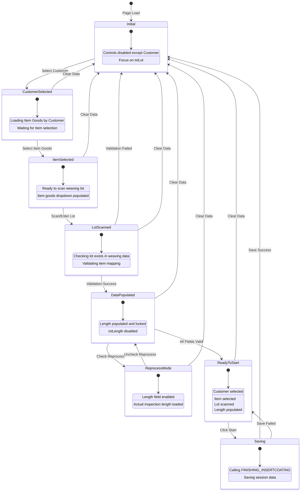
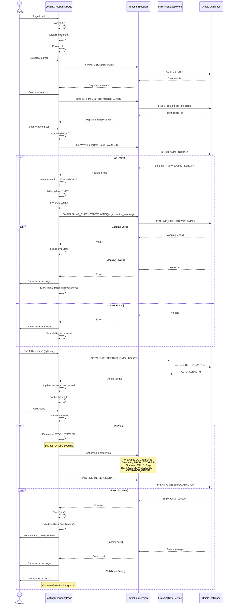

# UI Logic Analysis: Coating3 Preparing Page

## 1. Page Overview

**File**: `LuckyTex.AirBag.Pages\Pages\06 - Finishing\Coating3\Coating3PreparingPage.xaml.cs`
**XAML**: `LuckyTex.AirBag.Pages\Pages\06 - Finishing\Coating3\Coating3PreparingPage.xaml`
**Lines of Code**: 719 lines (C#), 366 lines (XAML)
**Complexity**: Medium
**Last Modified**: Active (current implementation)

**Business Context**:
Coating3 Preparing Page is the **first step** in the 3-step Coating3 workflow (Preparing → Processing → Finishing). This page allows operators to prepare fabric rolls for coating by scanning weaving lots, selecting customer/item information, and recording initial parameters. Unlike Coating1 (2-step workflow), Coating3 has a distinct **Processing** step between Preparing and Finishing.

**Key Responsibilities**:
- Scan and validate weaving lots
- Map Customer → Item Goods → Item Weaving
- Validate item/lot compatibility
- Set production type (Mass Production / Test / Guide)
- Record operator, shift group, and machine number
- Enable/support reprocess functionality
- Generate Finishing Lot and start coating preparation

---

## 2. UI Components Inventory

| Control Name | Type | Purpose | Data Source | Validation |
|-------------|------|---------|-------------|------------|
| **cbCustomer** | ComboBox | Select finishing customer | CUS_GETLIST | Required |
| **cbItemGoods** | ComboBox | Select item goods code | CUS_GETITEMGOODBYCUSTOMER (filtered by customer) | Required |
| **txtItemWeaving** | TextBox | Item weaving code (from scan/manual) | GETWEAVINGINGDATA | Mapped to item goods |
| **txtLot** | TextBox | Weaving lot number (barcode scan) | GETWEAVINGINGDATA | Required, CharacterCasing=Upper |
| **txtLength** | TextBox | Fabric length from weaving | Auto-populated from lot data | Initially disabled |
| **txtOperator** | TextBox | Operator ID | CurrentUser.OperatorId | Read-only |
| **txtScouringNo** | TextBox | Coating machine number | Machine.MCId (hidden field) | Default "255" |
| **cbShift** | ComboBox | Operator shift group | Static: A, B, C | Default index 0 (A) |
| **rbMassProduction** | RadioButton | Production type: Mass Production | - | Default checked |
| **rbTest** | RadioButton | Production type: Test | - | Mutually exclusive |
| **rbGuide** | RadioButton | Production type: Guide | - | Mutually exclusive |
| **chkReporcess** | CheckBox | Enable reprocess mode | - | Enables length editing |
| **cmdClear** | Button | Clear all form fields | - | - |
| **cmdStart** | Button | Start coating preparation | - | Validates all required fields |
| **cmdBack** | Button | Return to previous page | - | - |
| **gridProcess** | DataGrid | Display prepared coating lots | FINISHING_GETCOATINGCONDITIONDATA | Read-only |

---

## 3. Input Fields & Validation

### Required Fields

| Field | Format | MaxLength | Validation Rules |
|-------|--------|-----------|------------------|
| **cbCustomer** | String | - | Must be selected from dropdown |
| **cbItemGoods** | String | - | Must be selected from dropdown (depends on customer) |
| **txtLot** | Alphanumeric (uppercase) | - | Must exist in weaving data, auto-converts to uppercase |
| **txtLength** | Decimal | - | Auto-populated from lot, editable only if reprocess checked |

### Optional Fields

| Field | Default Value | Notes |
|-------|--------------|-------|
| **txtItemWeaving** | Empty | Auto-populated when lot scanned |
| **cbShift** | "A" | Defaults to first shift |
| **chkReporcess** | Unchecked | When checked, enables manual length editing |

### Validation Rules

1. **Customer Selection** (cbCustomer_SelectionChanged:182-213)
   - When customer selected → Load filtered item goods list
   - If customer null/empty → Clear item goods dropdown

2. **Lot Scanning** (ScanLot:469-505, txtLot_LostFocus:280-286)
   - Trim and uppercase lot number
   - Query: `GETWEAVINGINGDATA(WEAVINGLOT)`
   - If found:
     - Populate txtItemWeaving
     - Populate txtLot
     - Populate txtLength (formatted as `#,##0.##`)
     - Validate item weaving against selected item goods
   - If not found → Show error "This Item Weaving does not map with selected item Good"

3. **Item Weaving Validation** (ScanWeavingLot:435-463)
   - Query: `FINISHING_CHECKITEMWEAVING(itm_code, itm_weaving)`
   - If items.Count > 0 → Valid mapping, focus cmdStart
   - If not found → Clear txtItemWeaving, txtLot, txtLength; show error; focus txtItemWeaving

4. **Reprocess Mode** (chkReporcess_Checked:305-322, chkReporcess_Unchecked:324-331)
   - **When Checked**:
     - If txtLot is empty → Show error "Lot isn't Null", uncheck, focus txtLot
     - Else → Call GETCURRENTINSDATA(txtLot.Text) to get actual inspection length
     - Enable txtLength.IsEnabled = true
   - **When Unchecked**:
     - Restore txtLength.Text = OldLength (original length)
     - Disable txtLength.IsEnabled = false

5. **Start Button Validation** (cmdStart_Click:143-172)
   - All required fields must be populated:
     - cbCustomer.SelectedValue != null
     - cbItemGoods.SelectedValue != null
     - txtLot.Text != ""
     - txtLength.Text != ""
   - Sequential validation with specific error messages:
     - "Customer can't Null"
     - "Item Goods can't Null"
     - "Lot can't Null"
     - "Length can't Null"

---

## 4. Button Actions & Event Handlers

### cmdStart_Click (143-172)

**Enable Conditions**:
- Customer selected
- Item Goods selected
- Lot entered
- Length populated

**Action Flow**:
```
1. Validate all required fields (see section 3)
2. If valid → Call Start()
3. Else → Show specific error message for first missing field
```

### cmdClear_Click (134-137)

**Enable Conditions**: Always enabled

**Action Flow**:
```
1. Call ClearData()
2. Reset form to initial state
```

### cmdBack_Click (126-129)

**Enable Conditions**: Always enabled

**Action Flow**:
```
1. PageManager.Instance.Back()
2. Return to previous page (likely Finishing menu)
```

---

## 5. Main Workflow Diagram



---

## 6. Validation Logic Flowchart



---

## 7. State Transition Diagram



---

## 8. Sequence Diagram



---

## 9. Business Rules

### Production Type Mapping (Start:552-575)

```csharp
if (rbMassProduction.IsChecked == true)
    PRODUCTTYPEID = "1";  // Mass Production
else if (rbTest.IsChecked == true)
    PRODUCTTYPEID = "2";  // Test
else if (rbGuide.IsChecked == true)
    PRODUCTTYPEID = "3";  // Guide
```

### Reprocess Logic (chkReporcess_Checked:305-322)

- **Purpose**: Allow operators to modify fabric length when reprocessing defective lots
- **Validation**: Lot must be entered before enabling reprocess
- **Data Source**: `GETCURRENTINSDATA(FINISHINGLOT)` retrieves actual inspection length
- **Result**:
  - Stores original length in `OldLength` variable
  - Updates `txtLength.Text` with `ACTUALLENGTH` from inspection
  - Enables `txtLength` for manual editing
  - Session property: `_session.REPROCESS = "Y"` or "N"

### Customer → Item Goods Cascading (cbCustomer_SelectionChanged:182-213)

- When customer changes → Load filtered item goods
- Query: `FINISHING_GETITEMGOOD(cusID)`
- Clear item goods dropdown if customer is null/empty
- Ensures item goods are specific to selected customer

### Lot → Item Weaving Auto-Population (ScanLot:469-505)

- Lot scan triggers automatic population of:
  - `txtItemWeaving` ← `items[0].ITM_WEAVING`
  - `txtLot` ← `items[0].WEAVINGLOT`
  - `txtLength` ← `items[0].LENGTH.Value.ToString("#,##0.##")`
  - `OldLength` ← Original length for reprocess restore

### Machine Number Handling (SetupOperatorAndMC:678-712)

- Machine name displayed in `txtMCName` (e.g., "Coating No")
- Machine ID stored in hidden `txtScouringNo` (default "255")
- `txtScouringNo.Visibility = Collapsed` (hidden from UI)
- Machine ID used in:
  - `LoadFinishing_GetCoating(mcID, "S")` to load process grid
  - Session property: `_session.MCNO = MCNO`

---

## 10. Database Operations

### Stored Procedures

| Procedure Name | Parameters | Purpose | Called From |
|---------------|-----------|---------|-------------|
| **CUS_GETLIST** | None | Retrieve all finishing customers | LoadCustomer:356-370 |
| **FINISHING_GETITEMGOOD** | cusID (string) | Get item goods filtered by customer | LoadItemGood:376-390 |
| **GETWEAVINGINGDATA** | WEAVINGLOT (string) | Get weaving lot details (item, length) | ScanLot:469-505 |
| **FINISHING_CHECKITEMWEAVING** | itm_code, itm_weaving | Validate item weaving maps to item goods | ScanWeavingLot:435-463 |
| **GETCURRENTINSDATA** | FINISHINGLOT (string) | Get actual inspection length for reprocess | GETCURRENTINSDATA:511-525 |
| **FINISHING_GETCOATINGCONDITIONDATA** | mcno, flag | Load prepared coating lots for grid | LoadFinishing_GetCoating:531-546 |
| **FINISHING_INSERTCOATING** | (via session properties) | Insert new coating preparation record | Start:617 |

### FINISHING_INSERTCOATING Parameters (via Session)

```csharp
_session.WEAVINGLOT = weavlot;           // Weaving lot number
_session.ItemCode = itmCode;             // Item goods code
_session.Customer = finishcustomer;      // Customer ID
_session.PRODUCTTYPEID = PRODUCTTYPEID;  // 1, 2, or 3
_session.Operator = operatorid;          // Operator ID
_session.MCNO = MCNO;                    // Machine number
_session.Flag = flag;                    // "S" (Scouring flag)
_session.REPROCESS = "Y" or "N";         // Reprocess flag
_session.WEAVLENGTH = decimal.Parse(txtLength.Text);  // Fabric length
_session.OPERATOR_GROUP = cbShift.SelectedValue.ToString();  // A, B, or C
```

### Return Values

- **FINISHING_INSERTCOATING**:
  - Returns empty string on success
  - Returns error message on failure
  - Error handling (Start:619-627):
    ```csharp
    if (string.IsNullOrEmpty(result) == true)
        ClearData();  // Success
    else
        result.ShowMessageBox(true);  // Show error
    ```

---

## 11. D365 Integration

**NO D365 Integration in Coating3 Preparing Page**

Unlike Coating1 Preparing which has D365DataService calls for synchronization, Coating3 Preparing does NOT integrate with D365. All operations are local to the MES Oracle database.

**Comparison with Coating1**:
- Coating1 Preparing: Calls D365DataService for production order sync
- Coating3 Preparing: No D365 calls found in source code

---

## 12. Error Handling

### Try-Catch Patterns

1. **LoadCustomer** (356-370)
```csharp
try {
    List<FinishingCustomerData> items = _session.Finishing_GetCustomerList();
    this.cbCustomer.ItemsSource = items;
}
catch {
    "Please Check Data".ShowMessageBox(true);
}
```

2. **LoadItemGood** (376-390)
```csharp
try {
    List<FINISHING_GETITEMGOODData> items = _session.GetFINISHING_GETITEMGOOD(cusID);
    this.cbItemGoods.ItemsSource = items;
}
catch {
    "Please Check Data".ShowMessageBox(true);
}
```

3. **cbCustomer_SelectionChanged** (182-213)
```csharp
try {
    // Load item goods by customer
}
catch (Exception ex) {
    ex.Message.ToString().ShowMessageBox(true);
}
```

4. **ScanWeavingLot** (435-463)
```csharp
try {
    List<FINISHING_CHECKITEMWEAVINGData> items = _session.GetFINISHING_CHECKITEMWEAVING(itm_code, itm_weaving);
    if (items != null && items.Count > 0) {
        cmdStart.Focus();
    } else {
        string msg = "This Item Weaving does not map with selected item Good";
        msg.ShowMessageBox(false);
        // Clear fields
    }
}
catch (Exception ex) {
    ex.Message.ToString().ShowMessageBox(true);
}
```

5. **ScanLot** (469-505)
```csharp
try {
    List<GETWEAVINGINGDATA> items = _session.GetWeavingingDataList(WEAVINGLOT);
    if (items != null && items.Count > 0) {
        // Populate fields
    } else {
        string msg = "This Item Weaving does not map with selected item Good";
        msg.ShowMessageBox(false);
        // Clear fields and focus txtLot
    }
}
catch (Exception ex) {
    ex.Message.ToString().ShowMessageBox(true);
}
```

6. **Start** (552-634)
```csharp
try {
    // Prepare session and call stored procedure
    string result = _session.FINISHING_INSERTCOATING();

    if (string.IsNullOrEmpty(result) == true)
        ClearData();
    else
        result.ShowMessageBox(true);
}
catch (Exception ex) {
    ex.Message.ToString().ShowMessageBox(true);
}
```

7. **ClearData** (398-429)
```csharp
try {
    // Clear all controls
}
catch (Exception ex) {
    ex.Message.ToString().ShowMessageBox(true);
}
```

### Error Messages

| Scenario | Error Message | Action |
|----------|--------------|--------|
| Customer null | "Customer can't Null" | Return to form |
| Item Goods null | "Item Goods can't Null" | Return to form |
| Lot null | "Lot can't Null" | Return to form |
| Length null | "Length can't Null" | Return to form |
| Item mapping invalid | "This Item Weaving does not map with selected item Good" | Clear fields, focus txtItemWeaving |
| Lot not found | "This Item Weaving does not map with selected item Good" | Clear fields, focus txtLot |
| Reprocess without lot | "Lot isn't Null" | Uncheck reprocess, focus txtLot |
| Database error | "Please Check Data" | Generic catch-all |
| Stored procedure error | (Returned error message from SP) | Display SP message |

---

## 13. Critical Findings

### Performance Issues

1. **No Async/Await Usage**
   - All database calls are synchronous
   - UI blocks during DB operations
   - Impact: Poor UX for slow queries (GETWEAVINGINGDATA, FINISHING_CHECKITEMWEAVING)
   - **Recommendation**: Implement async/await pattern for all data service calls

2. **Modbus Manager Initialization** (Line 109-111)
   - Subscribes to Coating3ModbusManager.Instance.ReadCompleted event
   - Shuts down on UserControl_Unloaded
   - **Note**: No actual Modbus read logic in this page (event handler is empty at line 113-119)
   - **Potential Issue**: Unnecessary PLC manager overhead if not used

### Bugs/Code Smells

1. **Duplicate Error Message** (ScanLot:490, ScanWeavingLot:447)
   ```csharp
   string msg = "This Item Weaving does not map with selected item Good";
   ```
   - Same message for two different scenarios (lot not found vs. mapping invalid)
   - **Impact**: Confusing for operators
   - **Recommendation**: Use distinct messages:
     - "Weaving lot not found in database"
     - "Item weaving does not map to selected item goods"

2. **Magic String "S"** (Start:562, LoadFinishing_GetCoating:531)
   ```csharp
   string flag = "S";
   ```
   - Hardcoded flag with no explanation
   - **Assumption**: "S" likely means "Scouring" or "Start"
   - **Recommendation**: Use constant or enum

3. **txtLength Decimal Parsing** (Start:598-609)
   ```csharp
   try {
       if (txtLength.Text != "")
           _session.WEAVLENGTH = decimal.Parse(txtLength.Text);
   }
   catch {
       _session.WEAVLENGTH = 0;
   }
   ```
   - **Issue**: Silent exception swallowing, sets 0 on parse error
   - **Impact**: Invalid length could be saved as 0
   - **Recommendation**: Validate decimal format before parse, show error if invalid

4. **Session Reset Logic** (ClearData:414-415)
   ```csharp
   if (_session.Customer != "")
       _session = new FinishingSession();
   ```
   - **Issue**: Creates new session only if customer was set
   - **Impact**: Session state may not fully reset
   - **Recommendation**: Always create new session in ClearData()

### Refactoring Opportunities

1. **Extract Validation Method**
   - Consolidate field validation (Start:145-171) into separate `ValidateFields()` method
   - Return validation result object with field name and error message
   - Improves testability and reusability

2. **Create Enum for Product Type**
   ```csharp
   public enum ProductType {
       MassProduction = 1,
       Test = 2,
       Guide = 3
   }
   ```
   - Replace magic numbers in Start:564-575
   - Use `ProductType.MassProduction.ToString("d")` instead of "1"

3. **Consolidate Data Loading**
   - LoadCustomer, LoadItemGood, LoadFinishing_GetCoating all follow same pattern
   - Create generic `LoadData<T>(Func<List<T>> dataFetcher, Action<List<T>> onSuccess)` method
   - Reduces code duplication

4. **Session Property Builder**
   - Start method (577-615) sets ~10 session properties
   - Create `FinishingSession.FromPreparingPage(pageData)` factory method
   - Centralizes session initialization logic

---

## 14. Code Metrics

| Metric | Value | Assessment |
|--------|-------|------------|
| **Total Lines** | 719 | Medium complexity |
| **Methods** | 25 | Well-organized |
| **Event Handlers** | 10 | Standard WPF |
| **Database Calls** | 6 stored procedures | Moderate DB interaction |
| **Try-Catch Blocks** | 7 | Good error handling coverage |
| **Code-Behind LOC** | ~450 (excluding regions/comments) | Acceptable for WPF page |
| **Cyclomatic Complexity** | ~8 (Start method) | Moderate complexity |
| **Max Method Length** | 82 lines (Start) | Could be refactored |
| **Magic Numbers** | 3 ("1", "2", "3" for product type) | Use enums |
| **Magic Strings** | 2 ("S" flag, "255" machine) | Use constants |

---

## 15. Coating1 vs Coating3 Comparison

| Feature | Coating1 Preparing | Coating3 Preparing | Notes |
|---------|-------------------|-------------------|-------|
| **Workflow Steps** | 2-step (Preparing → Finishing) | 3-step (Preparing → Processing → Finishing) | Coating3 adds Processing step |
| **D365 Integration** | YES (D365DataService calls) | NO | Coating1 syncs with ERP |
| **PLC Integration** | Modbus manager for real-time data | Modbus manager (not actively used) | Coating3 Modbus event handler empty |
| **Reprocess Functionality** | YES | YES | Both support reprocess mode |
| **Production Types** | Mass / Test / Guide | Mass / Test / Guide | Same radio button options |
| **Machine Number Field** | Visible | Hidden (txtScouringNo.Visibility=Collapsed) | Different UI approach |
| **Length Field** | Initially disabled | Initially disabled | Same behavior |
| **Customer/Item Cascading** | YES | YES | Same dropdown logic |
| **Shift Selection** | A / B / C | A / B / C | Same shift options |
| **Grid Display** | Recent prepared lots | Recent prepared lots | Same grid purpose |
| **Stored Procedure** | FINISHING_INSERTCOATING | FINISHING_INSERTCOATING | Same SP, different flag? |
| **Flag Parameter** | (Unknown - need Coating1 source) | "S" (Scouring) | Check Coating1 flag value |
| **File Location** | `Coating1/Coating1PreparingPage.xaml.cs` | `Coating3/Coating3PreparingPage.xaml.cs` | Different folders |
| **Lines of Code** | (Unknown - need analysis) | 719 lines | - |
| **Business Purpose** | General coating preparation | Coating with scouring process | Scouring = chemical treatment |

### Key Architectural Difference

**Coating1 (2-Step)**:
```
Preparing Page → Finishing Page
```

**Coating3 (3-Step)**:
```
Preparing Page → Processing Page → Finishing Page
```

The **Processing Page** is the critical middle step in Coating3 that:
- Captures actual coating process parameters (temperatures, speeds, etc.)
- Records real-time PLC data from coating machine
- Validates process conditions against specifications
- Bridges the gap between preparation and final inspection

**Why Processing Page is in "OldCoating3" Folder**:
- Despite being in "Old" folder, Coating3ProcessingPage is still in active use
- File date and code references confirm it's current implementation
- "Old" folder likely indicates architectural refactoring in progress
- Processing step functionality is unique to Coating3 and not deprecated

---

## 16. Next Steps for Modernization

1. **Implement Async/Await**
   - Convert all data service calls to async methods
   - Use Task-based async pattern (TAP)
   - Add CancellationToken support for long operations

2. **Create ViewModel**
   - Extract all UI logic to Coating3PreparingViewModel
   - Implement INotifyPropertyChanged for data binding
   - Use MVVM pattern for testability

3. **Refactor Validation**
   - Create FluentValidation rules for all input fields
   - Implement IDataErrorInfo for field-level validation UI
   - Centralize validation logic in validator class

4. **Extract Business Logic**
   - Create ICoating3PreparingService interface
   - Move database operations to service layer
   - Inject dependencies via constructor

5. **Improve Error Handling**
   - Replace catch-all exceptions with specific exception types
   - Log errors to centralized logging system
   - Provide user-friendly error messages with troubleshooting steps

6. **Add Unit Tests**
   - Test validation logic in isolation
   - Mock FinishingSession and data services
   - Achieve >80% code coverage

---

## End of Document
