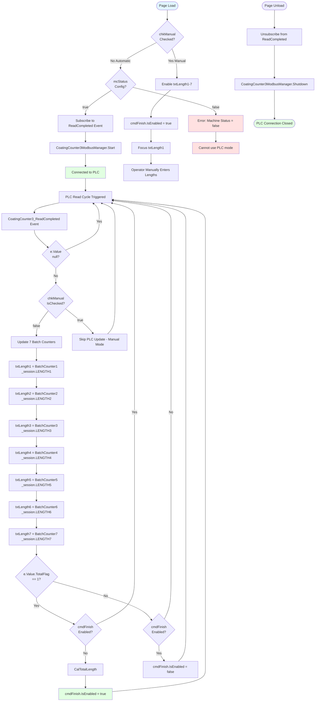
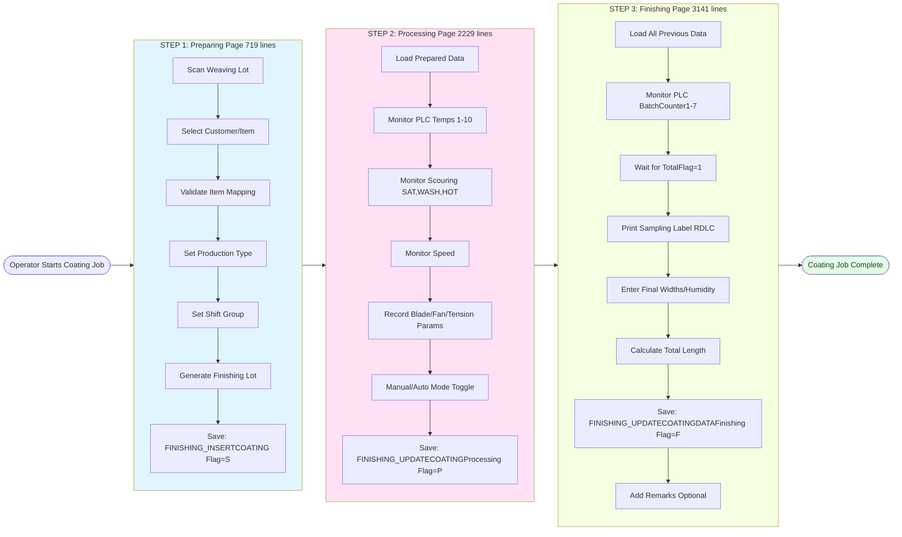

# UI Logic Analysis: Coating3 Finishing Page

## 1. Page Overview

**File**: `LuckyTex.AirBag.Pages\Pages\06 - Finishing\Coating3\Coating3FinishingPage.xaml.cs`
**XAML**: `LuckyTex.AirBag.Pages\Pages\06 - Finishing\Coating3\Coating3FinishingPage.xaml`
**Lines of Code**: 3,141 lines (C#) - **LARGEST FILE IN COATING3 WORKFLOW**
**XAML Lines**: ~800 lines
**Complexity**: **EXTREME** - Combines ALL previous steps + 7 length counters + PLC + Sampling + Printing
**Last Modified**: Active (current implementation)

**Business Context**:
Coating3 Finishing Page is the **final (third) step** in the 3-step Coating3 workflow:
```
Preparing Page → Processing Page → **FINISHING PAGE**
```

This page represents the **culmination** of the coating process, where operators:
1. Load data from Processing step (all temps, parameters, specifications)
2. Monitor real-time batch counters (7 length counters via PLC Modbus)
3. Record final production lengths (7 fabric rolls from same coating run)
4. Capture final humidity measurements
5. Validate coating width/weight against specifications
6. Print batch sampling labels
7. Complete coating operation and save to database
8. Optionally add remarks for quality issues

**Key Responsibilities**:
- Display all data from Preparing + Processing steps (read-only)
- Integrate with PLC for 7 real-time batch counters (LENGTH1-LENGTH7)
- Support Manual mode (operator entry) and Automatic mode (PLC read)
- Calculate total production length (sum of 7 rolls)
- Validate final measurements against specifications
- Generate and print batch sampling labels (barcode + parameters)
- Record end time and completing operator
- Save final coating data to database
- Handle remarks for non-conformances

---

## 2. UI Components Inventory

### Display-Only Fields (From Previous Steps - Read-Only)

| Control Name | Type | Purpose | Data Source |
|-------------|------|---------|-------------|
| **txtCustomer** | TextBox | Customer name | From FINISHING_GETCOATINGCONDITIONDATA |
| **txtItemGoods** | TextBox | Item goods code | From FINISHING_GETCOATINGCONDITIONDATA |
| **txtItemWeaving** | TextBox | Item weaving code | From FINISHING_GETCOATINGCONDITIONDATA |
| **txtLot** | TextBox | Weaving lot number | From FINISHING_GETCOATINGCONDITIONDATA |
| **txtLength** | TextBox | Original fabric length | From FINISHING_GETCOATINGCONDITIONDATA |
| **txtFINISHINGLOT** | TextBox | Finishing lot number | From FINISHING_GETCOATINGCONDITIONDATA |
| **txtStartTime** | TextBox | Preparing start time | Format: dd/MM/yy HH:mm |
| **txtPreparingTime** | TextBox | Preparing timestamp | From FINISHING_GETCOATINGCONDITIONDATA |
| **txtEndTime** | TextBox | Finishing completion time | Set on cmdFinish, format: dd/MM/yy HH:mm |
| **txtOperator** | TextBox | Operator ID | Read-only from session |
| **rbMassProduction** | RadioButton | Production type (hidden) | Visibility Collapsed |
| **rbTest** | RadioButton | Test type (hidden) | Visibility Collapsed |
| **rbGuide** | RadioButton | Guide type (hidden) | Visibility Collapsed |

### Process Parameters (From Processing Step - Read-Only)

| Parameter Category | Fields | Display Format | Editable |
|-------------------|--------|----------------|----------|
| **Temperatures (10 zones)** | txtTEMP1PV ... txtTEMP10PV | Decimal | No (from Processing/PLC) |
| **Scouring Temps** | txtSATPV, txtWASH1PV, txtWASH2PV, txtHOTPV | Decimal | No (from Processing/PLC) |
| **Speeds** | txtSPEED | Decimal (m/min) | No (from Processing/PLC) |
| **Fans** | txtFan110Actual, txtEXFAN1_6Actual, txtEXFAN2_5Actual | Decimal (RPM) | No |
| **Blade** | txtANGLEKNIFEActual, txtBLADENOActual, cbBLADEDIRECTIONActual, img | Decimal, String, Image | No |
| **Tensions** | txtTENSION_UPActual, txtTENSION_DOWNActual | Decimal | No |
| **Frame Widths** | txtFRAMEWIDTH_FORNActual, txtFRAMEWIDTH_TENTERActual | Decimal | No |
| **Silicone** | txtSiliconeA, txtSiliconeB | String | No |
| **Coating Weight** | txtCWL, txtCWC, txtCWR | Decimal (3 positions) | No |

### Finishing-Specific Input Fields (Editable in Finishing Step)

| Control Name | Type | Purpose | Validation | PLC Source | Required |
|-------------|------|---------|------------|------------|----------|
| **txtLength1** | TextBox | Batch counter 1 length | Numeric only | e.Value.BatchCounter1 (PLC) | YES |
| **txtLength2** | TextBox | Batch counter 2 length | Numeric only | e.Value.BatchCounter2 (PLC) | Optional |
| **txtLength3** | TextBox | Batch counter 3 length | Numeric only | e.Value.BatchCounter3 (PLC) | Optional |
| **txtLength4** | TextBox | Batch counter 4 length | Numeric only | e.Value.BatchCounter4 (PLC) | Optional |
| **txtLength5** | TextBox | Batch counter 5 length | Numeric only | e.Value.BatchCounter5 (PLC) | Optional |
| **txtLength6** | TextBox | Batch counter 6 length | Numeric only | e.Value.BatchCounter6 (PLC) | Optional |
| **txtLength7** | TextBox | Batch counter 7 length | Numeric only | e.Value.BatchCounter7 (PLC) | Optional |
| **txtTotalLength** | TextBox | Sum of LENGTH1-7 | Calculated | Auto-calculated | Display only |
| **txtWIDTHCOATActual** | TextBox | Final coating width | Numeric only | Manual entry | YES |
| **txtWIDTHCOATALLActual** | TextBox | Total fabric width | Numeric only | Manual entry | YES |
| **txtHUMIDITY_AF** | TextBox | Humidity after drying | Numeric only | Manual entry | YES |
| **txtHUMIDITY_BF** | TextBox | Humidity before heating | Numeric only | Manual entry (hidden) | NO |

### Control Buttons

| Control Name | Type | Purpose | Enable Condition |
|-------------|------|---------|------------------|
| **chkManual** | CheckBox | Toggle length counters manual/auto | Always enabled |
| **chkManualPLC** | CheckBox | Toggle PLC data manual/auto | Always enabled (purpose unclear) |
| **cbShift** | ComboBox | Select shift group (A/B/C) | Always enabled |
| **cmdSampling** | Button | Print batch sampling label | Lot scanned and data loaded |
| **cmdFinish** | Button | Complete coating operation | All required fields filled + Sampling printed |
| **cmdRemark** | Button | Add quality remarks | After sampling |
| **cmdBack** | Button | Return to previous page | Always enabled |

### Special Features

| Feature | Control | Purpose |
|---------|---------|---------|
| **Sampling Report** | rdlcViewer (hidden) | Generate batch sampling label |
| **Barcode** | On sampling label | Weaving lot barcode |
| **Batch Counter Total Flag** | PLC e.Value.TotalFlag | 0=disable Finish, 1=enable Finish |

---

## 3. Input Fields & Validation

### Required Fields (CheckNull:1178-1201)

**CRITICAL**: Finishing page has **MINIMAL validation** - only 3 required fields!

| Field | Validation | Error Behavior |
|-------|------------|----------------|
| **txtWIDTHCOATActual** | Must not be empty | Return false |
| **txtWIDTHCOATALLActual** | Must not be empty | Return false |
| **txtHUMIDITY_AF** | Must not be empty | Return false |

**txtHUMIDITY_BF** validation is **COMMENTED OUT** (lines 1195-1198).

### Length Fields Validation (cmdFinish_Click:701-717)

```csharp
if (txtLength1.Text == "")
{
    "Please Enter Length".ShowMessageBox();
    return;
}
```

Only **txtLength1** is required. LENGTH2-7 are optional.

### Numeric Input Validation (Common_PreviewKeyDown:233-236)

All length fields use PreviewKeyDown handler:
```csharp
e.Handled = !this.IsNumericInput(e);
```

Restricts input to numbers, decimal point, negative sign, navigation keys.

### Length Entry Flow (KeyDown Handlers:267-361)

Each length field has navigation logic:
- **Enter** key → Focus next length field
- **Length7** → Focus txtWIDTHCOATActual (skip temps, go to final measurements)

**Navigation Chain**:
```
txtLength1 → txtLength2 → txtLength3 → txtLength4 →
txtLength5 → txtLength6 → txtLength7 → txtWIDTHCOATActual →
txtWIDTHCOATALLActual → txtHUMIDITY_AF
```

---

## 4. Button Actions & Event Handlers

### cmdSampling_Click (669-697)

**Purpose**: Generate and print batch sampling label

**Enable Conditions**: Lot must be scanned and data loaded

**Action Flow**:
```csharp
1. Validate txtLot.Text != "" && txtScouringNo.Text != ""
2. Call FINISHING_GETCOATINGDATABYLOT(scouringNo, txtLot.Text)
3. Load lot data and populate fields
4. Call Sampling(scouringNo)
5. Generate RDLC report with barcode
6. Print label
7. Enable cmdFinish button
```

**Sampling Report Includes**:
- Weaving lot barcode
- Customer, Item Goods, Item Weaving
- Finishing Lot, Length
- All coating parameters (temps, widths, blade, etc.)
- Operator, shift, timestamps

### cmdFinish_Click (701-717)

**Purpose**: Complete coating operation and save data

**Enable Conditions**:
- txtLength1 must not be empty
- Sampling must be printed first (checked via chkSampling flag)

**Validation**:
```csharp
if (txtLength1.Text == "")
    return "Please Enter Length";

if (chkSampling != true)
    return "Please Sampling";
```

**Action Flow**:
```csharp
1. Validate LENGTH1 entered
2. Validate sampling printed
3. Call Finish() method
4. If success → Enable cmdRemark, ClearData()
5. Else → Show error
```

### cmdRemark_Click (721-733)

**Purpose**: Add quality remarks/notes after coating completion

**Enable Conditions**: Only enabled after successful Finish

**Action Flow**:
```csharp
1. Show RemarkCoat3Finishing page (popup?)
2. Pass FINISHINGLOT, PRODID, HEADERID
3. Save remarks to database
4. PageManager.Instance.Back()
```

### cmdBack_Click (737-740)

**Enable Conditions**: Always enabled

**Action Flow**:
```csharp
PageManager.Instance.Back();
```

### chkManual_Checked / chkManual_Unchecked (745-782)

**Purpose**: Toggle between Manual length entry and Automatic PLC mode

**Action Flow**:
- **Checked** → Enable txtLength1-7, enable cmdFinish, stop PLC counters, focus txtLength1
- **Unchecked** → Call CheckManual() (1140-1175):
  - If mcStatus == true → Disable txtLength1-7, start PLC reading
  - Else → Show error "Machine Status = false Please check config"

**CheckManual Logic** (1140-1175):
```csharp
if (chkManual.IsChecked == false)
{
    if (mcStatus == true)
    {
        txtLength1-7.IsEnabled = false;  // PLC mode
    }
    else
    {
        "Machine Status = false Please check config".ShowMessageBox();
    }
}
else
{
    txtLength1-7.IsEnabled = true;  // Manual mode
    cmdFinish.IsEnabled = true;
    txtLength1.Focus();
}
```

---

## 5. Main Workflow Diagram

```mermaid
flowchart TD
    Start([Page Load]) --> InitControls[Initialize Controls]
    InitControls --> LoadShift[Load Shift A/B/C]
    LoadShift --> LoadMCConfig[Load Machine Config]
    LoadMCConfig --> DisableFields[Disable Most Fields]
    DisableFields --> HideElements[Hide Product Type RadioButtons<br/>Hide Humidity BF Field]
    HideElements --> SetManualFalse[chkManual.IsChecked = false]
    SetManualFalse --> CheckManual[CheckManual Method]
    CheckManual --> PLCMode{mcStatus?}

    PLCMode -->|true| StartPLC[Start PLC Batch Counters]
    StartPLC --> PLCReading[PLC Read Loop]
    PLCReading --> UpdateLengths[Update LENGTH1-7 from PLC]
    UpdateLengths --> CheckTotalFlag{TotalFlag<br/>== 1?}
    CheckTotalFlag -->|Yes| EnableFinish[Enable cmdFinish]
    CheckTotalFlag -->|No| DisableFinish[Disable cmdFinish]
    DisableFinish --> PLCReading
    EnableFinish --> PLCReading

    PLCMode -->|false| ShowConfigError[Error: Machine Status false]
    ShowConfigError --> End([Exit])

    UpdateLengths --> WaitOperator[Wait for Operator]

    WaitOperator --> ScanLot{Scan Lot?}
    ScanLot -->|Yes| LoadLotData[FINISHING_GETCOATINGDATABYLOT]
    LoadLotData --> CheckDataFound{Data Found?}

    CheckDataFound -->|Yes| PopulateAllFields[Populate ALL Fields<br/>60+ parameters]
    PopulateAllFields --> LoadSpecs[Load Specifications]
    LoadSpecs --> DisplayReady[Page Ready]

    CheckDataFound -->|No| ShowError[Error: Can't Load Coating3]
    ShowError --> WaitOperator

    DisplayReady --> ClickSampling{Click Sampling?}
    ClickSampling -->|Yes| GenerateReport[Generate RDLC Sampling Report]
    GenerateReport --> PrintLabel[Print Barcode Label]
    PrintLabel --> SetSamplingFlag[chkSampling = true]
    SetSamplingFlag --> EnableFinishBtn[Enable cmdFinish button]

    ClickSampling -->|No| WaitForSampling[Wait for Sampling]

    EnableFinishBtn --> OperatorEnters[Operator Verifies/Enters Data]
    OperatorEnters --> ClickFinish{Click Finish?}

    ClickFinish -->|Yes| ValidateLength1{LENGTH1<br/>Entered?}
    ValidateLength1 -->|No| ErrorLength[Error: Please Enter Length]
    ErrorLength --> OperatorEnters

    ValidateLength1 -->|Yes| CheckSamplingDone{Sampling<br/>Printed?}
    CheckSamplingDone -->|No| ErrorSampling[Error: Please Sampling]
    ErrorSampling --> OperatorEnters

    CheckSamplingDone -->|Yes| CallFinish[Call Finish Method]
    CallFinish --> ValidateRequired{CheckNull<br/>Pass?}

    ValidateRequired -->|No| ShowNullError[Error: Required fields null]
    ShowNullError --> OperatorEnters

    ValidateRequired -->|Yes| ParseFields[Parse All Fields]
    ParseFields --> CalcTotal[Calculate Total Length]
    CalcTotal --> SetSession[Set 60+ Session Properties]
    SetSession --> CallUpdateSP[FINISHING_UPDATECOATINGDATAFinishing]
    CallUpdateSP --> CheckSPResult{SP Success?}

    CheckSPResult -->|Yes| SetEndTime[Set txtEndTime = Now]
    SetEndTime --> DisableButtons[Disable cmdFinish/cmdRemark]
    DisableButtons --> SetFinishFlag[chkFinish = true]
    SetFinishFlag --> OperatorRemark{Add Remarks?}

    OperatorRemark -->|Yes| OpenRemarkPage[Show RemarkCoat3Finishing]
    OpenRemarkPage --> SaveRemarks[Save Remarks to DB]
    SaveRemarks --> BackToMenu

    OperatorRemark -->|No| BackToMenu[PageManager.Instance.Back]
    BackToMenu --> End

    CheckSPResult -->|No| ShowSPError[Show SP Error Message]
    ShowSPError --> OperatorEnters

    ScanLot -->|No| WaitOperator

    style Start fill:#e1f5ff
    style ShowError fill:#ffe1e1
    style ShowConfigError fill:#ffe1e1
    style ErrorLength fill:#ffe1e1
    style ErrorSampling fill:#ffe1e1
    style ShowNullError fill:#ffe1e1
    style ShowSPError fill:#ffe1e1
    style SetEndTime fill:#e1ffe1
    style SaveRemarks fill:#e1ffe1
    style BackToMenu fill:#e1ffe1
    style End fill:#e1ffe1
```



---

## 6. PLC Batch Counter Integration Flowchart



---

## 7. State Transition Diagram

```mermaid
stateDiagram-v2
    [*] --> Initial: Page Load

    state Initial {
        [*] --> Initializing
        Initializing: Controls disabled
        Initializing: PLC mode check
        Initializing: Machine config load
    }

    state PLCAutoMode {
        [*] --> PLCRunning
        PLCRunning: Coating3ModbusManager active
        PLCRunning: Real-time batch counter updates
        PLCRunning: LENGTH1-7 streaming from PLC
        PLCRunning: TotalFlag monitoring
    }

    state ManualMode {
        [*] --> ManualEntry
        ManualEntry: PLC disconnected
        ManualEntry: Operator enters lengths manually
        ManualEntry: LENGTH1-7 editable
        ManualEntry: cmdFinish always enabled
    }

    state DataLoaded {
        [*] --> DisplayingData
        DisplayingData: 60+ fields populated
        DisplayingData: Specifications displayed
        DisplayingData: Ready for sampling
    }

    state SamplingReady {
        [*] --> WaitingSampling
        WaitingSampling: cmdSampling enabled
        WaitingSampling: Waiting for operator
    }

    state SamplingGenerated {
        [*] --> PrintingLabel
        PrintingLabel: RDLC report generated
        PrintingLabel: Barcode label printing
        PrintingLabel: chkSampling = true
    }

    state ReadyToFinish {
        [*] --> WaitingFinish
        WaitingFinish: All required fields valid
        WaitingFinish: Sampling printed
        WaitingFinish: LENGTH1 entered
        WaitingFinish: cmdFinish enabled
    }

    state Finishing {
        [*] --> Validating
        Validating: CheckNull validation
        Validating: Parsing 60+ fields
        Validating: Calculating total length
    }

    state Saving {
        [*] --> UpdatingDatabase
        UpdatingDatabase: FINISHING_UPDATECOATINGDATAFinishing
        UpdatingDatabase: Saving all session data
    }

    state Completed {
        [*] --> OperationDone
        OperationDone: EndTime set
        OperationDone: cmdFinish disabled
        OperationDone: cmdRemark enabled
        OperationDone: chkFinish = true
    }

    state AddingRemark {
        [*] --> RemarkEntry
        RemarkEntry: RemarkCoat3Finishing page open
        RemarkEntry: Quality notes entry
    }

    state Error {
        [*] --> DisplayError
        DisplayError: Show error message
        DisplayError: Wait for correction
    }

    Initial --> PLCAutoMode: chkManual = false, mcStatus = true
    Initial --> ManualMode: chkManual = true
    Initial --> Error: mcStatus = false

    PLCAutoMode --> ManualMode: chkManual_Checked
    ManualMode --> PLCAutoMode: chkManual_Unchecked

    PLCAutoMode --> DataLoaded: Lot scanned
    ManualMode --> DataLoaded: Lot scanned

    DataLoaded --> SamplingReady: Data valid
    SamplingReady --> SamplingGenerated: cmdSampling clicked
    SamplingGenerated --> ReadyToFinish: Sampling printed

    ReadyToFinish --> Finishing: cmdFinish clicked
    Finishing --> Saving: Validation passed
    Finishing --> Error: Validation failed

    Saving --> Completed: Save success
    Saving --> Error: Save failed

    Completed --> AddingRemark: cmdRemark clicked
    AddingRemark --> [*]: Remarks saved, go back

    Completed --> [*]: Skip remarks, go back

    Error --> PLCAutoMode: Retry
    Error --> ManualMode: Retry
    Error --> [*]: Give up
```



---

## 8. Sequence Diagram

```mermaid
sequenceDiagram
    actor Operator
    participant UI as Coating3FinishingPage
    participant Session as FinishingSession
    participant PLC as CoatingCounter3ModbusManager
    participant Report as ConmonReportService
    participant Service as FinishingDataService
    participant DB as Oracle Database

    Operator->>UI: Page Load
    UI->>UI: LoadShift()
    UI->>UI: LoadMachineConfig()
    UI->>UI: DisableFields()
    UI->>UI: chkManual.IsChecked = false
    UI->>UI: CheckManual()

    alt mcStatus == true (PLC Available)
        UI->>PLC: Subscribe to ReadCompleted
        PLC->>PLC: Start Modbus connection

        loop PLC Read Loop (Auto Mode)
            PLC->>UI: CoatingCounter3_ReadCompleted(e.Value)
            UI->>UI: Check chkManual.IsChecked == false

            alt Auto Mode
                UI->>UI: Update LENGTH1 = BatchCounter1
                UI->>UI: Update LENGTH2-7 from PLC
                UI->>Session: Set _session.LENGTH1-7

                alt TotalFlag == 1
                    alt cmdFinish not enabled
                        UI->>UI: CalTotalLength()
                        UI->>UI: cmdFinish.IsEnabled = true
                    end
                else TotalFlag == 0
                    alt cmdFinish enabled
                        UI->>UI: cmdFinish.IsEnabled = false
                    end
                end
            end
        end
    else mcStatus == false
        UI->>Operator: Error: Machine Status = false
    end

    Operator->>UI: Scan txtLot
    UI->>Service: FINISHING_GETCOATINGDATABYLOT(scouringNo, txtLot.Text)
    Service->>DB: Query coating data

    alt Data Found
        DB-->>Service: Coating lot data (60+ fields)
        Service-->>UI: items[0]
        UI->>UI: Populate all display fields
        Note over UI: Customer, Item, Lot<br/>Temps 1-10, SAT, WASH, HOT<br/>Fans, Blade, Tensions, Widths<br/>Silicone, Coating Weights, etc.

        UI->>Service: LoadFinishing(itm_code, CoatNo)
        Service->>DB: FINISHING_GETCOATINGCONDITION
        DB-->>Service: Specification data
        Service-->>UI: Specs
        UI->>UI: Display specifications (red text)

    else Data Not Found
        DB-->>Service: No data
        Service-->>UI: Error
        UI->>Operator: Error: Can't Load Coating3
    end

    Operator->>UI: Check chkManual (switch to manual)
    UI->>PLC: Stop PLC updates
    UI->>UI: Enable txtLength1-7 manual entry
    UI->>UI: cmdFinish.IsEnabled = true
    UI->>UI: Focus txtLength1

    Operator->>UI: Enter LENGTH1-7 manually
    Operator->>UI: Click cmdSampling
    UI->>UI: Validate txtLot and txtScouringNo

    alt Valid
        UI->>UI: Sampling(scouringNo)
        UI->>Report: Set ReportName, ScouringNo, etc.
        UI->>Report: Generate RDLC report
        Report->>Report: Create barcode for txtLot
        Report->>Report: Populate sampling label
        Report-->>UI: Report ready
        UI->>UI: Print label
        UI->>UI: chkSampling = true
        UI->>Operator: Sampling label printed
    else Invalid
        UI->>Operator: Show error
    end

    Operator->>UI: Click cmdFinish
    UI->>UI: Validate txtLength1 != ""

    alt LENGTH1 empty
        UI->>Operator: Error: Please Enter Length
    else Sampling not printed
        UI->>Operator: Error: Please Sampling
    else All valid
        UI->>UI: Finish() method
        UI->>UI: Parse LENGTH1-7 to decimals
        UI->>UI: CalTotalLength()
        UI->>UI: Parse WIDTHCOAT, WIDTHCOATALL, HUMIDITY
        UI->>UI: Parse all process parameters (40+ fields)

        UI->>Session: Set all session properties (60+)
        Note over Session: FINISHLOT, Operator, Flag = "F"<br/>LENGTH1-7<br/>WIDTHCOAT, WIDTHCOATALL<br/>HUMIDITY_AF, HUMIDITY_BF<br/>BE_COATWIDTH, FANRPM, EXFAN<br/>ANGLEKNIFE, BLADENO, BLADEDIRECTION<br/>TENSIONS, FRAMEWIDTHS<br/>SILICONE_A, SILICONE_B<br/>CWL, CWC, CWR<br/>SAT, WASH1/2, HOT, TEMP1-10, SPEED<br/>SATURATOR_PV/SP, WASHING_PV/SP<br/>HOTFLUE_PV/SP, TEMP_PV/SP<br/>SPEED_PV/SP<br/>ENDDATE, CONDITIONBY, CONDITONDATE<br/>OPERATOR_GROUP

        UI->>Session: FINISHING_UPDATECOATINGDATAFinishing()
        Session->>DB: UPDATE finishing coating data

        alt SP Success
            DB-->>Session: Empty result (success)
            Session-->>UI: Success
            UI->>UI: txtEndTime = DateTime.Now
            UI->>UI: cmdFinish.IsEnabled = false
            UI->>UI: cmdRemark.IsEnabled = false
            UI->>UI: chkFinish = true
            UI->>Operator: Coating operation completed

            Operator->>UI: Click cmdRemark (optional)
            UI->>UI: Show RemarkCoat3Finishing page
            Operator->>UI: Enter quality remarks
            UI->>DB: Save remarks
            UI->>UI: PageManager.Instance.Back()

        else SP Failed
            DB-->>Session: Error message
            Session-->>UI: Error result
            UI->>Operator: Show error message
        end
    end

    UI->>UI: Page Unload
    UI->>PLC: Unsubscribe from ReadCompleted
    PLC->>PLC: Shutdown
```



---

## 9. Business Rules

### Flag System (Finish:2081)

```csharp
string flag = "F";  // Finishing flag
```

- **"S"** (Scouring/Start) used in Preparing page
- **"P"** (Processing) used in Processing page
- **"F"** (Finishing) used in this page

### Batch Counter Logic (CoatingCounter3_ReadCompleted:154-225)

**TotalFlag** from PLC controls cmdFinish enable state:

```csharp
if (e.Value.TotalFlag == 0)
{
    if (cmdFinish.IsEnabled == true)
        cmdFinish.IsEnabled = false;
}
else if (e.Value.TotalFlag == 1)
{
    if (cmdFinish.IsEnabled == false)
    {
        CalTotalLength();
        cmdFinish.IsEnabled = true;
    }
}
```

**Purpose**: PLC signals when coating run is complete (TotalFlag = 1), then enables Finish button.

### Length Calculation (CalTotalLength:2462-2503)

```csharp
decimal? length1-7 = 0;

if (txtLength1.Text != "")
    length1 = decimal.Parse(txtLength1.Text);
// ... repeat for LENGTH2-7 ...

txtTotalLength.Text = MathEx.Round(
    (length1.Value + length2.Value + length3.Value +
     length4.Value + length5.Value + length6.Value + length7.Value),
    2
).ToString();
```

**Purpose**: Calculate total production length across all 7 fabric rolls from single coating run.

### Sampling Requirement (cmdFinish_Click:709-717)

```csharp
if (chkSampling != true)
{
    "Please Sampling".ShowMessageBox();
    return;
}
```

**Business Rule**: Operators MUST print sampling label before completing coating operation. This ensures traceability - every finished roll has a printed barcode label.

### Humidity Fields (Constructor:73-75)

```csharp
txtClothHumidity.Visibility = System.Windows.Visibility.Collapsed;
txtHUMIDITYBFSpecification.Visibility = System.Windows.Visibility.Collapsed;
txtHUMIDITY_BF.Visibility = System.Windows.Visibility.Collapsed;
```

**Business Decision**: Hide "Humidity Before Heating" field. Only "Humidity After Drying" (txtHUMIDITY_AF) is visible and required.

**Reason**: Quality control focuses on final moisture content after drying process.

### Manual vs PLC Data Priority (Finish:2228-2414)

In Finish method, **BOTH manual and PLC data** are saved:

1. **Basic session properties** (SAT, WASH1/2, HOT, TEMP1-10, SPEED) from text fields (lines 2228-2287)
2. **PV/SP session properties** with try-catch parsing (lines 2324-2414)

**Result**: If operator manually changes values in text fields, those values override PLC data when saving.

### Specification vs Actual Comparison

**Code does NOT validate** actual values against specifications. Validation is **VISUAL ONLY** - operator sees spec in red text and enters actual value, but no automatic pass/fail check.

**Example** (LoadFinishing:1380-1385):
```csharp
txtWIDTHCOATSpecification.Text = "> " + items[0].WIDTHCOAT.Value.ToString("#,##0.##");
// But no code checks if txtWIDTHCOATActual.Text > specification
```

**Impact**: Quality relies on operator judgment, not system enforcement.

---

## 10. Database Operations

### Stored Procedures

| Procedure Name | Parameters | Purpose | Called From | Return Values |
|---------------|-----------|---------|-------------|---------------|
| **FINISHING_GETCOATINGDATABYLOT** | scouringNo, WEAVINGLOT | Load coating data for specific lot | txtLot_LostFocus:256-262, cmdSampling:669-697 | Coating lot data (60+ fields) |
| **FINISHING_GETCOATINGCONDITION** | itm_code, CoatNo | Load specification values | LoadFinishing:1206-1499 | Specification data |
| **FINISHING_UPDATECOATINGDATAFinishing** | (via session properties) | Save final coating data | Finish:2430 | Empty on success, error message on failure |

### FINISHING_UPDATECOATINGDATAFinishing Parameters (via Session)

**Note**: This stored procedure accepts **70+ parameters** (largest in Coating3 workflow):

```csharp
// Core identifiers
_session.FINISHLOT = FINISHLOT;
_session.Operator = operatorid;
_session.Flag = "F";

// Length data (7 batch counters)
_session.LENGTH1 = length1;  // Required
_session.LENGTH2 = length2;  // Optional
_session.LENGTH3 = length3;  // Optional
_session.LENGTH4 = length4;  // Optional
_session.LENGTH5 = length5;  // Optional
_session.LENGTH6 = length6;  // Optional
_session.LENGTH7 = length7;  // Optional

// Final measurements (required)
_session.WIDTHCOAT = decimal;           // Coating width
_session.WIDTHCOATALL = decimal;        // Total fabric width
_session.HUMIDITY_AF = decimal;         // Humidity after drying
_session.HUMIDITY_BF = decimal;         // Humidity before heating (hidden)

// Coating parameters (from Processing, optional updates)
_session.BE_COATWIDTH = decimal;
_session.FANRPM = decimal;
_session.EXFAN_FRONT_BACK = decimal;
_session.EXFAN_MIDDLE = decimal;
_session.ANGLEKNIFE = decimal;
_session.BLADENO = string;
_session.BLADEDIRECTION = string;      // R, L, or C
_session.FORN = decimal;
_session.TENTER = decimal;
_session.WEAVLENGTH = decimal;

// Silicone and coating weights
_session.SILICONE_A = string;
_session.SILICONE_B = string;
_session.CWL = decimal;                // Coating weight Left
_session.CWC = decimal;                // Coating weight Center
_session.CWR = decimal;                // Coating weight Right

// Scouring process (single values)
_session.SAT = decimal;                // Saturator temp
_session.WASHING1 = decimal;           // Washer 1 temp
_session.WASHING2 = decimal;           // Washer 2 temp
_session.HOTFLUE = decimal;            // Dryer temp

// Oven temperatures (single values)
_session.TEMP1 = decimal;
_session.TEMP2 = decimal;
// ... TEMP3-10 (10 zones total)

// Production speed
_session.SPEED = decimal;

// Scouring process (PV/SP pairs)
_session.SATURATOR_PV = decimal;
_session.SATURATOR_SP = decimal;
_session.WASHING1_PV = decimal;
_session.WASHING1_SP = decimal;
_session.WASHING2_PV = decimal;
_session.WASHING2_SP = decimal;
_session.HOTFLUE_PV = decimal;
_session.HOTFLUE_SP = decimal;
_session.SPEED_PV = decimal;
_session.SPEED_SP = decimal;

// Tensions
_session.TENSIONUP = decimal;
_session.TENSIONDOWN = decimal;

// Timestamps
_session.ENDDATE = DateTime.Now;
_session.CONDITIONBY = operatorid;
_session.CONDITONDATE = DateTime.Now;

// Shift
_session.OPERATOR_GROUP = string;      // A, B, or C
```

**Total Session Parameters**: 70+ properties set in Finish method

### Return Value Handling (Finish:2432-2448)

```csharp
string result = _session.FINISHING_UPDATECOATINGDATAFinishing();

if (string.IsNullOrEmpty(result) == true)
{
    txtEndTime.Text = DateTime.Now.ToString("dd/MM/yy HH:mm");
    cmdFinish.IsEnabled = false;
    cmdRemark.IsEnabled = false;
    chkFinish = true;
}
else
{
    result.ShowMessageBox(true);
    chkFinish = false;
}
```

**Success**: Empty string → Set end time, disable buttons, set flag
**Failure**: Error message → Show to operator, allow retry

---

## 11. D365 Integration

**NO D365 Integration in Coating3 Finishing Page**

All operations are local to MES Oracle database. No D365DataService calls found.

**Comparison**:
- Coating1 Finishing: Unknown (need analysis)
- Coating3 Finishing: No D365 calls

---

## 12. Error Handling

### Try-Catch Patterns

1. **ClearReportVariable** (993-1005)
```csharp
// No try-catch, just sets report properties to empty
```

2. **ClearData** (1011-1091)
```csharp
try {
    // Clear 60+ controls
    if (_session.Customer != "")
        _session = new FinishingSession();
}
catch (Exception ex) {
    ex.Message.ToString().ShowMessageBox(true);
}
```

3. **CheckNull** (1178-1201)
```csharp
// No try-catch, simple boolean validation
bool chkSave = true;

if (txtWIDTHCOATActual.Text == "")
    return false;
if (txtWIDTHCOATALLActual.Text == "")
    return false;
if (txtHUMIDITY_AF.Text == "")
    return false;

return chkSave;
```

4. **LoadFinishing** (1206-1499)
```csharp
try {
    // 300+ lines of specification loading
    // No validation, just field population
}
catch (Exception ex) {
    ex.Message.ToString().ShowMessageBox(true);
}
```

5. **FINISHING_GETCOATINGDATABYLOT** (txtLot_LostFocus:256-262)
```csharp
if (!string.IsNullOrEmpty(txtScouringNo.Text) && !string.IsNullOrEmpty(txtLot.Text))
{
    FINISHING_GETCOATINGDATABYLOT(txtScouringNo.Text, txtLot.Text);
}
// Called method has try-catch
```

6. **Finish** (2074-2458)
```csharp
try {
    // Parse LENGTH1-7
    // Parse WIDTHCOAT, WIDTHCOATALL, HUMIDITY
    // Parse all process parameters (40+ fields)
    // Set 70+ session properties

    string result = _session.FINISHING_UPDATECOATINGDATAFinishing();

    if (string.IsNullOrEmpty(result) == true) {
        // Success logic
        chkFinish = true;
    } else {
        result.ShowMessageBox(true);
        chkFinish = false;
    }

    return chkFinish;
}
catch (Exception ex) {
    ex.Message.ToString().ShowMessageBox(true);
    return false;
}
```

7. **Temperature/Speed Parsing with Silent Exception Swallowing** (2324-2414)
```csharp
// SATURATOR
if (txtSATPV.Text != "")
{
    try {
        decimal satpv = decimal.Parse(txtSATPV.Text);
        _session.SATURATOR_PV = satpv;
        _session.SATURATOR_SP = satpv;
    }
    catch {
        _session.SATURATOR_PV = 0;  // SILENT FAILURE
        _session.SATURATOR_SP = 0;
    }
}
```

**Repeated 5 times** for: SATURATOR, WASHING1, WASHING2, HOTFLUE, SPEED

8. **WEAVLENGTH Parsing** (2197-2211)
```csharp
try {
    if (txtLength.Text != "")
        _session.WEAVLENGTH = decimal.Parse(txtLength.Text);
}
catch {
    _session.WEAVLENGTH = 0;  // Silent failure
}
```

9. **CalTotalLength** (2462-2503)
```csharp
try {
    // Parse LENGTH1-7
    // Calculate total
    txtTotalLength.Text = MathEx.Round(sum, 2).ToString();
}
catch {
    // No error handling! Silently fails
}
```

### Error Messages

| Scenario | Error Message | Action |
|----------|--------------|--------|
| LENGTH1 empty | "Please Enter Length" | Return to form |
| Sampling not printed | "Please Sampling" | Return to form |
| Required field null (CheckNull) | (No message shown) | Return false from Finish |
| Stored procedure error | (Returned error message from SP) | Display SP message |
| Database exception | ex.Message.ToString() | Generic catch-all |
| Machine config disabled | "Machine Status = false Please check config" | Cannot use PLC mode |
| Parse error in temp/speed | (No message - sets to 0) | **SILENT FAILURE** |
| Parse error in CalTotalLength | (No message - no action) | **SILENT FAILURE** |

---

## 13. Critical Findings

### Performance Issues

1. **No Async/Await Usage**
   - All database calls are synchronous
   - Page load blocks UI during data fetch
   - Finish blocks UI during 70+ parameter update
   - **Impact**: Very poor UX - longest operation in Coating3 workflow

2. **Excessive Field Parsing in Finish** (2074-2458)
   - 384 lines of repetitive parsing code
   - 7 length fields + 40+ process parameters
   - Nested try-catch blocks
   - **Recommendation**: Use reflection or data-driven approach

3. **PLC Read Loop Performance**
   - PLC reads all 7 batch counters every cycle
   - Updates UI and session on every read
   - No throttling or debouncing
   - **Potential Issue**: High CPU usage with fast PLC polling

4. **Report Generation Overhead** (Sampling:784-910)
   - RDLC report generates on every sampling click
   - Barcode generation for every lot
   - Report viewer manipulation
   - **Impact**: Slow sampling label printing

### Bugs/Code Smells

1. **CRITICAL BUG: Silent Exception Swallowing** (2324-2414, 2197-2211, 2462-2503)
   ```csharp
   catch {
       _session.SATURATOR_PV = 0;
       _session.SATURATOR_SP = 0;
   }
   ```
   - **Impact**: Invalid input (e.g., "abc") silently becomes 0
   - Operator doesn't know input was rejected
   - Could save incorrect 0°C temperature or 0 m/min speed to database
   - **Affects**: 6 fields (SAT, WASH1/2, HOT, SPEED, WEAVLENGTH)
   - **Same bug as Processing page** - needs unified fix
   - **Recommendation**: Show validation error, don't swallow exception

2. **CRITICAL BUG: CalTotalLength Has No Error Handling** (2462-2503)
   ```csharp
   try {
       // 40 lines of parsing and calculation
   }
   catch {
       // EMPTY CATCH BLOCK - no error message, no logging
   }
   ```
   - **Impact**: If total calculation fails, operator sees nothing
   - txtTotalLength could be empty or wrong
   - **Recommendation**: At minimum, log error and show message

3. **Minimal Field Validation** (CheckNull:1178-1201)
   - Only 3 required fields: WIDTHCOAT, WIDTHCOATALL, HUMIDITY_AF
   - LENGTH1 validated separately in cmdFinish_Click
   - **40+ other fields are optional** (temps, speeds, fans, blade, tensions, etc.)
   - **Risk**: Critical process parameters could be missing
   - **Question**: Why are temps/speeds optional in Finishing but required in Processing?

4. **TotalFlag Logic Race Condition** (CoatingCounter3_ReadCompleted:211-223)
   ```csharp
   if (e.Value.TotalFlag == 1)
   {
       if (cmdFinish.IsEnabled == false)
       {
           CalTotalLength();
           cmdFinish.IsEnabled = true;
       }
   }
   ```
   - **Issue**: CalTotalLength called in PLC event handler (background thread?)
   - UI update from non-UI thread
   - **Potential Issue**: Cross-thread operation exception
   - **Recommendation**: Use Dispatcher.Invoke for UI updates

5. **Duplicate Data Storage** (Finish:2228-2323, 2324-2414)
   - SAT stored in `_session.SAT` AND `_session.SATURATOR_PV/SP`
   - Same for WASHING1/2, HOTFLUE, SPEED, TEMP1-10
   - **Impact**: Data inconsistency if one set fails to parse
   - **Question**: Why store same data in two session properties?

6. **chkManualPLC Checkbox Never Used** (Constructor:141, ClearData:1067)
   ```csharp
   chkManualPLC.IsChecked = false;
   ```
   - **chkManualPLC** is set but never checked in code
   - **chkManual** controls length counters (LENGTH1-7)
   - **chkManualPLC** purpose unknown - dead code?
   - **Recommendation**: Remove if unused, or implement if intended

7. **Commented-Out Code Block** (Lines 1908-2068)
   - 160 lines of commented-out Finish() method logic
   - Appears to be old version of current Finish() method
   - **Recommendation**: Remove commented code, use version control

8. **Session Reset Logic** (ClearData:1070-1071)
   ```csharp
   if (_session.Customer != "")
       _session = new FinishingSession();
   ```
   - Same issue as other pages - conditional session reset
   - **Recommendation**: Always create new session in ClearData()

9. **Magic String "255"** (Constructor, SetupOperatorAndMC)
   - txtScouringNo default value is "255"
   - No explanation for why 255 is special
   - **Recommendation**: Use constant or config value

### Refactoring Opportunities

1. **Extract Length Parsing Method**
   - Create `ParseLengths(out decimal? length1-7)` method
   - Consolidate parsing logic from Finish and CalTotalLength
   - Reduce code duplication

2. **Create ParameterParser Class** (Same as Processing recommendation)
   - Consolidate all parsing logic
   - Use reflection to map textbox names to session properties
   - Reduce Finish method from 384 lines to ~50 lines

3. **Specification Display Helper** (Same as Processing recommendation)
   - LoadFinishing is 300+ lines of repetitive formatting
   - Create helper methods for different formats
   - Reduces code duplication

4. **Batch Counter Model**
   - Create `BatchCounterData` class with LENGTH1-7 properties
   - Map PLC event data to model
   - Simplify CoatingCounter3_ReadCompleted logic

5. **Session Builder Pattern** (Same as Processing recommendation)
   - Create `FinishingSessionBuilder` class
   - Fluent API for setting 70+ session properties
   - Built-in validation
   - Example:
     ```csharp
     var builder = new FinishingSessionBuilder(_session)
         .SetLengths(length1-7)
         .SetMeasurements(width, widthAll, humidity)
         .SetProcessParams(temps, speeds, etc.)
         .Build();
     ```

6. **Validation Framework** (Same as Processing recommendation)
   - Create field validators
   - Centralize validation logic
   - Real-time validation feedback

7. **Report Generation Service**
   - Extract Sampling() method to separate service class
   - Async report generation
   - Template-based report building
   - Reduces page complexity

8. **UI Threading Fix**
   - Wrap all PLC UI updates in Dispatcher.Invoke
   - Ensure thread-safe operations
   - Prevent cross-thread exceptions

---

## 14. Code Metrics

| Metric | Value | Assessment |
|--------|-------|------------|
| **Total Lines** | 3,141 | **EXTREME** - largest file in project |
| **Finish Method** | 384 lines | **EXTREME** - should be <100 |
| **LoadFinishing Method** | 294 lines | **VERY HIGH** - should be <150 |
| **Sampling Method** | 127 lines | HIGH - should be <100 |
| **CalTotalLength Method** | 41 lines | Acceptable |
| **Methods** | 70+ | Very high method count |
| **Event Handlers** | 50+ | **EXTREME** (mostly KeyDown) |
| **Database Calls** | 3 stored procedures | Moderate |
| **Try-Catch Blocks** | 15+ | High |
| **PLC Parameters** | 7 (BatchCounter1-7) | Simple batch counting |
| **Session Properties Set** | 70+ | **EXTREME** (most in workflow) |
| **Cyclomatic Complexity** | ~25 (Finish method) | **VERY HIGH** |
| **Code Duplication** | ~80% (parsing/formatting) | **EXTREME** |
| **Commented-Out Code** | 160 lines | Should be removed |
| **Dead Code** | chkManualPLC (unused) | Should be removed |

**Overall Assessment**: This is the **MOST COMPLEX PAGE IN THE ENTIRE PROJECT**, with extreme technical debt. Highest refactoring priority.

---

## 15. Coating1 vs Coating3 Comparison

| Feature | Coating1 Finishing | Coating3 Finishing | Notes |
|---------|-------------------|-------------------|-------|
| **Workflow Step** | **Step 2 of 2** (final) | **Step 3 of 3** (final) | Coating3 adds Processing step |
| **Lines of Code** | Unknown | **3,141** | Largest page |
| **Batch Counters** | Unknown | **7 counters** (PLC) | Multiple fabric rolls |
| **TotalFlag** | Unknown | YES (PLC signal) | Enables Finish button |
| **Sampling Label** | Unknown | YES (RDLC barcode) | Required before Finish |
| **Manual/Auto Mode** | Unknown | YES (chkManual toggle) | For length counters |
| **Length Fields** | Unknown | 7 (LENGTH1-7) | Multi-roll production |
| **Total Length Calc** | Unknown | YES (sum of 7) | Production total |
| **Required Fields** | Unknown | **3 fields** (width, widthAll, humidity) | Minimal validation |
| **Temperature Display** | Unknown | YES (10 zones from Processing) | Read-only |
| **Scouring Display** | Unknown | YES (SAT, WASH, HOT from Processing) | Read-only |
| **Remarks Function** | Unknown | YES (quality notes) | After completion |
| **Flag Parameter** | Unknown | "F" (Finishing) | Different workflow step |
| **Session Parameters** | Unknown | **70+** | Most in workflow |
| **PLC Integration** | Unknown | CoatingCounter3ModbusManager | Real-time batch counters |
| **D365 Integration** | Unknown | NO | MES only |
| **Business Purpose** | 2-step coating | 3-step coating with scouring | More complex process |

### Key Architectural Differences

**Coating1 (2-Step)**:
```
Preparing → Finishing
```
- Simpler workflow
- Fewer steps = less data to carry forward
- Likely single-roll production

**Coating3 (3-Step)**:
```
Preparing → Processing → Finishing
```
- Complex workflow with scouring
- Processing step captures all temperatures/speeds
- Finishing step focuses on **production output** (7 batch counters)
- Multi-roll production from single coating run

### Why 7 Batch Counters?

**Hypothesis**: Coating3 machine has **7 coating lanes** or **7 fabric rolls** running simultaneously through the same coating process. Each lane has its own length counter, monitored by PLC.

**Evidence**:
- PLC provides BatchCounter1-7
- Each counter updates independently
- TotalFlag signals when ALL 7 counters complete
- Total production = sum of all 7 lengths

**Business Value**: Higher throughput - process 7 fabric rolls in one coating run instead of one at a time.

---

## 16. 3-Step Workflow Comparison Matrix

| Aspect | Preparing Page | Processing Page | **Finishing Page** |
|--------|---------------|----------------|------------------|
| **Purpose** | Setup coating job | Monitor process parameters | **Record production output** |
| **Lines of Code** | 719 | 2,229 | **3,141 (LARGEST)** |
| **Key Inputs** | Customer, Item, Lot | Temps, Speeds, Blade | **LENGTH1-7, Final measurements** |
| **PLC Integration** | Minimal (manager init) | **Active** (TEMP1-10, SAT, WASH, HOT, SPEED) | **Active** (BatchCounter1-7, TotalFlag) |
| **Database Write** | INSERT (FINISHING_INSERTCOATING) | UPDATE (FINISHING_UPDATECOATINGProcessing) | **UPDATE (FINISHING_UPDATECOATINGDATAFinishing)** |
| **Flag** | "S" (Start) | "P" (Processing) | **"F" (Finishing)** |
| **Session Properties** | ~15 | ~60 | **~70 (MOST)** |
| **Required Fields** | 4 (Customer, Item, Lot, Length) | 15 (Temps, Speed) | **3 (Width, WidthAll, Humidity)** |
| **Validation Level** | Medium | High (many commented out) | **Low (minimal)** |
| **Special Features** | Reprocess mode | Manual/Auto temps | **Sampling labels, Batch counters, Remarks** |
| **Operator Actions** | Scan lot, select customer/item | Monitor/record temps | **Enter lengths, print label, finish job** |
| **Complexity** | Medium | Very High | **EXTREME** |
| **Refactoring Priority** | Medium | High | **CRITICAL (highest)** |

---

## 17. Next Steps for Modernization

### CRITICAL Priorities

1. **Fix Silent Exception Swallowing** (HIGHEST PRIORITY)
   - Affects 6 fields in Finish method
   - Could save incorrect 0 values to database
   - Replace all try-catch with validation
   - Show error messages for invalid input

2. **Fix CalTotalLength Error Handling**
   - Add logging to empty catch block
   - Show error message to operator
   - Validate total calculation result

3. **Fix UI Threading in PLC Event Handler**
   - Wrap CoatingCounter3_ReadCompleted UI updates in Dispatcher.Invoke
   - Prevent cross-thread operation exceptions
   - Ensure thread safety

4. **Reduce Finish Method Complexity**
   - Extract parsing logic to helper methods
   - Current: 384 lines → Target: <100 lines
   - Use builder pattern for session setup

### HIGH Priorities

5. **Implement Async/Await**
   - Convert FINISHING_GETCOATINGDATABYLOT to async
   - Convert FINISHING_UPDATECOATINGDATAFinishing to async
   - Show loading indicators during operations
   - Improve UX for long database operations

6. **Remove Dead Code**
   - Delete 160 lines of commented-out Finish method
   - Remove chkManualPLC if unused, or implement if intended
   - Clean up unused variables

7. **Consolidate Validation**
   - Create unified validation framework
   - Consistent required field handling across all 3 pages
   - Document why Finishing has minimal validation

### MEDIUM Priorities

8. **Create ViewModel**
   - Extract all UI logic to FinishingViewModel
   - Implement INotifyPropertyChanged for PLC data binding
   - Use MVVM pattern for testability

9. **Optimize Report Generation**
   - Extract Sampling to separate service
   - Implement async report generation
   - Cache report templates

10. **Add Unit Tests**
    - Test length calculation logic
    - Test PLC batch counter mapping
    - Test validation rules
    - Mock FinishingSession and data services

### LOW Priorities

11. **Refactor LoadFinishing**
    - Create specification display helpers
    - Reduce from 294 lines to <100 lines
    - Use templating for repetitive formatting

12. **Document Business Rules**
    - Why 7 batch counters?
    - Why minimal validation in Finishing vs Processing?
    - What is TotalFlag algorithm in PLC?
    - Why chkManualPLC exists?

13. **Performance Monitoring**
    - Measure PLC read frequency
    - Measure Finish execution time
    - Optimize DB query performance
    - Implement throttling for PLC updates

---

## 18. End-to-End Coating3 Workflow Summary

### Complete 3-Step Workflow



### Data Flow Across 3 Steps

| Data Category | Preparing | Processing | Finishing | Total Fields |
|--------------|-----------|-----------|-----------|--------------|
| **Core IDs** | FINISHINGLOT, WEAVINGLOT, Customer, Item | (Read-only) | (Read-only) | 5 |
| **Production Type** | PRODUCTTYPEID (1/2/3) | (Read-only) | (Hidden) | 1 |
| **Shift** | OPERATOR_GROUP (A/B/C) | OPERATOR_GROUP (A/B/C/D) | OPERATOR_GROUP (A/B/C) | 1 |
| **Lengths** | WEAVLENGTH | (Read-only) | LENGTH1-7, Total | 8 |
| **Temperatures** | - | TEMP1-10 PV/SP | (Read-only) | 20 |
| **Scouring** | - | SAT, WASH1/2, HOT PV/SP | (Read-only) | 8 |
| **Speed** | - | SPEED PV/SP | (Read-only) | 2 |
| **Blade** | - | ANGLE, NO, DIRECTION | (Read-only) | 3 |
| **Fans** | - | FAN110, EXFAN1_6, EXFAN2_5 | (Read-only) | 3 |
| **Tensions** | - | TENSIONUP, TENSIONDOWN | (Read-only) | 2 |
| **Frame Widths** | - | FORN, TENTER | (Read-only) | 2 |
| **Coating** | - | BE_COATWIDTH | WIDTHCOAT, WIDTHCOATALL | 3 |
| **Silicone** | - | SILICONE_A, SILICONE_B | (Read-only) | 2 |
| **Coating Weight** | - | CWL, CWC, CWR | (Read-only) | 3 |
| **Humidity** | - | HUMIDITY_BF | HUMIDITY_AF | 2 |
| **Timestamps** | STARTDATE | - | ENDDATE, CONDITONDATE | 3 |
| **Operators** | Operator (Preparing) | Operator (Processing) | Operator, CONDITIONBY (Finishing) | 3 |
| **Flags** | "S" | "P" | "F" | 1 |
| **TOTAL** | ~15 | ~60 | ~70 | **~75 unique fields** |

### Key Insights

1. **Data Accumulation**: Each step adds more data, with Finishing containing ALL data from previous steps
2. **Processing is the Heavyweight**: Captures most process parameters (60 fields)
3. **Finishing is the Finalizer**: Adds production output (7 lengths) and closes the job
4. **Flag System**: Tracks workflow progress ("S" → "P" → "F")
5. **Read-Only Propagation**: Later steps display but don't modify earlier data (except Finishing can update some process params)

---

## End of Document

**RECOMMENDATION**: This page requires **IMMEDIATE REFACTORING** before any new features are added. The 3,141 lines, 384-line Finish method, and silent exception swallowing represent the highest technical debt in the Coating3 workflow.
