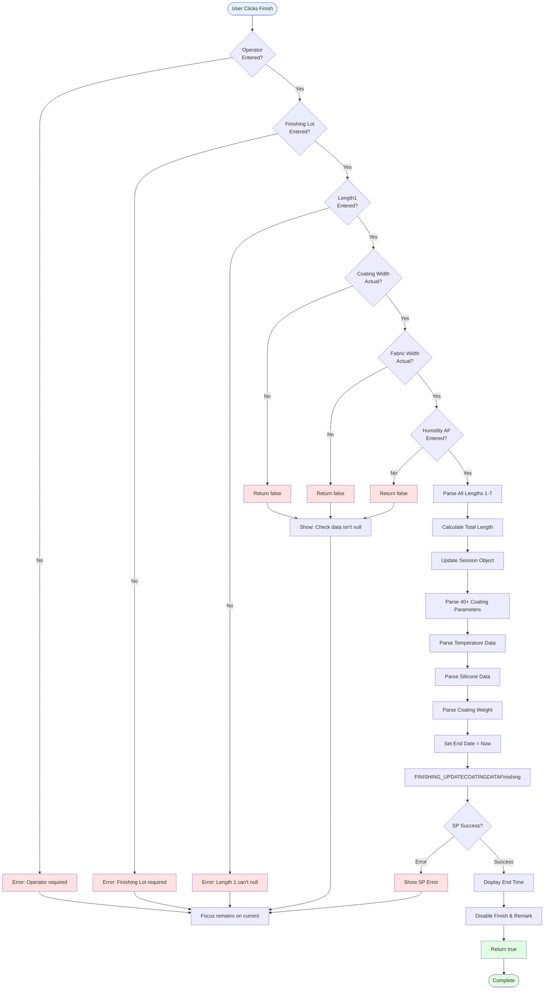
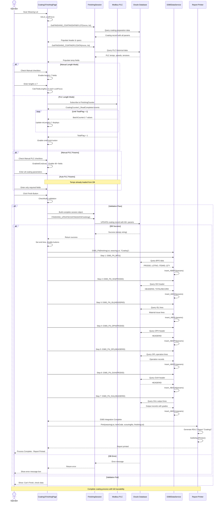

# UI Logic Analysis: Coating1 Finishing Page

## 1. Page Overview

**File Information:**
- **XAML File**: `LuckyTex.AirBag.Pages\Pages\06 - Finishing\Coating1\Coating1FinishingPage.xaml`
- **Code-Behind**: `LuckyTex.AirBag.Pages\Pages\06 - Finishing\Coating1\Coating1FinishingPage.xaml.cs`
- **Lines of Code**: 3,163 lines (code-behind) - **VERY LARGE**
- **Complexity**: **VERY HIGH**
- **Business Context**: Final stage of coating process - captures actual production data including 7 length measurements, 40+ coating parameters, PLC integration, D365 ERP synchronization, and report generation

**Purpose**: This page allows operators to complete the coating process by entering actual production data, including fabric lengths, coating conditions (temperature, tension, speed, blade settings, silicone ratios, humidity), with optional PLC integration for automatic data capture, followed by D365 ERP integration and report printing.

---

## 2. UI Components Inventory

### Header Information Controls

| Control Name | Type | Purpose | Data Binding |
|--------------|------|---------|--------------|
| **txtCustomer** | TextBox | Display customer name | Read-only, auto-populated |
| **txtItemGoods** | TextBox | Display item goods code | Read-only, auto-populated |
| **txtItemWeaving** | TextBox | Display item weaving code | Read-only, auto-populated |
| **txtLot** | TextBox | Scan weaving lot | Primary input, triggers data load |
| **txtFINISHINGLOT** | TextBox | Display finishing lot number | Read-only, auto-populated |
| **txtLength** | TextBox | Display original weaving length | Read-only |
| **txtStartTime** | TextBox | Display process start time | Read-only |
| **txtEndTime** | TextBox | Display process end time | Set on finish |
| **txtPreparingTime** | TextBox | Display preparation time | Read-only |
| **cbShift** | ComboBox | Select operator shift (A/B/C) | Static array binding |
| **txtOperator** | TextBox | Display operator ID | Read-only |
| **txtScouringNo** | TextBox | Display coating machine number | Visibility="Collapsed" |

### Production Type Controls

| Control Name | Type | Purpose | Data Binding |
|--------------|------|---------|--------------|
| **rbMassProduction** | RadioButton | Mass production type | Visibility="Collapsed" initially |
| **rbTest** | RadioButton | Test production type | Visibility="Collapsed" initially |
| **rbGuide** | RadioButton | Guide production type | Visibility="Collapsed" initially |

### Length Measurement Controls (7 zones)

| Control Name | Type | Purpose | Validation |
|--------------|------|---------|------------|
| **txtLength1** | TextBox | Length zone 1 | Numeric only, **Required** |
| **txtLength2** | TextBox | Length zone 2 | Numeric only, optional |
| **txtLength3** | TextBox | Length zone 3 | Numeric only, optional |
| **txtLength4** | TextBox | Length zone 4 | Numeric only, optional |
| **txtLength5** | TextBox | Length zone 5 | Numeric only, optional |
| **txtLength6** | TextBox | Length zone 6 | Numeric only, optional |
| **txtLength7** | TextBox | Length zone 7 | Numeric only, optional |
| **txtTotalLength** | TextBox | Calculated total length | Read-only, auto-calculated |
| **chkManual** | CheckBox | Manual length entry mode | Enables/disables length fields |

### Coating Process Parameters (Left Panel - 18 controls)

| Control Name | Type | Purpose | Display |
|--------------|------|---------|---------|
| **txtBE_COATWIDTHSpecification** | TextBox | Fabric width before coating spec | Red text (spec) |
| **txtBE_COATWIDTHActual** | TextBox | Fabric width before coating actual | User input |
| **txtFan110Specification** | TextBox | Fan RPM spec | Red text (spec) |
| **txtFan110Actual** | TextBox | Fan RPM actual | User input |
| **txtEXFAN15Specification** | TextBox | Exhaust fan 1,5 spec | Red text (spec) |
| **txtEXFAN15Actual** | TextBox | Exhaust fan 1,5 actual | User input |
| **txtEXFAN234Specification** | TextBox | Exhaust fan 2,3,4 spec | Red text (spec) |
| **txtEXFAN234Actual** | TextBox | Exhaust fan 2,3,4 actual | User input |
| **txtANGLEKNIFESpecification** | TextBox | Blade angle spec | Red text (spec) |
| **txtANGLEKNIFEActual** | TextBox | Blade angle actual | User input |
| **txtBLADENOSpecification** | TextBox | Blade number spec | Red text (spec) |
| **txtBLADENOActual** | TextBox | Blade number actual | User input |
| **cbBLADEDIRECTIONActual** | ComboBox | Blade direction (L/R/C) | Shows image on selection |
| **txtPathLineSpecification** | TextBox | Path line 10° spec | Red text (spec) |
| **txtPathLineActual** | TextBox | Path line 10° actual | User input |
| **txtFeedInSpecification** | TextBox | Feed-in pressure spec | Red text (spec) |
| **txtFeedInActual** | TextBox | Feed-in pressure actual | User input |
| **txtTENSION_UPSpecification** | TextBox | Tension up spec | Red text (spec) |
| **txtTENSION_UPActual** | TextBox | Tension up actual | User input |
| **txtTENSION_DOWNSpecification** | TextBox | Tension down spec | Red text (spec) |
| **txtTENSION_DOWNActual** | TextBox | Tension down actual | User input |
| **txtFRAMEWIDTH_FORNSpecification** | TextBox | Frame width forn spec | Red text (spec) |
| **txtFRAMEWIDTH_FORNActual** | TextBox | Frame width forn actual | User input |
| **txtFRAMEWIDTH_TENTERSpecification** | TextBox | Frame width tenter spec | Red text (spec) |
| **txtFRAMEWIDTH_TENTERActual** | TextBox | Frame width tenter actual | User input |
| **txtSPEEDSpecification** | TextBox | Speed production spec | Red text (spec) |
| **txtSPEED** | TextBox | Speed production actual | User input |
| **txtWIDTHCOATSpecification** | TextBox | Coating width spec | Red text (spec) |
| **txtWIDTHCOATActual** | TextBox | Coating width actual | **Required** |
| **txtWIDTHCOATALLSpecification** | TextBox | Fabric width spec | Red text (spec) |
| **txtWIDTHCOATALLActual** | TextBox | Fabric width actual | **Required** |
| **txtHUMIDITYBFSpecification** | TextBox | Humidity before heating spec | Red text (spec), hidden |
| **txtHUMIDITY_BF** | TextBox | Humidity before heating actual | User input, hidden |
| **txtHUMIDITYAFSpecification** | TextBox | Humidity after dry spec | Red text (spec) |
| **txtHUMIDITY_AF** | TextBox | Humidity after dry actual | **Required** |

### Scouring Process Parameters (Right Panel - 22 controls)

| Control Name | Type | Purpose | Data Source |
|--------------|------|---------|-------------|
| **txtSATURATOR_CHEMSpecification** | TextBox | Chemical temp spec | Red text (spec) |
| **txtSATPV** | TextBox | Chemical temp actual | User/PLC input |
| **txtWASHING1Specification** | TextBox | Washer 1 temp spec | Red text (spec) |
| **txtWASH1PV** | TextBox | Washer 1 temp actual | User/PLC input |
| **txtWASHING2Specification** | TextBox | Washer 2 temp spec | Red text (spec) |
| **txtWASH2PV** | TextBox | Washer 2 temp actual | User/PLC input |
| **txtHOTFLUESpecification** | TextBox | Dryer temp spec | Red text (spec) |
| **txtHOTPV** | TextBox | Dryer temp actual | User/PLC input |
| **txtROOMTEMP** | TextBlock | Room temperature spec | Orange background (spec) |
| **txtTEMP1PV** - **txtTEMP8PV** | TextBox (8) | Temperature zones 1-8 | User/PLC input |
| **txtRATIOSILICONE** | TextBox | Silicone ratio spec | Red text (spec) |
| **txtSiliconeA** | TextBox | Silicone A actual | User input |
| **txtSiliconeB** | TextBox | Silicone B actual | User input |
| **txtCOATINGWEIGTH** | TextBox | Coating weight spec | Red text (spec) |
| **txtCWL** | TextBox | Coating weight L | User input |
| **txtCWC** | TextBox | Coating weight C | User input |
| **txtCWR** | TextBox | Coating weight R | User input |
| **chkManualPLC** | CheckBox | Manual PLC data entry | Enables/disables scouring controls |

### Action Buttons

| Control Name | Type | Purpose | Key Binding |
|--------------|------|---------|-------------|
| **cmdSampling** | Button | Open sampling window | - |
| **cmdRemark** | Button | Add/edit remark | - |
| **cmdFinish** | Button | Finish coating process | Main action |
| **cmdPreview** | Button | Preview report | - |
| **cmdBack** | Button | Navigate back | - |

---

## 3. Input Fields & Validation

### Required Fields (CheckNull: 1183-1205)

| Field | Required | Validation | Error Message |
|-------|----------|------------|---------------|
| **txtLength1** | Yes | Not empty | "Length 1 can't null" |
| **txtWIDTHCOATActual** | Yes | Not empty | Returns false |
| **txtWIDTHCOATALLActual** | Yes | Not empty | Returns false |
| **txtHUMIDITY_AF** | Yes | Not empty | Returns false |

### Numeric Input Validation (234-237)

All numeric fields use `Common_PreviewKeyDown`:
```csharp
private void Common_PreviewKeyDown(object sender, KeyEventArgs e)
{
    e.Handled = !this.IsNumericInput(e);
}
```

Applied to: All length fields, all temperature fields, all coating parameter fields

### Data Type Conversions (Finish: 2087-2482)

Length fields:
```csharp
if (txtLength1.Text != "")
    length1 = decimal.Parse(txtLength1.Text);
// Repeat for length2-7
```

Coating parameters:
```csharp
if (!string.IsNullOrEmpty(txtBE_COATWIDTHActual.Text))
    _session.BE_COATWIDTH = decimal.Parse(txtBE_COATWIDTHActual.Text);
// Repeat for 40+ parameters
```

---

## 4. Button Actions & Event Handlers

### cmdFinish - Complete Coating Process (758-781)
- **Enable Condition**:
  - txtOperator not empty
  - txtFINISHINGLOT not empty
  - txtLength1 not empty
  - CheckNull() returns true (required fields filled)
- **Action**:
  1. Validate all inputs via CheckNull()
  2. Call Finish() method
  3. Call D365_FN() for ERP integration (6-step process)
  4. Call Print() to generate coating report
- **Stored Procedure**: `FINISHING_UPDATECOATINGDATAFinishing`
- **Post-Action**: Disables finish button, displays end time

### cmdPreview - Preview Report (786-838)
- **Enable Condition**: Various validation checks
- **Action**:
  - If cmdFinish enabled: Calls Finish() then Preview()
  - If cmdFinish disabled: Just calls Preview()
- **Report**: Opens RepMasterForm dialog with coating report

### cmdRemark - Add Remark (843-861)
- **Enable Condition**: Session exists
- **Action**:
  1. Get existing remark via `GetCoatingRemark()`
  2. Show remark dialog box
  3. Save remark via `AddCoatingRemark()`
- **Storage**: Stored in session.REMARK

### cmdSampling - Open Sampling Window (864-897)
- **Enable Condition**: Session exists
- **Action**:
  1. Collect current data (lot, item, customer, production type)
  2. Open SamplingCoatingWindow dialog
  3. Pass parameters to window.Setup()

### cmdBack - Navigate Back (750-753)
- **Enable Condition**: Always enabled
- **Action**: `PageManager.Instance.Back()`

### chkManual - Manual Length Entry (725-733, 1142-1179)
- **Checked Action**:
  - Enables txtLength1-7 for manual entry
  - Enables cmdFinish button
  - Disables PLC counter reading
- **Unchecked Action**:
  - Disables txtLength1-7
  - Waits for PLC counter data
  - Re-enables after TotalFlag=1 from PLC

### chkManualPLC - Manual PLC Data Entry (735-743, 1098-1139)
- **Checked Action**: Calls `EnabledCon(true)` - Enables all 40+ coating parameter fields
- **Unchecked Action**: Calls `EnabledCon(false)` - Disables all coating parameter fields

---

## 5. Main Workflow Diagram

```mermaid
flowchart TD
    Start([Page Load]) --> CheckMode{Check Manual Mode}
    CheckMode --> SetManual[chkManual=false, chkManualPLC=false]
    SetManual --> FocusLot[Focus on txtLot]

    FocusLot --> ScanLot[Scan Weaving Lot]
    ScanLot --> LoadData[FINISHING_COATINGDATABYLOT]
    LoadData --> ValidateLot{Lot Found?}

    ValidateLot -->|No| ClearAll[Clear Form]
    ClearAll --> FocusLot

    ValidateLot -->|Yes| PopulateHeader[Populate Header Data]
    PopulateHeader --> LoadSpec[Load Coating Specifications]
    LoadSpec --> LoadPLC[Load PLC Data if exists]

    LoadPLC --> PLCMode{Manual or PLC?}

    PLCMode -->|Manual| EnableManual[Enable Length Fields]
    EnableManual --> EnterLength[Operator Enters Lengths 1-7]

    PLCMode -->|PLC| WaitPLC[Wait for PLC Counter]
    WaitPLC --> PLCRead{TotalFlag=1?}
    PLCRead -->|No| WaitPLC
    PLCRead -->|Yes| PopulateLength[Auto-populate Lengths]

    EnterLength --> CalcTotal[Calculate Total Length]
    PopulateLength --> CalcTotal

    CalcTotal --> PLCDataMode{Manual PLC Data?}

    PLCDataMode -->|Yes| EnableParams[Enable All Parameters]
    EnableParams --> EnterParams[Enter 40+ Parameters]

    PLCDataMode -->|No| PLCAutoLoad[Auto-load from PLC]
    PLCAutoLoad --> ValidateParams[Validate Parameters]

    EnterParams --> ValidateParams

    ValidateParams --> CheckRequired{Required Fields?}

    CheckRequired -->|Missing| ShowError[Show Error Message]
    ShowError --> ValidateParams

    CheckRequired -->|Complete| ClickFinish[Click Finish Button]

    ClickFinish --> SaveData[FINISHING_UPDATECOATINGDATAFinishing]
    SaveData --> CheckSave{Save Success?}

    CheckSave -->|No| DBError[Show DB Error]
    DBError --> ValidateParams

    CheckSave -->|Yes| D365Start[Start D365 Integration]

    D365Start --> D365_BPO[Step 1: D365_FN_BPO]
    D365_BPO --> D365_ISH[Step 2: D365_FN_ISH]
    D365_ISH --> D365_ISL[Step 3: D365_FN_ISL]
    D365_ISL --> D365_OPH[Step 4: D365_FN_OPH]
    D365_OPH --> D365_OPL[Step 5: D365_FN_OPL]
    D365_OPL --> D365_OUH[Step 6: D365_FN_OUH]
    D365_OUH --> D365_OUL[Step 7: D365_FN_OUL]

    D365_OUL --> D365Done{D365 Complete?}

    D365Done -->|Success| PrintReport[Print Coating Report]
    D365Done -->|Error| D365Error[Show D365 Error]

    PrintReport --> DisableFinish[Disable Finish Button]
    DisableFinish --> SetEndTime[Set End Time]
    SetEndTime --> Complete([Process Complete])

    D365Error --> Complete

    style Start fill:#e1f5ff
    style DBError fill:#ffe1e1
    style D365Error fill:#ffe1e1
    style ShowError fill:#ffe1e1
    style Complete fill:#e1ffe1
    style PrintReport fill:#e1ffe1
```



---

## 6. Validation Logic Flowchart



---

## 7. State Transition Diagram

```mermaid
stateDiagram-v2
    [*] --> Initial: Page Load

    state Initial {
        [*] --> Disabled
        Disabled: All controls disabled
        Disabled: Manual checkboxes unchecked
        Disabled: Waiting for lot scan
    }

    state LotScanned {
        [*] --> DataLoaded
        DataLoaded: Header populated
        DataLoaded: Specs loaded
        DataLoaded: PLC data loaded if exists
    }

    state ManualLengthMode {
        [*] --> LengthEditable
        LengthEditable: Length fields enabled
        LengthEditable: Operator enters 1-7 lengths
        LengthEditable: Total auto-calculated
    }

    state PLCLengthMode {
        [*] --> WaitingCounter
        WaitingCounter: Length fields disabled
        WaitingCounter: Monitoring PLC TotalFlag
    }

    state CounterReady {
        [*] --> LengthsPopulated
        LengthsPopulated: 7 lengths from PLC
        LengthsPopulated: Total calculated
        LengthsPopulated: Finish button enabled
    }

    state ManualParamsMode {
        [*] --> ParamsEditable
        ParamsEditable: 40+ fields enabled
        ParamsEditable: Operator enters all params
    }

    state PLCParamsMode {
        [*] --> ParamsAutoLoaded
        ParamsAutoLoaded: Temps from PLC
        ParamsAutoLoaded: Some fields editable
    }

    state ReadyToFinish {
        [*] --> AllDataComplete
        AllDataComplete: Required fields filled
        AllDataComplete: Validations pass
        AllDataComplete: Finish button active
    }

    state Finishing {
        [*] --> Saving
        Saving: Calling stored procedure
        Saving: Updating all parameters
    }

    state D365Integration {
        [*] --> Step1_BPO
        Step1_BPO --> Step2_ISH
        Step2_ISH --> Step3_ISL
        Step3_ISL --> Step4_OPH
        Step4_OPH --> Step5_OPL
        Step5_OPL --> Step6_OUH
        Step6_OUH --> Step7_OUL
    }

    state Printing {
        [*] --> GeneratingReport
        GeneratingReport: Creating RDLC report
        GeneratingReport: Sending to printer
    }

    state Complete {
        [*] --> ProcessFinished
        ProcessFinished: End time set
        ProcessFinished: Buttons disabled
        ProcessFinished: Report printed
    }

    Initial --> LotScanned: Scan Valid Lot
    LotScanned --> ManualLengthMode: Check Manual Length
    LotScanned --> PLCLengthMode: Uncheck Manual Length
    PLCLengthMode --> CounterReady: TotalFlag = 1
    ManualLengthMode --> ManualParamsMode: Check Manual PLC
    ManualLengthMode --> PLCParamsMode: Uncheck Manual PLC
    CounterReady --> ManualParamsMode: Check Manual PLC
    CounterReady --> PLCParamsMode: Uncheck Manual PLC
    ManualParamsMode --> ReadyToFinish: All Fields Complete
    PLCParamsMode --> ReadyToFinish: All Fields Complete
    ReadyToFinish --> Finishing: Click Finish
    Finishing --> D365Integration: Save Success
    D365Integration --> Printing: D365 Complete
    Printing --> Complete: Print Success
    Finishing --> Initial: Error
```



---

## 8. Sequence Diagram - Complete Coating Process



---

## 9. Business Rules

### BR-1: Lot Data Loading (1547-1783)
- **Rule**: Scanning lot loads all preparation data + PLC historical data
- **Implementation**:
  - `FINISHING_COATINGDATABYLOT`: Loads preparation record
  - `FINISHING_COATINGPLCDATA`: Loads PLC temperature history
- **Auto-population**: Customer, Item, Length, Production Type, Times, all parameters

### BR-2: Production Type Visibility (1581-1613)
- **Rule**: Only selected production type radio button is visible
- **PRODUCTTYPEID Values**:
  - "1" → Show only rbMassProduction
  - "2" → Show only rbTest
  - "3" → Show only rbGuide
- **Purpose**: Prevent accidental production type changes during finishing

### BR-3: Manual vs PLC Length Mode (1142-1179, 155-226)
- **Manual Mode** (chkManual = true):
  - Enables txtLength1-7 for operator entry
  - Disables PLC counter reading
  - Enables cmdFinish immediately
  - Operator responsible for all length data

- **PLC Mode** (chkManual = false):
  - Disables txtLength1-7
  - Subscribes to `CoatingCounter1_ReadCompleted` event
  - Auto-populates lengths from `e.Value.BatchCounter1-7`
  - Enables cmdFinish only when `e.Value.TotalFlag == 1`

### BR-4: Manual vs PLC Parameters (1098-1139)
- **Manual PLC** (chkManualPLC = true):
  - Enables all 40+ coating parameter fields
  - Operator enters all specs manually
  - No PLC integration

- **Auto PLC** (chkManualPLC = false):
  - Disables all coating parameter fields
  - Loads from PLC data (temperatures, speeds)
  - Some fields remain editable (width, humidity)

### BR-5: Total Length Calculation (2487-2527)
- **Rule**: Total length = sum of length1-7
- **Trigger**: Every LostFocus on any length field
- **Formula**: `MathEx.Round((length1 + length2 + length3 + length4 + length5 + length6 + length7), 2)`
- **Display**: txtTotalLength (read-only)

### BR-6: Required Field Validation (1183-1205)
- **Minimum Required**:
  - txtLength1 (primary length)
  - txtWIDTHCOATActual (coating width)
  - txtWIDTHCOATALLActual (fabric width)
  - txtHUMIDITY_AF (humidity after drying)
- **Optional**: All other lengths and parameters

### BR-7: Specification Display Format (1210-1543)
- **Rule**: Specifications shown in red text, actuals in black
- **Formats**:
  - Range: `"min - max"` (e.g., "200 - 250")
  - Tolerance: `"value ± margin"` (e.g., "220 ± 5")
  - Minimum: `"> value"` (e.g., "> 1000")
  - Maximum: `"( value )"` (e.g., "( 1850 )")
  - Ratio: `"+/- value"` (e.g., "1500 +/- 50")

### BR-8: Blade Direction Image (905-929, 1284-1322)
- **Rule**: ComboBox selection changes displayed image
- **Options**:
  - "L" → Shows L.png (Left direction)
  - "R" → Shows R.png (Right direction)
  - "C" → Shows C.png (Center direction)
- **Display**: Both specification panel (static images) and actual panel (dynamic image)

### BR-9: Shift Persistence (1697-1717)
- **Rule**: Shift loaded from preparation record
- **Mapping**:
  - "A" → SelectedIndex = 0
  - "B" → SelectedIndex = 1
  - "C" → SelectedIndex = 2
  - "D" → SelectedIndex = 3 (if exists)

### BR-10: Session Object Update (2150-2348)
- **Rule**: All 60+ parameters stored in session before DB save
- **Categories**:
  - Coating params: BE_COATWIDTH, FANRPM, EXFAN, ANGLEKNIFE, BLADENO, etc.
  - Temperature data: SAT, WASHING1/2, HOTFLUE, TEMP1-8
  - Length data: LENGTH1-7, WEAVLENGTH
  - Weight/Ratio: SILICONE_A/B, CWL/CWC/CWR
  - Humidity: HUMIDITY_AF, HUMIDITY_BF
  - Tension: TENSIONUP, TENSIONDOWN
  - Speed: SPEED
  - Metadata: ENDDATE, CONDITIONBY, CONDITONDATE

---

## 10. Database Operations

### Stored Procedures Called

#### 1. FINISHING_UPDATECOATINGDATAFinishing (2454)
```csharp
// Location: Finish():2454
string result = _session.FINISHING_UPDATECOATINGDATAFinishing()

// Updates coating record with 60+ parameters:
- All coating parameters (BE_COATWIDTH, FANRPM, etc.)
- All temperature data (SAT, WASHING1/2, HOTFLUE, TEMP1-8)
- All lengths (LENGTH1-7)
- All weights/ratios (SILICONE_A/B, CWL/CWC/CWR)
- Humidity data
- Tension and speed
- End date and condition by
- Flag = "F" (finished)
```

#### 2. GetFINISHING_COATINGDATABYLOT (1551)
```csharp
// Location: FINISHING_COATINGDATABYLOT():1551
List<FINISHING_COATINGDATABYLOT> items =
    _session.GetFINISHING_COATINGDATABYLOT(P_MCNO, P_WEAVINGLOT)

// Returns complete preparation record:
- Header: FINISHINGCUSTOMER, ITM_CODE, ITM_WEAVING, WEAVINGLOT, FINISHINGLOT
- Metadata: PRODUCTTYPEID, WEAVLENGTH, STARTDATE, CONDITIONDATE
- All coating parameters with current values
- All temperature specifications
- Shift and operator info
```

#### 3. GetFINISHING_COATINGPLCDATA (1789)
```csharp
// Location: FINISHING_COATINGPLCDATA():1789
List<FINISHING_COATINGPLCDATA> items =
    _session.GetFINISHING_COATINGPLCDATA(P_MCNO, P_WEAVINGLOT)

// Returns PLC historical data:
- STARTDATE
- TEMP1-8 (actual temperatures)
- WASH1, WASH2, SAT, HOTF (washing/chemical temps)
- SPEED (production speed)
- TENUP, TENDOWN (tension values)
- All with MIN/MAX ranges for validation
```

#### 4. GetFINISHING_GETCOATINGCONDITION (1214)
```csharp
// Location: LoadFinishing():1214
List<FINISHING_GETCOATINGCONDITIONData> items =
    _session.GetFINISHING_GETCOATINGCONDITION(itm_code, CoatNo)

// Returns coating specifications for item:
- All specification ranges (BE_COATWIDTH, FANRPM, etc.)
- All margins and tolerances
- Blade settings (ANGLEKNIFE, BLADENO, BLADEDIRECTION)
- Path and tension specs
- Temperature specifications
- Humidity limits
- Coating weight specifications
```

#### 5. GetCoatingRemark (847)
```csharp
// Location: cmdRemark_Click():847
string remark = _session.GetCoatingRemark(txtScouringNo.Text, "S")
// Input: Machine number, Flag
// Returns: Existing remark text
```

#### 6. AddCoatingRemark (855)
```csharp
// Location: cmdRemark_Click():855
_session.AddCoatingRemark(FINISHLOT, ItemCode, remarkInfo.Remark)
// Input: Finishing lot, Item code, Remark text
// Action: Saves/updates remark
```

---

## 11. D365 Integration

### Complete 6-Step ERP Integration Process (2591-3075)

The coating process integrates with D365 ERP through a comprehensive 6-step workflow:

#### Step 1: D365_FN_BPO - Batch Production Order (2676-2743)
```csharp
// Location: D365_FN_BPO():2684
List<ListD365_FN_BPOData> results = D365DataService.Instance.D365_FN_BPO(
    P_FINISHINGLOT, P_WEAVINGLOT, P_PROCESS)

// Inserts into ABBPO table:
- PRODID (production order ID)
- LOTNO (batch number)
- ITEMID (item identifier)
- LOADINGTYPE
- QTY (quantity)
- UNIT (unit of measure)
- OPERATION (operation code)
```

#### Step 2: D365_FN_ISH - Issue Stock Header (2746-2799)
```csharp
// Location: D365_FN_ISH():2755
List<D365_FN_ISHData> results = D365DataService.Instance.D365_FN_ISH(
    P_FINISHINGLOT, P_WEAVINGLOT, P_PROCESS)

// Inserts into ABISH table:
- HEADERID (issue header ID)
- PRODID (links to BPO)
- TOTALRECORD (record count)
- LOTNO, ITEMID, LOADINGTYPE
```

#### Step 3: D365_FN_ISL - Issue Stock Lines (2802-2853)
```csharp
// Location: D365_FN_ISL():2811
List<ListD365_FN_ISLData> results = D365DataService.Instance.D365_FN_ISL(
    P_FINISHINGLOT, P_WEAVINGLOT, P_PROCESS)

// Inserts into ABISL table:
- HEADERID (links to ISH)
- LINENO (line number)
- ISSUEDATE (material issue date)
- ITEMID, STYLEID
- QTY, UNIT
- SERIALID (material serial/lot)
```

#### Step 4: D365_FN_OPH - Operation Header (2856-2909)
```csharp
// Location: D365_FN_OPH():2865
List<D365_FN_OPHData> results = D365DataService.Instance.D365_FN_OPH(
    P_FINISHINGLOT, P_WEAVINGLOT, P_PROCESS)

// Inserts into ABOPH table:
- HEADERID (operation header ID)
- PRODID (links to BPO)
- TOTALRECORD (operation count)
- LOTNO, ITEMID, LOADINGTYPE
```

#### Step 5: D365_FN_OPL - Operation Lines (2912-2957)
```csharp
// Location: D365_FN_OPL():2921
List<ListD365_FN_OPLData> results = D365DataService.Instance.D365_FN_OPL(
    P_FINISHINGLOT, P_WEAVINGLOT, P_PROCESS)

// Inserts into ABOPL table:
- HEADERID (links to OPH)
- LINENO (line number)
- PROCQTY (processed quantity)
- OPRNO (operation number)
- OPRID (operator ID)
- MACHINENO (machine number)
- STARTDATETIME, ENDDATETIME (operation times)
```

#### Step 6: D365_FN_OUH - Output Header (2960-3013)
```csharp
// Location: D365_FN_OUH():2969
List<D365_FN_OUHData> results = D365DataService.Instance.D365_FN_OUH(
    P_FINISHINGLOT, P_WEAVINGLOT, P_PROCESS)

// Inserts into ABOUH table:
- HEADERID (output header ID)
- PRODID (links to BPO)
- TOTALRECORD (output count)
- LOTNO, ITEMID, LOADINGTYPE
```

#### Step 7: D365_FN_OUL - Output Lines (3016-3075)
```csharp
// Location: D365_FN_OUL():3025
List<ListD365_FN_OULData> results = D365DataService.Instance.D365_FN_OUL(
    P_FINISHINGLOT, P_WEAVINGLOT, P_PROCESS)

// Inserts into ABOUL table:
- HEADERID (links to OUH)
- LINENO (line number)
- OUTPUTDATE (production date)
- ITEMID
- QTY, UNIT
- GROSSLENGTH, NETLENGTH (fabric lengths)
- GROSSWEIGHT, NETWEIGHT
- PALLETNO (pallet number)
- GRADE (quality grade)
- SERIALID (output serial/lot)
- LOADINGTYPE
- FINISH (finish status flag)
- MOVEMENTTRANS (movement transaction)
- WAREHOUSE, LOCATION (storage location)
```

### D365 Integration Flow (2591-2672)
```csharp
private void D365_FN(string _FINISHINGLOT, string _WEAVINGLOT, string _PROCESS)
{
    // Nested if checks for each step:
    if (D365_FN_BPO() == true)
        if (D365_FN_ISH(PRODID) == true)
            if (D365_FN_ISL(HEADERID) == true)
                if (D365_FN_OPH(PRODID) == true)
                    if (D365_FN_OPL(HEADERID) == true)
                        if (D365_FN_OUH(PRODID) == true)
                            if (D365_FN_OUL(HEADERID) == true)
                                "Send D365 complete".Info()

    // Error messages:
    "PRODID is null" → BPO failed
    "HEADERID is null" → ISH/OPH/OUH failed
    "Finishing Lot is null" → Missing input
    "Weaving Lot is null" → Missing input
    "Process is null" → Missing input
}
```

### D365 Transaction Tables
```
ABBPO (Batch Production Order)
  ↓
ABISH (Issue Stock Header) → ABISL (Issue Stock Lines)
  ↓
ABOPH (Operation Header) → ABOPL (Operation Lines)
  ↓
ABOUH (Output Header) → ABOUL (Output Lines)
```

**Purpose**: Full production order lifecycle tracking from material issue through operations to finished goods output.

---

## 12. Error Handling

### Try-Catch Patterns

#### Pattern 1: Lot Data Loading (1779-1782)
```csharp
try {
    // Load coating preparation data
    // Populate all fields
}
catch (Exception ex) {
    ex.Message.ToString().ShowMessageBox(true);
}
```

#### Pattern 2: Clear Data (1089-1092)
```csharp
try {
    // Reset all fields
    // Clear session
}
catch (Exception ex) {
    ex.Message.ToString().ShowMessageBox(true);
}
```

#### Pattern 3: Finish Process (2477-2481)
```csharp
try {
    // Validate and save all data
    // Return success/failure boolean
}
catch (Exception ex) {
    ex.Message.ToString().ShowMessageBox(true);
    return false;
}
```

#### Pattern 4: D365 Integration Steps (2736-2740, 2792-2796, etc.)
```csharp
try {
    // Call D365 service
    // Insert to staging table
    // Return success/failure
}
catch (Exception ex) {
    ex.Err(); // Log error
    MessageBox.Show(ex.Message.ToString(), "Error",
        MessageBoxButton.OK, MessageBoxImage.Error);
    return false;
}
```

#### Pattern 5: Print Operations (2557-2560, 2582-2585)
```csharp
try {
    // Setup report service
    // Get default printer
    // Print report
}
catch (Exception ex) {
    MessageBox.Show(ex.Message.ToString(), "Error/Please Try again later",
        MessageBoxButton.OK, MessageBoxImage.Error);
}
```

### Error Messages

| Condition | Message | Action |
|-----------|---------|--------|
| Length 1 empty | "Length 1 can't null" | Show message, return |
| Required fields missing | "Can't Finish Please check data isn't null" | Show message, return |
| SP execution error | {error from SP} | Show message box |
| D365 BPO failed | "PRODID is null" | Info message, stop integration |
| D365 ISH failed | "HEADERID is null" | Info message, stop integration |
| D365 integration complete | "Send D365 complete" | Info message, continue |
| Missing finishing lot | "Finishing Lot is null" | Info message |
| Missing weaving lot | "Weaving Lot is null" | Info message |
| Missing process | "Process is null" | Info message |
| BPO row count = 0 | "D365_FN_BPO Row = 0" | Info message |
| ISH row count = 0 | "D365_FN_ISH Row = 0" | Info message |
| ISL row count = 0 | "D365_FN_ISL Row = 0" | Info message |
| OPH row count = 0 | "D365_FN_OPH Row = 0" | Info message |
| OPL row count = 0 | "D365_FN_OPL Row = 0" | Info message |
| OUH row count = 0 | "D365_FN_OUH Row = 0" | Info message |
| OUL row count = 0 | "D365_FN_OUL Row = 0" | Info message |
| Print error | {exception message} | "Error" message box |
| Preview error | {exception message} | "Please Try again later" message box |
| Machine status false | "Machine Status = false Please check config" | Show message |

---

## 13. Critical Findings

### Performance Issues

1. **Synchronous Database Calls** (No async/await)
   - All 7 D365 integration steps are synchronous
   - Each step waits for previous to complete
   - Total integration time: 7× DB round-trip time
   - **Impact**: UI freezes for several seconds during D365 integration
   - **Recommendation**: Implement async/await pattern

2. **Nested If-Statement D365 Flow** (2591-2672)
   - 7 levels of nested if statements
   - No early exit on error (continues checking null)
   - **Complexity**: O(n) worst case with all checks
   - **Recommendation**: Use early returns or exception handling

3. **Large Session Object Updates** (2150-2348)
   - 60+ individual property assignments
   - No batch update method
   - **Recommendation**: Use object mapping library (AutoMapper)

4. **PLC Event Handler** (155-226)
   - Fires on every PLC read cycle
   - Updates UI controls in loop
   - **Risk**: UI thread saturation
   - **Recommendation**: Throttle updates or use background worker

5. **Total Length Calculation on Every LostFocus** (2487-2527)
   - Recalculates even if value unchanged
   - No memoization
   - **Recommendation**: Check if value actually changed

### Potential Bugs

1. **Commented PLC Data Assignment** (1678-1692)
   ```csharp
   // All PLC temp assignments commented out:
   //txtSATPV.Text = items[0].SATURATOR_CHEM_PV.ToString();
   //txtWASH1PV.Text = items[0].WASHING1_PV.ToString();
   // ... etc
   ```
   - **Impact**: PLC data loaded to session but not displayed
   - **Risk**: Operator sees empty fields despite data existing
   - **Status**: Appears intentional (moved to separate PLC data load)

2. **HUMIDITY_BF Field Hidden** (75-77, 511-514)
   ```csharp
   txtClothHumidity.Visibility = System.Windows.Visibility.Collapsed;
   txtHUMIDITYBFSpecification.Visibility = System.Windows.Visibility.Collapsed;
   txtHUMIDITY_BF.Visibility = System.Windows.Visibility.Collapsed;
   ```
   - Field exists in XAML but hidden at runtime
   - Commented out in navigation flow (511-512)
   - **Risk**: Business rule change needed field restoration

3. **Shift Index Boundary** (1713-1716)
   ```csharp
   else if (shift == "D")
       cbShift.SelectedIndex = 3;
   ```
   - ComboBox only has A/B/C (indices 0,1,2)
   - Index 3 will cause exception
   - **Fix Required**: Add "D" to shift array or remove this case

4. **D365 HEADERID Null Checks** (2640-2643, 2634-2636, 2626-2628)
   - Multiple "HEADERID is null" checks at different points
   - Same error message for different failure scenarios
   - **Impact**: Difficult to debug which step failed

5. **Specification Format Inconsistency** (1220-1527)
   - Some specs use `"min - max"` format
   - Others use `"( max )"` format
   - Others use `"value ± margin"` format
   - Others use `"> value"` format
   - **Risk**: Parsing errors if specs need to be validated

### Refactoring Opportunities

1. **Massive Finish() Method** (2087-2482)
   - 395 lines in single method
   - Violates Single Responsibility Principle
   - **Recommendation**: Extract to smaller methods:
     - ValidateInputs()
     - ParseLengthData()
     - ParseCoatingParameters()
     - ParseTemperatureData()
     - UpdateSessionObject()
     - CallStoredProcedure()

2. **Duplicate Parameter Parsing** (2153-2348)
   - Repeated pattern:
     ```csharp
     if (!string.IsNullOrEmpty(txtXXX.Text))
         _session.XXX = decimal.Parse(txtXXX.Text);
     ```
   - **Recommendation**: Generic parameter parsing method with reflection

3. **Magic Strings Throughout**
   - Production types: "1", "2", "3"
   - Flags: "S", "F", "N"
   - D365 status: "N" for new
   - Blade directions: "L", "R", "C"
   - **Recommendation**: Constants class or enums

4. **D365 Integration as Single Method** (2591-3075)
   - 484 lines of nested integration logic
   - **Recommendation**: Extract to D365IntegrationService class with:
     - CreateBatchOrder()
     - IssueStock()
     - RecordOperations()
     - RecordOutput()
     - Or use Chain of Responsibility pattern

5. **Load Specification Logic** (1210-1543)
   - 333 lines of similar field population
   - **Recommendation**: Configuration-driven approach with specification metadata

6. **Enable/Disable Control Logic** (1098-1139)
   - Manual enable/disable of 40+ controls
   - **Recommendation**: Control groups with enable/disable methods

7. **No Input Sanitization**
   - Decimal parsing without TryParse
   - No null coalescing
   - **Risk**: Parse exceptions on invalid input

8. **Hard-coded Navigation Flow** (363-719)
   - 40+ KeyDown handlers with hard-coded next focus
   - **Recommendation**: Declarative tab order configuration

### Security Issues

1. **No Input Validation**
   - Numeric fields accept any parseable value
   - No range validation against specs
   - **Risk**: Invalid data saved to database

2. **No Operator Authorization**
   - Any operator can finish any coating process
   - No role-based access control
   - **Recommendation**: Check operator permissions

3. **D365 Integration Error Exposure**
   - Technical error messages shown to operators
   - Database structure exposed (table names)
   - **Recommendation**: Generic error messages, detailed logging

---

## 14. Code Metrics

### Complexity Assessment

**Overall Complexity**: **VERY HIGH**

**Method Complexity Breakdown**:

**Extreme Complexity** (>300 lines):
- `Finish()`: 395 lines (2087-2482) - **CRITICAL REFACTORING NEEDED**
- `D365_FN()`: 82 lines (2591-2672) - Nested if statements
- `FINISHING_COATINGDATABYLOT()`: 232 lines (1547-1783) - Data loading
- `LoadFinishing()`: 333 lines (1210-1543) - Specification loading
- `FINISHING_COATINGPLCDATA()`: 178 lines (1785-1968) - PLC data

**High Complexity** (100-300 lines):
- `ClearData()`: 83 lines (1012-1093) - Reset logic
- `D365_FN_OUL()`: 58 lines (3017-3075) - Output lines
- `D365_FN_BPO()`: 67 lines (2676-2743) - Batch order
- `D365_FN_ISL()`: 51 lines (2802-2853) - Issue lines
- `D365_FN_OPL()`: 45 lines (2912-2957) - Operation lines

**Medium Complexity** (20-100 lines):
- `SetupOperatorAndMC()`: 38 lines (3118-3156) - Setup
- `EnabledCon()`: 41 lines (1098-1139) - Enable controls
- `CheckManual()`: 36 lines (1142-1179) - Manual mode
- `CalcTotalLength()`: 40 lines (2487-2527) - Calculation
- Various D365 methods: 40-60 lines each

**Low Complexity** (<20 lines):
- 40+ KeyDown event handlers (navigation)
- CheckBox event handlers
- Button click handlers

### Cyclomatic Complexity

**Finish() Method**: ~50 (based on decision points)
- Multiple if statements for null checks
- Try-catch blocks
- Decimal parsing conditions
- Session property assignments

**D365_FN() Method**: ~15 (7 nested levels + error checks)

**Recommendation**: Target cyclomatic complexity < 10 per method

### Lines of Code Distribution
- **Total**: 3,163 lines
- **D365 Integration**: ~485 lines (15%)
- **Data Loading**: ~600 lines (19%)
- **UI Event Handlers**: ~500 lines (16%)
- **Business Logic (Finish)**: ~400 lines (13%)
- **Parameter Loading**: ~350 lines (11%)
- **Enable/Disable Logic**: ~150 lines (5%)
- **Printing/Reports**: ~100 lines (3%)
- **Utilities**: ~580 lines (18%)

### Code Quality Indicators
- ✅ **Good**: Separated concerns (UI, session, services)
- ✅ **Good**: Consistent naming conventions
- ⚠️ **Warning**: Very large file (3,163 lines)
- ⚠️ **Warning**: No async operations
- ⚠️ **Warning**: No unit test support (tight UI coupling)
- ⚠️ **Warning**: Excessive method size (Finish: 395 lines)
- ❌ **Poor**: Magic strings throughout
- ❌ **Poor**: No input validation
- ❌ **Poor**: Duplicate code patterns
- ❌ **Poor**: Deep nesting (D365 integration)
- ❌ **Poor**: Exception handling shows technical details

---

## 15. Comparison: Preparing vs Finishing

### Architectural Differences

| Aspect | Preparing Page | Finishing Page |
|--------|---------------|----------------|
| **File Size** | 719 lines | 3,163 lines (4.4× larger) |
| **Primary Purpose** | Create coating preparation | Complete coating with actual data |
| **Complexity** | Medium | Very High |
| **Data Entry** | 4 required fields | 40+ parameters |
| **Integration** | None | D365 (6 steps) + Printing |
| **PLC Usage** | None | Modbus counter + historical data |
| **State Management** | Simple session creation | Complex session update |

### Feature Comparison

| Feature | Preparing | Finishing |
|---------|-----------|-----------|
| **Lot Scanning** | ✅ Primary input | ✅ Loads preparation data |
| **Customer Selection** | ✅ ComboBox | ❌ Read-only display |
| **Item Selection** | ✅ ComboBox | ❌ Read-only display |
| **Length Input** | 1 field | 7 fields + total |
| **Reprocess Mode** | ✅ Checkbox | ❌ N/A |
| **Manual Mode** | ❌ N/A | ✅ Length + PLC manual |
| **PLC Integration** | ❌ None | ✅ Counter + temps |
| **Temperature Data** | ❌ None | ✅ 8 zones + 4 washing |
| **Coating Parameters** | ❌ None | ✅ 20+ parameters |
| **Silicone Ratio** | ❌ None | ✅ A/B + weights L/C/R |
| **Blade Settings** | ❌ None | ✅ Angle/Number/Direction |
| **Tension Settings** | ❌ None | ✅ Up/Down |
| **Speed Control** | ❌ None | ✅ Production speed |
| **Humidity Tracking** | ❌ None | ✅ Before/After |
| **Shift Management** | ✅ Select shift | ✅ Display shift |
| **Production Type** | ✅ Select type | ✅ Display type (fixed) |
| **Remark** | ❌ None | ✅ Add/view remark |
| **Sampling** | ❌ None | ✅ Sampling window |
| **D365 Integration** | ❌ None | ✅ 6-step process |
| **Report** | ❌ None | ✅ Print + Preview |
| **Grid Display** | ✅ Prepared records | ❌ None |

### Database Operations

| Operation | Preparing | Finishing |
|-----------|-----------|-----------|
| **Main SP** | FINISHING_INSERTCOATING | FINISHING_UPDATECOATINGDATAFinishing |
| **Flag Value** | "S" (Start) | "F" (Finish) |
| **Parameters** | ~12 params | ~60 params |
| **D365 SPs** | 0 | 7 (BPO, ISH, ISL, OPH, OPL, OUH, OUL) |
| **Read SPs** | 7 | 3 |

### Workflow Relationship

```
1. PREPARING PAGE:
   ├─ Operator scans lot
   ├─ System validates customer/item
   ├─ Creates FINISHINGLOT record
   ├─ Sets production type & shift
   ├─ Flag = "S"
   └─ Record saved to DB

2. FINISHING PAGE:
   ├─ Operator scans same lot
   ├─ Loads FINISHINGLOT preparation data
   ├─ Captures 7 length measurements
   │  ├─ Manual entry, OR
   │  └─ PLC counter auto-read
   ├─ Captures 40+ coating parameters
   │  ├─ Manual entry, OR
   │  └─ PLC historical data
   ├─ Updates FINISHINGLOT record
   ├─ Flag = "F"
   ├─ D365 Integration (6 steps)
   ├─ Prints coating report
   └─ Process complete
```

### Data Flow

**Preparing → Finishing**:
```
Preparing creates:
├─ FINISHINGLOT (unique identifier)
├─ WEAVINGLOT (source lot)
├─ Customer, Item Code, Item Weaving
├─ Production Type (1/2/3)
├─ Operator, Shift
├─ Machine Number
├─ Start Date
└─ Flag = "S"

Finishing updates:
├─ All coating specifications (actual values)
├─ All temperature data (actual values)
├─ All lengths (7 zones)
├─ All weights/ratios
├─ Humidity data
├─ End Date
├─ Flag = "F"
└─ Triggers:
    ├─ D365 integration
    └─ Report printing
```

### Validation Complexity

| Validation Type | Preparing | Finishing |
|-----------------|-----------|-----------|
| **Required Fields** | 4 | 4 (but 40+ optional) |
| **Cascade Validation** | Customer→Item→Lot | Lot→LoadAll |
| **Mapping Validation** | Item Weaving ↔ Item Goods | Pre-validated |
| **Numeric Validation** | 1 field (Length) | 50+ fields |
| **Business Rules** | 7 rules | 10+ rules |
| **Error Messages** | 10 messages | 30+ messages |

---

## Summary

The Coating1 Finishing page represents the **most complex page** in the coating module, serving as the final data capture and integration point with over 3,000 lines of code.

**Key Strengths**:
- Comprehensive data capture (60+ parameters)
- Dual mode operation (Manual/PLC)
- Full D365 ERP integration
- Automatic report generation
- PLC integration for real-time data
- Complete traceability chain

**Critical Weaknesses**:
- **Extreme method complexity** (Finish: 395 lines)
- **No async operations** (UI freezing during D365 integration)
- **Deep nesting** (7 levels in D365 flow)
- **No input validation** (range checking)
- **Security issues** (error exposure, no authorization)
- **Poor maintainability** (magic strings, duplicate code)

**Modernization Priority**: **CRITICAL** - This page requires immediate refactoring:
1. Extract Finish() method into smaller components
2. Implement async/await for all DB operations
3. Extract D365 integration to service class
4. Add input validation layer
5. Implement proper error handling
6. Use dependency injection for services
7. Add unit test coverage (currently 0%)

**Recommended Approach**:
1. Start with extracting D365 integration (largest isolated component)
2. Refactor Finish() method using Command pattern
3. Create ParameterParser service for input handling
4. Implement specification validation layer
5. Add async operations with progress indicators
6. Create integration tests for D365 flow
7. Add operator authorization layer

This page is a prime candidate for the **strangler fig pattern** - gradually replace functionality while maintaining backward compatibility until complete modernization is achieved.
