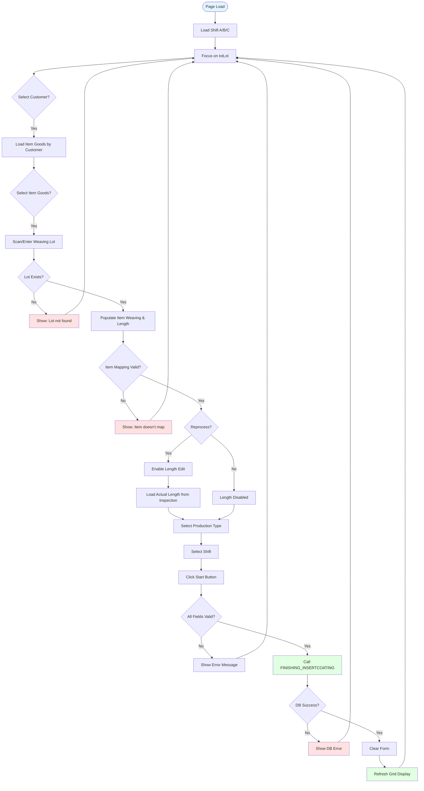
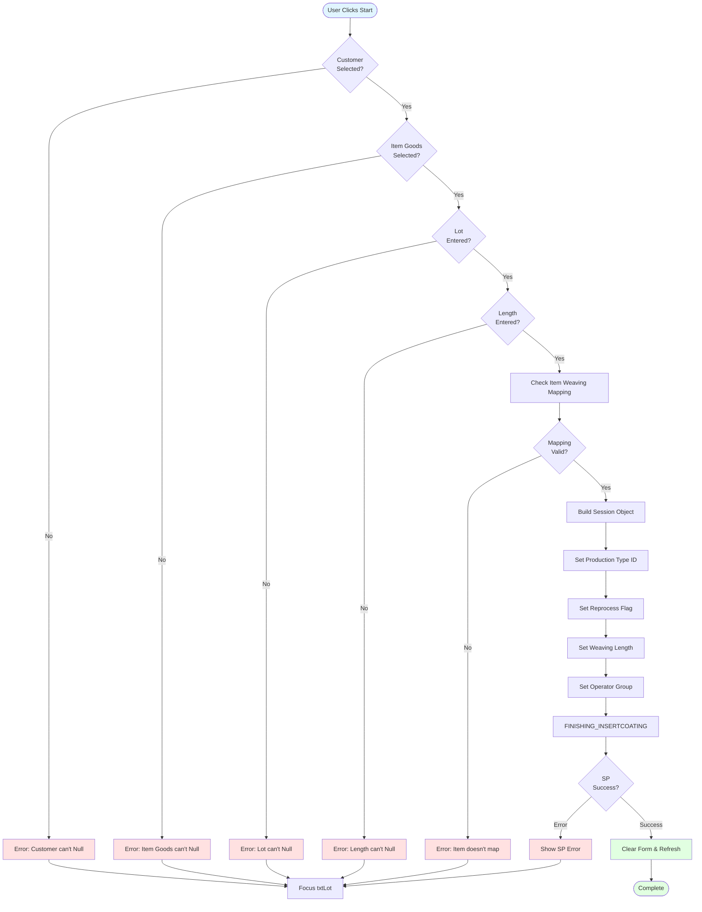
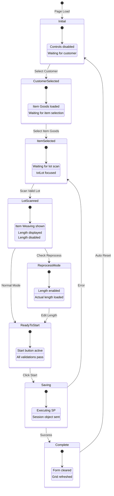
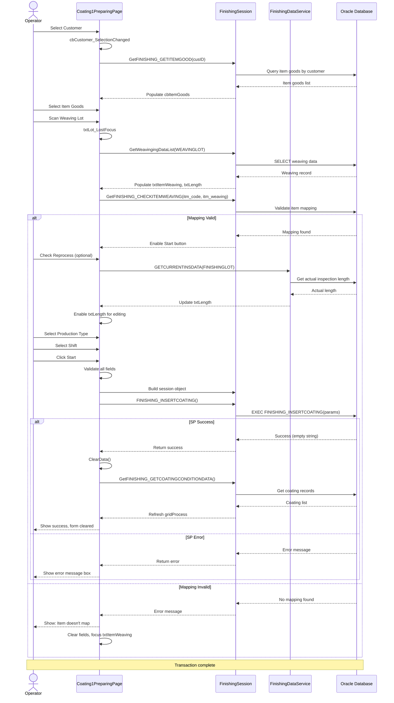

# UI Logic Analysis: Coating1 Preparing Page

## 1. Page Overview

**File Information:**
- **XAML File**: `LuckyTex.AirBag.Pages\Pages\06 - Finishing\Coating1\Coating1PreparingPage.xaml`
- **Code-Behind**: `LuckyTex.AirBag.Pages\Pages\06 - Finishing\Coating1\Coating1PreparingPage.xaml.cs`
- **Lines of Code**: 719 lines (code-behind)
- **Complexity**: Medium
- **Business Context**: First stage of coating process - prepares fabric for coating by scanning lot, validating item mapping, and creating coating preparation records

**Purpose**: This page allows operators to prepare fabric rolls for the coating process by scanning weaving lots, validating customer/item/lot combinations, and creating initial coating preparation records with production type, shift, and operator information.

---

## 2. UI Components Inventory

| Control Name | Type | Purpose | Data Binding |
|--------------|------|---------|--------------|
| **cbCustomer** | ComboBox | Select customer | ItemsSource="{Binding CUS_GETLIST}" |
| **cbItemGoods** | ComboBox | Select item goods code | ItemsSource="{Binding CUS_GETITEMGOODBYCUSTOMER}" |
| **txtItemWeaving** | TextBox | Display/scan item weaving code | Two-way binding |
| **txtLot** | TextBox | Scan weaving lot barcode | CharacterCasing="Upper" |
| **txtLength** | TextBox | Display/edit fabric length | Disabled by default |
| **cbShift** | ComboBox | Select operator shift (A/B/C) | Static array binding |
| **txtScouringNo** | TextBox | Display coating machine number | Visibility="Collapsed" |
| **rbMassProduction** | RadioButton | Mass production type | IsChecked="True" (default) |
| **rbTest** | RadioButton | Test production type | - |
| **rbGuide** | RadioButton | Guide production type | - |
| **chkReporcess** | CheckBox | Enable reprocess mode | Enables length editing |
| **txtOperator** | TextBox | Display operator ID | IsEnabled="False" |
| **cmdClear** | Button | Clear all inputs | - |
| **cmdStart** | Button | Start coating preparation | - |
| **cmdBack** | Button | Navigate back | - |
| **gridProcess** | DataGrid | Display prepared coating records | - |

---

## 3. Input Fields & Validation

### Required Fields

| Field | Required | Format | MaxLength | Validation Rules |
|-------|----------|--------|-----------|------------------|
| **cbCustomer** | Yes | String | - | Must select from list |
| **cbItemGoods** | Yes | String | - | Must select from list, depends on customer |
| **txtLot** | Yes | Uppercase | - | Must exist in weaving data, auto-uppercase |
| **txtLength** | Yes | Decimal | - | Numeric only, disabled unless reprocess checked |

### Validation Logic (cmdStart_Click: 141-170)

```csharp
// Field validation order
if (cbCustomer.SelectedValue == null) → "Customer can't Null"
if (cbItemGoods.SelectedValue == null) → "Item Goods can't Null"
if (txtLot.Text == "") → "Lot can't Null"
if (txtLength.Text == "") → "Length can't Null"
```

### Character Input Restrictions

- **txtLength**: Numeric only via `Common_PreviewKeyDown` (220-223)
- **txtLot**: Uppercase via `CharacterCasing="Upper"`

---

## 4. Button Actions & Event Handlers

### cmdStart - Start Preparation (141-170)
- **Enable Condition**: All required fields filled
- **Action**: Validates inputs → Calls `Start()` method → Creates coating preparation record
- **Stored Procedure**: `FINISHING_INSERTCOATING` (via session)
- **Post-Action**: Clears form on success

### cmdClear - Clear Form (132-136)
- **Enable Condition**: Always enabled
- **Action**: Calls `ClearData()` → Resets all fields → Refocuses on txtLot

### cmdBack - Navigate Back (124-127)
- **Enable Condition**: Always enabled
- **Action**: `PageManager.Instance.Back()`

### chkReporcess - Reprocess Checkbox (303-330)
- **Checked Action**:
  - Validates lot is entered → Calls `GETCURRENTINSDATA()` → Enables `txtLength`
  - Loads actual length from inspection data
- **Unchecked Action**:
  - Restores original length → Disables `txtLength`

---

## 5. Main Workflow Diagram



---

## 6. Validation Logic Flowchart



---

## 7. State Transition Diagram



---

## 8. Sequence Diagram - Lot Scanning & Preparation



---

## 9. Business Rules

### BR-1: Customer-Item Cascade (180-210)
- **Rule**: Item Goods dropdown must reload when Customer changes
- **Implementation**: `cbCustomer_SelectionChanged` → `LoadItemGood(cusID)`
- **Validation**: Clears item selection if customer changed

### BR-2: Item-Weaving Mapping (434-462)
- **Rule**: Item Weaving must map to selected Item Goods
- **Implementation**: Calls `FINISHING_CHECKITEMWEAVING` stored procedure
- **Error**: "This Item Weaving does not map with selected item Good"

### BR-3: Lot Validation (468-504)
- **Rule**: Weaving lot must exist in weaving data
- **Implementation**: `GetWeavingingDataList(WEAVINGLOT)`
- **Auto-populate**: Item Weaving and Length from weaving record

### BR-4: Reprocess Logic (303-330)
- **Rule**: Reprocess mode allows editing length based on actual inspection data
- **Condition**: Lot must be scanned first
- **Data Source**: `GETCURRENTINSDATA` returns actual length from inspection
- **Original Preservation**: Stores OldLength to restore if unchecked

### BR-5: Production Type (563-574)
- **Rule**: Exactly one production type must be selected
- **Options**:
  - Mass Production (PRODUCTTYPEID = "1")
  - Test (PRODUCTTYPEID = "2")
  - Guide (PRODUCTTYPEID = "3")
- **Default**: Mass Production

### BR-6: Shift Management (380-389)
- **Rule**: Operator shift must be selected (A/B/C)
- **Default**: Shift A (SelectedIndex = 0)
- **Storage**: Stored in session.OPERATOR_GROUP

### BR-7: Machine Configuration (43-44)
- **Rule**: Machine status must be configured
- **Implementation**: `ConfigManager.Instance.Coating1MachineConfig`
- **Impact**: Affects coating process availability

---

## 10. Database Operations

### Stored Procedures Called

#### 1. FINISHING_INSERTCOATING (616)
```csharp
// Location: Start():616
_session.FINISHING_INSERTCOATING()

// Parameters (from session):
- WEAVINGLOT
- ItemCode (ITM_CODE)
- Customer (FINISHINGCUSTOMER)
- PRODUCTTYPEID ("1", "2", or "3")
- Operator (operator ID)
- MCNO (machine number)
- Flag ("S" for start/preparing)
- REPROCESS ("Y" or "N")
- WEAVLENGTH (decimal)
- OPERATOR_GROUP (shift A/B/C)
```

#### 2. Finishing_GetCustomerList (344)
```csharp
// Location: LoadCustomer():344
List<FinishingCustomerData> items = _session.Finishing_GetCustomerList()
// Returns: List of finishing customers
```

#### 3. GetFINISHING_GETITEMGOOD (364)
```csharp
// Location: LoadItemGood():364
List<FINISHING_GETITEMGOODData> items = _session.GetFINISHING_GETITEMGOOD(cusID)
// Input: Customer ID
// Returns: Item goods for selected customer
```

#### 4. GetFINISHING_CHECKITEMWEAVING (438)
```csharp
// Location: ScanWeavingLot():438
List<FINISHING_CHECKITEMWEAVINGData> items =
    _session.GetFINISHING_CHECKITEMWEAVING(itm_code, itm_weaving)
// Input: Item goods code, Item weaving code
// Returns: Validation result for mapping
```

#### 5. GetWeavingingDataList (472)
```csharp
// Location: ScanLot():472
List<GETWEAVINGINGDATA> items = _session.GetWeavingingDataList(WEAVINGLOT)
// Input: Weaving lot number
// Returns: Weaving data (ITM_WEAVING, WEAVINGLOT, LENGTH)
```

#### 6. GETCURRENTINSDATA (517)
```csharp
// Location: GETCURRENTINSDATA():517
GETCURRENTINSDATA dbResults =
    FinishingDataService.Instance.GETCURRENTINSDATA(FINISHINGLOT)
// Input: Finishing lot number
// Returns: Actual length from inspection (ACTUALLENGTH)
```

#### 7. GetFINISHING_GETCOATINGCONDITIONDATA (534)
```csharp
// Location: LoadFinishing_GetCoating():534
List<FINISHING_GETCOATINGDATA> items =
    _session.GetFINISHING_GETCOATINGCONDITIONDATA(mcno, flag)
// Input: Machine number, Flag ("S" for prepared records)
// Returns: List of prepared coating records for grid display
```

---

## 11. D365 Integration

**No direct D365 integration in this page.**

D365 integration occurs in the Coating1FinishingPage when the coating process completes.

---

## 12. Error Handling

### Try-Catch Patterns

#### Pattern 1: ComboBox Selection Changed (183-208)
```csharp
try {
    // Load item goods by customer
    LoadItemGood(cusID);
}
catch (Exception ex) {
    ex.Message.ToString().ShowMessageBox(true);
}
```

#### Pattern 2: Barcode Scanning (436-461, 470-503)
```cshary
try {
    // Validate item mapping or lot data
    // Auto-populate fields
}
catch (Exception ex) {
    ex.Message.ToString().ShowMessageBox(true);
}
```

#### Pattern 3: Clear Data (399-427)
```csharp
try {
    // Reset all fields
    // Reload grid
}
catch (Exception ex) {
    ex.Message.ToString().ShowMessageBox(true);
}
```

#### Pattern 4: Start Preparation (551-633)
```csharp
try {
    // Build session object
    // Call stored procedure
    // Handle result
}
catch (Exception ex) {
    ex.Message.ToString().ShowMessageBox(true);
}
```

### Error Messages

| Condition | Message | Action |
|-----------|---------|--------|
| Customer not selected | "Customer can't Null" | Return, focus unchanged |
| Item Goods not selected | "Item Goods can't Null" | Return, focus unchanged |
| Lot not entered | "Lot can't Null" | Return, focus unchanged |
| Length not entered | "Length can't Null" | Return, focus unchanged |
| Item mapping invalid | "This Item Weaving does not map with selected item Good" | Clear fields, focus txtItemWeaving |
| Lot not found | "This Item Weaving does not map with selected item Good" | Clear fields, focus txtLot |
| Reprocess without lot | "Lot isn't Null" | Uncheck reprocess, focus txtLot |
| Data load error | "Please Check Data" | Show message box |
| SP execution error | {error from SP} | Show message box |

---

## 13. Critical Findings

### Performance Issues

1. **Synchronous Database Calls** (No async/await)
   - All DB operations are synchronous
   - UI freezes during long-running queries
   - **Impact**: Poor user experience with slow network/DB

2. **Repeated Grid Refresh** (419, 538)
   - Grid reloaded after every clear operation
   - No caching of coating records
   - **Recommendation**: Implement data caching

### Potential Bugs

1. **Error Message Reuse** (488, 446)
   - Same error message for different failure scenarios
   - "This Item Weaving does not map with selected item Good" used for:
     - Invalid item mapping
     - Lot not found
   - **Impact**: Confusing error messages

2. **OldLength Management** (54, 409, 478, 514)
   - OldLength string variable used to restore length
   - Not cleared in all code paths
   - **Risk**: Stale data if lot changed while reprocess checked

3. **Session Reset Logic** (413-414)
   - `if (_session.Customer != "") _session = new FinishingSession()`
   - Customer check may not catch all session states
   - **Risk**: Incomplete session cleanup

### Refactoring Opportunities

1. **Duplicate Validation Logic**
   - Item mapping validation duplicated in two methods (434-462, 480-484)
   - **Recommendation**: Extract to shared validation method

2. **Magic Strings**
   - Production type IDs: "1", "2", "3"
   - Flag: "S" for start
   - Reprocess: "Y"/"N"
   - **Recommendation**: Use constants or enums

3. **Missing Input Sanitization**
   - Lot number not trimmed before scanning
   - **Risk**: Extra whitespace causes validation failures

4. **Cascading ComboBox Pattern**
   - Customer → Item Goods cascade hardcoded
   - **Recommendation**: Generic cascading dropdown component

5. **Length Editing Logic Complexity** (303-330)
   - Reprocess checkbox controls multiple states
   - Enable/disable logic scattered
   - **Recommendation**: State machine pattern

---

## 14. Code Metrics

### Complexity Assessment

**Overall Complexity**: Medium

**Method Complexity Breakdown**:
- **High Complexity** (>20 lines):
  - `Start()`: 82 lines (551-633) - Main business logic
  - `ScanLot()`: 35 lines (468-504) - Lot validation and population
  - `LoadFinishing_GetCoating()`: 16 lines (530-545) - Grid data loading

- **Medium Complexity** (10-20 lines):
  - `ScanWeavingLot()`: 29 lines (434-462) - Item mapping validation
  - `ClearData()`: 29 lines (397-428) - Form reset
  - `LoadItemGood()`: 16 lines (360-375) - Item loading
  - `cbCustomer_SelectionChanged()`: 30 lines (180-210) - Cascade logic

- **Low Complexity** (<10 lines):
  - Event handlers: txtLot_KeyDown, txtItemWeaving_KeyDown, etc.
  - Simple getters/setters
  - Navigation methods

**Code Quality Indicators**:
- ✅ **Good**: Clear method names, consistent naming conventions
- ✅ **Good**: Separated UI logic from data access (session pattern)
- ⚠️ **Warning**: No async operations (all synchronous)
- ⚠️ **Warning**: Limited input validation
- ⚠️ **Warning**: Exception handling shows technical errors to users
- ❌ **Poor**: Magic strings throughout
- ❌ **Poor**: No unit test support (tight coupling to UI controls)

### Lines of Code Distribution
- **Total**: 719 lines
- **UI Event Handlers**: ~150 lines (20%)
- **Business Logic**: ~300 lines (42%)
- **Data Loading**: ~150 lines (20%)
- **Error Handling**: ~50 lines (7%)
- **Utility Methods**: ~70 lines (10%)

---

## 15. Comparison with Coating1 Finishing

### Key Differences: Preparing vs Finishing

| Aspect | Preparing Page | Finishing Page |
|--------|---------------|----------------|
| **Purpose** | Create coating preparation record | Complete coating process with actual data |
| **Complexity** | Medium (719 lines) | High (3,163 lines - 4.4x larger) |
| **Primary Input** | Lot scanning | Multiple length inputs + PLC data |
| **Data Entry** | Minimal (customer, item, lot) | Extensive (40+ parameters) |
| **PLC Integration** | None | Yes (Modbus counter reading) |
| **Manual Mode** | Reprocess checkbox | chkManual + chkManualPLC checkboxes |
| **Length Fields** | 1 (txtLength) | 7 (txtLength1-7) + total calculation |
| **Process Stage** | Start ("S" flag) | Finish ("F" flag) |
| **Stored Procedure** | FINISHING_INSERTCOATING | FINISHING_UPDATECOATINGDATAFinishing |
| **D365 Integration** | No | Yes (6-step integration process) |
| **Temperature Data** | No | Yes (8 temp zones + washing temps) |
| **Coating Parameters** | No | Yes (blade, tension, speed, silicone, etc.) |
| **Report Generation** | No | Yes (Print and Preview) |
| **State Persistence** | Session creation only | Session update with extensive params |
| **Validation Complexity** | Low (4 required fields) | High (CheckNull() + 40+ field validations) |
| **Grid Display** | Prepared records (read-only) | No grid (all direct input) |
| **Error Handling** | Basic try-catch | Comprehensive with multiple validation points |
| **Focus Flow** | Simple (3-4 fields) | Complex (40+ tab stops with conditional logic) |

### Workflow Relationship

1. **Preparing Page** creates initial record:
   - Scans lot
   - Validates customer/item
   - Creates FINISHINGLOT
   - Sets production type
   - Records operator and shift
   - Flag = "S" (Start)

2. **Finishing Page** completes the process:
   - Loads existing preparation data
   - Captures 7 length measurements
   - Records 40+ coating parameters
   - Integrates with PLC (if auto mode)
   - Updates record with actual data
   - Flag = "F" (Finish)
   - Sends to D365 ERP
   - Prints coating report

**Data Flow**: Preparing → (FINISHINGLOT created) → Finishing → (FINISHINGLOT updated) → D365 → Report

---

## Summary

The Coating1 Preparing page serves as the **entry point** for the coating process, providing a streamlined interface for operators to scan weaving lots, validate item mappings, and create initial coating preparation records.

**Key Strengths**:
- Simple, focused user interface
- Clear customer-item-lot cascade validation
- Reprocess mode for handling rework scenarios
- Real-time grid display of prepared records

**Key Weaknesses**:
- No async operations (potential UI freezing)
- Duplicate error messages causing confusion
- Magic strings instead of constants
- Limited input sanitization

**Modernization Priority**: Medium - Focus on async operations, validation refactoring, and state management improvements before tackling the more complex Finishing page.
