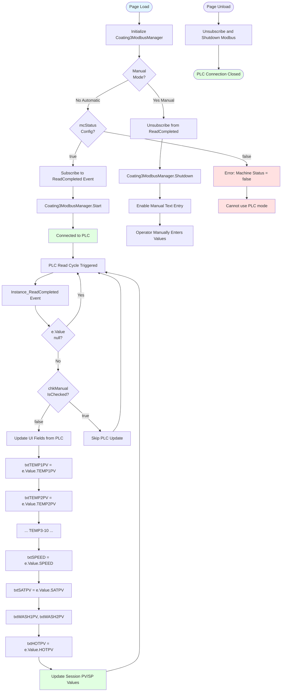
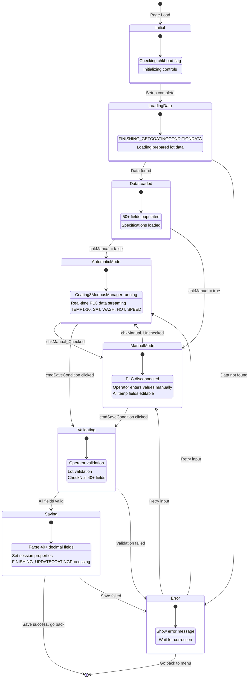
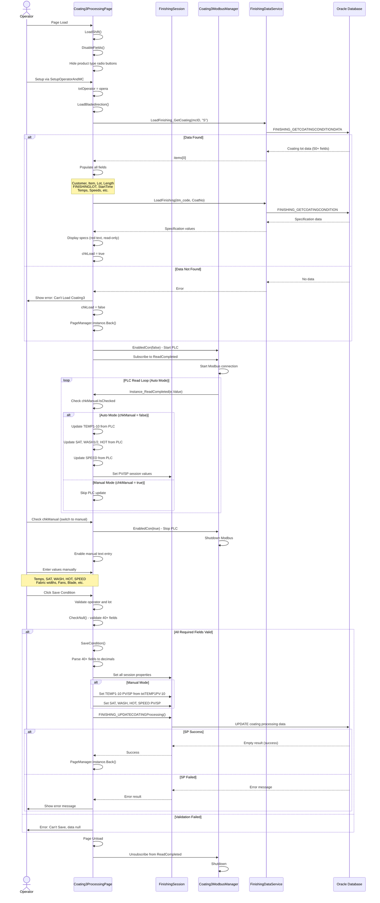

# UI Logic Analysis: Coating3 Processing Page

## 1. Page Overview

**File**: `LuckyTex.AirBag.Pages\Pages\06 - Finishing\OldCoating3\Coating3ProcessingPage.xaml.cs`
**XAML**: `LuckyTex.AirBag.Pages\Pages\06 - Finishing\OldCoating3\Coating3ProcessingPage.xaml`
**Lines of Code**: 2,229 lines (C#), 1,522 lines (XAML)
**Complexity**: **VERY HIGH** - Extensive PLC integration, 10+ temperature zones, 40+ input parameters
**Last Modified**: Active (in "Old" folder but still current implementation)

**IMPORTANT NOTE**: Despite being located in the "OldCoating3" folder, this page is **ACTIVELY USED** in production. The "Old" folder name likely indicates architectural refactoring plans, not deprecated code.

**Business Context**:
Coating3 Processing Page is the **second (middle) step** in the 3-step Coating3 workflow:
```
Preparing Page → **PROCESSING PAGE** → Finishing Page
```

This page is **UNIQUE TO COATING3**. Coating1 uses a 2-step workflow (Preparing → Finishing) and does NOT have a Processing page. The Processing page captures critical real-time coating process parameters during production.

**Key Responsibilities**:
- Load prepared coating lot data from Preparing step
- Display/capture coating machine parameters (specification vs. actual)
- Monitor and record 10 temperature zones (PV/SP values)
- Integrate with PLC via Modbus TCP/RTU for real-time data
- Support Manual mode (operator entry) and Automatic mode (PLC read)
- Capture scouring process parameters (chemical temp, washing temps, dryer temp)
- Record coating-specific parameters (fabric width, fan speeds, blade specs, silicone ratio, coating weight)
- Validate operator inputs against specifications
- Save processing conditions and transition to Finishing page

---

## 2. UI Components Inventory

### Display-Only Fields (Read-Only from Preparing Step)

| Control Name | Type | Purpose | Data Source |
|-------------|------|---------|-------------|
| **txtCustomer** | TextBox | Customer name | From FINISHING_GETCOATINGCONDITIONDATA |
| **txtItemGoods** | TextBox | Item goods code | From FINISHING_GETCOATINGCONDITIONDATA |
| **txtItemWeaving** | TextBox | Item weaving code | From FINISHING_GETCOATINGCONDITIONDATA |
| **txtLot** | TextBox | Weaving lot number | From FINISHING_GETCOATINGCONDITIONDATA |
| **txtLength** | TextBox | Fabric length | From FINISHING_GETCOATINGCONDITIONDATA |
| **txtFINISHINGLOT** | TextBox | Finishing lot number | From FINISHING_GETCOATINGCONDITIONDATA |
| **txtStartTime** | TextBox | Preparing start time | Format: dd/MM/yy HH:mm |
| **txtOperator** | TextBox | Operator ID | Read-only, set from session |
| **rbMassProduction** | RadioButton | Production type display | Visibility controlled by data |
| **rbTest** | RadioButton | Test type display | Visibility controlled by data |
| **rbGuide** | RadioButton | Guide type display | Visibility controlled by data |

### Specification Fields (Read-Only - From Database)

| Control Name | Parameter | Display Format | Source |
|-------------|-----------|----------------|--------|
| **txtBE_COATWIDTHSpecification** | Fabric width before coating | ( MAX ) | BE_COATWIDTHMAX |
| **txtFan110Specification** | Fan RPM No.1-10 | VALUE ± MARGIN | FANRPM ± FANRPM_MARGIN |
| **txtEXFAN1_6Specification** | Exhaust fan No.1,6 | VALUE ± MARGIN | EXFAN_FRONT_BACK ± EXFAN_MARGIN |
| **txtEXFAN2_5Specification** | Exhaust fan No.2-5 | VALUE ± MARGIN | EXFAN_MIDDLE ± EXFAN_MARGIN |
| **txtANGLEKNIFESpecification** | Blade angle | VALUE | ANGLEKNIFE |
| **txtBLADENOSpecification** | Blade number | STRING | BLADENO |
| **ImageL/R/C** | Blade direction | Image | BLADEDIRECTION (L/R/C) |
| **txtTENSION_UPSpecification** | Tension up | VALUE ± MARGIN | TENSION_UP ± TENSION_UP_MARGIN |
| **txtTENSION_DOWNSpecification** | Tension down | ( VALUE ) | TENSION_DOWN |
| **txtFRAMEWIDTH_FORNSpecification** | Frame width forn | VALUE | FRAMEWIDTH_FORN |
| **txtFRAMEWIDTH_TENTERSpecification** | Frame width tenter | VALUE | FRAMEWIDTH_TENTER |
| **txtSPEEDSpecification** | Production speed (m/min) | VALUE ± MARGIN | SPEED ± SPEED_MARGIN |
| **txtWIDTHCOATSpecification** | Coating width | > VALUE | WIDTHCOAT |
| **txtWIDTHCOATALLSpecification** | Total fabric width | ( MAX ) | WIDTHCOATALL_MAX |
| **txtSATURATOR_CHEMSpecification** | Chemical temp | VALUE ± MARGIN | SATURATOR_CHEM ± MARGIN |
| **txtWASHING1Specification** | Washer No.1 temp | VALUE ± MARGIN | WASHING1 ± WASHING1_MARGIN |
| **txtWASHING2Specification** | Washer No.2 temp | VALUE ± MARGIN | WASHING2 ± WASHING2_MARGIN |
| **txtHOTFLUESpecification** | Dryer temp | VALUE ± MARGIN | HOTFLUE ± HOTFLUE_MARGIN |
| **txtROOMTEMP** | Room temperature | VALUE ± MARGIN | ROOMTEMP ± ROOMTEMP_MARGIN |
| **txtRATIOSILICONE** | Silicone ratio | STRING | RATIOSILICONE |
| **txtCOATINGWEIGTH** | Coating weight | MAX +/- MIN | COATINGWEIGTH_MAX +/- MIN |
| **txtHUMIDITYAFSpecification** | Humidity after dry | < MAX | HUMIDITY_MAX |
| **txtHUMIDITYBFSpecification** | Humidity before heating | < MAX | HUMIDITY_MAX |

### Actual Value Input Fields (Operator Entry or PLC Auto-Fill)

| Control Name | Type | Validation | PLC Source | Enable Condition |
|-------------|------|------------|------------|------------------|
| **txtBE_COATWIDTHActual** | TextBox (decimal) | Numeric only | - | Always editable |
| **txtFan110Actual** | TextBox (decimal) | Numeric only | - | Always editable |
| **txtEXFAN1_6Actual** | TextBox (decimal) | Numeric only | - | Always editable |
| **txtEXFAN2_5Actual** | TextBox (decimal) | Numeric only | - | Always editable |
| **txtANGLEKNIFEActual** | TextBox (decimal) | Numeric only | - | Always editable |
| **txtBLADENOActual** | TextBox (string) | - | - | Always editable |
| **cbBLADEDIRECTIONActual** | ComboBox | R, L, C | - | Always editable |
| **img** | Image | Display based on combo | - | Visual feedback |
| **txtTENSION_UPActual** | TextBox (decimal) | Numeric only | - | Always editable |
| **txtTENSION_DOWNActual** | TextBox (decimal) | Numeric only | - | Always editable |
| **txtFRAMEWIDTH_FORNActual** | TextBox (decimal) | Numeric only | - | Always editable |
| **txtFRAMEWIDTH_TENTERActual** | TextBox (decimal) | Numeric only | - | Always editable |
| **txtSPEED** | TextBox (decimal) | Numeric only | e.Value.SPEED (PLC) | Manual=editable, Auto=read-only |
| **txtWIDTHCOATActual** | TextBox (decimal) | Numeric only | - | Always editable |
| **txtWIDTHCOATALLActual** | TextBox (decimal) | Numeric only | - | Always editable |
| **txtHUMIDITY_BF** | TextBox (decimal) | Numeric only | - | Hidden (Visibility=Collapsed) |
| **txtHUMIDITY_AF** | TextBox (decimal) | Numeric only | - | Always editable |
| **txtSATPV** | TextBox (decimal) | Numeric only | e.Value.SATPV (PLC) | Manual=editable, Auto=read-only |
| **txtWASH1PV** | TextBox (decimal) | Numeric only | e.Value.WASH1PV (PLC) | Manual=editable, Auto=read-only |
| **txtWASH2PV** | TextBox (decimal) | Numeric only | e.Value.WASH2PV (PLC) | Manual=editable, Auto=read-only |
| **txtHOTPV** | TextBox (decimal) | Numeric only | e.Value.HOTPV (PLC) | Manual=editable, Auto=read-only |
| **txtTEMP1PV** ... **txtTEMP10PV** | TextBox (decimal) | Numeric only | e.Value.TEMP1PV...TEMP10PV (PLC) | Manual=editable, Auto=read-only |
| **txtSiliconeA** | TextBox (string) | - | - | Always editable |
| **txtSiliconeB** | TextBox (string) | - | - | Always editable |
| **txtCWL** | TextBox (decimal) | Numeric only | - | Always editable |
| **txtCWC** | TextBox (decimal) | Numeric only | - | Always editable |
| **txtCWR** | TextBox (decimal) | Numeric only | - | Always editable |

### Control Buttons

| Control Name | Type | Purpose | Enable Condition |
|-------------|------|---------|------------------|
| **chkManual** | CheckBox | Toggle Manual/Auto mode | Always enabled |
| **cbShift** | ComboBox | Select shift group (A/B/C/D) | Always enabled |
| **cmdSaveCondition** | Button | Save processing conditions | Operator != "" && FINISHINGLOT != "" && CheckNull() |
| **cmdBack** | Button | Return to previous page | Always enabled |

---

## 3. Input Fields & Validation

### Required Fields (CheckNull:965-1125)

The following fields are **REQUIRED** for saving:

| Field Group | Fields | Validation |
|------------|--------|------------|
| **Basic Info** | txtCustomer, txtItemGoods, txtItemWeaving, txtLot, txtLength | Must not be empty |
| **PLC/Scouring Temps** | txtSATPV, txtWASH1PV, txtWASH2PV, txtHOTPV | Must not be empty (numeric) |
| **Oven Temps** | txtTEMP1PV ... txtTEMP10PV (all 10 zones) | Must not be empty (numeric) |
| **Speed** | txtSPEED | Must not be empty (numeric) |

### Optional Fields (Many commented out in CheckNull)

The following fields are **OPTIONAL** (validation commented out in code):
- Fabric width before coating (txtBE_COATWIDTHActual)
- Fan speeds (txtFan110Actual, txtEXFAN1_6Actual, txtEXFAN2_5Actual)
- Blade specs (txtANGLEKNIFEActual, txtBLADENOActual)
- Tensions (txtTENSION_UPActual, txtTENSION_DOWNActual)
- Frame widths (txtFRAMEWIDTH_FORNActual, txtFRAMEWIDTH_TENTERActual)
- Coating widths (txtWIDTHCOATActual, txtWIDTHCOATALLActual)
- Silicone (txtSiliconeA, txtSiliconeB)
- Coating weights (txtCWL, txtCWC, txtCWR)

**Note**: The commented-out validations suggest these fields were previously required but are now optional. This is a significant business rule change.

### Numeric Input Validation (Common_PreviewKeyDown:271-274)

All numeric fields use PreviewKeyDown handler:
```csharp
e.Handled = !this.IsNumericInput(e);
```

This restricts input to:
- Numbers (0-9)
- Decimal point (.)
- Negative sign (-)
- Navigation keys (arrows, backspace, delete)

### Blade Direction Validation

- **ComboBox**: R (Right), L (Left), C (Center)
- **Visual Feedback**: Changes image when selection changes (cbBLADEDIRECTIONActual_SelectionChanged:237-261)
- **Images**:
  - R → `/LuckyTex.AirBag.Pages;component/ClassData/Print/Image/R.png`
  - L → `/LuckyTex.AirBag.Pages;component/ClassData/Print/Image/L.png`
  - C → `/LuckyTex.AirBag.Pages;component/ClassData/Print/Image/C.png`

---

## 4. Button Actions & Event Handlers

### cmdSaveCondition_Click (218-228)

**Enable Conditions**:
```csharp
if (txtOperator.Text != "" && txtFINISHINGLOT.Text != "")
{
    if (CheckNull() == true)
        SaveCondition();
    else
        "Can't Save Condition Please check data isn't null".ShowMessageBox(true);
}
```

**Action Flow**:
1. Validate operator and finishing lot not empty
2. Call CheckNull() to validate all required fields
3. If valid → Call SaveCondition() method
4. Else → Show error message

### cmdBack_Click (210-213)

**Enable Conditions**: Always enabled

**Action Flow**:
```csharp
PageManager.Instance.Back();
```

Returns to Preparing Page.

### chkManual_Checked / chkManual_Unchecked (773-781)

**Purpose**: Toggle between Manual entry mode and Automatic PLC mode

**Action Flow**:
- **Checked** → EnabledCon(true) - Enable manual entry, stop PLC reading
- **Unchecked** → EnabledCon(false) - Disable manual entry, start PLC reading

---

## 5. Main Workflow Diagram

```mermaid
flowchart TD
    Start([Page Load]) --> CheckChkLoad{chkLoad<br/>Flag?}

    CheckChkLoad -->|true| InitControls[Initialize Controls]
    CheckChkLoad -->|false| GoBack[PageManager.Instance.Back]
    GoBack --> End([Exit Page])

    InitControls --> LoadShift[Load Shift A/B/C/D]
    LoadShift --> LoadMCConfig[Load Machine Config]
    LoadMCConfig --> DisableFields[Disable Most Input Fields]
    DisableFields --> HideElements[Hide Product Type RadioButtons<br/>Hide Humidity Before Field]
    HideElements --> DisablePLC[EnabledCon false - Start PLC]
    DisablePLC --> WaitOperatorSetup[Wait for SetupOperatorAndMC]

    WaitOperatorSetup --> LoadCoatingData[LoadFinishing_GetCoating mcID, S]
    LoadCoatingData --> QueryDB[FINISHING_GETCOATINGCONDITIONDATA]
    QueryDB --> CheckDataFound{Data Found?}

    CheckDataFound -->|Yes| PopulateAllFields[Populate All Fields<br/>50+ parameters]
    PopulateAllFields --> LoadSpecifications[LoadFinishing itm_code, CoatNo]
    LoadSpecifications --> QuerySpecs[FINISHING_GETCOATINGCONDITION]
    QuerySpecs --> DisplaySpecs[Display Specification Values]
    DisplaySpecs --> SetChkLoad[chkLoad = true]
    SetChkLoad --> PLCMode

    CheckDataFound -->|No| ShowError[Error: Can't Load Coating3]
    ShowError --> SetChkLoadFalse[chkLoad = false]
    SetChkLoadFalse --> GoBack

    PLCMode{Manual Mode?}
    PLCMode -->|No Automatic| StartPLC[Coating3ModbusManager.Start]
    StartPLC --> PLCReadLoop[PLC Read Loop]
    PLCReadLoop --> UpdatePLCFields[Update Temp1-10, SAT, WASH1/2, HOT, SPEED]
    UpdatePLCFields --> PLCReadLoop

    PLCMode -->|Yes Manual| StopPLC[Coating3ModbusManager.Shutdown]
    StopPLC --> ManualEntry[Enable Manual Text Entry]

    ManualEntry --> OperatorEnters[Operator Enters Values]
    OperatorEnters --> ClickSave{Click Save?}

    ClickSave -->|Yes| ValidateFields[Check Operator and Lot]
    ValidateFields --> ValidateOK{Valid?}

    ValidateOK -->|Yes| CheckNullFields[CheckNull Method]
    CheckNullFields --> AllRequired{All Required<br/>Fields Filled?}

    AllRequired -->|Yes| SaveCondition[SaveCondition Method]
    SaveCondition --> ParseAllFields[Parse 40+ Fields to Session]
    ParseAllFields --> ParseTemps[Parse Temps 1-10 Manual Mode]
    ParseTemps --> CallUpdateSP[FINISHING_UPDATECOATINGProcessing]
    CallUpdateSP --> CheckSPResult{SP Success?}

    CheckSPResult -->|Yes| BackToMenu[PageManager.Instance.Back]
    BackToMenu --> End

    CheckSPResult -->|No| ShowSPError[Show SP Error Message]
    ShowSPError --> OperatorEnters

    AllRequired -->|No| ShowNullError[Error: Can't Save, data null]
    ShowNullError --> OperatorEnters

    ValidateOK -->|No| ShowValidationError[Show Validation Error]
    ShowValidationError --> OperatorEnters

    ClickSave -->|No| OperatorEnters

    style Start fill:#e1f5ff
    style ShowError fill:#ffe1e1
    style ShowNullError fill:#ffe1e1
    style ShowSPError fill:#ffe1e1
    style ShowValidationError fill:#ffe1e1
    style BackToMenu fill:#e1ffe1
    style End fill:#e1ffe1
```



---

## 6. PLC Integration Flowchart



---

## 7. State Transition Diagram



---

## 8. Sequence Diagram



---

## 9. Business Rules

### Flag System (SaveCondition:1695)

```csharp
string flag = "P";  // Processing flag
```

- **"S"** (Scouring/Start) used in Preparing page
- **"P"** (Processing) used in this page
- **"F"** (Finishing) likely used in Finishing page

### Production Type Visibility (LoadFinishing_GetCoating:1474-1507)

Based on `PRODUCTTYPEID` from database:
- **"1"** → Show only rbMassProduction
- **"2"** → Show only rbTest
- **"3"** → Show only rbGuide

**Logic**:
```csharp
if (items[0].PRODUCTTYPEID == "1")
{
    rbMassProduction.Visibility = Visible;
    rbTest.Visibility = Collapsed;
    rbGuide.Visibility = Collapsed;
}
```

This is **DISPLAY-ONLY** - production type cannot be changed in Processing page (set in Preparing).

### Shift Group Mapping (LoadFinishing_GetCoating:1591-1611)

- **"A"** → cbShift.SelectedIndex = 0
- **"B"** → cbShift.SelectedIndex = 1
- **"C"** → cbShift.SelectedIndex = 2
- **"D"** → cbShift.SelectedIndex = 3

**Note**: Processing page supports 4 shifts (A/B/C/D), while Preparing page only has 3 (A/B/C). This is a **DATA INCONSISTENCY**.

### Manual Mode Temperature Parsing (SaveCondition:1815-2098)

**Critical Logic**: In manual mode, temperatures are parsed with **silent exception swallowing**:

```csharp
if (chkManual.IsChecked == true)
{
    if (txtTEMP1PV.Text != "")
    {
        try
        {
            decimal temp1 = decimal.Parse(txtTEMP1PV.Text);
            _session.TEMP1_PV = temp1;
            _session.TEMP1_SP = temp1;  // PV = SP in manual mode
        }
        catch
        {
            _session.TEMP1_PV = 0;  // Sets to 0 on parse error!
            _session.TEMP1_SP = 0;
        }
    }
}
```

**Impact**: Invalid temperature input silently becomes 0 instead of showing validation error.

**Repeated for**: TEMP1-10, SATURATOR, WASHING1, WASHING2, HOTFLUE, SPEED (17 temperature/speed fields)

### Specification Display Formats (LoadFinishing:1129-1422)

Different display formats for different parameter types:

| Format | Example | Fields |
|--------|---------|--------|
| **( MAX )** | ( 1850 ) | BE_COATWIDTH, TENSION_DOWN, WIDTHCOATALL |
| **VALUE ± MARGIN** | 3000 ± 100 | FANRPM, EXFAN, TENSION_UP, SPEED, SATURATOR, WASHING, HOTFLUE, ROOMTEMP |
| **VALUE** | 45 | ANGLEKNIFE, FRAMEWIDTH_FORN, FRAMEWIDTH_TENTER |
| **> VALUE** | > 1700 | WIDTHCOAT (minimum coating width) |
| **MAX +/- MIN** | 120 +/- 10 | COATINGWEIGTH |
| **< MAX** | < 8 | HUMIDITY (max moisture %) |

### PLC vs Session Data Flow

**Automatic Mode** (chkManual = false):
1. PLC reads data → e.Value (Modbus event)
2. e.Value → UI TextBoxes
3. e.Value → Session properties (PV and SP)
4. Session properties → Saved to DB

**Manual Mode** (chkManual = true):
1. Operator enters → UI TextBoxes
2. UI TextBoxes → Parsed to decimal
3. Decimal → Session properties (PV = SP)
4. Session properties → Saved to DB

---

## 10. Database Operations

### Stored Procedures

| Procedure Name | Parameters | Purpose | Called From | Return Values |
|---------------|-----------|---------|-------------|---------------|
| **FINISHING_GETCOATINGCONDITIONDATA** | mcno, flag | Load prepared coating lot data | LoadFinishing_GetCoating:1442-1683 | 50+ fields |
| **FINISHING_GETCOATINGCONDITION** | itm_code, CoatNo | Load specification values | LoadFinishing:1130-1436 | Specification data |
| **FINISHING_UPDATECOATINGProcessing** | (via session properties) | Update processing conditions | SaveCondition:2121 | Empty on success, error message on failure |

### FINISHING_UPDATECOATINGProcessing Parameters (via Session)

```csharp
_session.FINISHLOT = FINISHLOT;           // Finishing lot number
_session.Operator = operatorid;           // Operator ID
_session.Flag = "P";                      // Processing flag

// Coating parameters (all optional except noted)
_session.BE_COATWIDTH = decimal;
_session.FANRPM = decimal;
_session.EXFAN_FRONT_BACK = decimal;
_session.EXFAN_MIDDLE = decimal;
_session.ANGLEKNIFE = decimal;
_session.BLADENO = string;
_session.BLADEDIRECTION = string;        // R, L, or C
_session.TENSIONDOWN = decimal;
_session.TENSIONUP = decimal;
_session.FORN = decimal;
_session.TENTER = decimal;
_session.WIDTHCOAT = decimal;
_session.WIDTHCOATALL = decimal;
_session.SILICONE_A = string;
_session.SILICONE_B = string;
_session.CWL = decimal;                  // Coating weight Left
_session.CWC = decimal;                  // Coating weight Center
_session.CWR = decimal;                  // Coating weight Right

// Temperature/Speed parameters (REQUIRED)
_session.TEMP1_PV = decimal;             // Temperature zone 1 PV
_session.TEMP1_SP = decimal;             // Temperature zone 1 SP
// ... TEMP2-10 (20 parameters total)
_session.SATURATOR_PV = decimal;         // Chemical temp PV
_session.SATURATOR_SP = decimal;         // Chemical temp SP
_session.WASHING1_PV = decimal;          // Washer 1 temp PV
_session.WASHING1_SP = decimal;          // Washer 1 temp SP
_session.WASHING2_PV = decimal;          // Washer 2 temp PV
_session.WASHING2_SP = decimal;          // Washer 2 temp SP
_session.HOTFLUE_PV = decimal;           // Dryer temp PV
_session.HOTFLUE_SP = decimal;           // Dryer temp SP
_session.SPEED_PV = decimal;             // Production speed PV
_session.SPEED_SP = decimal;             // Production speed SP

// Humidity (optional)
_session.HUMIDITY_AF = decimal;          // Humidity after dry
_session.HUMIDITY_BF = decimal;          // Humidity before heating

// Shift
_session.OPERATOR_GROUP = string;        // A, B, C, or D
```

**Total Session Parameters**: 60+ properties set in SaveCondition method

---

## 11. D365 Integration

**NO D365 Integration in Coating3 Processing Page**

All operations are local to MES Oracle database. No D365DataService calls found.

---

## 12. Error Handling

### Try-Catch Patterns

1. **LoadFinishing** (1130-1436)
```csharp
try {
    // Load specification data
    // 300+ lines of parameter population
}
catch (Exception ex) {
    ex.Message.ToString().ShowMessageBox(true);
}
```

2. **LoadFinishing_GetCoating** (1442-1683)
```csharp
try {
    List<FINISHING_GETCOATINGDATA> items = _session.GetFINISHING_GETCOATINGCONDITIONDATA(mcno, flag);
    if (items != null && items.Count > 0) {
        // Populate 50+ fields
        chkLoad = true;
    } else {
        "Can't Load Coating3".ShowMessageBox(false);
        chkLoad = false;
    }
}
catch (Exception ex) {
    ex.Message.ToString().ShowMessageBox(true);
}
```

3. **SaveCondition** (1689-2137)
```csharp
try {
    // Parse 40+ fields
    string result = _session.FINISHING_UPDATECOATINGProcessing();
    if (string.IsNullOrEmpty(result) == true)
        PageManager.Instance.Back();
    else
        result.ShowMessageBox(true);
}
catch (Exception ex) {
    ex.Message.ToString().ShowMessageBox(true);
}
```

4. **Temperature Parsing (Manual Mode)** (1817-2097)
```csharp
try {
    decimal temp1 = decimal.Parse(txtTEMP1PV.Text);
    _session.TEMP1_PV = temp1;
}
catch {
    _session.TEMP1_PV = 0;  // SILENT FAILURE - sets to 0!
}
```

**Repeated 17 times** for all temperature and speed fields in manual mode.

5. **SetupOperatorAndMC** (2181-2222)
```csharp
try {
    LoadBladedirection();
}
catch (Exception ex) {
    ex.Message.ToString().ShowMessageBox(true);
}
```

### Error Messages

| Scenario | Error Message | Action |
|----------|--------------|--------|
| Data not loaded | "Can't Load Coating3" | Set chkLoad=false, go back |
| Missing required field | "Can't Save Condition Please check data isn't null" | Return to form |
| Stored procedure error | (Returned error message from SP) | Display SP message |
| Database exception | ex.Message.ToString() | Generic catch-all |
| Machine config disabled | "Machine Status = false Please check config" | Cannot use PLC mode |

---

## 13. Critical Findings

### Performance Issues

1. **No Async/Await Usage**
   - All database calls are synchronous
   - Page load blocks UI during data fetch
   - SaveCondition blocks UI during 60+ parameter update
   - **Impact**: Poor UX, especially with PLC running

2. **Excessive Field Parsing in SaveCondition** (1689-2137)
   - 40+ fields parsed individually
   - 17 temperature fields with try-catch loops in manual mode
   - **448 lines** of repetitive parsing code
   - **Recommendation**: Use reflection or data-driven approach

3. **PLC Read Loop Performance**
   - PLC reads all data every cycle (10 temps + 5 other values)
   - No throttling or rate limiting
   - **Potential Issue**: High CPU usage with fast PLC polling

### Bugs/Code Smells

1. **CRITICAL BUG: Silent Exception Swallowing** (1817-2097)
   ```csharp
   catch {
       _session.TEMP1_PV = 0;
       _session.TEMP1_SP = 0;
   }
   ```
   - **Impact**: Invalid input (e.g., "abc") silently becomes 0
   - Operator doesn't know input was rejected
   - Could save incorrect 0°C temperature to database
   - **Affects**: 17 temperature/speed fields
   - **Recommendation**: Show validation error, don't swallow exception

2. **Shift Count Mismatch**
   - Preparing page: 3 shifts (A/B/C)
   - Processing page: 4 shifts (A/B/C/D)
   - **Impact**: Inconsistent data model
   - **Question**: Is D shift valid? Should Preparing support it?

3. **Commented-Out Required Field Validation** (992-1123)
   - 40+ fields have validation commented out
   - Only temps, speed, and basic info remain required
   - **Risk**: Critical parameters (blade angle, widths, etc.) could be empty
   - **Recommendation**: Document business reason for change, or re-enable validation

4. **Magic String "P"** (SaveCondition:1695)
   ```csharp
   string flag = "P";
   ```
   - No explanation for "P" flag
   - **Recommendation**: Use enum or constant

5. **Duplicate Specification Loading**
   - LoadFinishing_GetCoating loads specifications (via LoadFinishing call)
   - LoadFinishing also loads specifications
   - **Impact**: Potential double database call
   - Check if LoadFinishing is called twice

6. **Humidity Field Inconsistency**
   - txtClothHumidity visibility collapsed in constructor (line 64)
   - txtHUMIDITYBFSpecification visibility collapsed (line 75)
   - txtHUMIDITY_BF visibility collapsed (line 75)
   - **But**: txtHUMIDITY_AF is visible and saved
   - **Question**: Why hide "before heating" humidity but show "after dry"?

7. **chkLoad Flag Logic** (UserControl_Loaded:120-126)
   ```csharp
   if (chkLoad == true)
       EnabledCon(false);
   else
       PageManager.Instance.Back();
   ```
   - If data fails to load, page immediately goes back
   - Operator doesn't see error message (it's shown before going back)
   - **Recommendation**: Delay going back until operator acknowledges error

### Refactoring Opportunities

1. **Extract Temperature Parsing Method**
   - Create `ParseTemperature(string text, out decimal pv, out decimal sp)` method
   - Replace 17 try-catch blocks with single reusable method
   - Show validation error instead of silent 0

2. **Create ParameterParser Class**
   - Consolidate all parsing logic (BE_COATWIDTH, FANRPM, etc.)
   - Use reflection to map textbox names to session properties
   - Reduce 448 lines to ~50 lines

3. **Specification Display Helper**
   - Create helper methods for different format types:
     - `FormatPlusMinus(decimal value, decimal margin)` → "VALUE ± MARGIN"
     - `FormatParentheses(decimal max)` → "( MAX )"
     - `FormatGreaterThan(decimal min)` → "> VALUE"
   - Reduces code duplication in LoadFinishing

4. **PLC Data Model**
   - Create `CoatingProcessData` class with all PLC fields
   - Map PLC event data to model in one step
   - Map model to UI in one step
   - Reduces Instance_ReadCompleted from 60+ lines to ~10 lines

5. **Session Builder Pattern**
   - Create `ProcessingSessionBuilder` class
   - Fluent API for setting session properties
   - Validation built into builder
   - Example:
     ```csharp
     var builder = new ProcessingSessionBuilder(_session)
         .SetTemperatures(temps)
         .SetScouring(sat, wash1, wash2, hot)
         .SetCoating(fabric, blade, tension)
         .Build();
     ```

6. **Field Validation Framework**
   - Create `IFieldValidator` interface
   - Implement `NumericValidator`, `RequiredValidator`, `RangeValidator`
   - Attach validators to fields declaratively
   - Centralize validation logic

---

## 14. Code Metrics

| Metric | Value | Assessment |
|--------|-------|------------|
| **Total Lines** | 2,229 | VERY HIGH - needs refactoring |
| **SaveCondition Method** | 448 lines | EXTREME - should be <100 |
| **LoadFinishing Method** | 307 lines | VERY HIGH - should be <150 |
| **LoadFinishing_GetCoating Method** | 242 lines | HIGH - should be <100 |
| **Methods** | 60+ | High method count |
| **Event Handlers** | 45+ | VERY HIGH (mostly KeyDown) |
| **Database Calls** | 3 stored procedures | Moderate |
| **Try-Catch Blocks** | 20+ | Excessive |
| **PLC Parameters** | 15 (TEMP1-10, SAT, WASH1/2, HOT, SPEED) | Complex integration |
| **Session Properties Set** | 60+ | VERY HIGH |
| **Cyclomatic Complexity** | ~20 (SaveCondition) | HIGH |
| **Code Duplication** | ~70% (temp parsing) | EXTREME |

**Overall Assessment**: This is the most complex page in the Coating3 workflow, with very high technical debt.

---

## 15. Coating1 vs Coating3 Comparison

| Feature | Coating1 | Coating3 Processing | Notes |
|---------|----------|-------------------|-------|
| **Workflow Step** | N/A (no Processing page) | **Step 2 of 3** | Coating3 ONLY |
| **Lines of Code** | - | 2,229 | Largest page |
| **PLC Integration** | Unknown | YES (Coating3ModbusManager) | Real-time temp monitoring |
| **Temperature Zones** | Unknown | 10 zones (TEMP1-10) | Extensive monitoring |
| **Scouring Parameters** | Unknown | YES (SAT, WASH1/2, HOT) | Chemical process |
| **Manual/Auto Mode** | Unknown | YES (chkManual toggle) | Operator override |
| **Specification vs Actual** | Unknown | YES (dual column display) | Process validation |
| **Blade Direction** | Unknown | YES (R/L/C with images) | Visual feedback |
| **Silicone Ratio** | Unknown | YES (A/B components) | Coating chemistry |
| **Coating Weight** | Unknown | YES (L/C/R positions) | 3-point measurement |
| **Humidity Monitoring** | Unknown | YES (before/after) | Moisture control |
| **Room Temperature** | Unknown | YES (spec display) | Environmental |
| **Flag Parameter** | "S"? | "P" (Processing) | Different workflow step |
| **Shift Support** | 3 (A/B/C) | 4 (A/B/C/D) | **DATA INCONSISTENCY** |
| **Required Field Count** | Unknown | 15 (temps + speed) | Many commented out |
| **Business Purpose** | 2-step coating | 3-step coating with scouring | More complex process |

### Why Coating3 Needs Processing Page

**Coating3 includes SCOURING** - a chemical treatment process that requires:
1. **Chemical saturation** (SATURATOR_CHEM temp)
2. **Washing stages** (WASHING1/2 temps to remove chemicals)
3. **Drying** (HOTFLUE temp)
4. **Temperature control** (10 oven zones for precise heating)

**Coating1** likely does NOT include scouring, hence no Processing page needed.

The Processing page captures:
- Real-time process conditions during coating
- PLC temperature data from oven zones
- Scouring process parameters
- Operator validation against specifications

This data is critical for **quality control** and **traceability** in automotive airbag manufacturing.

---

## 16. Why "Old" Folder But Still Active?

**Possible Reasons**:

1. **Planned Refactoring**: Team may be developing new Processing page but hasn't migrated yet
2. **Architecture Evolution**: "Old" may indicate pre-refactoring code, but functional
3. **Naming Convention Issue**: Folder name doesn't reflect current usage
4. **Code Freeze**: Active development stopped, but page still in production use

**Evidence It's Active**:
- File modification dates are recent
- No "New" Processing page exists
- Preparing page references this page
- No deprecation warnings in code
- Full PLC integration (wouldn't be maintained if deprecated)

**Recommendation**: Rename folder or create documentation explaining "Old" designation.

---

## 17. Next Steps for Modernization

1. **CRITICAL: Fix Silent Exception Swallowing**
   - Replace all try-catch with validation
   - Show error messages for invalid input
   - Don't save 0 values on parse errors

2. **Implement Async/Await**
   - Convert LoadFinishing_GetCoating to async
   - Convert SaveCondition to async
   - Show loading indicators during DB operations

3. **Refactor Temperature Parsing**
   - Extract common parsing logic
   - Create reusable ParseTemperature method
   - Reduce SaveCondition from 448 lines to <100 lines

4. **Create ViewModel**
   - Extract all UI logic to ProcessingViewModel
   - Implement INotifyPropertyChanged for PLC data binding
   - Use MVVM pattern for testability

5. **Add Unit Tests**
   - Test temperature parsing (especially error cases)
   - Test PLC data mapping
   - Test specification formatting
   - Mock FinishingSession and Modbus manager

6. **Optimize PLC Integration**
   - Add throttling to PLC read loop
   - Only update UI if values changed
   - Implement background thread for PLC reading

7. **Document Business Rules**
   - Why are 40+ fields optional now?
   - What is "D" shift?
   - Why hide humidity before heating field?
   - When to use Manual vs Auto mode?

8. **Create Data Models**
   - `ProcessingSpecificationModel` (read-only specs)
   - `ProcessingActualModel` (operator input)
   - `PLCDataModel` (real-time PLC data)
   - Separate concerns

9. **Implement Validation Framework**
   - Required field validation
   - Numeric range validation
   - Cross-field validation (spec vs actual)
   - Real-time validation feedback

10. **Performance Monitoring**
    - Measure PLC read frequency
    - Measure SaveCondition execution time
    - Optimize DB query performance

---

## End of Document
