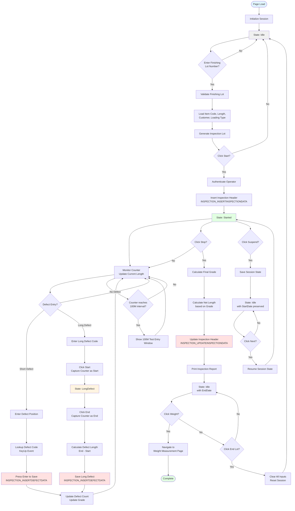
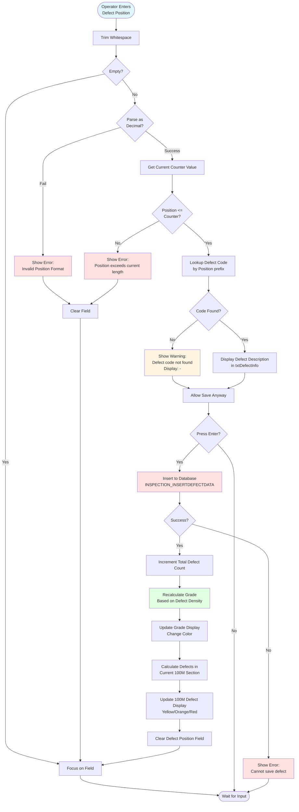
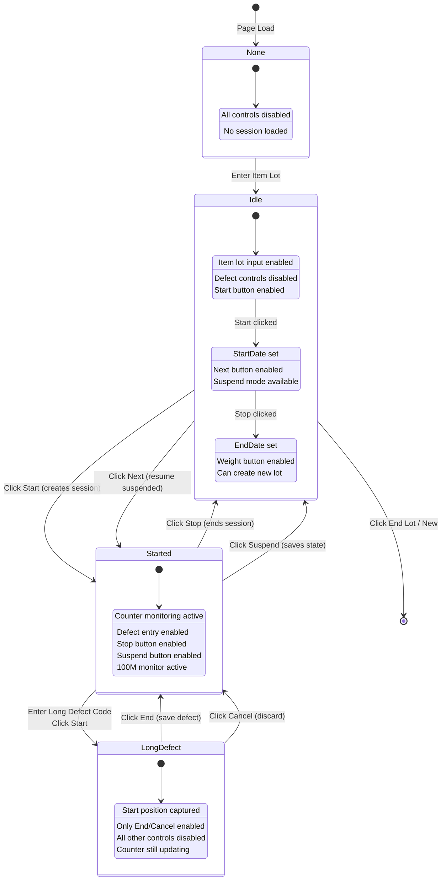
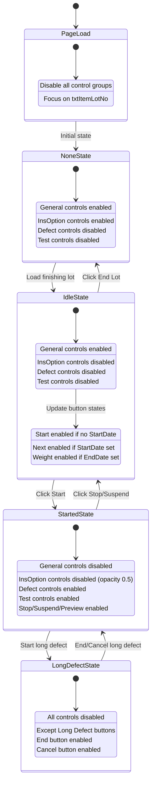
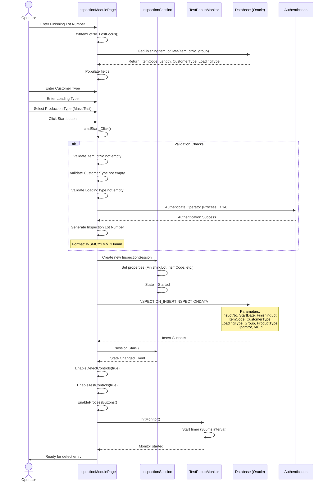
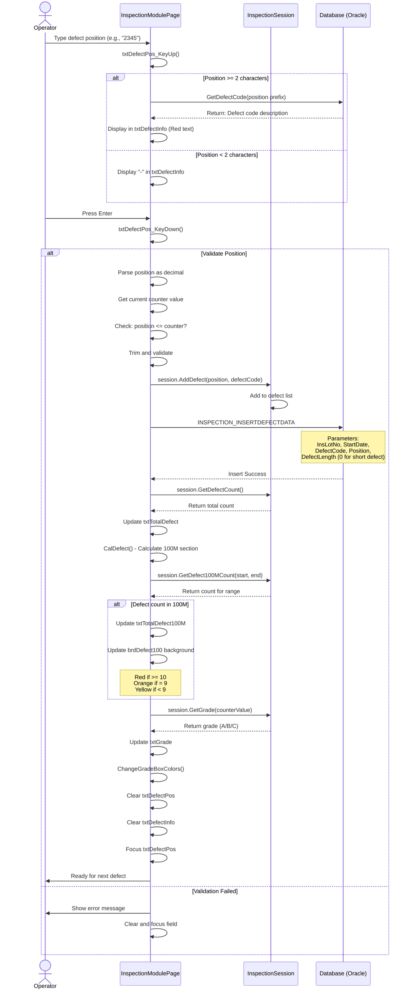
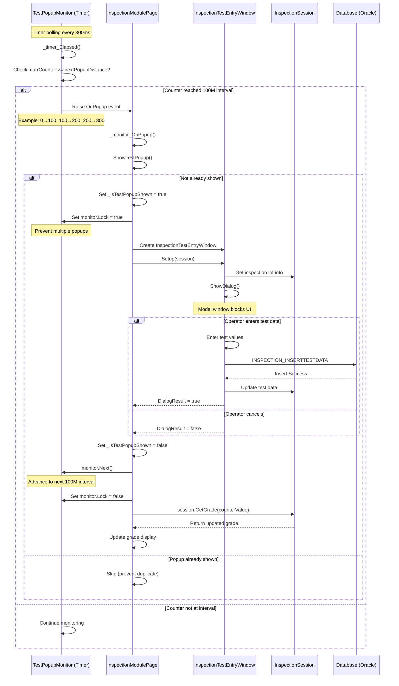

# UI Logic Analysis: Inspection Module Page

**File**: `LuckyTex.AirBag.Pages\Pages\08 - Inspection\InspectionModulePage.xaml.cs`
**Lines of Code**: 3,230 lines
**Complexity**: **EXTREME** - Largest inspection page in the system
**Business Context**: Main inspection tracking interface - Quality control for finished fabric rolls
**Analysis Date**: 2025-10-07

---

## 1. Page Overview

### Purpose
The InspectionModulePage is the **central quality control interface** for fabric inspection after finishing processes. It manages:
- Inspection session creation and tracking
- Real-time defect recording (short and long defects)
- Quality grading (A/B/C) based on defect counts
- Integration with weight measurement
- 100-meter test popup monitoring
- Inspection lot management (Mass/Test production types)
- Re-adjustment and re-processing workflows

### File Information
- **XAML**: `InspectionModulePage.xaml` (940 lines)
- **Code-Behind**: `InspectionModulePage.xaml.cs` (3,230 lines)
- **Nested Classes**: InspectionTestPopupMonitor (auto-popup every 100m)
- **Session Management**: Complex state machine with 4 states
- **Real-time Monitoring**: Timer-based counter updates + defect calculation

### Complexity Assessment
| Metric | Value | Rating |
|--------|-------|--------|
| Lines of Code | 3,230 | **EXTREME** |
| Methods | 80+ | Very High |
| UI States | 4 (None/Idle/Started/LongDefect) | High |
| Control Groups | 4 (General/InsOption/Defect/Test) | High |
| Event Handlers | 40+ | Very High |
| Business Rules | 15+ | High |
| Integration Points | 3 (DB, Weight, Test Entry) | Medium |

**Critical Observation**: This is the **largest single page** in the Inspection module and contains extensive state management logic.

---

## 2. UI Components Inventory

### Input Fields (12 fields)

| Control Name | Type | Purpose | Editable | MaxLength | Validation |
|--------------|------|---------|----------|-----------|------------|
| `txtItemLotNo` | TextBox | Finishing lot number (from Coating) | Yes* | - | Required, DB lookup |
| `txtInsLotNo` | TextBox | Inspection lot number (generated) | Yes* | - | Auto-generated/editable |
| `txtItemCode` | TextBox | Product item code | No | - | Auto-populated from DB |
| `txtCustomerType` | TextBox | Customer type code | Yes | - | Optional |
| `txtLoadingType` | TextBox | Loading type | Yes | - | Required |
| `txtTotalLen` | TextBox | Total length from finishing | No | - | Display only |
| `txtStartDT` | TextBox | Inspection start date/time | No | - | Auto-set on Start |
| `txtEndDT` | TextBox | Inspection end date/time | No | - | Auto-set on Stop |
| `txtCurrLen` | TextBox | Current inspected length (counter) | No | - | Real-time update |
| `txtRemainLen` | TextBox | Remaining length | No | - | Calculated |
| `txtDefectPos` | TextBox | Short defect position (meters) | Yes | 5 | Numeric validation |
| `txtDefect100` | TextBox | Starting position for 100M defect count | Yes | 6 | Numeric, 0 or currLen |

*Editability depends on inspection mode (Normal/Re-adjust/Re-process)

### Defect Entry Controls (Long Defect)

| Control Name | Type | Purpose | Editable | MaxLength |
|--------------|------|---------|----------|-----------|
| `txtDefectPos_Long` | TextBox | Long defect code | Yes | 5 |
| `txtLongDefectStart` | TextBox | Long defect start position | No | - |
| `txtLongDefectEnd` | TextBox | Long defect end position | No | - |
| `txtDefectLength` | TextBox | Calculated defect length | No | - |

### Display Fields (8 fields)

| Control Name | Type | Purpose | Style |
|--------------|------|---------|-------|
| `lbInsMC` | TextBlock | Inspection machine name | Red, FontSize 36 |
| `txtDefectInfo` | TextBlock | Short defect description | Red |
| `txtDefectInfo_Long` | TextBlock | Long defect description | Red |
| `txtTotalDefect` | TextBlock | Total defect count | White on Blue |
| `txtGrade` | TextBlock | Quality grade (A/B/C) | FontSize 90, color-coded |
| `txtOperator` | TextBlock | Operator ID | - |
| `txtCounter` | TextBlock | Large counter display (00000.00) | FontSize 90 |
| `txtTotalDefect100M` | TextBlock | Defects in current 100M | Color-coded (Yellow/Orange/Red) |

### Radio Buttons & Checkboxes (7 controls)

| Control Name | Type | Purpose | Group | Default |
|--------------|------|---------|-------|---------|
| `rbMass` | RadioButton | Mass production type | rbMain | Checked |
| `rbTest` | RadioButton | Test production type | rbMain | - |
| `chkReAdjustSameLot` | CheckBox | Re-adjust same lot mode | - | Unchecked |
| `rbReAdjustSameLotSameItem` | RadioButton | Re-adjust same item | rbSub2 | - |
| `rbReAdjustSameLotDiffItem` | RadioButton | Re-adjust different item | rbSub2 | - |
| `chkReProcessChangeLot` | CheckBox | Re-process change lot mode | - | Unchecked |
| `chkStart0` | CheckBox | Start 100M defect count from 0 | - | Checked |

### Buttons (16 buttons)

| Button Name | Label | Purpose | Enable Condition |
|-------------|-------|---------|------------------|
| `cmdStart` | Start | Start inspection session | State=Idle, StartDate=MinValue |
| `cmdStop` | Stop | Stop inspection | State=Started |
| `cmdNext` | Next | Resume next inspection session | State=Idle, StartDate set |
| `cmdClear` | Clear | Clear current defect entry | State=Started |
| `cmdSuspend` | Suspend | Suspend inspection (save state) | State=Started, Normal mode only |
| `cmdNew` | End Lot | End current lot, create new | Always (except when suspended) |
| `cmdRemark` | Remark | Add remark to inspection | StartDate set |
| `cmdWeight` | Weight | Navigate to weight measurement | Idle, EndDate set |
| `cmdPreview` | Preview | Preview inspection report | State=Started |
| `cmdBack` | Back | Navigate back | Always |
| `cmdShowDefectList` | Defect List | Show defect list window | Idle or Started |
| `cmdHistory` | History | Show inspection history | Idle or Started |
| `cmd100M` | 100M Record | Manual 100M test entry | State=Started |
| `cmdLongDefectStart` | Start | Mark long defect start | State=LongDefect |
| `cmdLongDefectEnd` | End | Mark long defect end | State=LongDefect |
| `cmdLongDefectCancel` | Cancel | Cancel long defect entry | State=LongDefect |

### Combobox (1 control)

| Control Name | Purpose | Binding | Required |
|--------------|---------|---------|----------|
| `cbGroup` | Inspection group (A/B/C/D) | Group collection | No |

---

## 3. Input Fields & Validation

### Required Fields

1. **txtItemLotNo** (Finishing Lot Number)
   - Format: Finishing lot from Coating module
   - Validation: Must exist in database
   - Lookup: `InspectionDataService.GetFinishingItemLotData(itemLotNo, group)`
   - Behavior: Auto-populates item code, length, customer type, loading type
   - Enable State: Enabled only in Normal mode (disabled in Re-adjust/Re-process)

2. **txtInsLotNo** (Inspection Lot Number)
   - Format: Auto-generated: `INSMCYYMMDDnnnn` (e.g., INS9925010150001)
   - Validation: Must be unique
   - Enable State: Enabled only in Re-adjust/Re-process modes
   - Generation: `InspectionLotGeneratorManager.Generate(machine, date)`

3. **txtCustomerType** (Customer Type)
   - Format: Customer code (uppercase)
   - Validation: None (free text)
   - MaxLength: None
   - Behavior: Stored with inspection lot

4. **txtLoadingType** (Loading Type)
   - Format: Loading type code
   - Validation: Should exist in database
   - Required: Yes (for inspection completion)
   - Lookup: Validated via InspectionDataService

### Optional Fields

1. **txtDefectPos** (Short Defect Position)
   - Format: Numeric (meters)
   - MaxLength: 5 characters
   - Validation: Must be numeric, must be <= current counter value
   - Behavior: Press Enter to save defect
   - KeyUp Event: Auto-lookup defect code description

2. **txtDefectPos_Long** (Long Defect Code)
   - Format: Defect code (5 characters)
   - Validation: Must exist in defect master data
   - Behavior: Triggers long defect workflow (Start → End → Save)
   - KeyUp Event: Display defect description

3. **txtDefect100** (100M Start Position)
   - Format: Numeric (0 or current length)
   - MaxLength: 6 characters
   - Validation: Numeric only
   - Behavior:
     - When `chkStart0` = Checked: Fixed at "0", disabled
     - When `chkStart0` = Unchecked: Editable, default = txtCurrLen
   - Purpose: Calculate defects per 100-meter section

### Read-Only Calculated Fields

1. **txtTotalLen** - Total length from finishing process
2. **txtCurrLen** - Current inspected length (from counter/manual)
3. **txtRemainLen** - Calculated: `ActualLength - CurrentLength`
4. **txtDefectLength** - Calculated: `LongDefectEnd - LongDefectStart`
5. **txtCounter** - Formatted counter display (8 digits with 2 decimals)
6. **txtGrade** - Quality grade based on defect density
7. **txtTotalDefect** - Total defect count in session
8. **txtTotalDefect100M** - Defects in current 100-meter section

---

## 4. Button Actions & Event Handlers

### Primary Workflow Buttons

#### 1. cmdStart_Click() - Start Inspection
**Enable Condition**: `State = Idle AND StartDate = DateTime.MinValue`

**Validation**:
```csharp
// Lines 1557-1646
1. Check ItemLotNo not empty
2. Check CustomerType not empty
3. Check LoadingType not empty
4. Authenticate operator (Process ID 14)
5. Validate re-adjust/re-process mode settings
6. Check finishing lot exists in database
```

**Actions**:
1. Load finishing lot data from database
2. Generate inspection lot number
3. Create inspection session (`_session.Start()`)
4. Insert inspection header to database: `INSPECTION_INSERTINSPECTIONDATA`
5. Initialize counter monitoring
6. Enable defect entry controls
7. Start 100M popup monitor
8. Change state to `Started`

**Database Operations**:
- Stored Procedure: `INSPECTION_INSERTINSPECTIONDATA`
- Parameters: InsLotNo, StartDate, FinishingLot, ItemCode, CustomerType, LoadingType, Group, ProductType, Operator, MCId

#### 2. cmdStop_Click() - Stop Inspection
**Enable Condition**: `State = Started`

**Validation**:
```csharp
// Lines 1646-1785
1. Check current length > 0
2. Confirm stop action with user
3. Calculate net length based on grade
4. Validate all required fields populated
```

**Actions**:
1. Stop counter monitoring
2. Calculate final grade
3. Calculate net length (with grade-based deductions)
4. Update inspection header: `INSPECTION_UPDATEINSPECTIONDATA`
5. Print inspection report (if configured)
6. Change state to `Idle`
7. Set EndDate

**Net Length Calculation** (Lines 1316-1349):
```csharp
private decimal GetNetLength(decimal? length, string grade)
{
    if (grade == "A") return length * 1.00m; // No deduction
    if (grade == "B") return length * 0.99m; // 1% deduction
    if (grade == "C") return length * 0.98m; // 2% deduction
    return length.Value; // Default
}
```

**Database Operations**:
- Stored Procedure: `INSPECTION_UPDATEINSPECTIONDATA`
- Parameters: InsLotNo, StartDate, EndDate, GrossLength, NetLength, Grade, TotalDefect, Operator

#### 3. cmd Next_Click() - Resume Inspection
**Enable Condition**: `State = Idle AND StartDate != DateTime.MinValue`

**Actions**:
1. Resume previous inspection session
2. Reload defect data from database
3. Update counter to last position
4. Change state to `Started`

#### 4. cmdSuspend_Click() - Suspend Inspection
**Enable Condition**: `State = Started AND ReAdjustMode = None AND ReProcessMode = None`

**Actions**:
1. Save current inspection state to database
2. Preserve counter value
3. Change state to `Idle` (but keep StartDate)
4. Allow operator to leave and resume later

#### 5. cmdNew_Click() - End Lot / New Inspection
**Enable Condition**: `Always enabled (except when suspended lot exists)`

**Actions**:
1. Clear all input controls
2. Reset session to None state
3. Clear defect lists
4. Reset counter to 0
5. Enable item lot number input

### Defect Entry Buttons

#### 6. cmdShowDefectList_Click() - Show Defect List
**Enable Condition**: `State = Idle OR Started`

**Actions**:
1. Open defect list window
2. Display all defects for current inspection lot
3. Allow defect deletion/editing
4. Refresh defect count after window closes

#### 7. cmdLongDefectStart_Click() - Start Long Defect
**Enable Condition**: `State = Started`

**Actions**:
1. Capture current counter value as start position
2. Save to session: `_session.StartLongDefect(counter, defectCode)`
3. Change state to `LongDefect`
4. Disable all other controls (only End/Cancel enabled)

#### 8. cmdLongDefectEnd_Click() - End Long Defect
**Enable Condition**: `State = LongDefect`

**Validation**:
```csharp
// Lines 1888-1946
1. End position must be > start position
2. Defect length must be > 0
3. Validate defect code exists
```

**Actions**:
1. Capture current counter value as end position
2. Calculate defect length: `End - Start`
3. Save long defect to database: `INSPECTION_INSERTDEFECTDATA`
4. Update total defect count
5. Update grade
6. Change state back to `Started`

**Database Operations**:
- Stored Procedure: `INSPECTION_INSERTDEFECTDATA`
- Parameters: InsLotNo, StartDate, DefectCode, Position (as Start-End range), DefectLength

#### 9. cmdLongDefectCancel_Click() - Cancel Long Defect
**Enable Condition**: `State = LongDefect`

**Actions**:
1. Clear long defect start/end values
2. Discard unsaved long defect
3. Change state back to `Started`

### Auxiliary Buttons

#### 10. cmd100M_Click() - 100-Meter Test Entry
**Enable Condition**: `State = Started`

**Actions**:
1. Open InspectionTestEntryWindow
2. Pass current session
3. Allow manual test entry (if auto-popup missed)
4. Update grade after test entry

#### 11. cmdHistory_Click() - Inspection History
**Actions**:
1. Open inspection history window
2. Show all inspection lots for current date/machine
3. Allow viewing past inspection details

#### 12. cmdWeight_Click() - Weight Measurement
**Enable Condition**: `State = Idle AND EndDate != DateTime.MinValue`

**Actions**:
1. Navigate to WeightMeasurementPage
2. Pass inspection lot number
3. Allow entering gross/net weight

#### 13. cmdPreview_Click() - Preview Report
**Enable Condition**: `State = Started OR Idle (with data)`

**Actions**:
1. Generate inspection report (RDLC)
2. Show in preview window
3. Allow print from preview

#### 14. cmdRemark_Click() - Add Remark
**Enable Condition**: `StartDate set`

**Actions**:
1. Open remark entry dialog
2. Save remark to database
3. Associate with inspection lot

#### 15. cmdClear_Click() - Clear Defect Entry
**Enable Condition**: `State = Started`

**Actions**:
1. Clear txtDefectPos
2. Clear txtDefectPos_Long
3. Focus on defect position field
4. DO NOT clear saved defects

---

## 5. Workflow Diagrams

### Main Inspection Workflow



---

## 6. Validation Logic Flowcharts

### Short Defect Entry Validation



### Long Defect Workflow Validation

```mermaid
flowchart TD
    Start([Operator Enters<br/>Long Defect Code]) --> LookupCode[Lookup Defect Code<br/>in Master Data]
    LookupCode --> CodeValid{Code Valid?}

    CodeValid -->|No| ShowError1[Show Error:<br/>Defect code not found<br/>Display: -]
    ShowError1 --> ClearCode[Clear Defect Code]
    ClearCode --> WaitCode([Wait for Code])

    CodeValid -->|Yes| DisplayDesc[Display Defect Description<br/>in txtDefectInfo_Long]
    DisplayDesc --> ClickStart{Click Start<br/>Button?}

    ClickStart -->|No| WaitCode
    ClickStart -->|Yes| GetCurrentPos1[Get Current Counter Value]
    GetCurrentPos1 --> SaveStartPos[Save Start Position<br/>to Session]
    SaveStartPos --> DisableInputs[Disable All Inputs<br/>except Long Defect Controls]
    DisableInputs --> ChangeState1[Change State to<br/>LongDefect]
    ChangeState1 --> DisplayStartVal[Display Start Value<br/>in txtLongDefectStart]
    DisplayStartVal --> EnableEndBtn[Enable End Button<br/>Enable Cancel Button]
    EnableEndBtn --> WaitOperator([Wait for Operator Action])

    WaitOperator --> CheckAction{Action?}

    CheckAction -->|Click Cancel| ConfirmCancel{Confirm<br/>Cancel?}
    ConfirmCancel -->|No| WaitOperator
    ConfirmCancel -->|Yes| ClearStartEnd[Clear Start/End Values]
    ClearStartEnd --> ChangeState2[Change State to Started]
    ChangeState2 --> EnableAllInputs[Enable All Inputs]
    EnableAllInputs --> End([Return to Normal])

    CheckAction -->|Click End| GetCurrentPos2[Get Current Counter Value]
    GetCurrentPos2 --> SaveEndPos[Save End Position]
    SaveEndPos --> CalcLength[Calculate Defect Length<br/>Length = End - Start]
    CalcLength --> ValidateLength{Length > 0?}

    ValidateLength -->|No| ShowError2[Show Error:<br/>End must be > Start]
    ShowError2 --> ClearEndPos[Clear End Position]
    ClearEndPos --> WaitOperator

    ValidateLength -->|Yes| DisplayEndVal[Display End Value<br/>in txtLongDefectEnd]
    DisplayEndVal --> DisplayLengthVal[Display Calculated Length<br/>in txtDefectLength]
    DisplayLengthVal --> SaveToDB[Insert to Database<br/>INSPECTION_INSERTDEFECTDATA<br/>Position: START-END format]

    SaveToDB --> DBSuccess{Success?}

    DBSuccess -->|No| ShowError3[Show Error:<br/>Cannot save long defect]
    ShowError3 --> WaitOperator

    DBSuccess -->|Yes| IncrementCount[Increment Total Defect Count]
    IncrementCount --> RecalcGrade[Recalculate Grade]
    RecalcGrade --> UpdateUI[Update Grade Display]
    UpdateUI --> ClearLongDefect[Clear Long Defect Fields]
    ClearLongDefect --> ChangeState2

    style Start fill:#e1f5ff
    style ShowError1 fill:#ffe1e1
    style ShowError2 fill:#ffe1e1
    style ShowError3 fill:#ffe1e1
    style ChangeState1 fill:#fff4e1
    style SaveToDB fill:#ffe1e1
    style RecalcGrade fill:#e1ffe1
    style End fill:#e1ffe1
```



---

## 7. State Transition Diagrams

### Inspection Session State Machine



### Control Enable/Disable State Logic



---

## 8. Sequence Diagrams

### Start Inspection Sequence



### Defect Entry Sequence (Short Defect)



### 100-Meter Test Popup Sequence



---

## 9. Business Rules

### Rule 1: Inspection Type Modes (Mutually Exclusive)

**Normal Mode** (Default):
- `ReAdjustMode = None`
- `ReProcessMode = None`
- Behavior:
  - Finishing lot number is editable
  - Inspection lot number is auto-generated and read-only
  - New inspection session created
  - Suspend functionality available

**Re-Adjust Same Lot Mode**:
- `chkReAdjustSameLot = Checked`
- `rbReAdjustSameLotSameItem = Checked` → `ReAdjustMode = Same`
- Behavior:
  - Finishing lot number is read-only
  - Inspection lot number is editable (operator enters previous ins lot)
  - Continue existing inspection lot with same item
  - Suspend functionality **NOT** available

**Re-Adjust Different Item Mode**:
- `chkReAdjustSameLot = Checked`
- `rbReAdjustSameLotDiffItem = Checked` → `ReAdjustMode = Diff`
- Behavior:
  - Finishing lot number is read-only
  - Inspection lot number is editable
  - Operator enters previous ins lot + new item code in txtDiff
  - Continue existing lot but change item code
  - Suspend functionality **NOT** available

**Re-Process Change Lot Mode**:
- `chkReProcessChangeLot = Checked` → `ReProcessMode = ReProcess`
- Behavior:
  - Finishing lot number is read-only
  - Inspection lot number is editable
  - Operator enters previous finishing lot for re-inspection
  - Generate new inspection lot number
  - Suspend functionality **NOT** available

### Rule 2: Quality Grading Algorithm

**Grade Calculation** (from InspectionSession.GetGrade()):

```csharp
// Based on defect density per 100 meters
decimal totalLength = currentCounter; // or actualLength
int totalDefects = session.GetDefectCount();

if (totalLength > 0)
{
    decimal defectPer100M = (totalDefects / totalLength) * 100;

    if (defectPer100M <= 3) return "A";
    else if (defectPer100M <= 6) return "B";
    else return "C";
}
return ""; // No grade if no length
```

**Grade-Based Net Length Calculation**:
```csharp
// Lines 1316-1349
if (grade == "A") netLength = grossLength * 1.00m; // No deduction
if (grade == "B") netLength = grossLength * 0.99m; // 1% deduction
if (grade == "C") netLength = grossLength * 0.98m; // 2% deduction
```

### Rule 3: 100-Meter Defect Count Display

**Color Coding** (Lines 1278-1293):
```csharp
int defectCount = session.GetDefect100MCount(startPos, endPos);

if (defectCount >= 10)
    brdDefect100.Background = Brushes.Red; // Critical
else if (defectCount == 9)
    brdDefect100.Background = Brushes.Orange; // Warning
else
    brdDefect100.Background = Brushes.Yellow; // Normal
```

**Calculation Range** (Lines 1266-1276):
```csharp
decimal defectStart = (chkStart0.IsChecked == true) ? 0 : decimal.Parse(txtDefect100.Text);

for (decimal i = defectStart; i <= (totalLength + 100); i += 100)
{
    decimal rangeStart = i;
    decimal rangeEnd = i + 100;

    if (rangeStart <= currLen && rangeEnd >= currLen)
    {
        // This is the current 100M section
        int count = session.GetDefect100MCount(rangeStart, rangeEnd);
        txtTotalDefect100M.Text = count.ToString();
        break;
    }
}
```

### Rule 4: Long Defect vs Short Defect

**Short Defect**:
- Single point defect (e.g., spot, hole, stain)
- Recorded with position only (e.g., 234.5 meters)
- DefectLength = 0 in database

**Long Defect**:
- Continuous defect over a range (e.g., bar, wrinkle, uneven coating)
- Recorded with Start-End range (e.g., "234.5-245.8")
- DefectLength = End - Start
- Requires special workflow (Start → End → Save)
- Changes session state to `LongDefect` during entry

### Rule 5: 100M Test Popup Monitoring

**Popup Trigger** (Lines 92-104, 172-189):
```csharp
// Calculate next popup distance
int nextPopup = Math.Floor(currCounter / 100) * 100 + 100;

// Example:
// currCounter = 0 → nextPopup = 100
// currCounter = 150 → nextPopup = 200
// currCounter = 245.8 → nextPopup = 300

if (currCounter >= nextPopup)
{
    // Trigger popup
    ShowTestPopup();
}
```

**Lock Mechanism** (Lines 1106-1132):
- Monitor locks during popup display
- Prevents multiple simultaneous popups
- Operator must close window before next popup can appear
- `monitor.Next()` advances to next interval after popup closes

### Rule 6: Inspection Lot Number Generation

**Format**: `INSMCYYMMDDnnnn`

Example: `INS9925010150001`
- `INS` = Prefix
- `99` = Machine number (e.g., INS99)
- `250101` = Date (YYMMDD) = 2025-01-01
- `50001` = Sequence number (5 digits, starts at 00001)

**Generation Logic** (InspectionLotGeneratorManager):
1. Get machine number from session
2. Get current date
3. Query database for max sequence on this machine + date
4. Increment sequence
5. Format as above

### Rule 7: Confirm Start Length Popup

**Purpose**: Warn operator if starting counter is too far from 0
**Trigger** (Lines 1351-1389):
```csharp
decimal confirmLength = 10; // Configurable (from config)

if (Math.Abs(counterValue) > confirmLength)
{
    string msg = $"Counter value is {counterValue}. Start anyway?";
    if (ShowConfirmBox(msg) == false)
    {
        // Operator canceled - do not start
        return;
    }
}
```

**Configuration**: Loaded from `ConfigManager.Instance.ConfirmLengthConfig`

### Rule 8: Group-Based Finishing Lot Lookup

**Groups**: A, B, C, D (ComboBox selection)

**Lookup Behavior**:
- When operator enters finishing lot number
- System queries: `GetFinishingItemLotData(itemLotNo, group)`
- If multiple finishing lots with same number but different groups exist
- Group filter narrows down the results
- Example: B2510011 might exist in Group A and Group B

---

## 10. Database Operations

### Stored Procedures Used

#### 1. INSPECTION_INSERTINSPECTIONDATA
**Purpose**: Insert new inspection header (Start inspection)

**Parameters**:
```sql
@INSPECTIONLOT NVARCHAR(50),        -- Generated inspection lot number
@STARTDATE DATETIME,                -- Inspection start date/time
@FINISHINGLOT NVARCHAR(50),         -- Finishing lot number
@ITEMCODE NVARCHAR(50),             -- Product item code
@CUSTOMERTYPE NVARCHAR(50),         -- Customer type code
@LOADTYPE NVARCHAR(50),             -- Loading type code
@GROUPNAME NVARCHAR(10),            -- Group (A/B/C/D)
@PRODUCTTYPEID NVARCHAR(10),        -- 1=Mass, 2=Test
@OPERATORID NVARCHAR(50),           -- Operator ID
@MCID INT                           -- Inspection machine ID
```

**Returns**: Success/Failure

**Called From**: cmdStart_Click() (Line ~1600)

#### 2. INSPECTION_UPDATEINSPECTIONDATA
**Purpose**: Update inspection header (Stop inspection)

**Parameters**:
```sql
@INSPECTIONLOT NVARCHAR(50),
@STARTDATE DATETIME,
@ENDDATE DATETIME,                  -- Inspection end date/time
@GROSSLENGTH DECIMAL(18,2),         -- Gross inspected length
@NETLENGTH DECIMAL(18,2),           -- Net length (after grade deduction)
@GRADE NVARCHAR(10),                -- Quality grade (A/B/C)
@TOTALDEFECT INT,                   -- Total defect count
@OPERATORID NVARCHAR(50)            -- Operator ID
```

**Called From**: cmdStop_Click() (Line ~1750)

#### 3. INSPECTION_INSERTDEFECTDATA
**Purpose**: Insert individual defect record

**Parameters**:
```sql
@INSPECTIONLOT NVARCHAR(50),
@STARTDATE DATETIME,
@DEFECTCODE NVARCHAR(50),           -- Defect code
@POSITION NVARCHAR(100),            -- Position (single value or "START-END")
@DEFECTLENGTH DECIMAL(18,2)         -- 0 for short defect, calculated for long defect
```

**Called From**:
- txtDefectPos_KeyDown() - Short defect (Line ~2200)
- cmdLongDefectEnd_Click() - Long defect (Line ~1920)

#### 4. INSPECTION_INSERTTESTDATA
**Purpose**: Insert 100-meter test data

**Parameters**:
```sql
@INSPECTIONLOT NVARCHAR(50),
@STARTDATE DATETIME,
@POSITION DECIMAL(18,2),            -- Position (e.g., 100, 200, 300)
@TEST1 DECIMAL(18,2),               -- Test parameter 1
@TEST2 DECIMAL(18,2),               -- Test parameter 2
@TEST3 DECIMAL(18,2),               -- Test parameter 3
... (more test parameters)
```

**Called From**: InspectionTestEntryWindow (separate window)

#### 5. GetFinishingItemLotData
**Purpose**: Retrieve finishing lot data (from Finishing module)

**Parameters**:
```sql
@ITEMLOTNO NVARCHAR(50),            -- Finishing lot number
@GROUPNAME NVARCHAR(10)             -- Group filter
```

**Returns**:
```csharp
public class FinishingItemLotData
{
    public string ITEMLOTNO { get; set; }
    public string ITEMCODE { get; set; }
    public decimal GROSSLENGTH { get; set; }
    public string CUSTOMERTYPE { get; set; }
    public string LOADTYPE { get; set; }
    public string GROUPNAME { get; set; }
}
```

**Called From**: txtItemLotNo_LostFocus() (Line ~2070)

#### 6. GetDefectCode
**Purpose**: Lookup defect code by position prefix

**Parameters**:
```sql
@PREFIX NVARCHAR(10)                -- First 2-3 chars of position
```

**Returns**:
```csharp
public class DefectCodeData
{
    public string DEFECTCODE { get; set; }
    public string DESCRIPTION { get; set; }
}
```

**Called From**: txtDefectPos_KeyUp(), txtDefectPos_Long_KeyUp() (Lines ~2240, ~2350)

#### 7. GetInspectionData
**Purpose**: Retrieve existing inspection lot data (for resume/re-adjust)

**Parameters**:
```sql
@INSPECTIONLOT NVARCHAR(50)
```

**Returns**:
```csharp
public class InspectionLotData
{
    public string INSPECTIONLOT { get; set; }
    public DateTime STARTDATE { get; set; }
    public DateTime? ENDDATE { get; set; }
    public string FINISHINGLOT { get; set; }
    public string ITEMCODE { get; set; }
    public decimal GROSSLENGTH { get; set; }
    public decimal? NETLENGTH { get; set; }
    public string GRADE { get; set; }
    public int TOTALDEFECT { get; set; }
    public string CUSTOMERTYPE { get; set; }
    public string LOADTYPE { get; set; }
}
```

**Called From**: txtInsLotNo_LostFocus() (Line ~2140)

### Transaction Boundaries

**No Explicit Transactions** - Each stored procedure call is independent

**Potential Issue**: If inspection header insert succeeds but subsequent defect inserts fail, data inconsistency can occur. No rollback mechanism exists.

**Recommendation**: Implement transaction scopes in future refactoring.

---

## 11. D365 Integration

**Status**: None found in InspectionModulePage

**Note**: D365 integration appears to be handled in:
1. WeightMeasurementPage (after weight entry)
2. SearchInspectionDataPage (manual D365 send button)

**Reason**: Inspection process itself does not trigger D365 transactions. Only after:
- Weight measurement is recorded
- Inspection is finalized and approved

---

## 12. Error Handling

### Try-Catch Patterns

#### Pattern 1: Silent Exception Swallowing

**Location**: Multiple database operations

**Example** (Line ~2200):
```csharp
try
{
    InspectionDataService.Instance.InsertDefectData(...);
}
catch (Exception ex)
{
    // Silent - no user notification
    Console.WriteLine(ex);
}
```

**Issue**: User never knows if defect save failed

**Recommendation**: Show error message to operator

#### Pattern 2: Generic Error Messages

**Example** (Line ~2080):
```csharp
try
{
    // ... operation ...
}
catch (Exception ex)
{
    ex.Message.ShowMessageBox(true);
}
```

**Issue**: Technical error messages shown to operator (not user-friendly)

**Recommendation**: Implement user-friendly error messages with error codes

#### Pattern 3: Empty Catch Blocks

**Location**: Monitor timer disposal (Line ~161-163)

```csharp
try
{
    _timer.Dispose();
}
catch
{
    // Empty catch - ignore all errors
}
finally
{
    NGC.FreeGC(_timer);
}
```

**Issue**: Disposal errors hidden

**Recommendation**: Log errors even if suppressed

### ShowMessageBox Calls

**Format**: `message.ShowMessageBox(isError)`

**Examples**:
1. `"No Inspection Data Found".ShowMessageBox(true);`
2. `"Counter value is too high".ShowMessageBox(false);`
3. `ex.Message.ShowMessageBox(true);`

**Issue**: Extension method pattern makes error handling inconsistent

---

## 13. Critical Findings

### 1. **EXTREME COMPLEXITY** - 3,230 Lines in Single File

**Issue**: This is the largest page in the entire system
- Violates Single Responsibility Principle
- Difficult to maintain and test
- High cognitive load for developers

**Recommendation**:
- Extract InspectionTestPopupMonitor to separate class
- Extract defect entry logic to separate service
- Extract state management to separate state machine class
- Extract grade calculation to separate business rule class

### 2. **No Async/Await** - All Database Operations Synchronous

**Impact**:
- UI freezes during database operations
- Poor user experience during:
  - Defect insertion (frequent)
  - Session start/stop
  - Data loading

**Recommendation**: Convert all database operations to async/await

### 3. **State Management Complexity**

**Issue**: Complex state machine with 4 states and multiple control groups
- 4 different control enable/disable methods
- State transitions scattered across multiple methods
- Difficult to trace state changes

**Recommendation**: Implement formal State pattern with clear transitions

### 4. **Tight Coupling to UI Controls**

**Issue**: Business logic directly manipulates UI controls
- Impossible to unit test
- Difficult to change UI without breaking logic
- Violates separation of concerns

**Example** (Line ~950):
```csharp
private void UpdateGrade(bool force)
{
    decimal counterVal = Convert.ToDecimal(txtCounter.Text);
    txtGrade.Text = _session.GetGrade(counterVal);
    ChangeGradeBoxColors();
}
```

**Recommendation**: Implement MVVM pattern with ViewModel

### 5. **No Input Validation Framework**

**Issue**: Validation scattered throughout KeyDown/LostFocus events
- Inconsistent validation patterns
- Difficult to maintain
- No centralized validation rules

**Recommendation**: Implement FluentValidation or similar framework

### 6. **Silent Data Save Failures**

**Issue**: Defect inserts can fail silently
- Operator continues without knowing defect wasn't saved
- Data integrity risk

**Recommendation**: Implement retry mechanism + clear error notifications

### 7. **100M Popup Monitor Timer Leak Risk**

**Issue**: Timer-based monitoring with 300ms interval
- Timer must be properly disposed on page unload
- Potential memory leak if page unloaded incorrectly

**Code** (Line ~1424):
```csharp
private void UserControl_Unloaded(object sender, RoutedEventArgs e)
{
    ReleaseMonitor(); // Calls _timer.Stop() and Dispose()
}
```

**Recommendation**: Add defensive checks + ensure timer disposal in all exit paths

### 8. **Hard-Coded Business Rules**

**Issue**: Grade calculation thresholds hard-coded
- Lines 1316-1349: Grade deduction percentages
- No flexibility for different products/customers

**Current Code**:
```csharp
if (grade == "A") return length * 1.00m;
if (grade == "B") return length * 0.99m; // 1% deduction
if (grade == "C") return length * 0.98m; // 2% deduction
```

**Recommendation**: Move to configuration or database

### 9. **No Transaction Management**

**Issue**: Multiple database operations without transaction scope
- Example: Insert inspection header + insert defects
- If defect insert fails, orphaned inspection header remains

**Recommendation**: Wrap related operations in TransactionScope

### 10. **Counter Value Formatting Complexity**

**Issue**: Complex string manipulation for counter display (Lines 798-831)
- 8-character zero-padded format
- Minus sign handling
- String concatenation

**Recommendation**: Use standard .NET format strings

---

## 14. Code Metrics

### Lines of Code

| Section | Lines | Percentage |
|---------|-------|------------|
| Constructor + Fields | 280 | 8.7% |
| InspectionTestPopupMonitor (nested class) | 230 | 7.1% |
| Init/Release Methods | 250 | 7.7% |
| Enable/Disable Controls | 200 | 6.2% |
| Validation Methods | 180 | 5.6% |
| Clear Input Methods | 100 | 3.1% |
| Update UI Methods | 350 | 10.8% |
| Button Event Handlers | 800 | 24.8% |
| TextBox Event Handlers | 450 | 13.9% |
| Helper Methods | 200 | 6.2% |
| Load/Unload | 50 | 1.5% |
| Defect Calculation | 150 | 4.6% |
| **Total** | **3,230** | **100%** |

### Cyclomatic Complexity

**High Complexity Methods** (CC > 10):
1. `cmdStart_Click()`: CC ~25 (Lines 1557-1646)
2. `cmdStop_Click()`: CC ~20 (Lines 1646-1785)
3. `EnableProcessButtons()`: CC ~18 (Lines 567-659)
4. `ValidateInspectionType()`: CC ~15 (Lines 838-900)
5. `CalDefect()`: CC ~12 (Lines 1169-1315)

**Recommendation**: Refactor methods with CC > 10 into smaller methods

### Method Count

- **Public Methods**: 12
- **Private Methods**: 68+
- **Event Handlers**: 40+
- **Total**: 120+

### Dependencies

**External Services**:
1. `InspectionDataService` (database operations)
2. `InspectionSession` (session management)
3. `InspectionLotGeneratorManager` (lot number generation)
4. `ConfigManager` (configuration)
5. `PageManager` (navigation)
6. `AuthenticationManager` (authentication)

**Windows**:
1. `InspectionTestEntryWindow` (100M test entry)
2. `DefectListWindow` (defect list display)
3. `InspectionHistoryWindow` (history display)
4. `InspectionRemarkWindow` (remark entry)
5. `InspectionLotSelectionWindow` (lot selection)

---

## 15. Comparison Summary

### InspectionModulePage vs Other Major Pages

| Metric | InspectionModule | WeavingProcess | Coating3Finishing | BeamingProcess |
|--------|------------------|----------------|-------------------|----------------|
| LOC | **3,230** ⚠️ | 2,916 | 3,141 | 2,431 |
| Complexity | **EXTREME** | Very High | Very High | Very High |
| States | 4 | 4 | 2 | 4 |
| Event Handlers | 40+ | 30+ | 35+ | 25+ |
| Database Ops | 7 | 5 | 2 | 3 |
| D365 Integration | No | Yes (7-step) | No | Yes (7-step) |
| PLC Integration | No | No | Yes (Modbus) | No |
| Nested Classes | 1 | 0 | 0 | 0 |
| Async/Await | ❌ | ❌ | ❌ | ❌ |

**Key Observations**:
1. InspectionModulePage is the **largest page** by LOC (tied with Coating3Finishing)
2. Unique feature: **InspectionTestPopupMonitor** (timer-based auto-popup)
3. Complex state machine with 4 states and control group management
4. No D365 integration (handled separately in WeightMeasurementPage)
5. High event handler count due to dual defect entry modes (short + long)

### Unique Features

1. **100-Meter Auto-Popup**: Only page with timer-based automatic popup monitoring
2. **Dual Defect Entry**: Short defects (single point) vs Long defects (range)
3. **State-Based Control Management**: 4 control groups with different enable states
4. **Re-Adjust/Re-Process Modes**: Complex inspection type handling
5. **Real-Time Grade Calculation**: Updates every 30 seconds during inspection
6. **100M Defect Count Display**: Color-coded defect density warning system

---

## Modernization Priority

### Refactoring Urgency: **CRITICAL (Priority 1)**

**Reasons**:
1. Largest and most complex page in module
2. High maintenance burden
3. Critical quality control process
4. No async operations (UI freezing risk)
5. Complex state management
6. Tight coupling to UI

**Recommended Approach**:
1. **Phase 1**: Extract InspectionTestPopupMonitor to separate service
2. **Phase 2**: Implement MVVM with ViewModel
3. **Phase 3**: Create defect entry service
4. **Phase 4**: Implement formal state machine
5. **Phase 5**: Add async/await to all database operations
6. **Phase 6**: Implement validation framework
7. **Phase 7**: Add transaction management
8. **Phase 8**: Extract configuration from hard-coded values

**Estimated Effort**: 2-3 weeks (200-250 hours) for full refactoring

---

**Analysis Complete**: 2025-10-07
**Analyst**: Claude (AI Assistant)
**Status**: ✅ Comprehensive analysis completed

