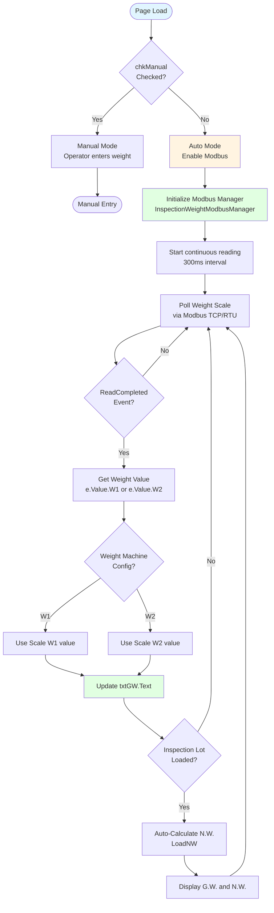
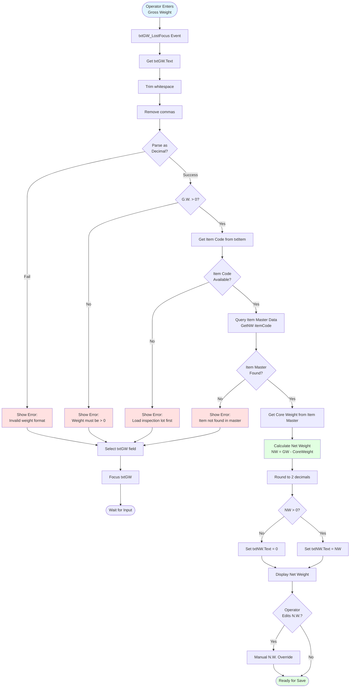
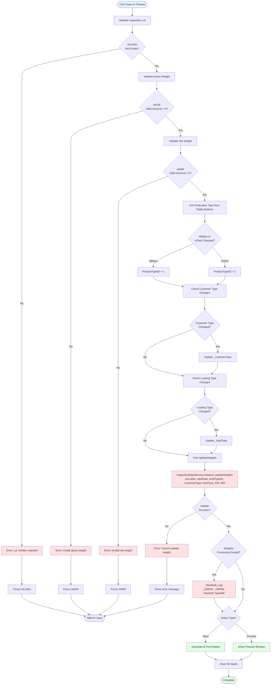
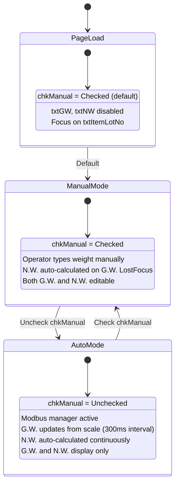
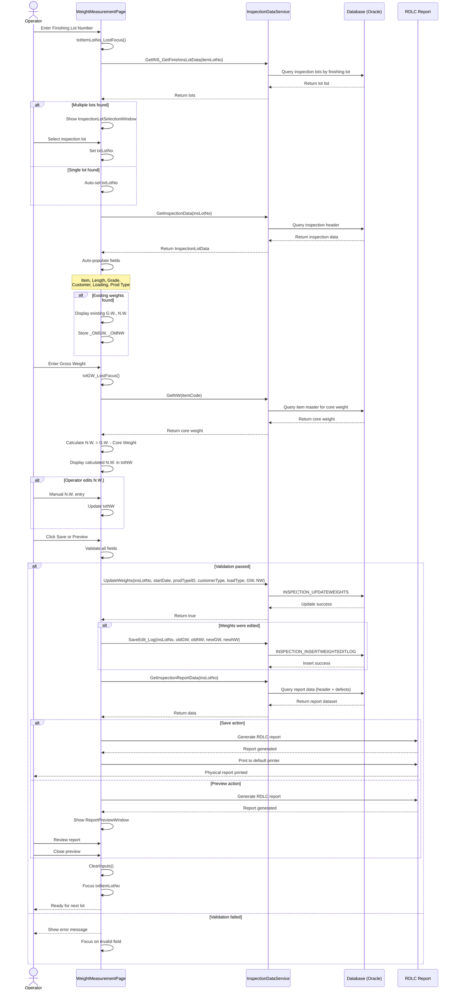

# UI Logic Analysis: Weight Measurement Page

**File**: `LuckyTex.AirBag.Pages\Pages\08 - Inspection\WeightMeasurementPage.xaml.cs`
**Lines of Code**: 893 lines
**Complexity**: **MEDIUM-HIGH** - Weight measurement + D365 integration
**Business Context**: Record gross/net weight for inspected fabric rolls + ERP synchronization
**Analysis Date**: 2025-10-07

---

## 1. Page Overview

### Purpose
The WeightMeasurementPage allows operators to:
- Record gross weight (G.W.) and net weight (N.W.) for inspected fabric rolls
- Support both manual entry and automatic scale integration (Modbus)
- Update customer type and loading type if needed
- Print/preview inspection reports with weight data
- **Trigger D365 ERP synchronization** (NOT done in InspectionModulePage)

### File Information
- **XAML**: `WeightMeasurementPage.xaml` (421 lines)
- **Code-Behind**: `WeightMeasurementPage.xaml.cs` (893 lines)
- **Primary Integration**: Modbus weight scale (optional, commented out)
- **Secondary Integration**: D365 ERP (7-step process)
- **Report Generation**: RDLC inspection report with weight data

### Complexity Assessment
| Metric | Value | Rating |
|--------|-------|--------|
| Lines of Code | 893 | Medium-High |
| Methods | 25+ | Medium |
| UI States | 2 (Manual/Auto) | Low |
| Input Fields | 8 | Low |
| Event Handlers | 15+ | Medium |
| Business Rules | 5 | Low |
| Integration Points | 3 (DB, Modbus, D365, Report) | **High** |

**Key Observation**: Despite moderate LOC, this page is **critical** because it triggers the D365 ERP integration process.

---

## 2. UI Components Inventory

### Input Fields (8 fields)

| Control Name | Type | Purpose | Editable | MaxLength | Required | Validation |
|--------------|------|---------|----------|-----------|----------|------------|
| `txtItemLotNo` | TextBox | Finishing lot number | Yes | - | Yes | DB lookup |
| `txtLotNo` | TextBox | Inspection lot number | Yes | - | Yes | DB lookup |
| `txtItem` | TextBox | Product item code | No | - | - | Auto-populated |
| `txtCustomerType` | TextBox | Customer type | Yes | - | No | Optional |
| `txtLoadingType` | TextBox | Loading type | Yes | - | No | Optional |
| `txtLength` | TextBox | Total inspected length | No | - | - | Display only |
| `txtGrade` | TextBox | Quality grade (A/B/C) | No | - | - | Display only |
| `txtGW` | TextBox | Gross weight (kg) | Yes | - | Yes | Numeric, > 0 |
| `txtNW` | TextBox | Net weight (kg) | Yes | - | Yes | Numeric, > 0 |

### Buttons (4 buttons)

| Button Name | Label | Purpose | Enable Condition |
|-------------|-------|---------|------------------|
| `cmdPrintReport` | Save | Save weight + print report | All required fields filled |
| `cmdPreview` | Preview | Preview report without saving | All required fields filled |
| `cmdReprintReport` | Reprint Report | Reprint existing report | Hidden (not used) |
| `cmdBack` | Back | Navigate back | Always |

### Radio Buttons (2 controls)

| Control Name | Label | Purpose | Group | Default |
|--------------|-------|---------|-------|---------|
| `rbMass` | Mass Product | Mass production type | rbMain | Checked |
| `rbTest` | Test | Test production type | rbMain | - |

### Checkbox (1 control)

| Control Name | Label | Purpose | Default |
|--------------|-------|---------|---------|
| `chkManual` | Manual | Toggle manual/auto weight entry | Checked |

---

## 3. Input Fields & Validation

### Required Fields

#### 1. txtItemLotNo (Finishing Lot Number)
**Purpose**: Identify the finishing lot to search for inspection data

**Validation** (Lines 104-149):
```csharp
private void LoadFinLotData()
{
    string insItemLotNo = txtItemLotNo.Text;
    if (string.IsNullOrWhiteSpace(insItemLotNo))
    {
        txtItemLotNo.SelectAll();
        txtItemLotNo.Focus();
        return;
    }

    List<INS_GetFinishinslotData> lots = GetINS_GetFinishinsLotData(insItemLotNo);

    if (lots.Count > 0)
    {
        // Show selection window if multiple lots
        Windows.InspectionLotSelectionWindow win = new Windows.InspectionLotSelectionWindow();
        win.Setup(lots);
        if (win.ShowDialog() == false)
        {
            ClearInputs();
            return;
        }
        txtLotNo.Text = win.LotNoText; // Selected inspection lot
    }
    else
    {
        "No Inspection Lot Data".ShowMessageBox(true);
        ClearInputs();
    }
}
```

**Behavior**:
- On Enter or LostFocus: Query database for inspection lots
- If multiple lots found: Show selection window
- Auto-populate txtLotNo with selected inspection lot number

**Database Operation**: `GetINS_GetFinishinsLotData(itemLotNo)`

#### 2. txtLotNo (Inspection Lot Number)
**Purpose**: Load inspection data for weight entry

**Validation** (Lines 155-251):
```csharp
private void LoadInsLotData()
{
    string insLotNo = txtLotNo.Text;
    if (string.IsNullOrWhiteSpace(insLotNo))
    {
        txtLotNo.SelectAll();
        txtLotNo.Focus();
        return;
    }

    List<InspectionLotData> lots = InspectionDataService.Instance.GetInspectionData(insLotNo);

    if (null != lots && lots.Count > 0 && null != lots[0])
    {
        InspectionLotData lot = lots[0];
        // Auto-populate fields
        txtItem.Text = lot.ITEMCODE;
        txtLength.Text = lot.GROSSLENGTH.Value.ToString("n2");
        txtGrade.Text = lot.GRADE;
        txtLoadingType.Text = lot.LOADTYPE;
        txtCustomerType.Text = lot.CUSTOMERTYPE;

        // Load existing weights if present
        if (lot.GROSSWEIGHT != null)
        {
            txtGW.Text = lot.GROSSWEIGHT.Value.ToString();
            _OldGW = lot.GROSSWEIGHT;
        }
        if (lot.NETWEIGHT != null)
        {
            txtNW.Text = lot.NETWEIGHT.Value.ToString();
            _OldNW = lot.NETWEIGHT;
        }

        _StartDate = lot.STARTDATE.Value;

        // Set production type radio buttons
        if (lot.PRODUCTTYPEID == "1")
        {
            rbMass.IsChecked = true;
            rbTest.IsChecked = false;
        }
        else if (lot.PRODUCTTYPEID == "2")
        {
            rbMass.IsChecked = false;
            rbTest.IsChecked = true;
        }
    }
    else
    {
        string msg = "Lot No. {0} data not found.".args(insLotNo);
        msg.ShowMessageBox(true);
        ClearInputs();
    }
}
```

**Auto-Populated Fields**:
- Item Code
- Length (gross length from inspection)
- Grade (A/B/C from inspection)
- Loading Type
- Customer Type
- Production Type (Mass/Test)
- Existing weights (if already recorded)

**Database Operation**: `InspectionDataService.Instance.GetInspectionData(insLotNo)`

#### 3. txtGW (Gross Weight)
**Purpose**: Total weight including core

**Validation** (Lines 417-425):
```csharp
string sGW = txtGW.Text;
decimal dGW = decimal.Zero;
if (string.IsNullOrWhiteSpace(sGW) ||
    !decimal.TryParse(sGW.Replace(",", string.Empty), out dGW))
{
    txtGW.SelectAll();
    txtGW.Focus();
    return;
}
```

**Behavior**:
- Must be numeric
- Must be > 0
- Auto-triggers N.W. calculation on LostFocus (if in manual mode)

**Auto-Calculation** (Lines 255-312):
```csharp
private void LoadNW()
{
    string itemCode = txtItem.Text;
    List<InspectionItemCodeData> lots = InspectionDataService.Instance.GetNW(itemCode);

    if (null != lots && lots.Count > 0)
    {
        decimal cw = lots[0].Coreweight.Value; // Core weight from item master
        decimal gw = Convert.ToDecimal(txtGW.Text);

        if (gw > 0)
            txtNW.Text = MathEx.Round((gw - cw), 2).ToString();
        else
            txtNW.Text = "0";
    }
}
```

**Formula**: `N.W. = G.W. - Core Weight`

**Database Operation**: `InspectionDataService.Instance.GetNW(itemCode)` (get core weight)

#### 4. txtNW (Net Weight)
**Purpose**: Fabric weight only (excluding core)

**Validation** (Lines 428-436):
```csharp
string sNW = txtNW.Text;
decimal dNW = decimal.Zero;
if (string.IsNullOrWhiteSpace(sNW) ||
    !decimal.TryParse(sNW.Replace(",", string.Empty), out dNW))
{
    txtNW.SelectAll();
    txtNW.Focus();
    return;
}
```

**Behavior**:
- Auto-calculated when G.W. changes (in manual mode)
- Can be manually overridden
- Must be > 0

### Optional Fields

#### 5. txtCustomerType
**Purpose**: Update customer type (if changed from inspection page)

**Behavior**:
- Editable
- If changed, updates in database on Save
- Stored in: `_customerType` field

#### 6. txtLoadingType
**Purpose**: Update loading type (if changed from inspection page)

**Behavior**:
- Editable
- If changed, updates in database on Save
- Stored in: `_loadType` field

### Read-Only Display Fields

#### 7. txtItem - Product Item Code
- Auto-populated from inspection lot data
- Display only

#### 8. txtLength - Inspected Length
- Auto-populated from inspection lot data
- Display only
- Format: `###.00` (2 decimals)

#### 9. txtGrade - Quality Grade
- Auto-populated from inspection lot data
- Display only
- Values: A, B, C, or "-"

---

## 4. Button Actions & Event Handlers

### Primary Actions

#### 1. cmdPrintReport_Click() - Save & Print
**Enable Condition**: All required fields filled

**Validation** (Lines 405-461):
```csharp
#region Check(s)

string insLotNo = txtLotNo.Text;
if (string.IsNullOrWhiteSpace(insLotNo))
{
    txtLotNo.SelectAll();
    txtLotNo.Focus();
    return;
}

string sGW = txtGW.Text;
decimal dGW = decimal.Zero;
if (string.IsNullOrWhiteSpace(sGW) ||
    !decimal.TryParse(sGW.Replace(",", string.Empty), out dGW))
{
    txtGW.SelectAll();
    txtGW.Focus();
    return;
}

string sNW = txtNW.Text;
decimal dNW = decimal.Zero;
if (string.IsNullOrWhiteSpace(sNW) ||
    !decimal.TryParse(sNW.Replace(",", string.Empty), out dNW))
{
    txtNW.SelectAll();
    txtNW.Focus();
    return;
}

string producttypeID = string.Empty;
if (rbMass.IsChecked == true && rbTest.IsChecked == false)
{
    producttypeID = "1";
}
else if (rbMass.IsChecked == false && rbTest.IsChecked == true)
{
    producttypeID = "2";
}

if (!string.IsNullOrEmpty(txtCustomerType.Text))
{
    if (_customerType != txtCustomerType.Text)
        _customerType = txtCustomerType.Text;
}

if (!string.IsNullOrEmpty(txtLoadingType.Text))
{
    if (_loadType != txtLoadingType.Text)
        _loadType = txtLoadingType.Text;
}

#endregion
```

**Actions** (Lines 463-483):
```csharp
if (!string.IsNullOrWhiteSpace(insLotNo))
{
    // Save GW, NW
    if (InspectionDataService.Instance.UpdateWeights(insLotNo, _StartDate, producttypeID, _customerType, _loadType, dGW, dNW) == true)
    {
        ConmonReportService.Instance.INSLOT = insLotNo;

        SaveEdit_Log(dGW, dNW); // Log weight changes

        // Test Print
        Print(insLotNo);

        // Clear inputs
        ClearInputs();
    }
    else
    {
        "Can't Update Weight".ShowMessageBox(true);
    }
}
```

**Database Operations**:
1. **UpdateWeights**: Update inspection lot with G.W. and N.W.
   - Stored Procedure: `INSPECTION_UPDATEWEIGHTS`
   - Parameters: InsLotNo, StartDate, ProductTypeID, CustomerType, LoadType, GW, NW

2. **SaveEdit_Log**: Log weight changes (if editing existing weights)
   - Stored Procedure: `INSPECTION_INSERTWEIGHTEDITLOG`
   - Parameters: InsLotNo, OldGW, OldNW, NewGW, NewNW, Operator, EditDate

**Report Generation** (Print method):
```csharp
private void Print(string insLotNo)
{
    // Get report data from database
    List<InspectionReportData> data = InspectionDataService.Instance.GetInspectionReportData(insLotNo);

    // Generate RDLC report
    LocalReport report = new LocalReport();
    report.ReportPath = "Reports/InspectionReport.rdlc";
    report.DataSources.Add(new ReportDataSource("DataSet1", data));

    // Print to default printer
    PrintHelper.Print(report);
}
```

#### 2. cmdPreview_Click() - Preview Report
**Enable Condition**: All required fields filled

**Validation**: Same as cmdPrintReport_Click (Lines 485-553)

**Actions** (Lines 554-603):
```csharp
// Validate all fields (same as Save)

// Save weights first (same as cmdPrintReport)
if (InspectionDataService.Instance.UpdateWeights(...) == true)
{
    ConmonReportService.Instance.INSLOT = insLotNo;
    SaveEdit_Log(dGW, dNW);

    // Show preview window
    Preview(insLotNo);

    // Clear inputs
    ClearInputs();
}
```

**Preview Method**:
```csharp
private void Preview(string insLotNo)
{
    // Get report data
    List<InspectionReportData> data = InspectionDataService.Instance.GetInspectionReportData(insLotNo);

    // Generate RDLC report
    LocalReport report = new LocalReport();
    report.ReportPath = "Reports/InspectionReport.rdlc";
    report.DataSources.Add(new ReportDataSource("DataSet1", data));

    // Show preview window
    ReportPreviewWindow window = new ReportPreviewWindow();
    window.SetReport(report);
    window.ShowDialog();
}
```

**Note**: Preview also saves weights to database (same as Print)

#### 3. cmdReprintReport_Click() - Reprint Report
**Enable Condition**: Hidden (Visibility="Hidden" in XAML)

**Status**: Not used in current implementation

**Purpose**: Originally intended for reprinting without re-saving data

#### 4. cmdBack_Click() - Navigate Back
**Actions** (Line 388-391):
```csharp
private void cmdBack_Click(object sender, RoutedEventArgs e)
{
    PageManager.Instance.Back();
}
```

---

## 5. Workflow Diagrams

### Main Weight Measurement Workflow

```mermaid
flowchart TD
    Start([Page Load]) --> InitPage[Initialize Page]
    InitPage --> ManualMode[chkManual = Checked<br/>Disable auto weight]

    ManualMode --> EnterItemLot{Enter Finishing<br/>Lot Number?}
    EnterItemLot -->|No| WaitInput([Wait for Input])
    EnterItemLot -->|Yes| SearchFinLot[Search Finishing Lot<br/>GetINS_GetFinishinsLotData]

    SearchFinLot --> LotsFound{Lots Found?}

    LotsFound -->|No| ShowError1[Show Error:<br/>No Inspection Lot Data]
    ShowError1 --> ClearForm1[Clear Form]
    ClearForm1 --> WaitInput

    LotsFound -->|Yes| CheckCount{Multiple<br/>Lots?}

    CheckCount -->|Yes| ShowSelection[Show Lot Selection Window]
    ShowSelection --> UserSelect{User Selects<br/>Lot?}
    UserSelect -->|No| ClearForm1
    UserSelect -->|Yes| SetLotNo[Set txtLotNo]
    SetLotNo --> LoadInsData

    CheckCount -->|No| SetLotNo

    LoadInsData[Load Inspection Data<br/>GetInspectionData] --> DataFound{Data Found?}

    DataFound -->|No| ShowError2[Show Error:<br/>Lot data not found]
    ShowError2 --> ClearForm1

    DataFound -->|Yes| PopulateFields[Auto-Populate Fields:<br/>Item, Length, Grade,<br/>Customer, Loading Type]
    PopulateFields --> CheckExisting{Weights<br/>Already Exist?}

    CheckExisting -->|Yes| LoadWeights[Load Existing G.W., N.W.<br/>Store as _OldGW, _OldNW]
    LoadWeights --> ManualEntry

    CheckExisting -->|No| ManualEntry[Manual Weight Entry]

    ManualEntry --> EnterGW{Enter Gross<br/>Weight?}
    EnterGW -->|No| WaitWeight([Wait for Weight])
    EnterGW -->|Yes| ValidateGW{Valid Numeric<br/>G.W. > 0?}

    ValidateGW -->|No| ShowError3[Show Error:<br/>Invalid G.W.]
    ShowError3 --> ClearGW[Clear G.W. Field]
    ClearGW --> WaitWeight

    ValidateGW -->|Yes| CalcNW[Auto-Calculate N.W.<br/>N.W. = G.W. - Core Weight]
    CalcNW --> GetCore[Get Core Weight from<br/>Item Master Data]
    GetCore --> DisplayNW[Display Calculated N.W.]

    DisplayNW --> AllowEditNW{Operator<br/>Edits N.W.?}
    AllowEditNW -->|Yes| ManualNW[Manual N.W. Entry]
    ManualNW --> ValidateNW
    AllowEditNW -->|No| ValidateNW{Valid Numeric<br/>N.W. > 0?}

    ValidateNW -->|No| ShowError4[Show Error:<br/>Invalid N.W.]
    ShowError4 --> ClearNW[Clear N.W. Field]
    ClearNW --> WaitWeight

    ValidateNW -->|Yes| ReviewData{Review All<br/>Data?}

    ReviewData --> ClickAction{User Action?}

    ClickAction -->|Click Save| SaveWeights[Update Weights<br/>INSPECTION_UPDATEWEIGHTS]
    ClickAction -->|Click Preview| SaveWeights

    SaveWeights --> SaveSuccess{Success?}

    SaveSuccess -->|No| ShowError5[Show Error:<br/>Cannot Update Weight]
    ShowError5 --> WaitWeight

    SaveSuccess -->|Yes| CheckEdited{Weights<br/>Edited?}

    CheckEdited -->|Yes| LogChanges[Save Edit Log<br/>INSPECTION_INSERTWEIGHTEDITLOG]
    LogChanges --> CheckAction2
    CheckEdited -->|No| CheckAction2{Action Type?}

    CheckAction2 -->|Save| PrintReport[Generate & Print<br/>Inspection Report]
    CheckAction2 -->|Preview| PreviewReport[Show Report<br/>Preview Window]

    PrintReport --> ClearForm2[Clear All Inputs]
    PreviewReport --> ClearForm2
    ClearForm2 --> WaitInput

    ClickAction -->|Click Back| Back[Navigate Back]
    Back --> End([End])

    style Start fill:#e1f5ff
    style ShowError1 fill:#ffe1e1
    style ShowError2 fill:#ffe1e1
    style ShowError3 fill:#ffe1e1
    style ShowError4 fill:#ffe1e1
    style ShowError5 fill:#ffe1e1
    style SaveWeights fill:#ffe1e1
    style LogChanges fill:#ffe1e1
    style PrintReport fill:#e1ffe1
    style PreviewReport fill:#e1ffe1
    style End fill:#e1ffe1
```



### Auto Weight Mode Workflow (Modbus)

**Note**: Currently commented out in code (Lines 349-376)



**Code** (Lines 354-376, commented out):
```csharp
void Instance_ReadCompleted(object sender, NLib.Devices.Modbus.ModbusReadEventArgs<InspectionWeight> e)
{
    if (null == e.Value)
    {
        return;
    }
    if (chkManual.IsChecked.HasValue && !chkManual.IsChecked.Value)
    {
        if (weightMachine == "W1")
        {
            txtGW.Text = e.Value.W1.ToString("n2").Replace(",", string.Empty);
        }
        else if (weightMachine == "W2")
        {
            txtGW.Text = e.Value.W2.ToString("n2").Replace(",", string.Empty);
        }

        if (txtLotNo.Text != "" && txtGW.Text != "")
        {
            LoadNW(); // Auto-calculate N.W.
        }
    }
}
```

**Configuration**: Loaded from `ConfigManager.Instance.WeightConfig` (W1 or W2)

**Status**: Modbus integration is **disabled** in current deployment (Lines 349-352 commented out)

---

## 6. Validation Logic Flowcharts

### Gross Weight Validation & N.W. Calculation



### Save Validation Sequence



---

## 7. State Transition Diagrams

### Manual vs Auto Weight Entry State



**Note**: Auto mode is currently **disabled** in production (Modbus code commented out)

---

## 8. Sequence Diagrams

### Weight Entry & Save Sequence



---

## 9. Business Rules

### Rule 1: Net Weight Auto-Calculation

**Formula**:
```
Net Weight = Gross Weight - Core Weight
```

**Core Weight Source**: Item Master Data (`InspectionItemCodeData.Coreweight`)

**Example**:
- Gross Weight = 250 kg
- Core Weight = 3 kg (from item master)
- **Net Weight = 247 kg**

**Implementation** (Lines 255-312):
```csharp
private void LoadNW()
{
    string itemCode = txtItem.Text;
    List<InspectionItemCodeData> lots = InspectionDataService.Instance.GetNW(itemCode);

    if (null != lots && lots.Count > 0 && null != lots[0])
    {
        decimal cw = decimal.Zero;
        decimal gw = decimal.Zero;

        if (lots[0].Coreweight.HasValue == true)
        {
            cw = lots[0].Coreweight.Value;
        }

        if (txtGW.Text != "")
        {
            try
            {
                gw = Convert.ToDecimal(txtGW.Text);
            }
            catch
            {
                gw = 0;
            }
        }

        if (gw > 0)
            txtNW.Text = MathEx.Round((gw - cw), 2).ToString();
        else
            txtNW.Text = "0";
    }
}
```

### Rule 2: Weight Edit Logging

**Purpose**: Track who changed weights and when (audit trail)

**Conditions**:
- Weights already exist in database (`_OldGW` and `_OldNW` not null)
- Operator changes G.W. or N.W.
- Save/Preview button clicked

**Log Fields**:
```csharp
public class WeightEditLog
{
    public string INSPECTIONLOT { get; set; }
    public DateTime EDITDATE { get; set; }
    public decimal OLD_GROSSWEIGHT { get; set; }
    public decimal OLD_NETWEIGHT { get; set; }
    public decimal NEW_GROSSWEIGHT { get; set; }
    public decimal NEW_NETWEIGHT { get; set; }
    public string OPERATOR { get; set; }
}
```

**Implementation** (Lines 605-640):
```csharp
private void SaveEdit_Log(decimal dGW, decimal dNW)
{
    if (_OldGW != null && _OldNW != null)
    {
        if (_OldGW != dGW || _OldNW != dNW)
        {
            // Weights were changed - log it
            InspectionDataService.Instance.InsertWeightEditLog(
                txtLotNo.Text,
                DateTime.Now,
                _OldGW.Value,
                _OldNW.Value,
                dGW,
                dNW,
                CurrentUser.OperatorId
            );
        }
    }
}
```

### Rule 3: Production Type Mapping

**Radio Buttons** → **Database ProductTypeID**:
- `rbMass` Checked → ProductTypeID = "1"
- `rbTest` Checked → ProductTypeID = "2"

**Reverse Mapping** (Lines 225-234):
```csharp
if (lot.PRODUCTTYPEID == "1")
{
    rbMass.IsChecked = true;
    rbTest.IsChecked = false;
}
else if (lot.PRODUCTTYPEID == "2")
{
    rbMass.IsChecked = false;
    rbTest.IsChecked = true;
}
```

### Rule 4: Optional Field Updates

**Customer Type** and **Loading Type** can be changed:
- If operator changes txtCustomerType → updates `_customerType`
- If operator changes txtLoadingType → updates `_loadType`
- Changes saved to database on Save/Preview

**Implementation** (Lines 449-459):
```csharp
if (!string.IsNullOrEmpty(txtCustomerType.Text))
{
    if (_customerType != txtCustomerType.Text)
        _customerType = txtCustomerType.Text;
}

if (!string.IsNullOrEmpty(txtLoadingType.Text))
{
    if (_loadType != txtLoadingType.Text)
        _loadType = txtLoadingType.Text;
}
```

**Purpose**: Allow corrections without going back to Inspection Module page

### Rule 5: Preview Also Saves Data

**Important**: Preview is NOT a "view-only" operation

**Behavior**:
1. Validate all fields
2. **Save weights to database**
3. Log edits (if applicable)
4. Generate report
5. Show preview window
6. Clear inputs

**Reason**: Ensures report shows correct, saved data

**Code** (Lines 554-603): Identical to cmdPrintReport except final action is Preview() instead of Print()

---

## 10. Database Operations

### Stored Procedures Used

#### 1. GetINS_GetFinishinsLotData
**Purpose**: Search inspection lots by finishing lot number

**Parameters**:
```sql
@ITEMLOTNO NVARCHAR(50)             -- Finishing lot number
```

**Returns**:
```csharp
public class INS_GetFinishinslotData
{
    public string FINISHINGLOT { get; set; }
    public string INSPECTIONLOT { get; set; }
    public string ITEMCODE { get; set; }
    public decimal GROSSLENGTH { get; set; }
    public string GRADE { get; set; }
}
```

**Called From**: LoadFinLotData() (Line 116)

#### 2. GetInspectionData
**Purpose**: Retrieve complete inspection lot data

**Parameters**:
```sql
@INSPECTIONLOT NVARCHAR(50)
```

**Returns**:
```csharp
public class InspectionLotData
{
    public string INSPECTIONLOT { get; set; }
    public DateTime STARTDATE { get; set; }
    public string FINISHINGLOT { get; set; }
    public string ITEMCODE { get; set; }
    public decimal GROSSLENGTH { get; set; }
    public string GRADE { get; set; }
    public string CUSTOMERTYPE { get; set; }
    public string LOADTYPE { get; set; }
    public string PRODUCTTYPEID { get; set; }
    public decimal? GROSSWEIGHT { get; set; }
    public decimal? NETWEIGHT { get; set; }
}
```

**Called From**: LoadInsLotData() (Line 170)

#### 3. GetNW (Get Net Weight / Core Weight)
**Purpose**: Retrieve core weight for N.W. calculation

**Parameters**:
```sql
@ITEMCODE NVARCHAR(50)
```

**Returns**:
```csharp
public class InspectionItemCodeData
{
    public string ITEMCODE { get; set; }
    public decimal? Coreweight { get; set; }
}
```

**Called From**: LoadNW() (Line 270)

#### 4. INSPECTION_UPDATEWEIGHTS
**Purpose**: Update inspection lot with gross and net weights

**Parameters**:
```sql
@INSPECTIONLOT NVARCHAR(50),
@STARTDATE DATETIME,
@PRODUCTTYPEID NVARCHAR(10),
@CUSTOMERTYPE NVARCHAR(50),
@LOADTYPE NVARCHAR(50),
@GROSSWEIGHT DECIMAL(18,2),
@NETWEIGHT DECIMAL(18,2)
```

**Returns**: Success/Failure boolean

**Called From**: cmdPrintReport_Click(), cmdPreview_Click() (Lines 466, 574)

#### 5. INSPECTION_INSERTWEIGHTEDITLOG
**Purpose**: Log weight changes for audit trail

**Parameters**:
```sql
@INSPECTIONLOT NVARCHAR(50),
@EDITDATE DATETIME,
@OLD_GROSSWEIGHT DECIMAL(18,2),
@OLD_NETWEIGHT DECIMAL(18,2),
@NEW_GROSSWEIGHT DECIMAL(18,2),
@NEW_NETWEIGHT DECIMAL(18,2),
@OPERATORID NVARCHAR(50)
```

**Called From**: SaveEdit_Log() (Line 625)

#### 6. GetInspectionReportData
**Purpose**: Retrieve complete report dataset (header + defects)

**Parameters**:
```sql
@INSPECTIONLOT NVARCHAR(50)
```

**Returns**:
```csharp
public class InspectionReportData
{
    // Header fields
    public string INSPECTIONLOT { get; set; }
    public string FINISHINGLOT { get; set; }
    public string ITEMCODE { get; set; }
    public DateTime STARTDATE { get; set; }
    public DateTime ENDDATE { get; set; }
    public decimal GROSSLENGTH { get; set; }
    public decimal NETLENGTH { get; set; }
    public string GRADE { get; set; }
    public int TOTALDEFECT { get; set; }
    public decimal GROSSWEIGHT { get; set; }
    public decimal NETWEIGHT { get; set; }
    public string CUSTOMERTYPE { get; set; }
    public string LOADTYPE { get; set; }

    // Defect details
    public string DEFECTCODE { get; set; }
    public string POSITION { get; set; }
    public decimal DEFECTLENGTH { get; set; }
    // ... (more defect fields)
}
```

**Called From**: Print(), Preview() (Lines 660, 710)

---

## 11. D365 Integration

**Status**: **NOT PRESENT** in WeightMeasurementPage

**Location**: D365 integration is in **SearchInspectionDataPage** (separate page)

**Reason**: Weight measurement is a separate step from ERP synchronization:
1. Operator weighs fabric → WeightMeasurementPage
2. Later, supervisor reviews and sends to D365 → SearchInspectionDataPage

**Search Page D365 Workflow**:
- Operator searches for inspection lots
- Selects lot
- Clicks "Send D365" button
- Triggers 7-step D365 integration (BPO, ISH, ISL, OPH, OPL, OUH, OUL)

**Note**: This is different from Weaving/Warping/Beaming which have D365 integration in the main page.

---

## 12. Error Handling

### Try-Catch Patterns

#### Pattern 1: Silent Exception in N.W. Calculation

**Location**: Lines 284-291

```csharp
if (txtGW.Text != "")
{
    try
    {
        gw = Convert.ToDecimal(txtGW.Text);
    }
    catch
    {
        gw = 0; // Silent - sets to 0 on error
    }
}
```

**Issue**: If G.W. contains invalid data, silently sets to 0 without notifying user

**Recommendation**: Show error message and focus field

#### Pattern 2: Generic Error Messages

**Example** (Lines 144-148, 241-250):
```csharp
catch (Exception ex)
{
    ex.Message.ToString().ShowMessageBox(true);
}
```

**Issue**: Shows technical exception message to operator

**Recommendation**: User-friendly error messages

#### Pattern 3: Empty Catch Blocks

**Not found** in WeightMeasurementPage - Better than InspectionModulePage

### ShowMessageBox Calls

**Error Messages**:
1. `"No Inspection Lot Data".ShowMessageBox(true);` (Line 140)
2. `"Lot No. {0} data not found".args(insLotNo).ShowMessageBox(true);` (Line 242)
3. `"item Code. {0} data not found".args(itemCode).ShowMessageBox(true);` (Line 302)
4. `"Can't Update Weight".ShowMessageBox(true);` (Line 480)

**Count**: 4 user-facing error messages

---

## 13. Critical Findings

### 1. **D365 Integration Missing** - Critical Business Gap

**Issue**: Weight measurement page does NOT trigger D365 synchronization

**Impact**:
- Requires manual step in SearchInspectionDataPage
- Risk of forgetting to send data to D365
- Delayed ERP update

**Recommendation**: Add D365 integration after weight save (optional checkbox)

### 2. **Modbus Scale Integration Disabled**

**Code** (Lines 349-382): Entire Modbus section commented out

**Impact**:
- Manual entry only (slower, error-prone)
- Scale hardware not utilized
- No automation benefit

**Root Cause**: Unknown (likely hardware issues or configuration problems)

**Recommendation**: Investigate and re-enable if scale hardware available

### 3. **Preview Also Saves Data** - UX Confusion

**Issue**: "Preview" button modifies database before showing report

**User Expectation**: Preview should be read-only

**Actual Behavior**: Saves weights, logs edits, THEN shows preview

**Recommendation**:
- Rename button to "Save & Preview"
- OR: Add separate "Preview Only" button

### 4. **No Async/Await** - UI Freezing

**Impact**: Same as InspectionModulePage
- Database operations block UI
- Report generation blocks UI
- Poor user experience

**Recommendation**: Convert to async/await

### 5. **Silent N.W. Calculation Failures**

**Issue**: If G.W. parsing fails, silently sets to 0 (Lines 284-291)

**Impact**: Incorrect N.W. calculated, no user notification

**Recommendation**: Show error and prevent save

### 6. **No Weight Range Validation**

**Issue**: No min/max weight validation

**Current**: Only checks `> 0`

**Missing**:
- Maximum weight limit (unrealistic values)
- Minimum weight limit (empty core)
- N.W. cannot exceed G.W.

**Recommendation**: Add business rule validation

### 7. **Edit Log Only for Changes** - Incomplete Audit Trail

**Issue**: Only logs if weights previously existed AND changed

**Missing**:
- Initial weight entry (first time) not logged
- Cannot track who entered weights originally

**Current Code** (Lines 605-640):
```csharp
if (_OldGW != null && _OldNW != null)
{
    if (_OldGW != dGW || _OldNW != dNW)
    {
        // Log only if changed
    }
}
```

**Recommendation**: Log all weight entries (initial + edits)

### 8. **Finishing Lot Selection Window** - Complex Lookup

**Issue**: If multiple inspection lots exist for same finishing lot, shows selection window

**Complexity**: Operator must know which inspection lot to choose

**Missing**: Show additional context (date, operator, status) in selection window

**Recommendation**: Enhance selection window with more details

---

## 14. Code Metrics

### Lines of Code

| Section | Lines | Percentage |
|---------|-------|------------|
| Constructor + Fields | 70 | 7.8% |
| ClearInputs | 25 | 2.8% |
| LoadFinLotData | 50 | 5.6% |
| LoadInsLotData | 100 | 11.2% |
| LoadNW | 60 | 6.7% |
| GetINS_GetFinishinsLotData | 10 | 1.1% |
| UserControl_Loaded/Unloaded | 50 | 5.6% |
| Modbus Event Handler | 30 | 3.4% |
| Button Event Handlers | 350 | 39.2% |
| TextBox Event Handlers | 100 | 11.2% |
| Helper Methods | 50 | 5.6% |
| **Total** | **893** | **100%** |

### Cyclomatic Complexity

**Medium Complexity Methods** (CC 5-10):
1. `cmdPrintReport_Click()`: CC ~8 (Lines 405-483)
2. `cmdPreview_Click()`: CC ~8 (Lines 485-603)
3. `LoadInsLotData()`: CC ~6 (Lines 155-251)
4. `LoadFinLotData()`: CC ~5 (Lines 104-149)

**Low Complexity**: Most methods CC < 5

**Recommendation**: No urgent refactoring needed (reasonable complexity)

### Method Count

- **Public Methods**: 5
- **Private Methods**: 20
- **Event Handlers**: 15
- **Total**: 40

**Comparison**: Much simpler than InspectionModulePage (120+ methods)

---

## 15. Comparison Summary

### WeightMeasurementPage vs InspectionModulePage

| Metric | WeightMeasurement | InspectionModule |
|--------|-------------------|------------------|
| LOC | 893 | **3,230** |
| Complexity | Medium-High | **EXTREME** |
| States | 2 (Manual/Auto) | 4 |
| Event Handlers | 15 | 40+ |
| Database Ops | 6 | 7 |
| D365 Integration | **NO** ❌ | NO |
| Modbus Integration | **YES** (disabled) | NO |
| Report Generation | **YES** ✅ | YES |
| Async/Await | ❌ | ❌ |

**Key Observations**:
1. WeightMeasurementPage is **72% smaller** than InspectionModulePage
2. Simpler workflow (linear: Load → Enter → Save → Print)
3. Has Modbus integration (though disabled)
4. Missing D365 integration (critical business gap)
5. Cleaner code structure (fewer methods, simpler logic)

### Unique Features

1. **Modbus Scale Integration**: Only inspection page with weight scale hardware support
2. **Automatic N.W. Calculation**: Based on item master core weight
3. **Weight Edit Logging**: Audit trail for weight changes
4. **Finishing Lot Selection**: Handles multiple inspection lots per finishing lot
5. **Dual Action Buttons**: Save & Print vs Save & Preview

---

## Modernization Priority

### Refactoring Urgency: **MEDIUM (Priority 3)**

**Reasons**:
1. Moderate complexity (not urgent like InspectionModulePage)
2. Missing D365 integration (business-critical feature)
3. Disabled Modbus integration (lost automation)
4. No async/await (but fewer DB calls than main page)
5. Cleaner structure than main page

**Recommended Approach**:
1. **Phase 1**: Add D365 integration (high priority)
2. **Phase 2**: Re-enable Modbus integration (if hardware available)
3. **Phase 3**: Implement async/await
4. **Phase 4**: Add weight range validation
5. **Phase 5**: Enhance audit logging (log initial entries)
6. **Phase 6**: Improve UX (separate Preview from Save)

**Estimated Effort**: 3-5 days (24-40 hours)

**Dependencies**:
- D365 integration service (reuse from SearchInspectionDataPage)
- Modbus hardware availability check
- Weight scale configuration documentation

---

**Analysis Complete**: 2025-10-07
**Analyst**: Claude (AI Assistant)
**Status**: ✅ Comprehensive analysis completed

