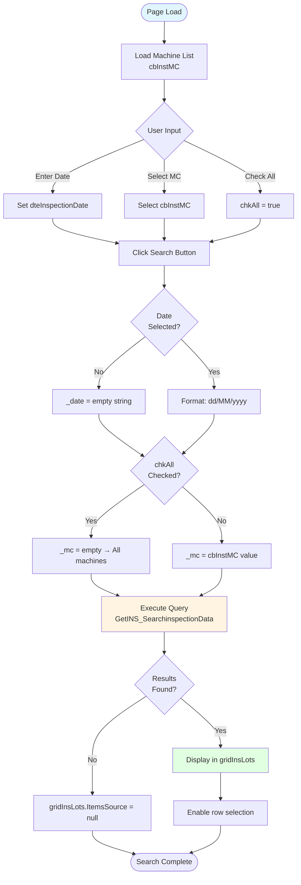
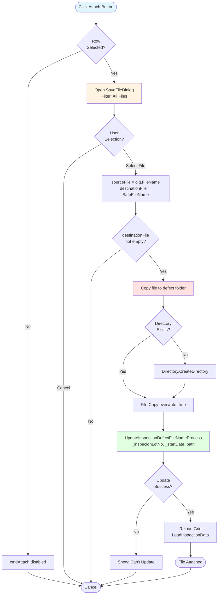
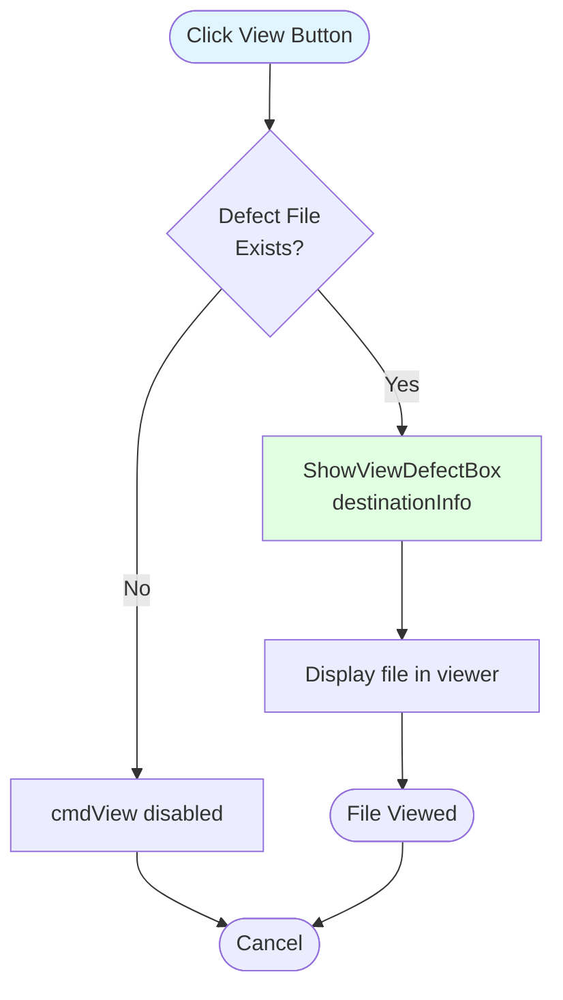
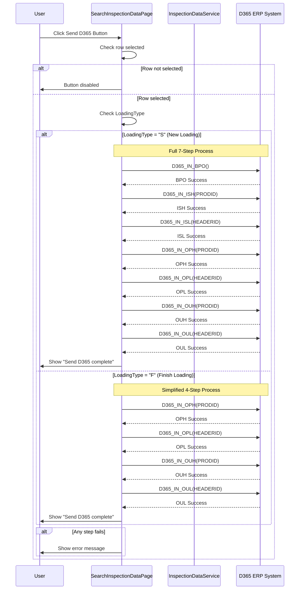
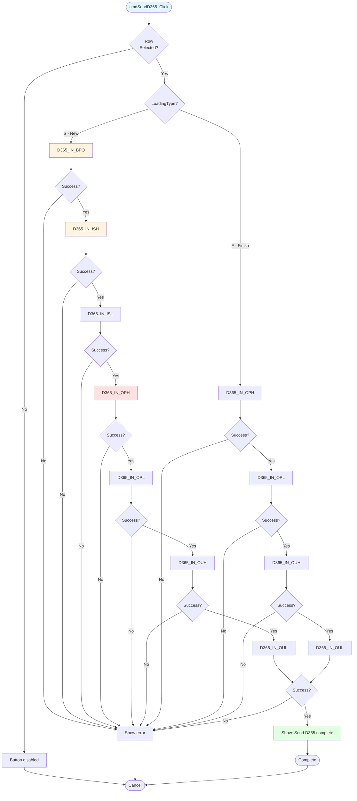

# UI Logic Analysis: Search Inspection Data

**Page**: SearchInspectionDataPage.xaml
**Module**: 08 - Inspection
**Purpose**: Search inspection records, attach defect files, and send data to D365 ERP
**Complexity**: Medium-High (974 LOC C#, D365 integration)
**Related Process Doc**: Documents/Processes/08_Inspection/036-PROCESS_INSPECTION_REPORTING.md

---

## 1. Page Overview

### Primary Functions
1. **Search Inspection Records** - Query by date and machine
2. **View Inspection Details** - Display lot information in grid
3. **Attach Defect Files** - Upload defect images/documents
4. **View Attached Files** - Open/save defect files
5. **Send to D365** - ERP integration for finished goods

### UI Layout

**Search Criteria (Top)**:
- `dteInspectionDate` (DatePicker) - Inspection date filter
- `cbInstMC` (ComboBox) - Machine number selection
- `chkAll` (CheckBox) - "Show All Machines" toggle
- `cmdSearch` (Button) - Execute search

**Results Grid (Center)**:
- `gridInsLots` (DataGrid) - Inspection lots with columns:
  - Finishing Lot, Inspection Lot, Item, Customer
  - Gross Weight, Net Weight, Meters
  - Defect File Name, Start Date

**Action Buttons (Bottom)**:
- `cmdAttach` - Attach defect file
- `cmdView` - View attached file
- `cmdSendD365` - Send to ERP
- `cmdBack` - Return to menu

---

## 2. Input Validation Logic

### Search Criteria Validation

**Inspection Date** (Required):
```csharp
// Line 98-101
if (dteInspectionDate.SelectedDate != null)
{
    _date = dteInspectionDate.SelectedDate.Value.ToString("dd/MM/yyyy");
}
```
- **Rule**: Date is optional but recommended
- **Format**: dd/MM/yyyy
- **Default**: No default (user must select)

**Machine Selection** (Optional):
```csharp
// Lines 103-112
if (chkAll.IsChecked == false)
{
    if (cbInstMC.SelectedValue != null)
    {
        _mc = cbInstMC.SelectedValue.ToString();
    }
}
```
- **Rule**: If "Show All" unchecked, machine must be selected
- **Behavior**: Empty string if "Show All" checked → returns all machines

### Grid Selection Validation

```csharp
// Lines 331-427 (gridInsLots_SelectedCellsChanged)
if (gridInsLots.SelectedItem != null)
{
    INS_SearchInspectionData row = gridInsLots.SelectedItem as INS_SearchInspectionData;

    // Extract all fields from selected row
    _inspecionLotNo = row.INSPECTIONLOT;
    _startDate = row.Startdate;
    _defectFileName = row.DEFECTFILENAME;
    P_FINISHINGLOT = row.FINISHINGLOT;
    P_INSPECTIONLOT = row.INSPECTIONLOT;
    // ... more fields
}
```

**Button Enable Logic**:
- `cmdAttach.IsEnabled = true` - If row selected
- `cmdView.IsEnabled = true` - If row selected AND defect file exists
- `cmdSendD365.IsEnabled = true` - If row selected

---

## 3. Main Workflows

### Workflow 1: Search Inspection Data



### Workflow 2: Attach Defect File



### Workflow 3: View Attached File



### Workflow 4: Send to D365 ERP



---

## 4. Control Enable/Disable Logic

### Button State Matrix

| Button | Enabled When | Disabled When |
|--------|-------------|---------------|
| `cmdSearch` | Always | Never |
| `cmdAttach` | Row selected | No row selected |
| `cmdView` | Row selected AND defect file exists | No row OR no file |
| `cmdSendD365` | Row selected | No row selected |
| `cmdBack` | Always | Never |

**Implementation** (Lines 331-427):
```csharp
private void gridInsLots_SelectedCellsChanged(...)
{
    if (gridInsLots.SelectedItem != null)
    {
        // Enable Attach button
        if (cmdAttach.IsEnabled == false)
            cmdAttach.IsEnabled = true;

        // Enable View button if file exists
        if (_defectFileName != string.Empty)
        {
            if (cmdView.IsEnabled == false)
                cmdView.IsEnabled = true;
        }
    }
    else
    {
        ClearControl(); // Disables buttons
    }
}
```

---

## 5. Data Binding

### ComboBox Binding

**Machine List**:
```csharp
// Line 81-85
instList = InspectionDataService.Instance.GetMachinesData();
this.cbInstMC.ItemsSource = instList;
this.cbInstMC.DisplayMemberPath = "DisplayName";
this.cbInstMC.SelectedValuePath = "MCId";
```

### DataGrid Binding

**Inspection Lots**:
```csharp
// Lines 116-127
List<INS_SearchInspectionData> lots =
    InspectionDataService.Instance.GetINS_SearchinspectionData(_date, _mc);

if (lots != null && lots.Count > 0 && lots[0] != null)
{
    gridInsLots.ItemsSource = lots;
}
else
{
    gridInsLots.ItemsSource = null;
}
```

**Data Model Fields**:
- `FINISHINGLOT` - Finishing lot number
- `INSPECTIONLOT` - Inspection lot number
- `ITEMID` - Item code
- `CUSTOMERNAME` - Customer name
- `GW` - Gross weight
- `NW` - Net weight
- `METER` - Length in meters
- `DEFECTFILENAME` - Attached file path
- `Startdate` - Inspection start date
- `PRODID` - Production ID (for D365)
- `HEADERID` - Header ID (for D365)
- `LOADINGTYPE` - "S" (new) or "F" (finish)

---

## 6. File Management

### Defect File Attachment

**File Path Configuration**:
```csharp
// Line 188
string pathDefectFile = ConfigManager.Instance.DefectFileConfig;
```

**File Copy Process**:
```csharp
// Lines 194-220
if (!Directory.Exists(pathDefectFile))
{
    Directory.CreateDirectory(pathDefectFile);
}

File.Copy(sourceFile, destinationInfo, true); // Overwrite if exists

if (InspectionDataService.Instance.UpdateInspectionDefectFileNameProcess(
    _inspecionLotNo, _startDate.Value, destinationInfo) == true)
{
    LoadInspectionData(); // Refresh grid
}
```

### File View/Save

**View File**:
```csharp
// Line 222-228
private void ViewFile(string destinationInfo)
{
    this.ShowViewDefectBox(destinationInfo); // Opens viewer window
}
```

**Save File**:
```csharp
// Lines 245-293
SaveFileDialog dlg = new SaveFileDialog();
// Extract file type from extension
// Copy from defect folder to user-selected location
```

---

## 7. D365 ERP Integration

### Integration Types

**Type 1: New Loading (LoadingType = "S")**
- **7-Step Process**: BPO → ISH → ISL → OPH → OPL → OUH → OUL
- **Use Case**: First-time sending inspection data to D365
- **Operations**: Create BPO, Issue, Output

**Type 2: Finish Loading (LoadingType = "F")**
- **4-Step Process**: OPH → OPL → OUH → OUL
- **Use Case**: Update existing D365 records
- **Operations**: Output only (skip BPO/ISH/ISL)

### D365 Methods

```csharp
// D365 Integration Methods (Lines 558-974)
private bool D365_IN_BPO() // Batch Production Order
private bool D365_IN_ISH(long? PRODID) // Issue Header
private bool D365_IN_ISL(long? HEADERID) // Issue Line
private bool D365_IN_OPH(long? PRODID) // Output Header
private bool D365_IN_OPL(long? HEADERID) // Output Line
private bool D365_IN_OUH(long? PRODID) // Output Update Header
private bool D365_IN_OUL(long? HEADERID) // Output Update Line
```

### D365 Execution Flow



---

## 8. Key Business Rules

### Search Behavior
1. **Date Optional**: If no date selected, returns all records (performance concern)
2. **Machine Filter**: "Show All" checkbox overrides machine selection
3. **Default Sort**: Results sorted by date descending (newest first)

### File Attachment
1. **File Storage**: Centralized defect file folder (config-driven)
2. **Overwrite Policy**: Always overwrite if file exists
3. **File Types**: All file types allowed (*.*)
4. **Database Update**: File path stored in `DEFECTFILENAME` field

### D365 Integration
1. **LoadingType Determines Flow**:
   - "S" → Full 7-step integration
   - "F" → Simplified 4-step integration
2. **Sequential Execution**: Each step must succeed before next
3. **No Rollback**: Failed steps don't undo previous steps (⚠️ Data integrity risk)
4. **Synchronous**: UI freezes during D365 calls (⚠️ UX issue)

---

## 9. Code Issues & Technical Debt

### Critical Issues

**1. No Async Operations** ⚠️
```csharp
// All D365 calls are synchronous - UI freezes
private bool D365_IN_BPO() { ... } // Should be async Task<bool>
```
**Impact**: UI freezes during 7-step D365 integration (can take 10+ seconds)

**2. No Transaction Rollback** ⚠️
```csharp
// If step 5 fails, steps 1-4 already committed
if (D365_IN_OPH(PRODID) == true)
{
    // OPH succeeded, but OPL might fail
    if (D365_IN_OPL(HEADERID) == true)
```
**Impact**: Partial D365 data if any step fails

**3. Silent Exception Handling** ⚠️
```csharp
// Lines 87-90
catch
{
    "Please Check Data".ShowMessageBox(true);
}
```
**Impact**: No logging, hard to troubleshoot

**4. No Input Sanitization** ⚠️
- File names not validated before copy
- SQL injection risk if stored procedures don't use parameters

### Medium Issues

**5. Nested Try-Catch** 🟡
```csharp
// Lines 191-220 - Double nested try-catch
try {
    try {
        // File copy logic
    }
    catch { ... }
}
catch { ... }
```

**6. Performance Concern** 🟡
- No paging on search results
- Loading all records if no date selected
- Grid rebinding on every attach/reload

---

## 10. Database Operations

### Stored Procedures Used

1. **GetMachinesData()** - Load machine list
2. **GetINS_SearchinspectionData(date, mc)** - Search inspection lots
3. **UpdateInspectionDefectFileNameProcess(lot, date, path)** - Update file attachment
4. **D365_IN_BPO()** - Create BPO
5. **D365_IN_ISH(prodId)** - Create Issue Header
6. **D365_IN_ISL(headerId)** - Create Issue Line
7. **D365_IN_OPH(prodId)** - Create Output Header
8. **D365_IN_OPL(headerId)** - Create Output Line
9. **D365_IN_OUH(prodId)** - Update Output Header
10. **D365_IN_OUL(headerId)** - Update Output Line

### Key Tables
- **INSPECTIONDATA** - Main inspection records
- **D365_BPO** - Batch Production Orders
- **D365_ISH** - Issue Headers
- **D365_ISL** - Issue Lines
- **D365_OPH** - Output Headers
- **D365_OPL** - Output Lines

---

## 11. Implementation Checklist

### Repository Layer
- [ ] Create `InspectionSearchRepository.cs`
  - [ ] `SearchInspectionLotsAsync(date, machineId)`
  - [ ] `AttachDefectFileAsync(lotNo, date, filePath)`
  - [ ] `GetDefectFilePathAsync(lotNo)`

### Service Layer
- [ ] Create `InspectionReportingService.cs`
  - [ ] `SearchLotsAsync(criteria)` with validation
  - [ ] `AttachDefectFileAsync(lot, file)` with file validation
  - [ ] `SendToD365Async(lot)` with async implementation

### D365 Integration
- [ ] Create `D365InspectionIntegrationService.cs`
  - [ ] `SendNewLoadingAsync(lot)` - 7-step process
  - [ ] `SendFinishLoadingAsync(lot)` - 4-step process
  - [ ] Add transaction support
  - [ ] Add rollback on failure

### UI Refactoring
- [ ] Convert D365 calls to async/await
- [ ] Add loading indicators during D365 integration
- [ ] Add paging to grid (PagedCollectionView)
- [ ] Add input validation framework
- [ ] Add comprehensive error logging

### Testing
- [ ] Unit tests for search criteria
- [ ] Integration tests for D365 flows
- [ ] File attachment tests (various file types)
- [ ] Performance tests (large result sets)

---

## 12. Summary

### Page Characteristics
- **Complexity**: Medium-High (974 lines)
- **Primary Function**: Search and report inspection data
- **Key Feature**: D365 ERP integration with dual workflows
- **File Management**: Attach/view defect files

### Strengths
✅ Comprehensive search functionality
✅ Dual D365 integration paths (new/finish)
✅ File attachment capability
✅ Clear button enable/disable logic

### Critical Improvements Needed
🔴 **Async/Await** - D365 integration freezes UI
🔴 **Transaction Management** - No rollback on D365 failures
🔴 **Error Handling** - Silent exceptions, no logging
🔴 **Performance** - No paging, loads all records

### Modernization Priority
**HIGH** - D365 integration is critical for ERP synchronization. Current synchronous implementation creates poor UX and data integrity risks.

---

**Analysis Complete**: SearchInspectionDataPage
**Lines Analyzed**: 974 (C#) + 195 (XAML) = 1,169 total
**Diagrams Created**: 4 (Search workflow, Attach workflow, View workflow, D365 sequence)
**Date**: 2025-10-07
