# UI Logic Analysis: Cut & Print Process

**Document ID**: 039-UI_LOGIC_CUT_PRINT_PROCESS
**Module**: 11 - Cut & Print
**Page**: CutPrintPage.xaml
**Analysis Date**: 2025-10-09
**Status**: LARGEST FILE IN PROJECT (6,525 lines)

---

## 1. Process Overview

### Purpose
The Cut & Print module represents the **final production stage** before packing in the airbag fabric manufacturing process. This stage performs quality inspection, barcode validation, and integrates with Microsoft Dynamics 365 ERP for production order tracking.

### Scope
- Quality parameter inspection (width, density, speed, fabric width)
- Barcode scanning and validation for 4 production lines
- Support for primary and secondary barcodes (2nd Barcode)
- Suspend/Resume capability for incomplete lots
- Clear functionality with authorization (Process ID 7)
- Complete D365 ERP integration for production orders
- Print slip generation

### Key Characteristics
- **Dual Barcode System**: Primary barcode + secondary barcode for specific customers
- **4-Lane Processing**: Tracks 4 separate production lines with begin/end roll validation
- **Left/Right Selvage Tracking**: Quality check for fabric edges (OK/NG status)
- **Customer-Specific Logic**: Special handling for Customer ID "08" with barcode prefix manipulation
- **Complex State Machine**: Start → Data Entry → End workflow with suspend capability

---

## 2. UI Files Inventory

### XAML Files
| File Path | Size | Description |
|-----------|------|-------------|
| `d:\Projects\NET\Production\Luckytex\LuckyTexAirBagV01x02\LuckyTex.AirBag.Pages\Pages\11 - Cut & Print\CutPrintPage.xaml` | 1,320 lines | Main UI layout with quality parameter inputs |

### Code-Behind Files
| File Path | Size | Description |
|-----------|------|-------------|
| `d:\Projects\NET\Production\Luckytex\LuckyTexAirBagV01x02\LuckyTex.AirBag.Pages\Pages\11 - Cut & Print\CutPrintPage.xaml.cs` | **6,525 lines** | **LARGEST FILE IN ENTIRE PROJECT** - Business logic, validation, D365 integration |

### Related Service Files
- `CutPrintSession.cs` - Session state management
- Data services for Cut & Print operations
- `D365DataService.Instance` - D365 ERP integration service

---

## 3. UI Layout Description

### Header Section (Grid1 - Lines 58-271)
**Basic Information Display**

| Control Name | Type | Purpose | ReadOnly |
|--------------|------|---------|----------|
| `txtITEMCODE` | TextBox | Item code from finishing lot | Yes |
| `txtITEMLOT` | TextBox | **PRIMARY INPUT** - Finishing lot number | No |
| `txtPrintNo` | TextBox | Print machine number (default: 256) | No |
| `txtFINISHINGLOT` | TextBox | Finishing lot reference | Yes |
| `txtBATCHNO` | TextBox | Batch number | Yes |
| `txtOperator` | TextBox | Operator name | Yes |
| `txtStartTime` | TextBox | Process start timestamp | Yes |
| `txtEndTime` | TextBox | Process end timestamp | Yes |

**Product Type Selection**
- `rbMass` - RadioButton: Mass Production (default checked)
- `rbTest` - RadioButton: Test Production

### Quality Parameters Section (Grid3 - Lines 272-1314)

#### Specification vs Actual Values
Each quality parameter has:
- Specification field (readonly) - loaded from item code
- Actual input fields (1-4 measurements)

**Quality Parameters Table**

| Parameter | Specification Control | Actual Input Controls | Unit | Validation |
|-----------|----------------------|----------------------|------|------------|
| Width of Barcode | `txtWIDTHSpecification` | `txtWIDTH1-4` | mm | Numeric only |
| Distant barcode-number | `txtDISTANTBARSpecification` | `txtDISTANTBAR1-4` | cm | Numeric only |
| Distant line by line | `txtDISTANTLINESpecification` | `txtDISTANTLINE1-3` | cm | Numeric only |
| Density - Warp | `txtDENWARPSpecification` | `txtDENWARP` | Unit/inch | Numeric only |
| Density - Weft | `txtDENWeftSpecification` | `txtDENWEFT` | Unit/inch | Numeric only |
| Speed of product | `txtSPEEDSpecification` | `txtSPEED` | m/min | Numeric only |
| Fabric width (Before) | `txtBeforeSpecification` | `txtWIDTHBE` | cm | Numeric only |
| Fabric width (After) | `txtAfterSpecification` | `txtWIDTHAF`, `txtWIDTHAF_END` | cm | Numeric only |

#### Selvage (Cut Edges) Status
- `cbStatusLeft` - ComboBox: Left edge status (OK/NG)
- `cbStatusRight` - ComboBox: Right edge status (OK/NG)
- **Visibility controlled by item configuration** (`SHOWSELVAGE` field)

### 4-Lane Barcode Validation Section (Grid4 - Lines 734-1187)

**Structure**: 4 production lines × (Primary + Secondary barcode) × (Begin + End roll)

#### Primary Barcode Fields (Per Line 1-4)
| Control | Purpose | Validation Logic |
|---------|---------|------------------|
| `txtBatchNo1-4` | Expected barcode (readonly) | Set by system |
| `txtBEGINLINE1-4` | Begin roll barcode scan | Must match `txtBatchNo` |
| `txtENDLINE1-4` | End roll barcode scan | Must match `txtBatchNo` |
| `imgTrue1-4` | Checkmark image | Shown when barcode matches |
| `imgTrueEnd1-4` | Checkmark image | Shown when end barcode matches |

#### Secondary Barcode Fields (Per Line 1-4)
| Control | Purpose | Validation Logic |
|---------|---------|------------------|
| `txt2ndBatchNo1-4` | Expected 2nd barcode (readonly) | Set by system |
| `txt2ndBEGINLINE1-4` | Begin roll 2nd barcode scan | Must match `txt2ndBatchNo` |
| `txt2ndENDLINE1-4` | End roll 2nd barcode scan | Must match `txt2ndBatchNo` |
| `img2ndTrue1-4` | Checkmark image | Shown when 2nd barcode matches |
| `img2ndTrueEnd1-4` | Checkmark image | Shown when end 2nd barcode matches |

### Additional Controls

| Control | Type | Purpose |
|---------|------|---------|
| `txtREMARK` | TextBox | Operator remarks |
| `txtLengthDetail` | TextBox | Mathematical expression for cutting length |
| `txtLengthPrint` | TextBox | Calculated print length (from expression) |
| `txtTension` | TextBox | Tension value (mandatory for End) |

### Action Buttons

| Button | Initial State | Purpose |
|--------|---------------|---------|
| `cmdStart` | Disabled | Start production (calls `CUT_INSERTDATA`) |
| `cmdEnd` | Disabled | End production (calls `CUT_UPDATEDATA`, triggers D365 sync) |
| `cmdPreview` | Disabled | Preview/Print cut slip |
| `cmdClear` | Disabled | Clear current lot (requires authorization) |
| `cmdSuspend` | Disabled | Suspend lot for later completion |
| `cmdBack` | Enabled | Return to previous screen |

---

## 4. Key Business Logic

### 4.1 Main Workflow States

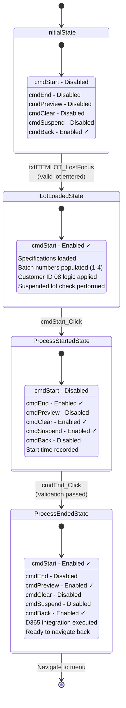

### 4.2 Customer ID 08 Special Logic

For Customer ID = "08", batch numbers are transformed:
```csharp
// Original batch from database
string batch = items[0].BATCHNO.TrimStart().TrimEnd();

// Primary barcode: Add "P" prefix + first 9 chars
if (batch.Length >= 9)
{
    batchNo = "P" + batch.Substring(0, 9);
    txtBatchNo1-4.Text = batchNo;
}

// Secondary barcode: Add "H" prefix + ITEMLOT (without last char)
batchNo2nd = "H" + ITEMLOT.Substring(0, ITEMLOT.Length - 1);
txt2ndBatchNo1-4.Text = batchNo2nd;
```

### 4.3 Barcode Validation Logic

#### Primary Barcode Validation (Begin Roll Example)

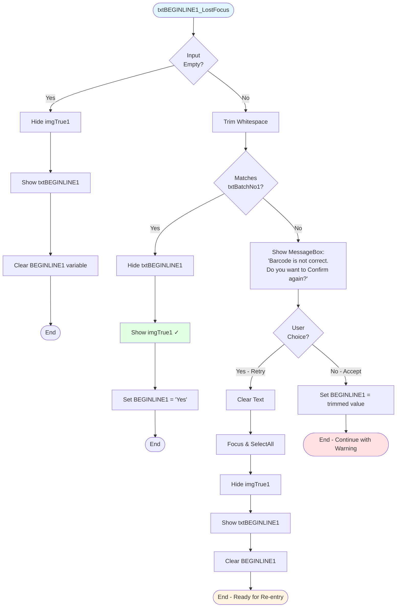

**Visual Feedback**:
- ✅ **Correct barcode**: Input field hidden, checkmark image visible, BEGINLINE1="Yes"
- ⚠️ **Incorrect barcode**: Warning dialog with retry option, can accept override
- ⬜ **Empty field**: No validation, checkmark hidden, BEGINLINE1 cleared

### 4.4 Suspend/Resume Capability

**Suspend Operation** (`cmdSuspend_Click`):

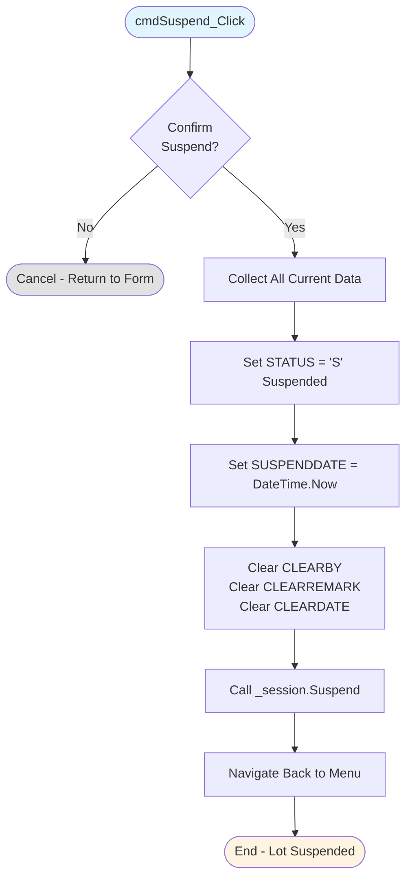

**Resume Detection** (`Cut_GetMCSuspendData` on page load):

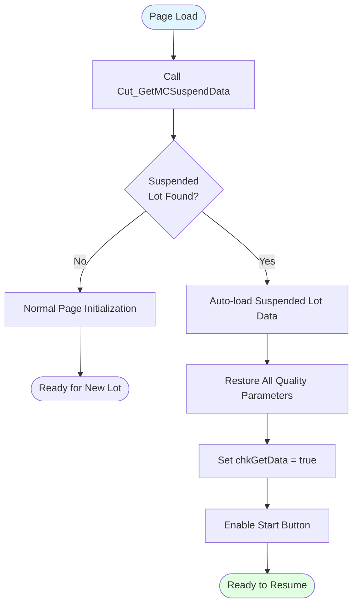

### 4.5 Clear Authorization

**Process ID**: 7
**Authorization Required**: Yes

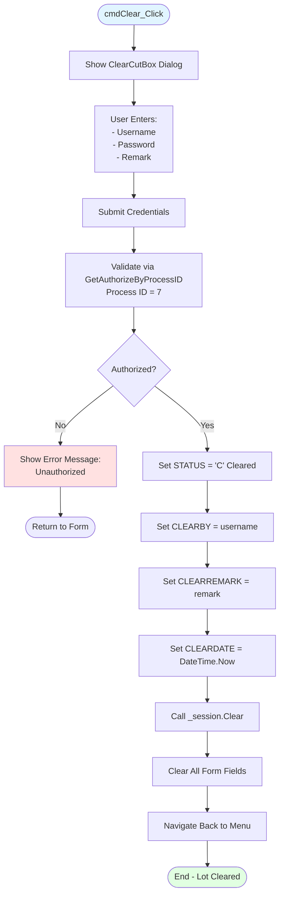

---

## 5. Input Validation Logic

### 5.1 Field-Level Validation

#### txtITEMLOT (Item Lot - Primary Input)

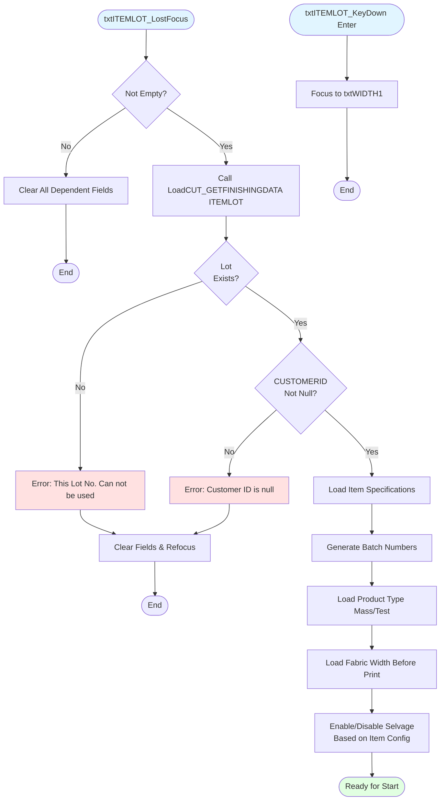

**Error Messages**:
- "This Lot No. {ITEMLOT} Can not be used" - Lot not found
- "This Customer ID is null Can not be used" - Invalid customer data

#### Numeric Fields (Quality Parameters)

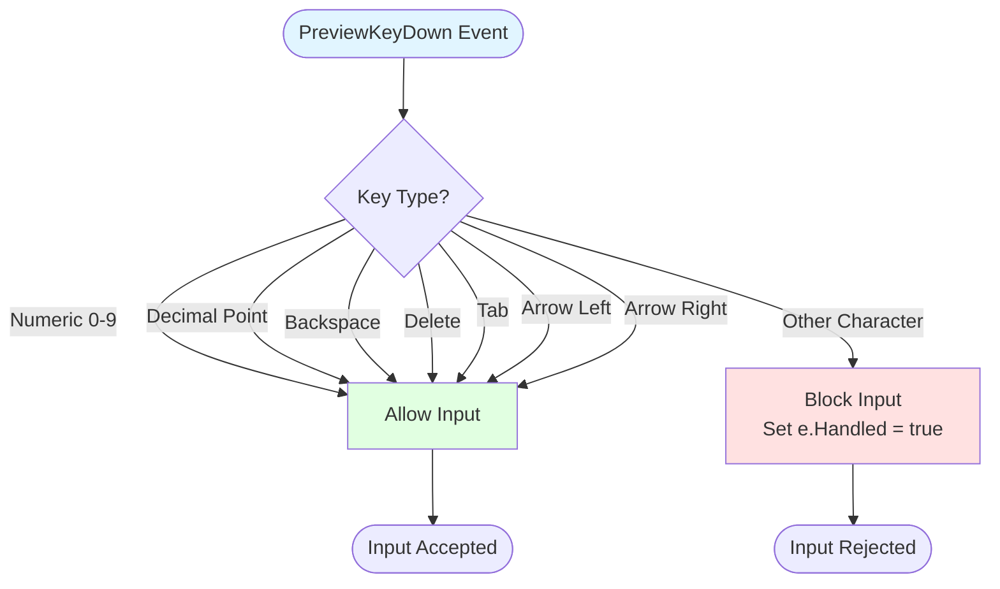

**Affected Fields** (All numeric-only quality parameters):
- Width measurements: txtWIDTH1, txtWIDTH2, txtWIDTH3, txtWIDTH4
- Barcode distance: txtDISTANTBAR1, txtDISTANTBAR2, txtDISTANTBAR3, txtDISTANTBAR4
- Line distance: txtDISTANTLINE1, txtDISTANTLINE2, txtDISTANTLINE3
- Density: txtDENWARP, txtDENWEFT
- Speed: txtSPEED
- Fabric width: txtWIDTHBE, txtWIDTHAF, txtWIDTHAF_END
- Other: txtTension, txtLengthPrint

### 5.2 Barcode Validation Matrix

| Customer ID | Field | Expected Format | Validation Logic |
|-------------|-------|-----------------|------------------|
| "08" | Primary | "P" + 9 chars | Exact match after trim |
| "08" | Secondary | "H" + (ITEMLOT - last char) | Exact match after trim |
| Other | Primary | BATCHNO as-is | Exact match |
| Other | Secondary | SND_BARCODE | Exact match (if exists) |

### 5.3 End Process Validation

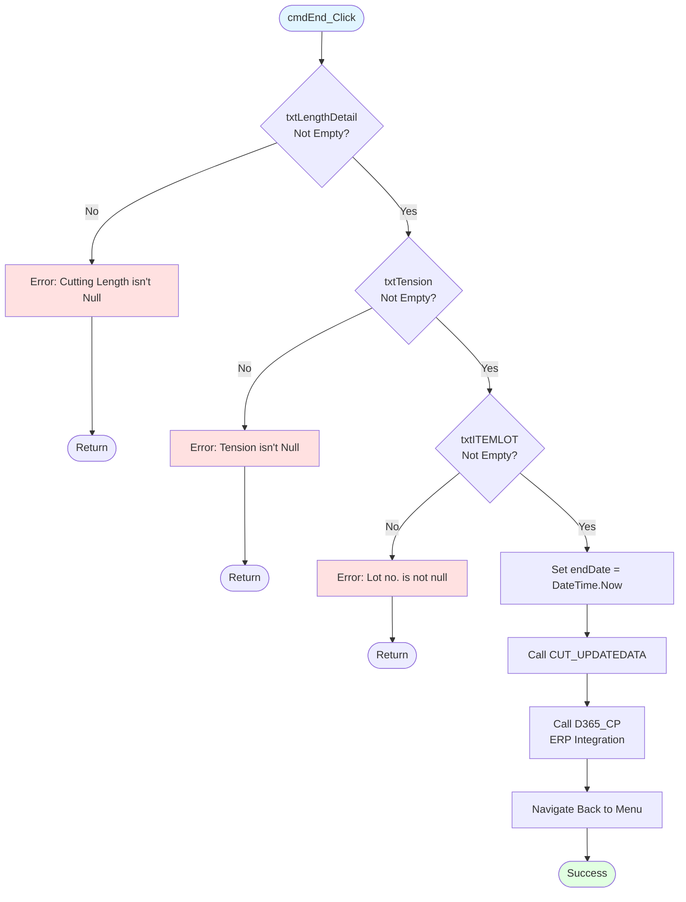

### 5.4 Start Process Validation

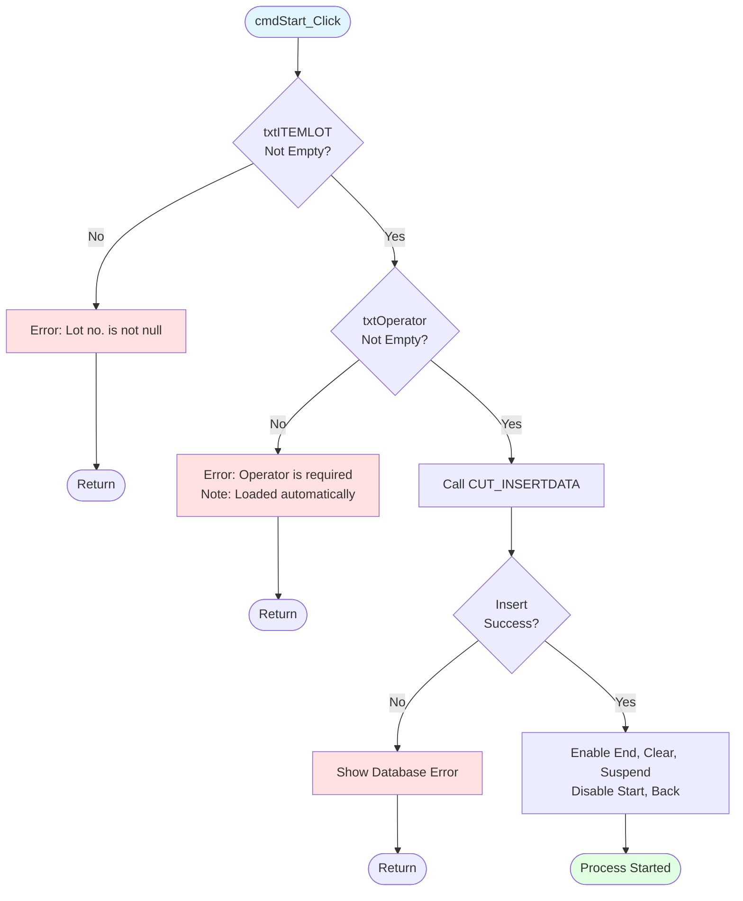

---

## 6. State Management

### 6.1 Page States

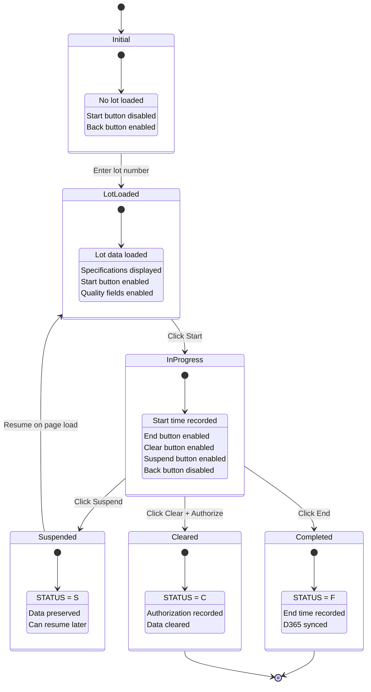

### 6.2 Button State Transitions

| Event | cmdStart | cmdEnd | cmdPreview | cmdClear | cmdSuspend | cmdBack |
|-------|----------|--------|------------|----------|------------|---------|
| Page Load | Disabled | Disabled | Disabled | Disabled | Disabled | **Enabled** |
| Lot Loaded | **Enabled** | Disabled | Disabled | Disabled | Disabled | **Enabled** |
| Start Clicked | Disabled | **Enabled** | Disabled | **Enabled** | **Enabled** | Disabled |
| End Clicked | **Enabled** | Disabled | **Enabled** | Disabled | Disabled | **Enabled** |
| Suspend Clicked | Navigate Back | - | - | - | - | - |
| Clear Clicked | Navigate Back | - | - | - | - | - |

### 6.3 Internal State Variables

```csharp
// Global state flags
private string cmID = string.Empty;              // Customer ID
private bool chkGetData = false;                 // Suspended lot flag
private DateTime startDate;                       // Process start timestamp
private DateTime endDate;                         // Process end timestamp
private string PRODUCTTYPEID = string.Empty;     // "1" = Mass, "2" = Test

// Barcode validation state (per line)
private string BEGINLINE1 = string.Empty;        // "Yes" or actual value
private string BEGINLINE2 = string.Empty;
private string BEGINLINE3 = string.Empty;
private string BEGINLINE4 = string.Empty;
private string ENDLINE1 = string.Empty;
private string ENDLINE2 = string.Empty;
private string ENDLINE3 = string.Empty;
private string ENDLINE4 = string.Empty;

// Secondary barcode state
private string BEGINLINE12nd = string.Empty;
private string BEGINLINE22nd = string.Empty;
private string BEGINLINE32nd = string.Empty;
private string BEGINLINE42nd = string.Empty;
private string ENDLINE12nd = string.Empty;
private string ENDLINE22nd = string.Empty;
private string ENDLINE32nd = string.Empty;
private string ENDLINE42nd = string.Empty;

// D365 integration state
private long? PRODID = null;                     // Production order ID
private long? HEADERID = null;                   // Header ID for transactions
private string P_LOTNO = string.Empty;           // Production lot
private string P_ITEMID = string.Empty;          // Item ID
private string P_LOADINGTYPE = string.Empty;     // Loading type
```

### 6.4 Session Object (_session)

The `CutPrintSession` object maintains state across operations:

```csharp
// Session properties (partial list)
_session.FINISHINGLOT       // Finishing lot number
_session.ITEMLOT            // Item lot number
_session.Operator           // Operator name
_session.STARTDATE          // Start timestamp
_session.ENDDATE            // End timestamp
_session.PRODUCTTYPEID      // Product type
_session.REMARK             // Operator remarks
_session.MCNO               // Machine number
_session.WIDTH1-4           // Width measurements
_session.DISTANTBAR1-4      // Barcode distance measurements
_session.DISTANTLINE1-3     // Line distance measurements
_session.DENWARP/DENWEFT    // Density measurements
_session.SPEED              // Speed measurement
_session.WIDTHBE/WIDTHAF    // Fabric width measurements
_session.WIDTHAF_END        // End fabric width
_session.BEGINLINE1-4       // Begin barcodes
_session.ENDLINE1-4         // End barcodes
_session.P_2BEGINLINE1-4    // 2nd begin barcodes
_session.P_2ENDLINE1-4      // 2nd end barcodes
_session.SELVAGELEFT        // Left selvage status
_session.SELVAGERIGHT       // Right selvage status
_session.P_TENSION          // Tension value
_session.LENGTHDETAIL       // Length calculation expression
_session.LENGTHPRINT        // Calculated print length
_session.STATUS             // "I"=InProgress, "F"=Finished, "S"=Suspended, "C"=Cleared
_session.CLEARBY            // Authorization user
_session.CLEARREMARK        // Clear reason
_session.CLEARDATE          // Clear timestamp
_session.SUSPENDDATE        // Suspend timestamp
_session.FINISHINGPROCESS   // "Scouring" disables selvage controls
```

---

## 7. Database Operations

### 7.1 Stored Procedures Used

#### Data Retrieval
| Procedure | Purpose | Called By | Parameters |
|-----------|---------|-----------|------------|
| `CUT_GETFINISHINGDATA` | Load finishing lot details | `LoadCUT_GETFINISHINGDATA()` | `ITEMLOT` |
| `CUT_GETCONDITIONBYITEMCODE` | Load quality specifications | `LoadCUT_GETCONDITIONBYITEMCODE()` | `P_ITMCODE` |
| `Cut_GetMCSuspendData` | Load suspended lot | `Cut_GetMCSuspendData()` | (None - loads all suspended) |
| `GetAuthorizeByProcessID` | Validate clear authorization | `GetAuthorizeByProcessID()` | `PROCESSID=7, USER, PASS` |

#### Data Modification
| Procedure | Purpose | Called By | Operation |
|-----------|---------|-----------|-----------|
| `CUT_INSERTDATA` | Start production process | `CUT_INSERTDATA()` | INSERT |
| `CUT_UPDATEDATA` | End production process | `CUT_UPDATEDATA()` | UPDATE |
| `Suspend` | Suspend current lot | `Suspend()` | UPDATE (STATUS='S') |
| `Clear` | Clear lot with authorization | `GetAuthorizeByProcessID()` | UPDATE (STATUS='C') |

### 7.2 Key Data Structures

#### CUT_GETFINISHINGDATA Response
```csharp
{
    CUSTOMERID       // Customer identifier (drives barcode logic)
    ITEMCODE         // Item code
    BATCHNO          // Batch number (source for barcode generation)
    FINISHINGLOT     // Finishing lot reference
    SND_BARCODE      // Secondary barcode (optional)
    PRODUCTTYPEID    // "1" = Mass, "2" = Test
    BEFORE_WIDTH     // Fabric width before print
    FINISHINGPROCESS // "Scouring" = hide selvage controls
}
```

#### CUT_GETCONDITIONBYITEMCODE Response
```csharp
{
    strWIDTHBARCODE     // Width specification (e.g., "7-9")
    strDISTANTBARCODE   // Barcode distance spec (e.g., "1.0-1.5")
    strDISTANTLINE      // Line distance spec (e.g., "23.5-24.5")
    strDENSITYWARP      // Warp density spec (e.g., "52-56")
    strDENSITYWEFT      // Weft density spec (e.g., "52-56")
    strSPEED            // Speed spec (e.g., "15-20")
    strAFTER            // After width spec (e.g., "161-165")
    SHOWSELVAGE         // "Y" = Show selvage, "N" = Hide
}
```

### 7.3 Transaction Flow

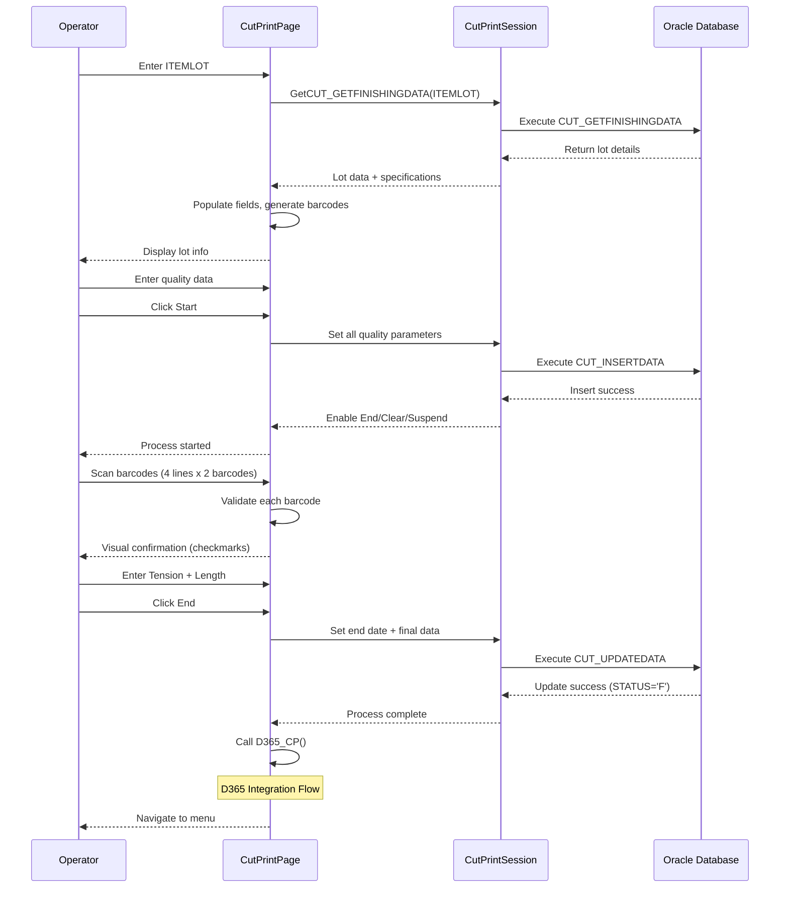

---

## 8. D365 Integration

### 8.1 Integration Overview

The D365 integration is triggered **ONLY on End** (`cmdEnd_Click`) and consists of **7 sequential steps**:


**⚠️ Critical Issue - Failure Handling**: If ANY step fails, entire integration stops with **NO ROLLBACK**. This can result in partial data corruption in D365 (e.g., if BPO succeeds but ISH fails, orphaned production order exists).

### 8.2 D365 Integration Steps

#### Step 1: D365_CP_BPO (Bill of Production Output)
```
Purpose: Create production order in D365
Database: Call D365_CP_BPO(ITEMLOT)
Insert: D365DataService.Insert_ABBPO()
Parameters:
├─ PRODID (from query)
├─ LOTNO
├─ ITEMID
├─ LOADINGTYPE
├─ QTY
├─ UNIT
└─ OPERATION
Output: Sets PRODID, P_LOTNO, P_ITEMID, P_LOADINGTYPE
```

#### Step 2: D365_CP_ISH (Issue Header)
```
Purpose: Create material issue header
Database: Call D365_CP_ISH(ITEMLOT)
Insert: D365DataService.Insert_ABISH()
Parameters:
├─ HEADERID (from query)
├─ PRODID (from step 1)
├─ TOTALRECORD
├─ P_LOTNO
├─ P_ITEMID
└─ P_LOADINGTYPE
Output: Sets HEADERID
```

#### Step 3: D365_CP_ISL (Issue Lines)
```
Purpose: Create material issue line items
Database: Call D365_CP_ISL(ITEMLOT)
Insert: D365DataService.Insert_ABISL() [Loop through lines]
Parameters:
├─ HEADERID (from step 2)
├─ LINENO
├─ ISSUEDATE (formatted as yyyy-MM-dd)
├─ ITEMID
├─ STYLEID
├─ QTY
├─ UNIT
└─ SERIALID
```

#### Step 4: D365_CP_OPH (Operation Header)
```
Purpose: Create operation tracking header
Database: Call D365_CP_OPH(ITEMLOT)
Insert: D365DataService.Insert_ABOPH()
Parameters:
├─ HEADERID (from query - NEW headerID)
├─ PRODID (from step 1)
├─ TOTALRECORD
├─ P_LOTNO
├─ P_ITEMID
└─ P_LOADINGTYPE
Output: Updates HEADERID
```

#### Step 5: D365_CP_OPL (Operation Lines)
```
Purpose: Record operation details (machine, time, qty)
Database: Call D365_CP_OPL(ITEMLOT)
Insert: D365DataService.Insert_ABOPL() [Loop through lines]
Parameters:
├─ HEADERID (from step 4)
├─ LINENO
├─ PROCQTY (processed quantity)
├─ OPRNO (operation number)
├─ OPRID (operator ID)
├─ MACHINENO
├─ STARTDATETIME
└─ ENDDATETIME
```

#### Step 6: D365_CP_OUH (Output Header)
```
Purpose: Create production output header
Database: Call D365_CP_OUH(ITEMLOT)
Insert: D365DataService.Insert_ABOUH()
Parameters:
├─ HEADERID (from query - NEW headerID)
├─ PRODID (from step 1)
├─ TOTALRECORD
├─ P_LOTNO
├─ P_ITEMID
└─ P_LOADINGTYPE
Output: Updates HEADERID
```

#### Step 7: D365_CP_OUL (Output Lines)
```
Purpose: Record finished goods output
Database: Call D365_CP_OUL(ITEMLOT)
Insert: D365DataService.Insert_ABOUL() [Loop through lines]
Parameters:
├─ HEADERID (from step 6)
├─ LINENO
├─ OUTPUTDATE (formatted as yyyy-MM-dd)
├─ ITEMID
├─ QTY
├─ UNIT
├─ GROSSLENGTH
├─ NETLENGTH
├─ GROSSWEIGHT
├─ NETWEIGHT
├─ PALLETNO
├─ GRADE
├─ SERIALID
├─ LOADINGTYPE
├─ FINISH (int? converted from nullable)
├─ MOVEMENTTRANS
├─ WAREHOUSE
└─ LOCATION
```

### 8.3 D365 Integration Flowchart

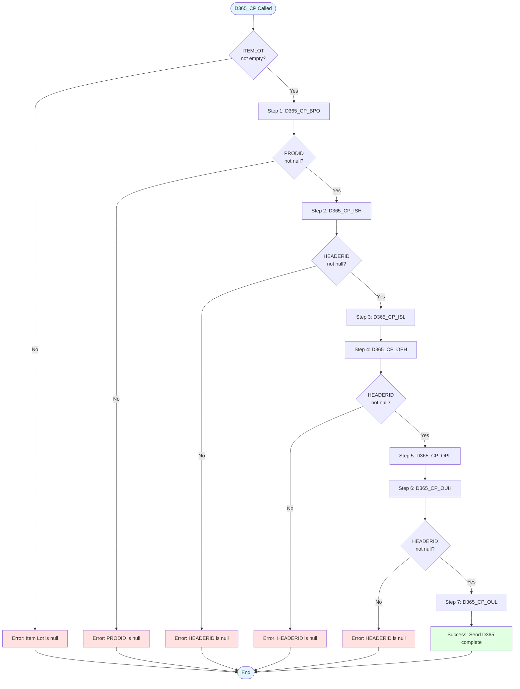

### 8.4 D365 Error Handling

```csharp
// Each D365 step returns bool
// If any step returns false, entire flow stops

if (D365_CP_BPO() == true)           // Step 1
{
    if (PRODID != null)
    {
        if (D365_CP_ISH(PRODID) == true)    // Step 2
        {
            if (HEADERID != null)
            {
                if (D365_CP_ISL(HEADERID) == true)  // Step 3
                {
                    if (D365_CP_OPH(PRODID) == true)  // Step 4
                    {
                        // ... continues through step 7
                    }
                }
            }
        }
    }
}
```

**Error Messages**:
- Specific error from database operation (shown via ShowMessageBox)
- Generic info messages for null ID tracking:
  - "PRODID is null"
  - "HEADERID is null"
  - "Item Lot is null"
  - "D365_CP_XXX Row = 0" (no data returned from query)

---

## 9. Mermaid Diagrams

### 9.1 Main Workflow Flowchart

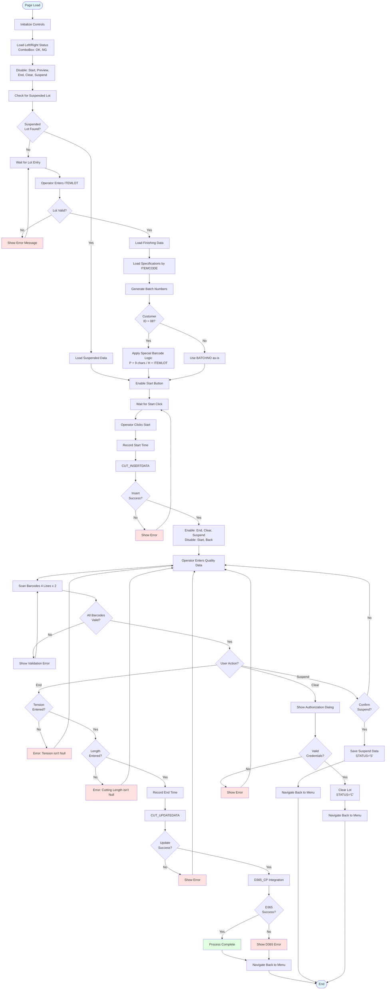

### 9.2 Barcode Validation Sequence Diagram

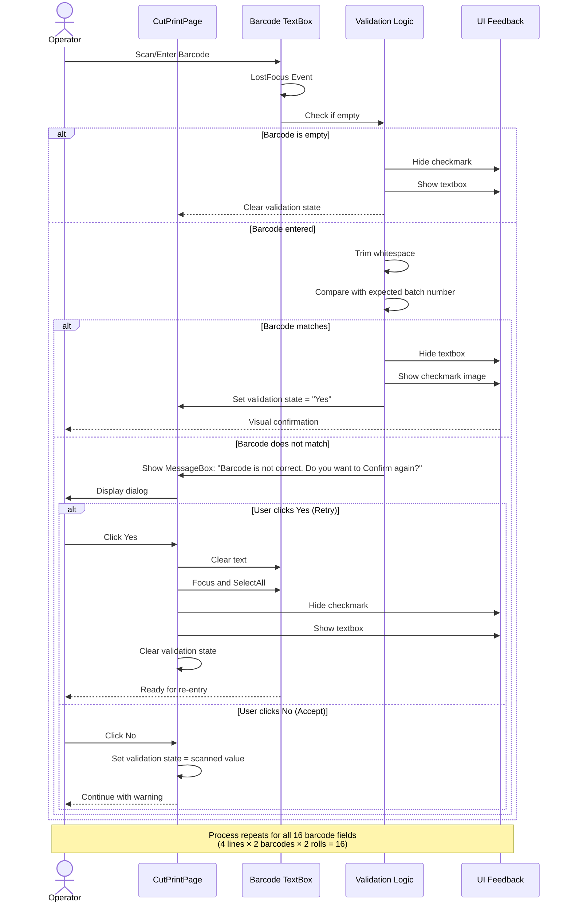

### 9.3 UI State Transition Diagram

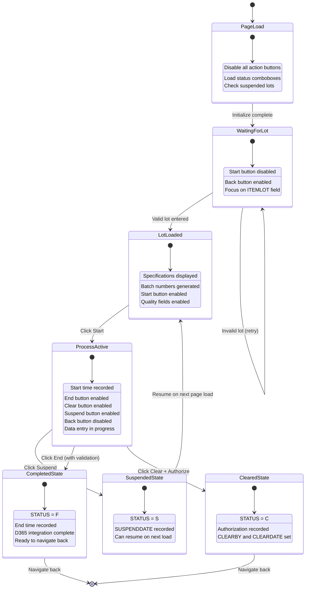

### 9.4 Validation Sequence Diagram

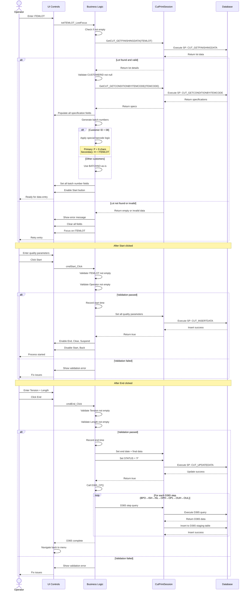

### 9.5 D365 Integration Sequence

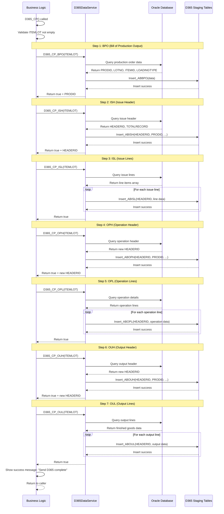

---

## 10. Critical Findings

### 10.1 Code Complexity Metrics

| Metric | Value | Assessment |
|--------|-------|------------|
| **Total Lines** | 6,525 | **CRITICAL** - Largest file in project |
| **Cyclomatic Complexity** | Very High | Extensive nesting, multiple decision points |
| **Method Count** | 100+ | Too many methods in single file |
| **Duplicate Code** | High | Barcode validation repeated 16 times |
| **D365 Integration** | 7 sequential steps | Single point of failure, no rollback |

### 10.2 Bugs and Issues

#### CRITICAL ISSUES

**1. D365 Integration Failure - No Rollback** (Lines 5981-6450)
```
Severity: CRITICAL
Impact: Partial data corruption in D365

If any D365 step fails after BPO succeeds:
├─ Production order created in D365 (ABBPO table)
├─ But issue/operation/output data missing
└─ Manual intervention required to fix D365 state

Recommendation: Implement transaction wrapper or compensating transactions
```

**2. Hardcoded Machine Number** (Line 127)
```xaml
<TextBox Name="txtPrintNo" Text="256" ... />

Severity: HIGH
Impact: Wrong machine tracking if used on different equipment

Recommendation: Load from machine configuration or user selection
```

**3. Decimal Parsing Without TryCatch** (Lines 4594-4644, 4786-4836)
```csharp
if (txtWIDTH1.Text != "")
    WIDTH1 = decimal.Parse(txtWIDTH1.Text);  // No try-catch

Severity: HIGH
Impact: Application crash if invalid decimal format

Recommendation: Use decimal.TryParse() with error handling
```

#### MAJOR ISSUES

**4. Customer ID "08" Hardcoded Logic** (Lines 4136-4303)
```csharp
if (items[0].CUSTOMERID == "08")
{
    // Special barcode manipulation
    batchNo = "P" + batch.Substring(0, 9);
    batchNo2nd = "H" + ITEMLOT.Substring(0, ITEMLOT.Length - 1);
}

Severity: MAJOR
Impact: Business logic tied to hardcoded customer ID

Recommendation: Move to configuration table or customer profile
```

**5. Massive Code Duplication - Barcode Validation** (Lines 1067-3750)
```
Similar logic repeated 16 times:
- txtBEGINLINE1-4_LostFocus
- txt2ndBEGINLINE1-4_LostFocus
- txtENDLINE1-4_LostFocus
- txt2ndENDLINE1-4_LostFocus

Severity: MAJOR
Impact: Maintenance nightmare, bug fixes must be applied 16 times

Recommendation: Extract to shared validation method with parameters
```

**6. String Concatenation for Barcode Generation** (Lines 4250-4300)
```csharp
if (batch.Length >= 9)
{
    batchNo = "P" + batch.Substring(0, 9);  // No length validation
}

Severity: MAJOR
Impact: IndexOutOfRangeException if batch length < 9

Recommendation: Validate length before substring
```

#### MODERATE ISSUES

**7. Magic Strings Throughout** (Lines 4367-4382, 4917, 5135)
```csharp
if (items[0].FINISHINGPROCESS == "Scouring")  // Magic string
_session.STATUS = "F";  // Magic string
_session.STATUS = "S";  // Magic string
_session.STATUS = "C";  // Magic string

Severity: MODERATE
Impact: Typos cause logic errors, hard to maintain

Recommendation: Use enums or constants
```

**8. Complex Navigation Flow** (Multiple KeyDown handlers)
```
54 KeyDown event handlers for tab order navigation
Lines 320-1063 - Manual focus management

Severity: MODERATE
Impact: Brittle, breaks if UI layout changes

Recommendation: Use TabIndex property or focus manager
```

**9. Authorization Process ID Hardcoded** (Line 275)
```csharp
string processId = "7";  // Hardcoded

Severity: MODERATE
Impact: Unclear what Process ID 7 represents

Recommendation: Use named constant: PROCESSID_CUT_PRINT_CLEAR = 7
```

**10. No Input Sanitization** (Lines 4544-4742)
```csharp
_session.REMARK = txtREMARK.Text;  // No sanitization
_session.LENGTHDETAIL = txtLengthDetail.Text;  // User input directly

Severity: MODERATE
Impact: Potential SQL injection if not handled in stored procedure

Recommendation: Sanitize/validate all user inputs
```

### 10.3 Performance Concerns

**1. Sequential D365 Calls** (Lines 5989-6038)
```
D365_CP() executes 7 sequential database calls
Total time: 7 × (network latency + DB query + insert)

Recommendation: Consider batch operations or async processing
```

**2. Multiple ComboBox Bindings** (Lines 3915-3935)
```csharp
cbStatusLeft.ItemsSource = new string[] { "OK", "NG" };
cbStatusRight.ItemsSource = new string[] { "OK", "NG" };

Minor issue: Created every page load
Recommendation: Create once in constructor
```

### 10.4 Security Concerns

**1. Authorization Bypass Potential** (Lines 5183-5220)
```csharp
if (_session.GetAuthorizeByProcessID(PROCESSID, USER, PASS) == true)
{
    // Clear lot
}

Concern: Password transmitted to database (unclear if hashed)
Recommendation: Verify password hashing in stored procedure
```

**2. No Audit Trail for Barcode Mismatches** (Lines 1150-1164)
```csharp
else
{
    BEGINLINE1 = beging;  // Wrong barcode accepted
    txtBEGINLINE1.Text = beging;
}

Concern: Operator can override barcode validation without logging
Recommendation: Log all overrides to audit table
```

### 10.5 Maintainability Issues

**1. File Size** (6,525 lines)
```
This single file is:
- 3× larger than typical page
- Contains business logic + UI logic + D365 integration + validation

Recommendation: Split into:
- CutPrintPage.xaml.cs (UI only)
- CutPrintBusinessLogic.cs (validation, workflow)
- CutPrintD365Integration.cs (D365 specific)
- BarcodeValidator.cs (shared barcode logic)
```

**2. Session God Object** (Lines 104, 4578-4716)
```csharp
_session has 50+ properties

Recommendation: Use DTOs for data transfer instead of session state
```

**3. Commented Code** (Lines 4138-4233, 1075-1136)
```
Extensive blocks of commented-out code

Recommendation: Remove dead code, use version control instead
```

### 10.6 Recommended Refactoring Priority

| Priority | Issue | Estimated Effort | Risk |
|----------|-------|------------------|------|
| 1 | D365 transaction safety | High (2 weeks) | Critical |
| 2 | Extract barcode validation | Medium (1 week) | Medium |
| 3 | Replace decimal.Parse | Low (2 days) | High |
| 4 | File size reduction | High (3 weeks) | Low |
| 5 | Remove hardcoded values | Medium (1 week) | Medium |
| 6 | Add input sanitization | Low (3 days) | Medium |
| 7 | Implement proper enums | Low (2 days) | Low |
| 8 | Remove dead code | Low (1 day) | Low |

---

## Document Metadata

**Generated**: 2025-10-09
**Analysis Version**: 1.0
**Files Analyzed**:
- CutPrintPage.xaml (1,320 lines)
- CutPrintPage.xaml.cs (6,525 lines)

**Total Lines Analyzed**: 7,845 lines

**Key Statistics**:
- Quality Parameters: 11 categories
- Barcode Fields: 16 (4 lines × 2 barcodes × 2 rolls)
- Button Controls: 6 action buttons
- D365 Integration Steps: 7 sequential operations
- Database Procedures: 12+
- State Variables: 30+
- Event Handlers: 80+

---

**END OF DOCUMENT**
