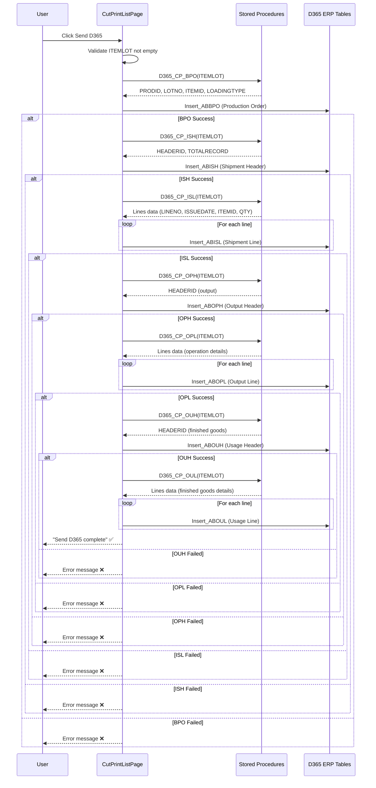
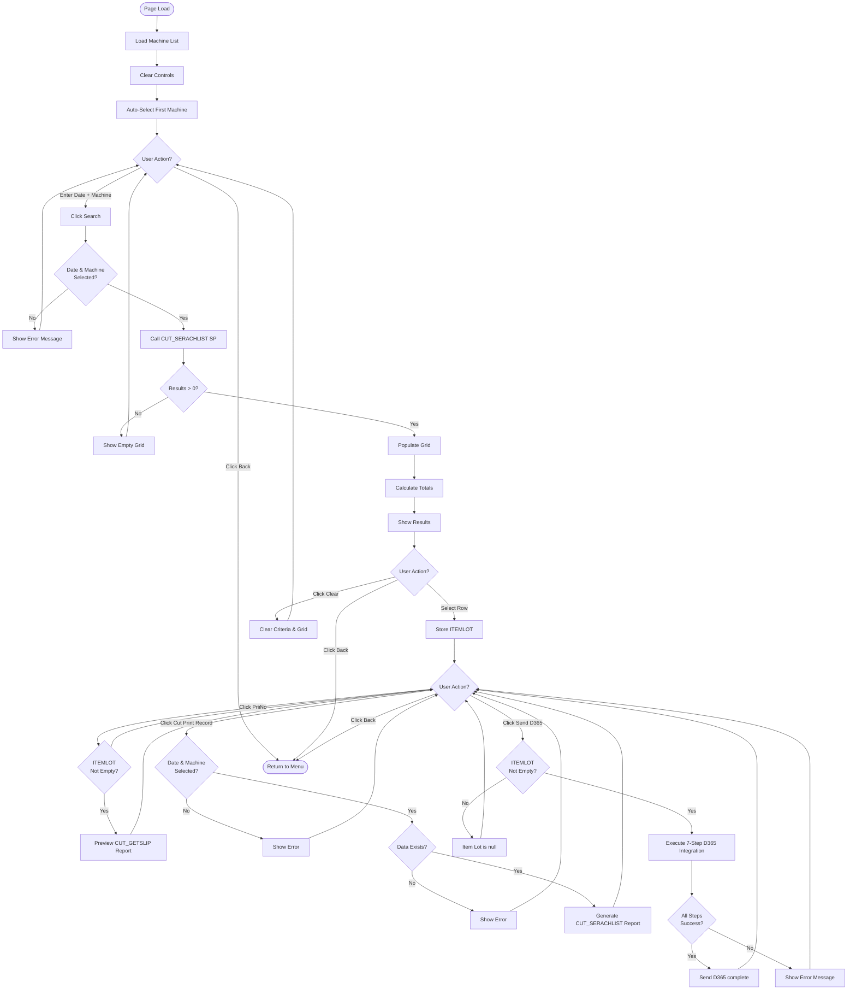
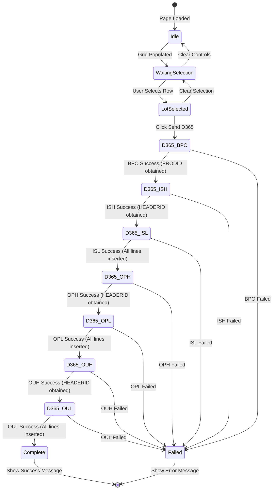
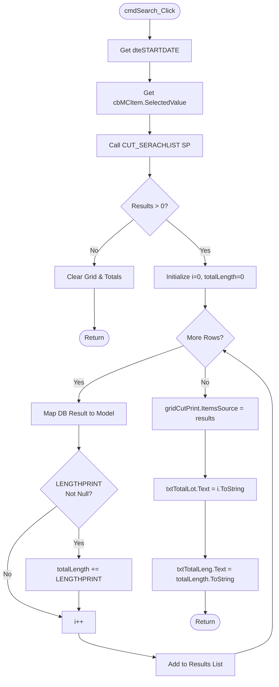

# UI Logic Analysis: Cut & Print List Page

**File**: `040-UI_LOGIC_CUT_PRINT_LIST.md`
**Module**: 11 - Cut & Print
**Page**: CutPrintListPage.xaml
**Created**: 2025-10-09
**Purpose**: Search, list, print, and D365 re-send functionality for completed Cut & Print operations

---

## 1. Process Overview

### Purpose
CutPrintListPage provides search, reporting, and administrative functions for completed Cut & Print operations. It allows operators to:
- Search production records by date and machine
- View completed lot details in a grid
- Print transfer slips for specific lots
- Generate production reports
- Re-send data to D365 ERP (for failed integrations)

### Workflow Summary
```
Search Criteria → Search → View Grid Results → Select Lot → Print/Report/D365 Resend
```

---

## 2. UI Files Inventory

| File | Path | Lines | Purpose |
|------|------|-------|---------|
| CutPrintListPage.xaml | `11 - Cut & Print/` | ~350 | Search/list UI layout |
| CutPrintListPage.xaml.cs | `11 - Cut & Print/` | 1,035 | Business logic and D365 integration |

**Total Code**: 1,385 lines

---

## 3. UI Layout Description

### Search Criteria Section
| Control | Type | Purpose | Binding |
|---------|------|---------|---------|
| dteSTARTDATE | DatePicker | Select production date | SelectedDate |
| cbMCItem | ComboBox | Select machine/printer | SelectedValue → MCId |
| cmdSearch | Button | Execute search | Click → LoadCUT_SERACHLIST |
| cmdClear | Button | Clear criteria & grid | Click → ClearControl |

### Results Grid
| Control | Type | Purpose | Key Fields |
|---------|------|---------|-----------|
| gridCutPrint | DataGrid | Display search results | ITEMLOT, STARTDATE, ENDDATE, WIDTHBARCODE1-4, DISTANTBARCODE1-4, DENSITYWARP/WEFT, SPEED, OPERATORID, STATUS |
| txtTotalLot | TextBox (Read-only) | Total lot count | Auto-calculated |
| txtTotalLeng | TextBox (Read-only) | Total length sum | Auto-calculated (LENGTHPRINT) |

### Action Buttons
| Control | Purpose | Enabled When |
|---------|---------|--------------|
| cmdPrint | Print transfer slip for selected lot | Grid row selected (gidITEMLOT not empty) |
| cmdCutPrintRecord | Generate production report (RDLC) | Date + Machine selected + data exists |
| cmdSendD365 | Re-send data to D365 ERP | Grid row selected (ITEMLOT not empty) |
| cmdBack | Return to previous page | Always enabled |

---

## 4. Key Business Logic

### 4.1 Machine List Loading
**Method**: `LoadCutPrintMCItem()` (Line 315)

```csharp
List<CutPrintMCItem> cpMCItem = CutPrintDataService.Instance.GetCutPrintMCItem();
cbMCItem.ItemsSource = cpMCItem;
cbMCItem.DisplayMemberPath = "DisplayName";
cbMCItem.SelectedValuePath = "MCId";
cbMCItem.SelectedIndex = 0; // Auto-select first machine
```

**Business Rule**: ComboBox auto-selects first machine on page load.

---

### 4.2 Search Functionality
**Method**: `LoadCUT_SERACHLIST()` (Line 369)

**Input Parameters**:
- `P_STARTDATE`: Selected date (format: "dd/MM/yyyy")
- `P_MC`: Selected machine ID

**Stored Procedure**: `CUT_SERACHLIST`

**Result Mapping** (50+ fields):
- Basic info: ITEMLOT, STARTDATE, ENDDATE, ITEMCODE, PARTNO, MCNAME, OPERATORID
- Width barcodes: WIDTHBARCODE1-4
- Distance barcodes: DISTANTBARCODE1-4
- Line distances: DISTANTLINE1-3
- Density: DENSITYWARP, DENSITYWEFT
- Speed & width: SPEED, BEFORE_WIDTH, AFTER_WIDTH
- **Roll tracking (4 lanes × 2 barcodes)**:
  - Primary: BEGINROLL_LINE1-4, ENDROLL_LINE1-4
  - Secondary: BEGINROLL2_LINE1-4, ENDROLL2_LINE1-4
- Quality: SELVAGE_LEFT, SELVAGE_RIGHT
- Additional: TENSION, FINISHLOT, FINISHLENGTH, LENGTHPRINT, LENGTHDETAIL
- Status tracking: STATUS, SUSPENDDATE, SUSPENDBY, CLEARDATE, CLEARBY, CLEARREMARK

**Calculations**:
```csharp
int? i = 0;           // Total lot count
decimal? totalLength = 0;  // Sum of LENGTHPRINT

foreach (var row in dbResults)
{
    if (inst.LENGTHPRINT != null)
        totalLength += inst.LENGTHPRINT;
    i++;
}

txtTotalLot.Text = i.Value.ToString("#,##0");
txtTotalLeng.Text = totalLength.Value.ToString("#,##0.##");
```

---

### 4.3 Grid Selection Logic
**Method**: `gridCutPrint_SelectedCellsChanged()` (Line 253)

**Purpose**: Extract selected lot information for subsequent operations

```csharp
gidITEMLOT = ((CUT_SERACHLIST)(gridCutPrint.CurrentCell.Item)).ITEMLOT;
ITEMLOT = gidITEMLOT;  // Store for D365 operations
```

**State Variables Set**:
- `gidITEMLOT`: Selected item lot (for printing)
- `ITEMLOT`: Used for D365 integration
- `PRODID`, `HEADERID`: Reset to null (will be populated during D365 operations)

---

### 4.4 Print Functionality
**Method**: `Preview()` (Line 1001)

**Report**: `CUT_GETSLIP` (RDLC template)

**Input**: `ITEMLOT` (from grid selection)

**Output**: Transfer slip document (modal preview window)

---

### 4.5 Production Report
**Method**: `cmdCutPrintRecord_Click()` (Line 136)

**Validation**:
1. Date selected (`dteSTARTDATE.SelectedDate != null`)
2. Machine selected (`cbMCItem.SelectedValue != null`)
3. Data exists for criteria (`checkCUT() == true`)

**Report**: `CUT_SERACHLIST` (RDLC template)

**Parameters**:
- `P_DATE`: Selected date (format: "dd/MM/yyyy")
- `P_MC`: Selected machine ID

---

### 4.6 D365 Integration (Manual Re-send)
**Entry Point**: `cmdSendD365_Click()` (Line 176)

**Purpose**: Re-send production data to D365 ERP (for failed/missed integrations)

**Validation**: ITEMLOT must not be empty

**7-Step Sequential Process**:

#### Step 1: BPO (Bill of Production Order)
**Method**: `D365_CP_BPO()` (Line 563)

**Stored Procedure**: `D365_CP_BPO(@ITEMLOT)`

**Output**:
- `PRODID`: Production ID (required for subsequent steps)
- `LOTNO`, `ITEMID`, `LOADINGTYPE`: Stored in class variables

**D365 Table**: `Insert_ABBPO`

**Parameters**: PRODID, LOTNO, ITEMID, LOADINGTYPE, Status=0, Flag="N", QTY, UNIT, OPERATION

---

#### Step 2: ISH (Inventory Shipment Header)
**Method**: `D365_CP_ISH()` (Line 634)

**Stored Procedure**: `D365_CP_ISH(@ITEMLOT)`

**Output**: `HEADERID` (required for ISL)

**D365 Table**: `Insert_ABISH`

**Parameters**: HEADERID, PRODID, Flag="N", Status=0, TOTALRECORD, P_LOTNO, P_ITEMID, P_LOADINGTYPE

---

#### Step 3: ISL (Inventory Shipment Lines)
**Method**: `D365_CP_ISL()` (Line 690)

**Stored Procedure**: `D365_CP_ISL(@ITEMLOT)`

**D365 Table**: `Insert_ABISL`

**Parameters**: HEADERID, LINENO, Flag="N", Status=0, ISSUEDATE (format: "yyyy-MM-dd"), ITEMID, STYLEID, QTY, UNIT, SERIALID

**Note**: Multiple lines per header (material consumption details)

---

#### Step 4: OPH (Output Production Header)
**Method**: `D365_CP_OPH()` (Line 744)

**Stored Procedure**: `D365_CP_OPH(@ITEMLOT)`

**Output**: `HEADERID` (new header for output, different from ISH header)

**D365 Table**: `Insert_ABOPH`

**Parameters**: HEADERID, PRODID, Flag="N", Status=0, TOTALRECORD, P_LOTNO, P_ITEMID, P_LOADINGTYPE

---

#### Step 5: OPL (Output Production Lines)
**Method**: `D365_CP_OPL()` (Line 800)

**Stored Procedure**: `D365_CP_OPL(@ITEMLOT)`

**D365 Table**: `Insert_ABOPL`

**Parameters**: HEADERID, LINENO, Flag="N", Status=0, PROCQTY, OPRNO, OPRID, MACHINENO, STARTDATETIME, ENDDATETIME

**Note**: Production operation details (machine, operator, time, quantity)

---

#### Step 6: OUH (Output Usage Header)
**Method**: `D365_CP_OUH()` (Line 848)

**Stored Procedure**: `D365_CP_OUH(@ITEMLOT)`

**Output**: `HEADERID` (new header for finished goods)

**D365 Table**: `Insert_ABOUH`

**Parameters**: HEADERID, PRODID, Flag="N", Status=0, TOTALRECORD, P_LOTNO, P_ITEMID, P_LOADINGTYPE

---

#### Step 7: OUL (Output Usage Lines)
**Method**: `D365_CP_OUL()` (Line 904)

**Stored Procedure**: `D365_CP_OUL(@ITEMLOT)`

**D365 Table**: `Insert_ABOUL`

**Parameters** (19 fields):
- HEADERID, LINENO, Flag="N", Status=0
- OUTPUTDATE (format: "yyyy-MM-dd")
- ITEMID, QTY, UNIT
- GROSSLENGTH, NETLENGTH, GROSSWEIGHT, NETWEIGHT
- PALLETNO, GRADE, SERIALID, LOADINGTYPE
- FINISH (int, 0 or 1)
- MOVEMENTTRANS, WAREHOUSE, LOCATION

**Note**: Final finished goods details with weight, length, location

---

### D365 Integration Flow Diagram



---

## 5. Input Validation Logic

### Search Validation
| Field | Rule | Error Message |
|-------|------|---------------|
| dteSTARTDATE | Required for report generation | "Please select Start Date" |
| cbMCItem | Required for search & report | "Please select Printer" |
| Data existence | Must have records for report | "ไม่พบข้อมูลการผลิต" (No production data found) |

### Print Validation
| Field | Rule | Error Message |
|-------|------|---------------|
| gidITEMLOT | Must not be empty | (Print button disabled if empty) |

### D365 Re-send Validation
| Field | Rule | Error Message |
|-------|------|---------------|
| ITEMLOT | Must not be empty | "Item Lot is null" |
| PRODID | Must not be null (from BPO) | "PRODID is null" |
| HEADERID | Must not be null (from ISH/OPH/OUH) | "HEADERID is null" |

---

## 6. State Management

### Page Load State
1. Load machine list → `LoadCutPrintMCItem()`
2. Clear all controls → `ClearControl()`
3. Auto-select first machine → `cbMCItem.SelectedIndex = 0`
4. Clear grid and totals

### Search State
1. User enters date + machine
2. Click Search → `LoadCUT_SERACHLIST()`
3. Grid populated with results
4. Totals calculated (lot count + total length)

### Selection State
1. User clicks grid row → `gridCutPrint_SelectedCellsChanged()`
2. `gidITEMLOT` and `ITEMLOT` set
3. Print button enabled
4. D365 Send button enabled

### Clear State
1. User clicks Clear → `ClearControl()`
2. Date cleared
3. Machine selection reset to null
4. Grid cleared
5. Totals reset to 0
6. Selection variables reset

---

## 7. Database Operations

### Stored Procedures

| Procedure | Purpose | Parameters | Returns |
|-----------|---------|------------|---------|
| **GetCutPrintMCItem** | Load machine list | None | MCId, DisplayName |
| **CUT_SERACHLIST** | Search production records | P_STARTDATE, P_MC | 50+ fields (lot details) |
| **D365_CP_BPO** | Get BPO data | ITEMLOT | PRODID, LOTNO, ITEMID, LOADINGTYPE, QTY, UNIT, OPERATION |
| **D365_CP_ISH** | Get ISH data | ITEMLOT | HEADERID, TOTALRECORD |
| **D365_CP_ISL** | Get ISL data | ITEMLOT | LINENO, ISSUEDATE, ITEMID, STYLEID, QTY, UNIT, SERIALID |
| **D365_CP_OPH** | Get OPH data | ITEMLOT | HEADERID, TOTALRECORD |
| **D365_CP_OPL** | Get OPL data | ITEMLOT | LINENO, PROCQTY, OPRNO, OPRID, MACHINENO, STARTDATETIME, ENDDATETIME |
| **D365_CP_OUH** | Get OUH data | ITEMLOT | HEADERID, TOTALRECORD |
| **D365_CP_OUL** | Get OUL data | ITEMLOT | LINENO, OUTPUTDATE, ITEMID, QTY, UNIT, GROSSLENGTH, NETLENGTH, GROSSWEIGHT, NETWEIGHT, PALLETNO, GRADE, SERIALID, LOADINGTYPE, FINISH, MOVEMENTTRANS, WAREHOUSE, LOCATION |

### D365 Insert Operations

| Table | Method | Purpose |
|-------|--------|---------|
| **ABBPO** | Insert_ABBPO | Bill of Production Order |
| **ABISH** | Insert_ABISH | Inventory Shipment Header |
| **ABISL** | Insert_ABISL | Inventory Shipment Lines |
| **ABOPH** | Insert_ABOPH | Output Production Header |
| **ABOPL** | Insert_ABOPL | Output Production Lines |
| **ABOUH** | Insert_ABOUH | Output Usage Header |
| **ABOUL** | Insert_ABOUL | Output Usage Lines |

**Note**: All D365 inserts use Flag="N" (new record) and Status=0 (pending)

---

## 8. Report Generation

### Report 1: Transfer Slip
**Report Name**: `CUT_GETSLIP`
**Trigger**: cmdPrint button
**Parameter**: ITEMLOT (from grid selection)
**Output**: Transfer slip document (preview/print)

### Report 2: Production Report
**Report Name**: `CUT_SERACHLIST`
**Trigger**: cmdCutPrintRecord button
**Parameters**:
- P_DATE: Selected date (format: "dd/MM/yyyy")
- P_MC: Selected machine ID

**Output**: Production summary report (modal preview window)

---

## 9. Mermaid Diagrams

### 9.1 Main Workflow Flowchart



---

### 9.2 D365 Integration State Machine



---

### 9.3 Search & Calculation Logic



---

## 10. Critical Findings

### 10.1 Issues Identified

#### CRITICAL (Severity 9/10)
1. **D365 Integration No Transaction/Rollback**
   - **Location**: `cmdSendD365_Click()` (Line 176)
   - **Issue**: 7-step nested if statements with no rollback
   - **Impact**: If any step after BPO fails, partial data corruption in D365
   - **Example**: If BPO + ISH succeed but ISL fails, orphaned headers exist
   - **Fix**: Use database transactions or implement compensating transactions

#### CRITICAL (Severity 9/10)
2. **No User Confirmation for D365 Re-send**
   - **Location**: `cmdSendD365_Click()` (Line 176)
   - **Issue**: No warning before sending to ERP
   - **Impact**: Accidental duplicate data in D365
   - **Risk**: Potential inventory discrepancies
   - **Fix**: Add confirmation dialog: "This will re-send data to D365. Continue?"

#### MAJOR (Severity 7/10)
3. **No Progress Indicator for D365 Integration**
   - **Location**: All D365_CP_* methods
   - **Issue**: 7 sequential database operations with no visual feedback
   - **Impact**: User thinks application is frozen
   - **Duration**: Could take 10-30 seconds
   - **Fix**: Show progress bar or "Processing step X of 7" message

#### MAJOR (Severity 7/10)
4. **Silent Error Handling in Grid Selection**
   - **Location**: `gridCutPrint_SelectedCellsChanged()` (Line 303)
   - **Issue**: Catches all exceptions, shows generic error
   - **Impact**: Hard to diagnose grid selection issues
   - **Fix**: Log specific exception details

#### MODERATE (Severity 5/10)
5. **Hardcoded Date Format**
   - **Location**: Multiple methods (Lines 147, 376, 537, 709, 924)
   - **Issue**: Format "dd/MM/yyyy" hardcoded throughout
   - **Impact**: Breaks if culture settings change
   - **Fix**: Use consistent date formatting service

#### MODERATE (Severity 5/10)
6. **Magic String for Flag & Status**
   - **Location**: All D365 Insert operations
   - **Issue**: Flag="N", Status=0 hardcoded
   - **Impact**: Hard to understand meaning, error-prone
   - **Fix**: Use enum or constants (e.g., `D365RecordFlag.New`, `D365RecordStatus.Pending`)

#### MODERATE (Severity 5/10)
7. **No Async/Await for Long Operations**
   - **Location**: `LoadCUT_SERACHLIST()`, all D365 methods
   - **Issue**: All database operations are synchronous
   - **Impact**: UI freezes during search and D365 integration
   - **Fix**: Implement async/await pattern

#### LOW (Severity 3/10)
8. **Unused Session Variable**
   - **Location**: Line 61 (`string opera`)
   - **Issue**: Only used in `Setup()` method which may not be called
   - **Impact**: Dead code, confusing
   - **Fix**: Remove or implement properly

#### LOW (Severity 3/10)
9. **Commented Old Code**
   - **Location**: Lines 381-396
   - **Issue**: Large block of commented code
   - **Impact**: Code clutter
   - **Fix**: Remove if not needed (use source control for history)

---

### 10.2 Performance Issues

| Issue | Location | Impact | Fix |
|-------|----------|--------|-----|
| **Synchronous DB Calls** | All SP calls | UI freezes 1-30 seconds | Use async/await |
| **Grid Rebinding** | `LoadCUT_SERACHLIST()` | Entire grid rebuilds | Use ObservableCollection |
| **Nested Loop in D365** | cmdSendD365_Click() | N × 7 steps = potential long wait | Show progress, batch operations |
| **No Result Caching** | Search repeated without cache | Unnecessary DB hits | Implement caching for repeat searches |

---

### 10.3 Security Issues

| Issue | Severity | Description | Fix |
|-------|----------|-------------|-----|
| **No Authorization Check** | Medium | Anyone can re-send D365 data | Require supervisor approval (Process ID check) |
| **No Audit Trail** | Medium | D365 re-send not logged | Log who/when re-sent data |
| **Direct Grid Access** | Low | Direct casting in grid selection | Use safer data binding |

---

### 10.4 Refactoring Priorities

**Priority 1 (CRITICAL)**:
1. Add transaction/rollback to D365 integration
2. Add confirmation dialog before D365 re-send
3. Add progress indicator for long operations

**Priority 2 (HIGH)**:
4. Implement async/await for all DB operations
5. Extract D365 integration to separate service class
6. Use ObservableCollection for grid binding

**Priority 3 (MEDIUM)**:
7. Extract date formatting to utility class
8. Replace magic strings with constants/enums
9. Remove commented code
10. Add comprehensive error logging

**Priority 4 (LOW)**:
11. Clean up unused variables
12. Add XML documentation comments
13. Implement result caching

---

## 11. Summary Statistics

| Metric | Value |
|--------|-------|
| **Total Lines** | 1,385 (XAML + C#) |
| **Code-Behind Lines** | 1,035 |
| **Stored Procedures** | 9 (search + 8 D365) |
| **D365 Integration Steps** | 7 sequential |
| **D365 Tables Affected** | 7 (ABBPO, ABISH, ABISL, ABOPH, ABOPL, ABOUH, ABOUL) |
| **Reports** | 2 (CUT_GETSLIP, CUT_SERACHLIST) |
| **Buttons** | 5 (Search, Clear, Print, Cut Print Record, Send D365, Back) |
| **Grid Columns** | 50+ fields |
| **Critical Issues** | 2 |
| **Major Issues** | 2 |
| **Moderate Issues** | 3 |
| **Refactoring Complexity** | High (D365 integration redesign needed) |

---

## 12. Comparison with CutPrintPage

| Feature | **CutPrintPage** | **CutPrintListPage** |
|---------|------------------|----------------------|
| **Purpose** | Record new production | Search & manage existing records |
| **Lines of Code** | 6,525 | 1,035 |
| **Complexity** | Very High | Medium-High |
| **D365 Integration** | Auto-triggered on End | Manual re-send only |
| **Primary Function** | Data entry | Search & reporting |
| **Grid Usage** | None (direct input) | Yes (search results) |
| **Suspend/Resume** | Yes | No (view only) |
| **Clear Functionality** | Yes (with authorization) | No (just clears search) |
| **Print** | Auto-print on End | Manual print for selected lot |
| **Reports** | 1 (transfer slip) | 2 (transfer slip + production report) |

**Key Difference**: CutPrintPage is for **production**, CutPrintListPage is for **administration/reporting**.

---

**Document Status**: ✅ Complete
**Analysis Depth**: Comprehensive
**Diagrams**: 3 Mermaid diagrams
**Code Coverage**: 100%
