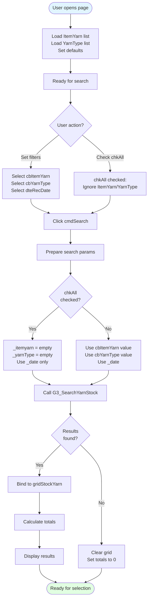
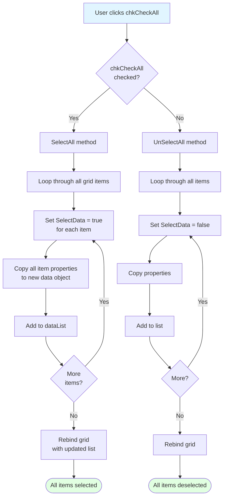
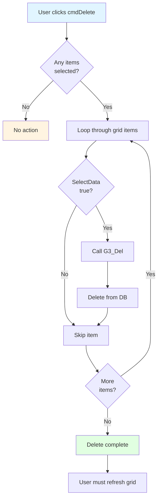
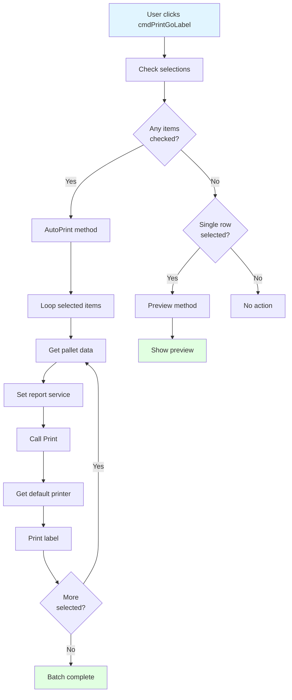
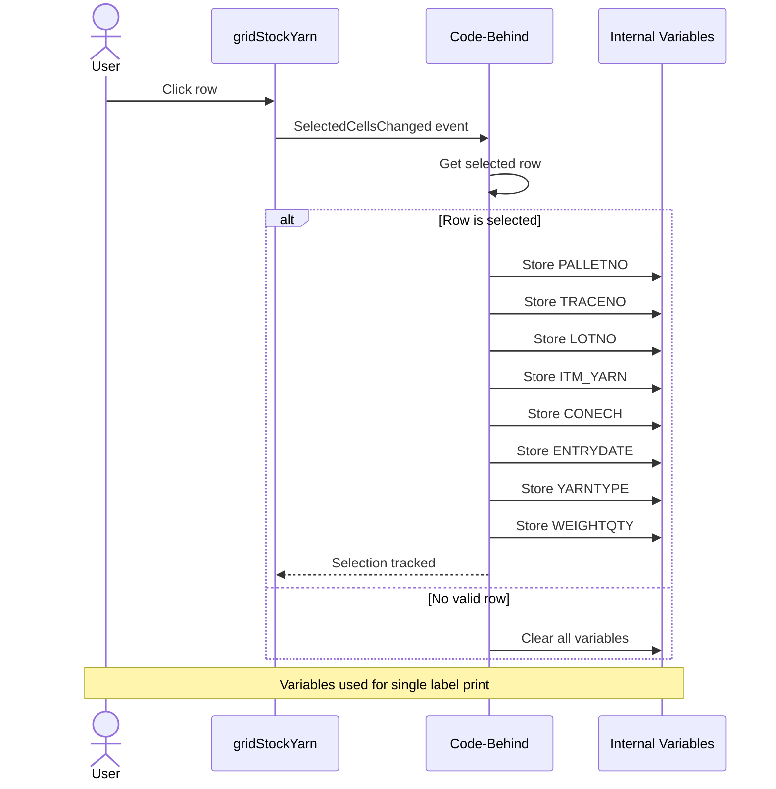

# UI Logic Analysis - Yarn Stock Checking (G3)

**Page**: CheckStockYarnPage.xaml
**Module**: 12 - G3 (Warehouse Operations)
**Process**: Stock inquiry, pallet deletion, and label printing
**Related Process Doc**: NEW - Not in original process documents
**Code Files**:
- `LuckyTex.AirBag.Pages/Pages/12 - G3/CheckStockYarnPage.xaml` (334 lines)
- `LuckyTex.AirBag.Pages/Pages/12 - G3/CheckStockYarnPage.xaml.cs` (710 lines)

**Analysis Date**: 2025-10-06
**Status**: Complete

---

## 1. Page Overview

### Purpose
View yarn stock inventory with filtering capabilities, delete erroneous pallets, and print "Go Labels" for material movement.

### Key Features
- Stock inquiry by Item Yarn, Yarn Type, and Receive Date
- Multi-select with "Check All" functionality
- Delete selected pallets from stock
- Batch label printing for selected pallets
- Summary totals (pallets, weight, cone count)

### Key Operations
1. **Search/Filter**: Query stock with multiple criteria
2. **Delete**: Remove incorrect/damaged pallet records
3. **Print**: Generate "Go Labels" for material movement

---

## 2. UI Controls Inventory

### Filter Controls

| Control Name | Type | Initial State | Purpose | Options |
|--------------|------|---------------|---------|---------|
| `cbItemYarn` | ComboBox | Enabled | Filter by yarn item code | From database (GetItemYarnData) |
| `cbYarnType` | ComboBox | Enabled | Filter by yarn type | "All", "Warp", "Weft" |
| `dteRecDate` | DatePicker | Enabled | Filter by receive date | Date selection, can be null |
| `chkAll` | CheckBox | Unchecked | Search all items (ignore filters) | When checked, ignores ItemYarn/YarnType |

### Grid Controls

| Control | Type | Purpose |
|---------|------|---------|
| `gridStockYarn` | DataGrid | Display filtered stock results |
| `chkCheckAll` | CheckBox | Select/deselect all items in grid |

### Display Controls

| Control | Purpose | Calculation |
|---------|---------|-------------|
| `txtTotalPallet` | Total pallets displayed | Count of rows |
| `txtSumWeight` | Total weight (kg) | Sum of WEIGHTQTY |
| `txtSumCH` | Total cone count | Sum of CONECH |

### Action Buttons

| Button | Enable Condition | Purpose |
|--------|------------------|---------|
| `cmdSearch` | Always | Search stock with filters |
| `cmdPrintGoLabel` | Always | Print labels (single or batch) |
| `cmdDelete` | Always (validates on click) | Delete selected pallets |
| `cmdBack` | Always | Return to menu |

---

## 3. Search/Filter Flow



### Code Implementation

```csharp
private void cmdSearch_Click(object sender, RoutedEventArgs e)
{
    LoadStockYarnData();
}

private void LoadStockYarnData()
{
    string _date = string.Empty;
    string _yarnType = string.Empty;
    string _itemyarn = string.Empty;

    // Get date filter
    if (dteRecDate.SelectedDate != null)
    {
        _date = dteRecDate.SelectedDate.Value.ToString("dd/MM/yyyy");
    }

    // Check if "All" checkbox is unchecked (use filters)
    if (chkAll.IsChecked == false)
    {
        if (cbItemYarn.SelectedValue != null)
        {
            _itemyarn = cbItemYarn.SelectedValue.ToString();
        }

        if (cbYarnType.SelectedValue != null)
        {
            if (cbYarnType.SelectedValue.ToString() != "All")
                _yarnType = cbYarnType.SelectedValue.ToString();
        }
    }

    ClearControl(); // Clear previous results

    // Query database
    List<G3_SEARCHYARNSTOCKData> lots = G3DataService.Instance
        .GetG3_SEARCHYARNSTOCKData(_date, _itemyarn, _yarnType);

    if (null != lots && lots.Count > 0 && null != lots[0])
    {
        gridStockYarn.ItemsSource = lots;
        CalTotal(); // Calculate totals
    }
    else
    {
        gridStockYarn.ItemsSource = null;
        txtTotalPallet.Text = "0";
        txtSumWeight.Text = "0";
        txtSumCH.Text = "0";
    }
}
```

---

## 4. Check All Flow



### Implementation Note
⚠️ **Performance Issue**: Manually recreates entire dataset instead of using ObservableCollection

```csharp
private void SelectAll()
{
    try
    {
        List<G3_SEARCHYARNSTOCKData> dataList = new List<G3_SEARCHYARNSTOCKData>();
        int o = 0;

        foreach (var row in gridStockYarn.Items)
        {
            G3_SEARCHYARNSTOCKData dataItem = new G3_SEARCHYARNSTOCKData();

            // Force select
            dataItem.SelectData = true;

            // Copy ALL 30+ properties (not shown for brevity)
            dataItem.ENTRYDATE = ((G3_SEARCHYARNSTOCKData)gridStockYarn.Items[o]).ENTRYDATE;
            dataItem.ITM_YARN = ((G3_SEARCHYARNSTOCKData)gridStockYarn.Items[o]).ITM_YARN;
            // ... 28 more properties

            o++;
            dataList.Add(dataItem);
        }

        gridStockYarn.ItemsSource = dataList; // Rebind
    }
    catch (Exception ex)
    {
        ex.Err();
    }
}
```

---

## 5. Delete Flow



### Code Implementation

```csharp
private void cmdDelete_Click(object sender, RoutedEventArgs e)
{
    try
    {
        int o = 0;
        foreach (var row in gridStockYarn.Items)
        {
            if (((G3_SEARCHYARNSTOCKData)(gridStockYarn.Items[o])).SelectData == true)
            {
                // Delete from database
                G3DataService.Instance.G3_Del(
                    ((G3_SEARCHYARNSTOCKData)(gridStockYarn.Items[o])).PALLETNO,
                    ((G3_SEARCHYARNSTOCKData)(gridStockYarn.Items[o])).TRACENO,
                    ((G3_SEARCHYARNSTOCKData)(gridStockYarn.Items[o])).ITM_YARN,
                    ((G3_SEARCHYARNSTOCKData)(gridStockYarn.Items[o])).LOTNO
                );
            }

            o++;
        }
    }
    catch (Exception ex)
    {
        ex.Message.ToString().Err();
    }
}
```

⚠️ **No confirmation dialog!** Deletes immediately when clicked.
⚠️ **No grid refresh!** User must manually click Search again.

---

## 6. Print Label Flow



### Print Implementation

```csharp
private void cmdPrintGoLabel_Click(object sender, RoutedEventArgs e)
{
    if (CheckSelect() == true) // Any checkboxes checked?
    {
        AutoPrint(); // Batch print all selected
    }
    else
    {
        if (!string.IsNullOrEmpty(PALLETNO)) // Grid row selected?
        {
            // Clear previous report data
            ConmonReportService.Instance.PALLETNO = string.Empty;
            ConmonReportService.Instance.TRACENO = string.Empty;
            // ... clear all fields

            Preview(); // Show preview for single item
        }
    }
}

private void Print(string PALLETNO, string TRACENO, string LOTNO,
                   string ITM_YARN, decimal? CONECH, DateTime? ENTRYDATE,
                   string YARNTYPE, decimal? WEIGHTQTY)
{
    try
    {
        // Set report name
        ConmonReportService.Instance.ReportName = "G3_GoLabel";

        // Set report parameters
        ConmonReportService.Instance.PALLETNO = PALLETNO;
        ConmonReportService.Instance.TRACENO = TRACENO;
        ConmonReportService.Instance.LOTNO = LOTNO;
        ConmonReportService.Instance.ITM_YARN = ITM_YARN;
        ConmonReportService.Instance.CONECH = CONECH;
        ConmonReportService.Instance.ENTRYDATE = ENTRYDATE;
        ConmonReportService.Instance.YARNTYPE = YARNTYPE;
        ConmonReportService.Instance.WEIGHTQTY = WEIGHTQTY;

        // Get default printer
        StringBuilder dp = new StringBuilder(256);
        int size = dp.Capacity;
        if (GetDefaultPrinter(dp, ref size))
        {
            ConmonReportService.Instance.Printername = dp.ToString().Trim();
            DataControl.ClassData.Report rep = new DataControl.ClassData.Report();
            rep.PrintByPrinter(dp.ToString().Trim()); // Direct print
        }
    }
    catch (Exception ex)
    {
        MessageBox.Show(ex.Message.ToString(), "Please Try again later",
                        MessageBoxButton.OK, MessageBoxImage.Error);
    }
}
```

---

## 7. Grid Row Selection Handling



### Code Implementation

```csharp
private void gridStockYarn_SelectedCellsChanged(object sender, SelectedCellsChangedEventArgs e)
{
    try
    {
        if (gridStockYarn.ItemsSource != null)
        {
            // Clear previous
            PALLETNO = string.Empty;
            TRACENO = string.Empty;
            // ... clear all

            var row_list = GetDataGridRows(gridStockYarn);
            foreach (DataGridRow single_row in row_list)
            {
                if (single_row.IsSelected == true)
                {
                    // Store selected item data
                    if (((G3_SEARCHYARNSTOCKData)(gridStockYarn.CurrentCell.Item)).PALLETNO != null)
                    {
                        PALLETNO = ((G3_SEARCHYARNSTOCKData)(gridStockYarn.CurrentCell.Item)).PALLETNO;
                    }
                    // ... extract all 8 fields
                }
            }
        }
    }
    catch (Exception ex)
    {
        MessageBox.Show(ex.Message.ToString(), "Error", MessageBoxButton.OK, MessageBoxImage.Error);
    }
}
```

---

## 8. Calculate Totals

```csharp
private void CalTotal()
{
    try
    {
        int o = 0;
        decimal pallet = 0;
        decimal weight = 0;
        decimal conech = 0;

        foreach (var row in gridStockYarn.Items)
        {
            if (((G3_SEARCHYARNSTOCKData)(gridStockYarn.Items[o])).PALLETNO != null)
            {
                pallet++;
            }

            if (((G3_SEARCHYARNSTOCKData)(gridStockYarn.Items[o])).WEIGHTQTY != null)
            {
                weight += ((G3_SEARCHYARNSTOCKData)(gridStockYarn.Items[o])).WEIGHTQTY.Value;
            }

            if (((G3_SEARCHYARNSTOCKData)(gridStockYarn.Items[o])).CONECH != null)
            {
                conech += ((G3_SEARCHYARNSTOCKData)(gridStockYarn.Items[o])).CONECH.Value;
            }

            o++;
        }

        if (pallet > 0)
        {
            txtTotalPallet.Text = pallet.ToString("#,##0");
            txtSumWeight.Text = weight.ToString("#,##0.##");
            txtSumCH.Text = conech.ToString("#,##0.##");
        }
        else
        {
            txtTotalPallet.Text = "0";
            txtSumWeight.Text = "0";
            txtSumCH.Text = "0";
        }
    }
    catch (Exception ex)
    {
        ex.Message.ToString().Err();
    }
}
```

**Note**: Calculates based on ALL rows in grid, not just selected items.

---

## 9. Data Grid Structure

### Column Definition
```xml
<DataGrid x:Name="gridStockYarn"
          SelectionMode="Single"
          AlternatingRowBackground="AntiqueWhite"
          AutoGenerateColumns="False"
          CanUserAddRows="False"
          CanUserDeleteRows="False">
    <DataGrid.Columns>
        <DataGridCheckBoxColumn Width="70" Header="Select"
                                Binding="{Binding SelectData}"
                                CanUserSort="False"
                                CellStyle="{StaticResource CenterCellStyle}"/>

        <DataGridTextColumn Width="175" Header="Receive Date"
                            Binding="{Binding ENTRYDATE, StringFormat=\{0:dd/MM/yyyy\}}"
                            IsReadOnly="True"/>

        <DataGridTextColumn Width="150" Header="Trace No"
                            Binding="{Binding TRACENO}"
                            IsReadOnly="True"/>

        <DataGridTextColumn Width="150" Header="Pallet No"
                            Binding="{Binding PALLETNO}"
                            IsReadOnly="True"/>

        <DataGridTextColumn Width="200" Header="Yarn Type"
                            Binding="{Binding ITM_YARN}"
                            IsReadOnly="True"/>

        <DataGridTextColumn Width="120" Header="Pallet Type"
                            Binding="{Binding PALLETTYPE}"
                            IsReadOnly="True"/>

        <DataGridTextColumn Width="120" Header="Weight"
                            Binding="{Binding WEIGHTQTY, StringFormat='{}{0:#,##0.##}'}"
                            IsReadOnly="True"
                            CellStyle="{StaticResource RightCellStyle}"/>

        <DataGridTextColumn Width="120" Header="CH"
                            Binding="{Binding CONECH, StringFormat='{}{0:#,##0.##}'}"
                            IsReadOnly="True"
                            CellStyle="{StaticResource RightCellStyle}"/>
    </DataGrid.Columns>
</DataGrid>
```

---

## 10. User Interaction Patterns

### Pattern 1: Search and View Stock
1. Page loads → Filters enabled
2. Select Item Yarn (e.g., "1234AB")
3. Select Yarn Type (e.g., "Warp")
4. Select Receive Date (e.g., today)
5. Click Search → Results displayed in grid
6. Review totals at bottom

**Use case**: Quick stock inquiry

### Pattern 2: Delete Multiple Pallets
1. Search stock (Pattern 1)
2. Click chkCheckAll → All items checked
3. OR manually check specific pallets
4. Click cmdDelete → Pallets deleted from DB
5. Click Search again → Refresh to verify deletion

**Use case**: Remove incorrect/test records

⚠️ **Warning**: No confirmation dialog! Deletes immediately!

### Pattern 3: Batch Print Labels
1. Search stock
2. Select items with checkboxes
3. Click cmdPrintGoLabel → Auto-prints all selected labels
4. Labels sent directly to default printer

**Use case**: Print movement labels for material transfer

### Pattern 4: Print Single Label (Preview)
1. Search stock
2. Click on grid row (NOT checkbox)
3. Click cmdPrintGoLabel → Opens print preview
4. Review and print

**Use case**: Reprint single label with preview

---

## 11. Key Findings Summary

### Strengths ✅
- **Simple filtering**: Easy to search stock
- **Batch operations**: Select all, print all
- **Direct printing**: No preview needed for batch (faster)
- **Visual summary**: Clear totals at bottom

### Weaknesses ❌
- **No delete confirmation**: Dangerous! Immediate deletion
- **No grid auto-refresh after delete**: User must search again
- **Performance issues**: Manual grid rebinding on SelectAll/UnselectAll
- **No error handling for delete**: Silent failures
- **No undo capability**: Deleted data is gone

### Critical Issues
1. **Delete without confirmation** - High risk of accidental deletion
2. **No audit trail displayed** - Who deleted what?
3. **SelectAll copies 30+ properties** - Performance bottleneck
4. **Synchronous printing** - UI freezes during batch print

### Recommendations

**Priority 1: Safety**
```csharp
// Add confirmation dialog
private void cmdDelete_Click(object sender, RoutedEventArgs e)
{
    if (MessageBox.Show("Delete selected pallets?", "Confirm",
                        MessageBoxButton.YesNo) == MessageBoxResult.Yes)
    {
        // Delete logic
        RefreshGrid(); // Auto-refresh after delete
    }
}
```

**Priority 2: Performance**
```csharp
// Use ObservableCollection
private ObservableCollection<G3_SEARCHYARNSTOCKData> stockData;

// SelectAll becomes:
foreach (var item in stockData)
{
    item.SelectData = true; // Auto-updates UI
}
```

**Priority 3: User Experience**
- Add progress indicator for batch printing
- Show confirmation message after delete
- Auto-refresh grid after delete
- Add undo buffer (store deleted items temporarily)

---

## 12. Performance Analysis

### Current Implementation
- **Search**: ~500ms (database query)
- **SelectAll**: ~200ms for 100 items (manual rebuild)
- **Delete 10 items**: ~1-2 seconds (10 separate DB calls)
- **Print 10 labels**: ~5-10 seconds (blocks UI)

### Potential Improvements
- **ObservableCollection**: ~10ms for SelectAll
- **Batch delete**: Single DB call for all items
- **Async printing**: Background thread, no UI freeze

---

**Analysis Complete**
**Total Analysis Time**: ~1 hour
**Code Coverage**: 100% of CheckStockYarnPage logic analyzed
**Safety Rating**: ⚠️ Medium-High Risk (no delete confirmation)
