# UI Logic Analysis: Edit Issue Raw Material Page

**File**: `LuckyTex.AirBag.Pages/Pages/12 - G3/EditIssueRawMaterialPage.xaml`
**Code-Behind**: `EditIssueRawMaterialPage.xaml.cs` (1150 lines)
**Module**: 12 - G3 (Warehouse)
**Purpose**: Edit existing issue requests - add pallets, delete pallets, cancel entire requests, print reports
**Created**: 2025-10-06
**Complexity**: High

---

## 1. Page Overview

### Business Purpose
Allows warehouse operators to modify existing yarn issue requests by:
- Adding additional pallets to an existing request
- Removing pallets from a request
- Canceling entire requests
- Printing issue request reports

This is a companion to `IssueRawMaterialPage` - while that page creates NEW issue requests, this page EDITS existing ones.

### Key Features
1. **Request Number Lookup**: Enter existing request number to load details
2. **Dual Grid Display**:
   - Top grid: Pallets already in the request (read-only)
   - Bottom grid: Available stock pallets to add
3. **Pallet Addition**: Scan pallet numbers to add to request
4. **Pallet Deletion**: Remove specific pallets from request
5. **Request Cancellation**: Cancel entire issue request
6. **Report Printing**: Print issue request document
7. **AS400 Integration**: Syncs additions to AS400 ERP system

---

## 2. UI Controls Inventory

### Input Controls

| Control Name | Type | Purpose | Enabled State |
|--------------|------|---------|---------------|
| `txtRequestNo` | TextBox | Enter existing request number | Always enabled |
| `txtItemYarn` | TextBox | Display yarn type (auto-filled) | Disabled (display only) |
| `txtPalletNo` | TextBox | Scan pallet number to add | Enabled after request loaded |
| `dteIssueDate` | DatePicker | Issue date | Disabled (display only) |
| `cbIssueTo` | ComboBox | Issue destination (Warp AB/Weft AB/Warp AD/Weft AD) | Disabled (display only) |
| `txtOperator` | TextBox | Operator name | Disabled (display only) |

### Grid Controls

| Control Name | Bound To | Purpose |
|--------------|----------|---------|
| `gridPalletDetail` | `G3_GETREQUESTNODETAIL` | Existing pallets in request (9 columns) |
| `gridEditPalletDetail` | `G3_SEARCHYARNSTOCKData` | Available stock pallets (9 columns) |

**gridPalletDetail Columns**:
1. Pallet No
2. Trace No
3. Lot No
4. Item Type
5. Yarn Type
6. Weight
7. CH
8. Pallet Type
9. Receive Date

**gridEditPalletDetail Columns**: Same structure + `SelectData` checkbox (visual only, set by pallet scan)

### Action Buttons

| Button | Purpose | Validation |
|--------|---------|------------|
| `cmdPrint` | Print report | Requires P_REQUESTNO not empty |
| `cmdCancelRequest` | Cancel entire request | Requires P_REQUESTNO + confirmation |
| `cmdDeletePallet` | Delete selected pallet | Requires P_PALLETNO + confirmation |
| `cmdAdd` | Add selected pallets | Requires CheckEdit() == true |
| `cmdBack` | Return to previous page | None |

---

## 3. Data Flow Architecture

### Service Dependencies

```
EditIssueRawMaterialPage
├── G3DataService (Singleton)
│   ├── G3_GETREQUESTNODETAIL(requestNo) → List<G3_GETREQUESTNODETAIL>
│   ├── GetG3_SEARCHYARNSTOCKData(date, item, type) → List<G3_SEARCHYARNSTOCKData>
│   ├── G3_CANCELREQUESTNO(requestNo, operator) → bool
│   └── G3_INSERTUPDATEISSUEYARN(...) → bool
├── BCSPRFTPDataService (AS400 Integration)
│   ├── InsertDataBCSPRFTP(...) → bool
│   └── chkConAS400(conStr) → bool
├── ConmonReportService (Singleton)
│   ├── ReportName = "IssueRawMaterial"
│   └── REQUESTNO = string
└── ConfigManager (Singleton)
    └── AS400Config → string
```

### State Variables

```csharp
// Request context (populated from grid selection)
string P_REQUESTNO = string.Empty;
string P_PALLETNO = string.Empty;
string P_TRACENO = string.Empty;
decimal? P_CH = null;
decimal? P_WEIGHT = null;
DateTime? P_ISSUEDATE = null;
string P_PALLETTYPE = string.Empty;
string P_ISSUETO = string.Empty;

// Session context
string opera = string.Empty;  // Operator login ID
string strConAS400 = string.Empty;  // AS400 connection string
bool chkStatusAS400 = true;  // AS400 connectivity status
```

---

## 4. User Interaction Workflow

### Workflow Diagram


---

## 5. Input Validation Logic

### Request Number Entry (txtRequestNo_KeyDown)


**Validation Rules**:
- ❌ Empty Request No → Ignored
- ✅ Valid Request No → Loads data, focuses pallet input
- ❌ Invalid Request No → Shows error, clears field

### Pallet Number Entry (txtPalletNo_KeyDown)


**Validation Rules**:
- ❌ No Request loaded → Show error, focus Request No
- ❌ Empty Pallet No → Ignored
- ✅ Valid Pallet No → Searches in bottom grid, marks as selected

### Pallet Selection Marking (CheckPalletNo Method)

```csharp
private void CheckPalletNo(string PalletNo)
{
    // Key Logic:
    // 1. Loop through all items in gridEditPalletDetail
    // 2. If PalletNo matches item.PALLETNO:
    //    - Set SelectData = true (visual highlight)
    //    - Set chkData = true (found flag)
    // 3. Rebuild entire list with new SelectData values
    // 4. Rebind grid (manual rebinding, not ObservableCollection)
    // 5. If chkData == false → Show "No Data Found"
}
```

**Critical Issue**: ⚠️ Manual grid rebinding (performance bottleneck)

---

## 6. Grid Selection Logic

### Top Grid Selection (gridPalletDetail_SelectedCellsChanged)


**Purpose**: Stores selected pallet details for Delete operation

### Bottom Grid Row Coloring (gridEditPalletDetail_LoadingRow)

```csharp
private void gridEditPalletDetail_LoadingRow(DataGridRowEventArgs e)
{
    if (item.SelectData == true)
        e.Row.Foreground = Red;  // Selected pallets in RED
    else
        e.Row.Foreground = Black; // Others in BLACK
}
```

**Visual Feedback**: Selected pallets (via scan or manual selection) appear in **red text**

---

## 7. Business Operations

### 7.1 Add Pallets to Request (Edit Method)

```mermaid
sequenceDiagram
    participant User
    participant UI as EditPage
    participant Val as Validator
    participant Svc as G3DataService
    participant AS400 as BCSPRFTPDataService
    participant DB as Oracle Database

    User->>UI: Click cmdAdd
    UI->>Val: CheckEdit() - any selected?
    Val-->>UI: bool result

    alt No selection
        UI->>User: Silent return
    else Has selection
        UI->>UI: Validate Request + Date not null

        alt Validation fails
            UI->>User: Show error message
        else Validation OK
            UI->>UI: Map cbIssueTo to code
            Note right of UI: Warp AB → SB<br/>Weft AB → SA<br/>Warp AD → SD<br/>Weft AD → SC

            loop For each selected pallet
                UI->>Svc: G3_INSERTUPDATEISSUEYARN(...)
                Svc->>DB: Insert/Update record
                DB-->>Svc: Success

                alt AS400 connected
                    Svc->>AS400: SendAS400(pallet data)
                    AS400->>AS400: Convert KG to Pounds
                    AS400->>AS400: Format dates (YYYYMMDD, YYYYMMDDHHMM)
                    AS400->>AS400: InsertDataBCSPRFTP(...)

                    alt AS400 insert fails
                        AS400-->>UI: Error: Can't Insert Data SA400
                        UI->>UI: Set chkSave = false
                    end
                end
            end

            alt All saved
                UI->>User: Show 'Pallet have been Add'
                UI->>Svc: G3_GETREQUESTNODETAIL(refresh)
                Svc-->>UI: Updated data
                UI->>UI: Clear pallet input
                UI->>UI: Reset date/IssueTo
                UI->>UI: Focus txtPalletNo
            else Save failed
                UI->>User: Show error
            end
        end
    end
```



**IssueTo Mapping** (Lines 787-794):
```csharp
// UI Display → Database Code
"Warp AB" → "SB"
"Weft AB" → "SA"
"Warp AD" → "SD"
"Weft AD" → "SC"
```

**AS400 Conversion Logic**:
- Weight (KG) → Pounds (multiply by 2.2046, round to 2 decimals)
- Issue Date → Format: YYYYMMDD
- Send DateTime → Format: YYYYMMDDHHMM

### 7.2 Delete Pallet (cmdDeletePallet_Click)


**Confirmation Dialog**: ✅ "Do you want to Cancel this Pallet from Request No?"

### 7.3 Cancel Request (cmdCancelRequest_Click)


**Confirmation Dialog**: ✅ "Do you want to Cancel this Request No?"

### 7.4 Print Report (cmdPrint_Click)


---

## 8. State Transition Diagram


---

## 9. Error Handling

### User-Facing Errors

| Error Message | Trigger | Action |
|---------------|---------|--------|
| "No data found for this Request No" | Invalid request number entered | Clear field, focus txtRequestNo |
| "Request No is not null" | Scan pallet without loading request | Focus txtRequestNo |
| "No Data Found" | Scanned pallet not in stock | Clear txtPalletNo, allow retry |
| "Please select Request No" | Print/Cancel without request loaded | Stay on page |
| "Please select Pallet No" | Delete without selecting pallet | Stay on page |
| "Request No isn't Null" | Add without request loaded | Focus txtRequestNo |
| "Issue Date isn't Null" | Add without date selected | Focus dteIssueDate |
| "Can't Cancel Request Please check data" | Database error on cancel | Stay on page |
| "Can't Insert Data SA400" | AS400 sync failure | Continue (local save succeeded) |

### Exception Handling

```csharp
// Pattern used throughout:
try
{
    // Business logic
}
catch (Exception ex)
{
    ex.Message.ToString().Err();  // NLib extension method
    return false;
}
```

**Note**: All exceptions logged via NLib `.Err()` extension method

---

## 10. Database Operations

### Stored Procedures Called

#### G3_GETREQUESTNODETAIL(REQUESTNO)
```sql
-- Returns all pallets for given request number
-- Returns: List<G3_GETREQUESTNODETAIL>
-- Used for: Loading existing request data
```

**Return Columns**:
- REQUESTNO, PALLETNO, TRACENO, LOTNO
- ITM_YARN, YARNTYPE, WEIGHT, CH
- PALLETTYPE, ENTRYDATE, ISSUEDATE, ISSUETO

#### GetG3_SEARCHYARNSTOCKData(P_RECDATE, P_ITMYARN, P_YARNTYPE)
```sql
-- Returns available stock matching filters
-- Returns: List<G3_SEARCHYARNSTOCKData>
-- Used for: Bottom grid - pallets available to add
```

**Filters**:
- `P_RECDATE`: Receive date (empty = all dates)
- `P_ITMYARN`: Item Yarn (from request)
- `P_YARNTYPE`: Yarn Type (from request)

#### G3_CANCELREQUESTNO(REQUESTNO, OPERATOR)
```sql
-- Cancels entire issue request
-- Returns: bool
-- Used for: Cancel Request button
```

#### G3_INSERTUPDATEISSUEYARN(params...)
```sql
-- Inserts new pallet into request OR deletes pallet from request
-- Parameters:
--   REQUESTNO, PALLETNO, TRACENO, CH, WEIGHT,
--   ISSUEDATE, OPERATOR, PALLETTYPE, ISSUETO
-- Returns: bool
-- Used for: Add pallet, Delete pallet
```

**Dual Purpose**:
- Called with full data → Adds pallet to request
- Called for deletion → Removes pallet from request (logic in SP)

### AS400 Integration Table

#### BCSPRFTP (AS400 Table)
```sql
-- ERP integration table for material movements
-- Inserted via BCSPRFTPDataService.InsertDataBCSPRFTP()
```

**Key Fields**:
- FLAGS = "R" (Receive)
- RECTY = "S" (Stock)
- CDSTO = "3N" (Storage code)
- USRNM = "PGMR"
- DTTRA = Issue date (int, YYYYMMDD)
- DTINP = Input date (int, YYYYMMDD)
- CDEL0 = Pallet number
- CDCON = Pallet number (duplicate)
- BLELE = Weight (kg)
- CDUM0 = "KG"
- CDKE1 = ITM400 (item code)
- CDLOT = Lot number
- CDTRA = Issue To code (SA/SB/SC/SD)
- REFER = Request Number
- LOCAT = "GD" (Location)
- CDQUA = "1" (Quality)
- TECU1 = Pounds (converted)
- TECU2 = Pounds (duplicate)
- TECU3 = CH
- TECU4 = Weight (kg)
- TECU6 = Trace number
- DTORA = Send datetime (int64, YYYYMMDDHHMM)

---

## 11. Performance Considerations

### Issues Identified

1. **Manual Grid Rebinding** (Line 711)
   ```csharp
   gridEditPalletDetail.ItemsSource = dataList;
   ```
   - **Problem**: Rebuilds entire list on every pallet scan
   - **Impact**: Performance degradation with many pallets
   - **Recommendation**: Use ObservableCollection

2. **No Async Operations**
   - All database calls are synchronous
   - **Impact**: UI freezes during database operations
   - **Recommendation**: Use async/await pattern

3. **Grid Row Iteration Pattern** (Line 658-709)
   ```csharp
   foreach (var row in gridEditPalletDetail.Items)
   {
       // Manual property copying for every row
   }
   ```
   - **Problem**: Copies all 30+ properties for every row
   - **Impact**: O(n) complexity per scan
   - **Recommendation**: Toggle SelectData property only

4. **Synchronous AS400 Calls**
   - SendAS400() called inside loop (Line 818)
   - **Impact**: Network latency blocks UI
   - **Recommendation**: Batch AS400 calls or use background worker

---

## 12. Code Quality Issues

### Anti-Patterns Identified

1. **Magic Strings**
   ```csharp
   if (cbIssueTo.SelectedValue.ToString() == "Warp AB")  // No constants
   ```

2. **Commented-Out Code** (Lines 477-486, 776-785)
   ```csharp
   #region Old
   // Old code kept for reference but not deleted
   #endregion
   ```

3. **Empty Catch Blocks** (Line 373-376)
   ```csharp
   catch
   {
       // Silent failure in LoadingRow event
   }
   ```

4. **Nullable Chaos**
   ```csharp
   if (((G3_GETREQUESTNODETAIL)(gridPalletDetail.CurrentCell.Item)).REQUESTNO != null)
   ```
   - Long, nested null checks repeated 8 times

5. **No Input Sanitization**
   - `txtPalletNo.Text` used directly without trimming

---

## 13. Security Considerations

### Issues

1. **Hardcoded Username**
   ```csharp
   USRNM = "PGMR";  // Line 957 - hardcoded AS400 user
   ```

2. **Connection String in Config**
   ```csharp
   strConAS400 = ConfigManager.Instance.AS400Config;
   ```
   - Should use secure storage (not plain text config)

3. **No Authorization Checks**
   - Any operator can cancel any request
   - No role-based access control

4. **SQL Injection Risk** (Mitigated)
   - Uses stored procedures (safe)
   - But no parameter validation before SP calls

---

## 14. UI/UX Issues

### Usability Problems

1. **Confusing Field Disabling**
   - `dteIssueDate` and `cbIssueTo` are disabled (display only)
   - But no visual indication they're from the original request
   - **Recommendation**: Use labels instead of disabled textboxes

2. **No Undo for Add**
   - After clicking Add, must use Delete to undo
   - **Recommendation**: Add confirmation dialog

3. **Silent Failures**
   - CheckPalletNo returns void, shows MessageBox on failure
   - Add returns void, no success confirmation
   - **Recommendation**: Use status bar or toast notifications

4. **Inconsistent Messaging**
   - "Request No is not null" → Confusing (means "must not be null")
   - "Please select Request No" vs "Please select Pallet No"
   - **Recommendation**: Standardize message format

5. **No Loading Indicators**
   - Database calls have no visual feedback
   - **Recommendation**: Show spinner during operations

---

## 15. Testing Scenarios

### Test Cases

| Test Case | Input | Expected Output | Notes |
|-----------|-------|-----------------|-------|
| TC-01: Load valid request | Request No = REQ-001 | Grids populate, fields fill | Happy path |
| TC-02: Load invalid request | Request No = XXX-999 | Error message, clear field | Error handling |
| TC-03: Scan valid pallet | Pallet No = P001 | Row marked red, SelectData = true | Visual feedback |
| TC-04: Scan invalid pallet | Pallet No = XXX | "No Data Found" | Error handling |
| TC-05: Add without request | Click Add (no request) | Silent return | Validation |
| TC-06: Add without selection | Click Add (no pallets selected) | Silent return | Validation |
| TC-07: Add with selection | Select pallets, click Add | Database insert, AS400 sync | Happy path |
| TC-08: Delete without selection | Click Delete (no pallet) | "Please select Pallet No" | Validation |
| TC-09: Delete with selection | Select pallet, click Delete | Confirmation → Delete | Happy path |
| TC-10: Cancel request | Click Cancel Request | Confirmation → Cancel → Clear | Happy path |
| TC-11: Print report | Click Print | Preview dialog opens | Happy path |
| TC-12: AS400 failure | Add pallet (AS400 down) | Local save succeeds, error message | Resilience |
| TC-13: Scan duplicate pallet | Scan same pallet twice | Both scans mark selected | Duplicate handling |
| TC-14: Delete last pallet | Delete only pallet | Grids clear, return to initial | Edge case |

### Edge Cases

1. **Empty Request**: Request exists but has no pallets
2. **Empty Stock**: No available pallets matching filters
3. **Partial AS400 Failure**: Some pallets sync, others fail
4. **Concurrent Edits**: Another user cancels request while editing
5. **Network Timeout**: AS400 connection drops mid-operation

---

## 16. Recommendations for Refactoring

### Priority 1 (Critical)

1. **Replace Manual Grid Rebinding**
   ```csharp
   // Current:
   gridEditPalletDetail.ItemsSource = dataList;

   // Recommended:
   ObservableCollection<G3_SEARCHYARNSTOCKData> stockItems;
   // Update SelectData in place, auto-updates UI
   ```

2. **Add Async/Await**
   ```csharp
   private async Task<bool> G3_GETREQUESTNODETAIL(string REQUESTNO)
   {
       return await Task.Run(() => G3DataService.Instance.G3_GETREQUESTNODETAIL(REQUESTNO));
   }
   ```

3. **Add Confirmation for Add**
   ```csharp
   if (MessageBox.Show("Add selected pallets?", "Confirm", ...))
   ```

### Priority 2 (Important)

4. **Extract IssueTo Mapping to Constant**
   ```csharp
   private static readonly Dictionary<string, string> IssueToMapping = new()
   {
       { "Warp AB", "SB" }, { "Weft AB", "SA" },
       { "Warp AD", "SD" }, { "Weft AD", "SC" }
   };
   ```

5. **Simplify Null Checks**
   ```csharp
   // Current: 8 nested if statements
   // Use LINQ + null propagation
   var selected = gridPalletDetail.CurrentCell?.Item as G3_GETREQUESTNODETAIL;
   if (selected != null) { /* ... */ }
   ```

6. **Remove Commented Code**
   - Delete `#region Old` blocks (lines 477-486, 776-785)

### Priority 3 (Nice to Have)

7. **Add Loading Indicator**
8. **Standardize Error Messages**
9. **Add Role-Based Authorization**
10. **Extract AS400 Logic to Separate Service**

---

## 17. Key Findings Summary

### Strengths ✅
- Comprehensive edit capabilities (add/delete/cancel)
- Confirmation dialogs for destructive operations
- AS400 integration with resilience (continues on failure)
- Dual grid design for clear separation of concerns
- Proper grid selection state management

### Weaknesses ❌
- Manual grid rebinding (performance issue)
- No async operations (UI freezes)
- Silent failures in Add operation
- Confusing disabled fields (UX issue)
- No authorization checks
- Hardcoded AS400 username
- Empty catch blocks

### Critical Business Logic 🔥
- **IssueTo Mapping**: Warp AB→SB, Weft AB→SA, Warp AD→SD, Weft AD→SC
- **AS400 Sync**: KG → Pounds (×2.2046), dates formatted as YYYYMMDD
- **Dual Purpose SP**: G3_INSERTUPDATEISSUEYARN used for both add and delete

---

**Document Version**: 1.0
**Lines Analyzed**: 1150 (code-behind) + 175 (XAML)
**Analysis Date**: 2025-10-06
**Complexity Score**: 8/10 (High)
**Code Quality Score**: 5/10 (Needs Improvement)
