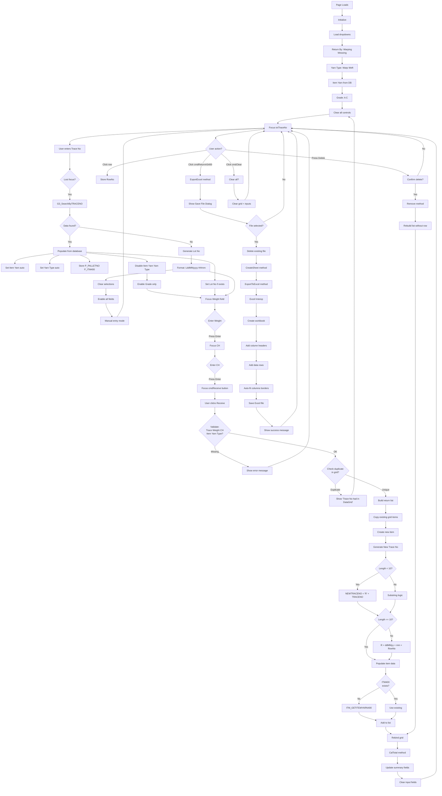
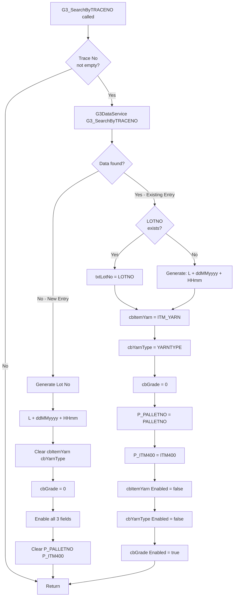
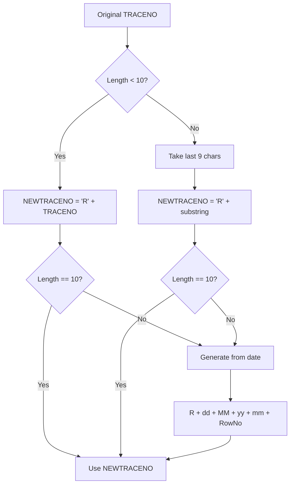
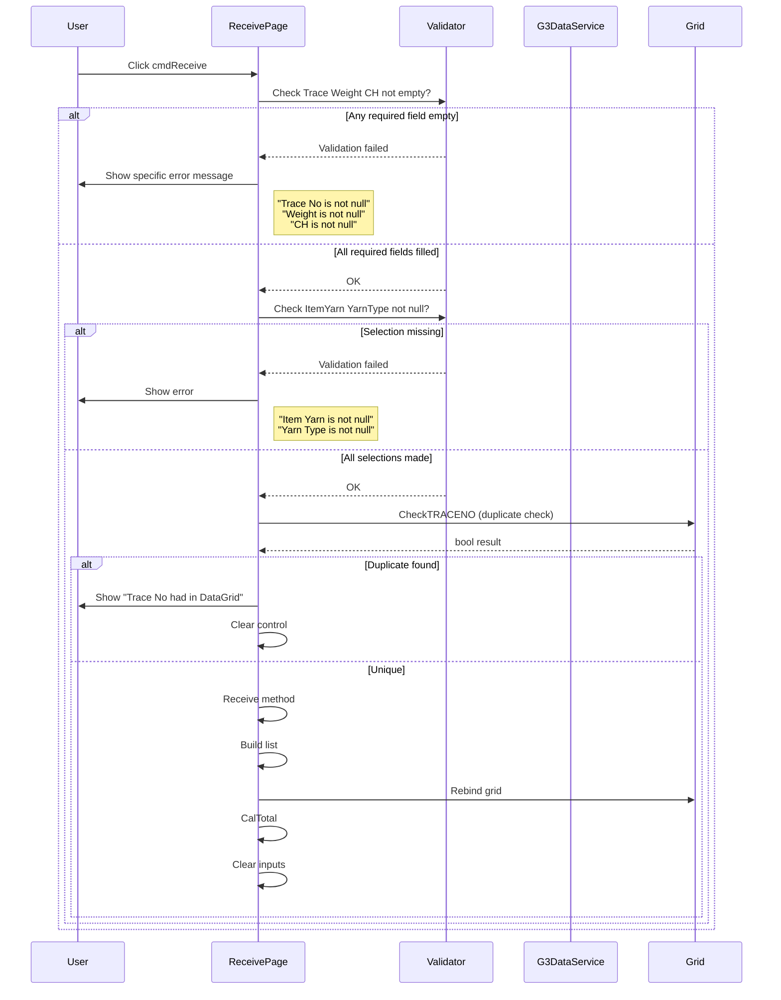
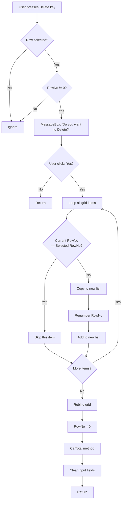
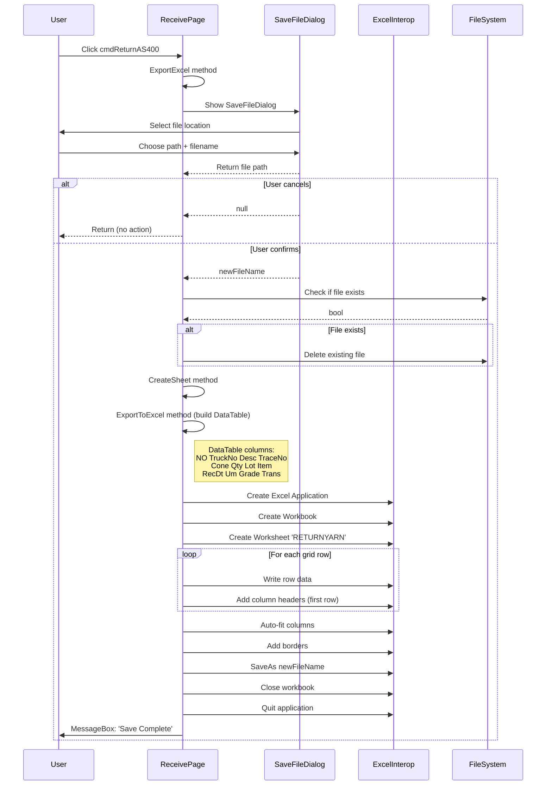
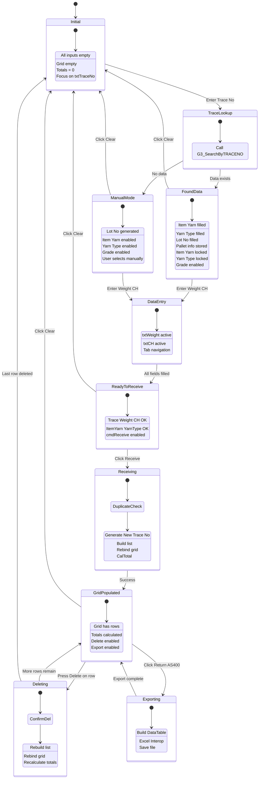
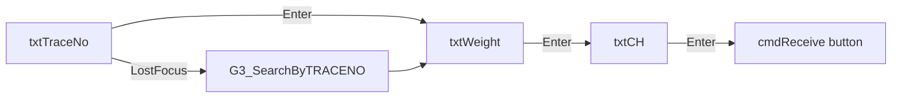

# UI Logic Analysis: Receive Return Material Page

**File**: `LuckyTex.AirBag.Pages/Pages/12 - G3/ReceiveReturnMaterialPage.xaml`
**Code-Behind**: `ReceiveReturnMaterialPage.xaml.cs` (1242 lines)
**Module**: 12 - G3 (Warehouse)
**Purpose**: Receive returned yarn from production departments (Warping/Weaving) that was previously issued
**Created**: 2025-10-06
**Complexity**: High

---

## 1. Page Overview

### Business Purpose
Handles the reverse flow of yarn materials:
1. Yarn is initially issued to production (via IssueRawMaterialPage)
2. Production uses some yarn but may return unused/defective material
3. This page receives returned material back into warehouse inventory
4. Generates new trace numbers for returned items (prefixed with "R")
5. Exports data to Excel for AS400 upload

### Key Features
1. **Trace Number Lookup**: Scan original trace number to retrieve original pallet data
2. **Batch Receiving**: Build up list of returned pallets before final processing
3. **New Trace Number Generation**: Auto-generates "R" prefixed trace number
4. **Lot Number Auto-Generation**: Creates lot numbers if not found
5. **Grade Selection**: Assign grade (A or C) to returned material
6. **Total Calculations**: Auto-calculates Total Pallets, Sum Weight, Sum CH
7. **Excel Export**: Export return data to Excel template for AS400 upload
8. **Delete Row**: Remove items from return list (before saving)

---

## 2. UI Controls Inventory

### Input Controls

| Control Name | Type | Purpose | Enabled State | Max Length |
|--------------|------|---------|---------------|------------|
| `txtTraceNo` | TextBox | Scan original trace number | Always enabled | 10 chars |
| `dteReceiveDate` | DatePicker | Return receive date | Always enabled | - |
| `cbReturnBy` | ComboBox | Department returning (Warping/Weaving) | Always enabled | - |
| `txtWeight` | TextBox | Return weight (kg) | Always enabled | Numeric only |
| `txtCH` | TextBox | Return CH (cone count) | Always enabled | Numeric only |
| `txtOperator` | TextBox | Operator name | Disabled (display only) | - |
| `cbItemYarn` | ComboBox | Item yarn type | **Conditional** (see logic) | - |
| `cbYarnType` | ComboBox | Yarn type (Warp/Weft) | **Conditional** (see logic) | - |
| `txtLotNo` | TextBox | Lot number | Disabled (auto-filled) | - |
| `cbGrade` | ComboBox | Grade (A/C) | **Conditional** (see logic) | - |

**Conditional Enable Logic**:
- If Trace No **FOUND** in database → cbItemYarn, cbYarnType, cbGrade all **ENABLED = false** (read-only)
- If Trace No **NOT FOUND** → All three **ENABLED = true** (manual entry)

### Grid Control

| Control Name | Bound To | Purpose | Row Delete |
|--------------|----------|---------|------------|
| `gridPalletDetail` | `G3_INSERTRETURNYARN` | Received return items (12 columns) | **Delete key** |

**Grid Columns**:
1. Trace No (original)
2. Lot No
3. Item Yarn
4. Pallet No
5. Item 400 (ERP item code)
6. Yarn Type
7. Weight
8. CH
9. **New Trace No** (auto-generated with "R" prefix)
10. Grade
11. Receive Date
12. Return By

### Action Buttons

| Button | Purpose | Validation |
|--------|---------|------------|
| `cmdReceive` | Add to return list | Requires Trace No + Weight + CH + ItemYarn + YarnType |
| `cmdClear` | Clear all inputs and grid | None |
| `cmdReturnAS400` | Export to Excel | Requires grid data |
| `cmdBack` | Return to previous page | None |

### Summary Displays (Read-Only)

| Control | Displays | Format |
|---------|----------|--------|
| `txtTotalPallet` | Count of pallets in grid | "#,##0" |
| `txtSumWeight` | Sum of all weights | "#,##0.##" |
| `txtSumCH` | Sum of all CH | "#,##0.##" |

---

## 3. Data Flow Architecture

### Service Dependencies

```
ReceiveReturnMaterialPage
├── G3DataService (Singleton)
│   ├── GetItemYarnData() → List<ItemYarnItem>
│   ├── G3_SearchByTRACENO(traceNo) → G3_SEARCHBYPALLETNOSearchData
│   ├── ITM_GETITEMYARN400(itemYarn) → string (ITM400 code)
│   ├── G3_INSERTRETURNYARN(...) → bool (commented out in current code)
│   └── (Excel export instead of database save)
└── Microsoft.Office.Interop.Excel
    └── Export to ReturnAS400.xls template
```

**CRITICAL FINDING**: ⚠️ Database save (`ReturnAS400()`) is **COMMENTED OUT** (line 272)
Current implementation only exports to Excel - no database persistence!

### State Variables

```csharp
// Grid data list
List<ItemYarnItem> instList = null;  // Item yarn dropdown data

// Connectivity (commented out - not used)
string strConAS400 = string.Empty;
bool chkStatusAS400 = true;

// Session context
string opera = string.Empty;  // Operator login ID
int? RowNo = null;  // Selected grid row number

// Pallet context (from trace lookup)
string P_PALLETNO = string.Empty;
string P_ITM400 = string.Empty;  // AS400 item code
string P_TRACENO = string.Empty;
```

---

## 4. User Interaction Workflow

### Main Workflow Diagram



---

## 5. Trace Number Lookup Logic

### G3_SEARCHBYTRACENO Method



**Lot Number Format**:
```csharp
// Pattern: L + ddMMyyyy + HHmm
// Example: L0610202514  30
// L = Literal "L"
// 06 = Day
// 10 = Month
// 2025 = Year
// 14 = Hour
// 30 = Minute
```

**Business Rule**:
- If Trace No **exists** → Auto-fill data, lock Item/YarnType, enable Grade only
- If Trace No **NOT exists** → Manual entry mode, enable all fields

---

## 6. New Trace Number Generation Logic

### Algorithm (Lines 545-569)



**Examples**:
```csharp
// Case 1: Short trace (< 10 chars)
TRACENO = "ABC123"
NEWTRACENO = "RABC123"  (7 chars)
→ Fallback: "R" + "06" + "10" + "25" + "30" + "1" = "R0610253 01"

// Case 2: Exactly 10 chars
TRACENO = "1234567890"
NEWTRACENO = "R123456789" (10 chars) ✅

// Case 3: More than 10 chars
TRACENO = "ABCDEFGHIJK" (11 chars)
Substring: last 9 = "CDEFGHIJK"
NEWTRACENO = "RCDEFGHIJK" (10 chars) ✅
```

**Validation**: NEWTRACENO **MUST** be exactly 10 characters

---

## 7. Input Validation Logic

### Receive Button Validation



**Validation Error Messages**:
| Message | Trigger |
|---------|---------|
| "Trace No is not null" | Empty txtTraceNo |
| "Weight is not null" | Empty txtWeight |
| "CH is not null" | Empty txtCH |
| "Item Yarn is not null" | No cbItemYarn selection |
| "Yarn Type is not null" | No cbYarnType selection |
| "Trace No had in DataGrid" | Duplicate TRACENO in grid |

**Note**: All messages say "is not null" but mean "**must not be null**" (confusing wording)

---

## 8. Grid Management Logic

### Delete Row (Remove Method)



**Confirmation**: ✅ Shows "Do you want to Delete?" before removing

### Total Calculation (CalTotal Method)

```csharp
private void CalTotal()
{
    int pallet = 0;
    decimal weight = 0;
    decimal conech = 0;

    // Loop all grid items
    foreach (item in gridPalletDetail.Items)
    {
        if (item.PALLETNO != null) pallet++;
        if (item.WEIGHT != null) weight += item.WEIGHT.Value;
        if (item.CH != null) conech += item.CH.Value;
    }

    // Update summary fields
    txtTotalPallet.Text = pallet.ToString("#,##0");
    txtSumWeight.Text = weight.ToString("#,##0.##");
    txtSumCH.Text = conech.ToString("#,##0.##");
}
```

**Recalculated After**:
- Adding new item (Receive)
- Deleting item (Remove)

---

## 9. Excel Export Logic

### Export to AS400 Excel Template



**Excel Column Mapping**:
| Excel Column | Source | Notes |
|--------------|--------|-------|
| NO | RowNo | Row number |
| TruckNo | (empty) | Not used |
| Desc | (empty) | Not used |
| TraceNo | NEWTRACENO | **New** trace number (with R prefix) |
| Cone | CH | Cone count |
| Qty | WEIGHT | Quantity in KG |
| Lot | LOTNO | Lot number |
| Item | ITM400 | AS400 item code |
| RecDt | RECEIVEDATE | Receive date |
| Um | "KG" | Unit of measure (hardcoded) |
| Grade | GRADE | A or C |
| Trans | "GR" | Transaction type (hardcoded) |

**Template File**: `ReturnAS400.xls` (in application directory)

---

## 10. State Transition Diagram



---

## 11. Critical Findings and Issues

### 🔥 CRITICAL: Database Save Disabled

**Line 272**:
```csharp
private void cmdReturnAS400_Click(object sender, RoutedEventArgs e)
{
    ExportExcel();
    //ReturnAS400();  // ❌ COMMENTED OUT!
}
```

**Impact**:
- Data is **NOT saved to database**
- Only exported to Excel
- `ReturnAS400()` method (lines 800-873) includes:
  - Database insert via `G3_INSERTRETURNYARN`
  - AS400 sync via `SendAS400`
  - All commented out / not called

**Business Risk**:
- Excel file must be manually imported to AS400
- No local database record of returns
- No traceability in MES system

### ⚠️ Performance Issues

1. **Manual Grid Rebinding** (Lines 629, 700)
   ```csharp
   gridPalletDetail.ItemsSource = dataList;  // Full rebuild
   ```
   - Should use ObservableCollection

2. **Grid Item Iteration Pattern**
   - Copies all properties manually for every row
   - Lines 517-530 (Receive method)
   - Lines 660-692 (Remove method)

3. **No Async Operations**
   - Database calls are synchronous (if enabled)
   - Excel export is synchronous (blocks UI)

### ⚠️ Code Quality Issues

1. **Complex Trace Number Logic**
   - Lines 545-569
   - Multiple try-catch blocks
   - Fallback to date-based generation
   - **No unit tests** for this critical logic

2. **Magic Strings Everywhere**
   ```csharp
   if (cbReturnBy.SelectedValue.ToString() == "Warping")  // No constants
   ```

3. **Confusing Error Messages**
   ```csharp
   "Trace No is not null".ShowMessageBox();  // Means "must not be null"
   ```

4. **Empty Catch Blocks**
   - Lines 565, 599, 609
   - Silent failures in numeric parsing

5. **Commented Out Code**
   - Lines 93-94, 98 (AS400 config)
   - Line 272 (ReturnAS400 call)
   - Lines 1019-1021 (Excel formatting)

### ⚠️ Security Issues

1. **No Input Sanitization**
   - txtTraceNo used directly without trimming/validation

2. **Hardcoded Credentials** (if AS400 enabled)
   ```csharp
   USRNM = "PGMR";  // Line 1161
   ```

3. **No Authorization Check**
   - Any operator can receive returns from any department

4. **Excel Interop Risks**
   - No COM object cleanup (potential memory leaks)
   - Finally block cleans up but incomplete

---

## 12. Input Field Navigation Flow

### Tab/Enter Key Flow



**Numeric Input Validation**:
```csharp
private void Common_PreviewKeyDown(object sender, KeyEventArgs e)
{
    e.Handled = !this.IsNumericInput(e);  // Block non-numeric keys
}
```

**Applied To**:
- txtWeight
- txtCH
- txtLotNo (though disabled)

---

## 13. Testing Scenarios

### Test Cases

| Test Case | Input | Expected Output | Notes |
|-----------|-------|-----------------|-------|
| TC-01: Existing trace lookup | Trace No = existing | Auto-fill Item/YarnType, lock fields | Happy path |
| TC-02: New trace entry | Trace No = new value | Generate lot, enable manual entry | Happy path |
| TC-03: Duplicate in grid | Scan same trace twice | Error + clear | Duplicate detection |
| TC-04: Short trace (< 10) | Trace = "ABC" | New trace = "RABC" (7 chars) → Fallback | Edge case |
| TC-05: Exact 10 char trace | Trace = "1234567890" | New trace = "R123456789" (10 chars) | Valid |
| TC-06: Long trace (> 10) | Trace = "ABCDEFGHIJK" | New trace = "RCDEFGHIJK" (10 chars) | Substring logic |
| TC-07: Missing weight | Trace + CH only | Error: "Weight is not null" | Validation |
| TC-08: Non-numeric weight | Weight = "ABC" | Blocked by PreviewKeyDown | Input filter |
| TC-09: Delete row | Select row + Delete key | Confirmation → Remove | Happy path |
| TC-10: Delete last row | Delete only row | Grid empty, totals = 0 | Edge case |
| TC-11: Excel export empty | Export with no data | ? (not tested in code) | Edge case |
| TC-12: Excel file locked | Export to open file | Exception | Error case |
| TC-13: Missing ITM400 | No P_ITM400, has ItemYarn | Call ITM_GETITEMYARN400 | Lookup |
| TC-14: Total calculation | Add 3 pallets | Sum weight, sum CH, count = 3 | Calculation |

### Edge Cases Not Handled

1. **Excel Export with Empty Grid**: No validation
2. **Excel File Already Open**: Will throw exception
3. **Trace Number with Special Characters**: No sanitization
4. **Negative Weight/CH**: No validation (though UI blocks via PreviewKeyDown)
5. **Very Large Numbers**: No range validation

---

## 14. Recommendations for Refactoring

### Priority 1 (Critical)

1. **Re-enable Database Save**
   ```csharp
   // Uncomment and test ReturnAS400() method
   // Or create new async database save method
   ```

2. **Add Async/Await**
   ```csharp
   private async Task ExportExcelAsync()
   {
       await Task.Run(() => CreateSheet(fileName));
   }
   ```

3. **Fix Error Messages**
   ```csharp
   // Current: "Trace No is not null"
   // Fixed: "Trace No is required" or "Trace No cannot be empty"
   ```

### Priority 2 (Important)

4. **Replace Manual Grid Rebinding**
   ```csharp
   ObservableCollection<G3_INSERTRETURNYARN> returnItems = new();
   // Auto-updates UI
   ```

5. **Extract New Trace Generation to Method**
   ```csharp
   private string GenerateNewTraceNumber(string originalTrace, int rowNo)
   {
       // Encapsulate complex logic
       // Add unit tests
   }
   ```

6. **Add Constants**
   ```csharp
   private const string RETURN_TRACE_PREFIX = "R";
   private const string LOT_PREFIX = "L";
   private const string TRANS_TYPE_GR = "GR";
   private const string UNIT_KG = "KG";
   ```

7. **Proper COM Cleanup**
   ```csharp
   finally
   {
       if (worKsheeT != null) Marshal.ReleaseComObject(worKsheeT);
       if (worKbooK != null) Marshal.ReleaseComObject(worKbooK);
       if (excel != null) Marshal.ReleaseComObject(excel);
   }
   ```

### Priority 3 (Nice to Have)

8. **Add Loading Indicator for Excel Export**
9. **Validate Trace Number Format** (before database lookup)
10. **Add Role-Based Authorization** (by department)
11. **Extract Excel Logic to Separate Service**

---

## 15. Key Findings Summary

### Strengths ✅
- Flexible handling (existing vs new trace numbers)
- Auto-generation of lot numbers and trace numbers
- Duplicate detection in grid
- Delete confirmation
- Total calculations auto-update
- Excel export with proper formatting

### Weaknesses ❌
- **DATABASE SAVE DISABLED** (critical)
- Manual grid rebinding (performance)
- Complex trace generation logic (no tests)
- Confusing error messages ("is not null")
- No async operations (UI freezes)
- No input sanitization
- Incomplete COM object cleanup

### Critical Business Logic 🔥
- **New Trace Format**: "R" + (original trace OR date-based)
- **Lot Number Format**: "L" + ddMMyyyy + HHmm
- **Excel Columns**: 12 columns for AS400 import
- **Transaction Type**: Always "GR" (Goods Receipt)
- **Unit of Measure**: Always "KG"
- **Grade Options**: "A" (good) or "C" (defect)
- **Return Sources**: Warping or Weaving departments

---

**Document Version**: 1.0
**Lines Analyzed**: 1242 (code-behind) + 425 (XAML)
**Analysis Date**: 2025-10-06
**Complexity Score**: 8/10 (High)
**Code Quality Score**: 4/10 (Needs Major Improvement)
**Risk Level**: ⚠️ HIGH (Database save disabled)
