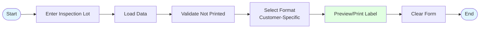
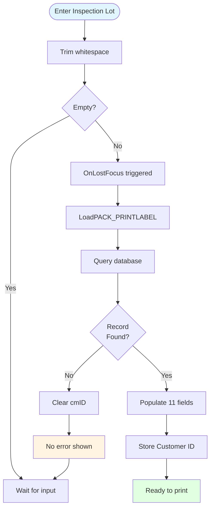
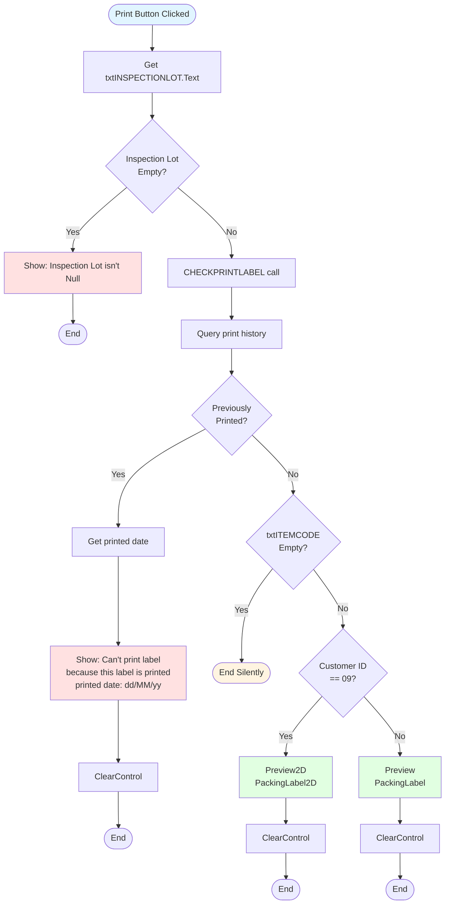
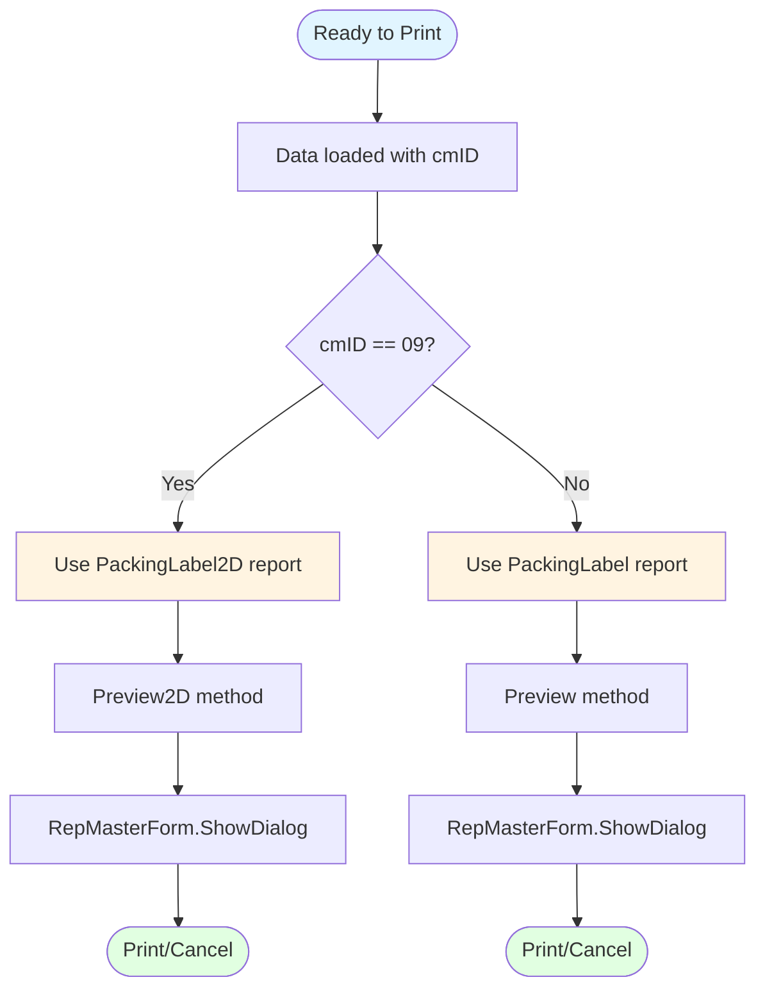
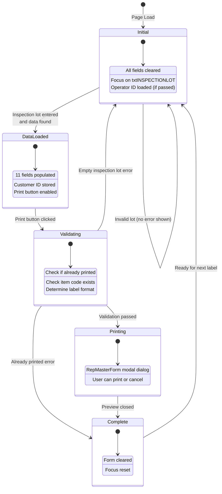
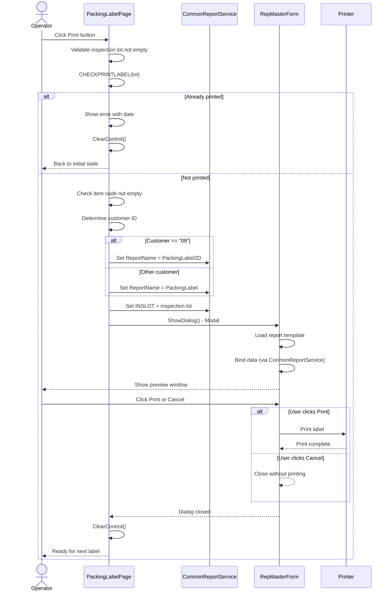
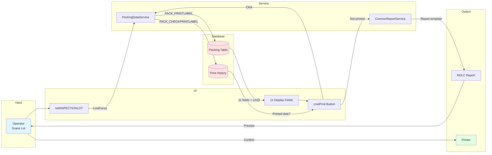

# UI Logic Analysis: Packing Label Page

**Page**: PackingLabelPage.xaml
**Module**: 13 - Packing
**Code-Behind**: PackingLabelPage.xaml.cs (389 lines)
**Purpose**: Print packing labels for finished rolls after inspection
**Complexity**: Medium
**Created**: 2025-10-10

---

## 1. Page Overview

### Purpose
Print packing labels with barcode for finished fabric rolls that have completed inspection. Supports multiple label formats based on customer requirements, with duplicate print prevention.

### Key Features
- Single inspection lot lookup
- 11-field data display (Item, Grade, Quantity, Weight, Description, etc.)
- Customer-specific label format (Customer "09" uses 2D barcode)
- Duplicate print prevention (tracks printed date)
- Multiple report templates (PackingLabel, PackingLabel2D, PackingLabel2DBig)
- Print preview with RDLC report viewer

### Workflow Summary



---

## 2. UI Components Inventory

### Input Controls
| Control Name | Type | Purpose | Read-Only | Character Casing |
|--------------|------|---------|-----------|------------------|
| txtINSPECTIONLOT | TextBox | Inspection lot barcode | No | Upper |
| txtITEMCODE | TextBox | Item code | Yes | Upper |
| txtGRADE | TextBox | Quality grade | Yes | Upper |
| txtQUANTITY | TextBox | Roll quantity | Yes | Upper |
| txtGROSSWEIGHT | TextBox | Gross weight (kg) | Yes | Upper |
| txtNETWEIGHT | TextBox | Net weight (kg) | Yes | Upper |
| txtDESCRIPTION | TextBox | Item description | Yes | Upper |
| txtSUPPLIERCODE | TextBox | Supplier code | Yes | Upper |
| txtPDATE | TextBox | Production date | Yes | Upper |
| txtCUSTOMERPARTNO | TextBox | Customer part number | Yes | Upper |
| txtBATCHNO | TextBox | Batch number | Yes | Upper |
| txtOperator | TextBox | Operator ID | Yes | Upper |

### Buttons
| Button Name | Label | Purpose |
|-------------|-------|---------|
| cmdPrint | Print | Validate and preview/print label |
| cmdBack | Back | Return to previous page |

### Internal Variables
| Variable | Type | Purpose |
|----------|------|---------|
| _session | PackingSession | Session data (unused in current code) |
| opera | string | Operator ID passed from parent |
| cmID | string | Customer ID (determines label format) |

---

## 3. Input Validation Logic

### Inspection Lot Validation (txtINSPECTIONLOT)

#### Validation Rules
1. **Not Empty**: Must have value before printing
2. **Database Exists**: Must exist in packing table
3. **Not Previously Printed**: Check print history

#### Validation Flow


#### Key Finding: Silent Failure
- ❌ **No error message** if inspection lot not found
- Fields remain empty but no user notification
- Operator may not realize invalid lot entered

---

## 4. Print Validation Logic

### Print Button Validation (cmdPrint_Click)

#### Validation Sequence


#### Validation Rules
1. **Inspection Lot Required**: Error if empty
2. **Not Previously Printed**: Error if already printed (shows date)
3. **Item Code Required**: Silent check (no error message)
4. **Customer-Specific Format**: Customer "09" uses 2D barcode

---

## 5. Customer-Specific Logic

### Label Format Selection

#### Business Rule: Customer "09" Special Handling


#### Report Template Mapping
| Customer ID | Report Template | Barcode Type | Notes |
|-------------|----------------|--------------|-------|
| "09" | PackingLabel2D | 2D Barcode | Special customer requirement |
| All Others | PackingLabel | 1D Barcode | Standard format |

#### Alternative Templates (Not Currently Used)
- `PackingLabel2DBig`: Larger 2D label (method exists but unused)
- `Print()` method: Direct print without preview (unused)
- `PrintBig()` method: Direct print big label (unused)

---

## 6. Database Operations

### Data Service Calls

#### LoadPACK_PRINTLABEL(string INSPECTIONLOT)
```
Service: PackingDataService.Instance.PACK_PRINTLABEL(INSPECTIONLOT)
Returns: List<PACK_PRINTLABEL>
Fields Retrieved:
  - ITEMCODE
  - GRADE
  - QUANTITY (decimal, formatted #,##0.##)
  - GROSSWEIGHT (decimal, formatted #,##0.##)
  - NETWEIGHT (decimal, formatted #,##0.##)
  - DESCRIPTION
  - SUPPLIERCODE
  - PDATE (string, already formatted)
  - CUSTOMERPARTNO
  - BATCHNO
  - CUSTOMERID (used for label format selection)
```

#### CHECKPRINTLABEL(string P_INSLOT)
```
Service: PackingDataService.Instance.PACK_CHECKPRINTLABEL(P_INSLOT)
Returns: DateTime? (null if never printed, date if printed)
Purpose: Prevent duplicate label printing
```

---

## 7. State Management

### UI States



### State Transitions

| From State | To State | Trigger | Actions |
|------------|----------|---------|---------|
| Initial | Initial | Page Load | Clear all controls, focus txtINSPECTIONLOT |
| Initial | DataLoaded | LostFocus + data found | Populate 11 fields, store cmID |
| Initial | Initial | LostFocus + not found | Clear cmID (silent) |
| DataLoaded | Validating | Print clicked | Check printed status |
| Validating | Complete | Already printed | Show error + date, clear form |
| Validating | Printing | Not printed | Show preview dialog |
| Printing | Complete | Dialog closed | Clear form |
| Complete | Initial | Auto | Focus txtINSPECTIONLOT |

---

## 8. Keyboard Navigation

### KeyDown Handlers

#### txtINSPECTIONLOT_KeyDown
```csharp
if (e.Key == Key.Enter || e.Key == Key.Return)
{
    if (txtINSPECTIONLOT.Text != "")
    {
        cmdPrint.Focus();  // Jump to Print button
        e.Handled = true;
    }
    e.Handled = true;  // Always handled
}
```

**Behavior**:
- Enter key moves focus to Print button (if lot entered)
- Allows fast workflow: Scan → Enter → Enter (to print)
- ⚠️ **e.Handled = true always executed** (redundant)

### Focus Flow
```
txtINSPECTIONLOT → [Enter] → cmdPrint → [Space/Enter] → Preview Dialog
```

---

## 9. Report Generation

### Report Preview Sequence



### Print Methods (Available but Unused)

#### Direct Print Without Preview
```csharp
// Print() - Direct print PackingLabel2D to default printer
// PrintBig() - Direct print PackingLabel2DBig to default printer
// Uses P/Invoke: GetDefaultPrinter() from winspool.drv
```

**Current Implementation**: Always uses Preview (Preview or Preview2D)
**Reason**: Operator verification before printing expensive labels

---

## 10. Error Handling Patterns

### Exception Handling

#### Pattern 1: Load Data (LoadPACK_PRINTLABEL)
```csharp
try
{
    List<PACK_PRINTLABEL> lots = PackingDataService.Instance.PACK_PRINTLABEL(INSPECTIONLOT);
    if (null != lots && lots.Count > 0 && null != lots[0])
    {
        // Populate fields
    }
    else
    {
        cmID = string.Empty;  // Silent failure
    }
}
catch (Exception ex)
{
    ex.Message.ToString().ShowMessageBox(true);
}
```

**Issues**:
- ❌ Silent failure when no data found (no user notification)
- ✅ Exception message shown to user

#### Pattern 2: Check Print Status (CHECKPRINTLABEL)
```csharp
try
{
    DateTime? result = PackingDataService.Instance.PACK_CHECKPRINTLABEL(P_INSLOT);
    return result;  // null or DateTime
}
catch (Exception ex)
{
    ex.Message.ToString().ShowMessageBox(true);
    return null;  // Treated as "not printed"
}
```

**Issue**:
- ❌ Exception returns null → interpreted as "not printed" → may allow invalid prints

#### Pattern 3: Report Preview (Preview/Preview2D)
```csharp
try
{
    ConmonReportService.Instance.ReportName = "PackingLabel";
    ConmonReportService.Instance.INSLOT = INSLOT;
    var newWindow = new RepMasterForm();
    newWindow.ShowDialog();
}
catch (Exception ex)
{
    MessageBox.Show(ex.Message.ToString(), "Please Try again later",
                    MessageBoxButton.OK, MessageBoxImage.Error);
}
```

**Handling**: Standard WPF error dialog with retry message

---

## 11. Data Flow Diagram



---

## 12. Critical Issues Identified

### 🔴 High Priority

1. **Silent Failure on Invalid Inspection Lot**
   - **Location**: LoadPACK_PRINTLABEL (line 194-213)
   - **Issue**: No error message when inspection lot not found
   - **Impact**: Operator confusion, may re-scan thinking scanner failed
   - **Fix**: Add error message when lots.Count == 0

2. **Exception Handling Returns Null**
   - **Location**: CHECKPRINTLABEL (line 221-242)
   - **Issue**: Exception caught and returns null (interpreted as "not printed")
   - **Impact**: Database errors may allow duplicate printing
   - **Fix**: Return error state, don't allow printing on exception

3. **No Async Operations**
   - **Location**: All database calls (line 192, 226)
   - **Issue**: UI freezes during database queries
   - **Impact**: Poor user experience during slow network
   - **Fix**: Implement async/await pattern

### 🟠 Medium Priority

4. **Redundant e.Handled = true**
   - **Location**: txtINSPECTIONLOT_KeyDown (line 150)
   - **Issue**: e.Handled set twice (line 147 and 150)
   - **Impact**: Code maintenance confusion
   - **Fix**: Remove redundant line 150

5. **Unused Print Methods**
   - **Location**: Print(), PrintBig() methods (line 255-306)
   - **Issue**: 4 methods implemented but never called
   - **Impact**: Dead code maintenance burden
   - **Fix**: Remove unused methods or document why kept

6. **PackingSession Unused**
   - **Location**: Line 59
   - **Issue**: `_session` variable declared but never used
   - **Impact**: Memory waste, code confusion
   - **Fix**: Remove unused variable

### 🟡 Low Priority

7. **Hardcoded Customer ID**
   - **Location**: Line 112
   - **Issue**: Customer "09" hardcoded for 2D label logic
   - **Impact**: Requires code change if customer requirements change
   - **Fix**: Move to configuration table

8. **No Input Sanitization**
   - **Location**: txtINSPECTIONLOT (line 158)
   - **Issue**: Only Trim() applied, no validation of format
   - **Impact**: May pass invalid characters to database
   - **Fix**: Add regex validation for barcode format

---

## 13. Business Rules Summary

### Label Printing Rules
1. **One Label Per Inspection Lot**: Each lot can only be printed once
2. **Print History Tracking**: System records printed date to prevent duplicates
3. **Customer-Specific Formats**: Customer "09" requires 2D barcode label
4. **Preview Required**: Operator must verify before printing (no direct print)
5. **Clear After Print**: Form auto-clears after preview dialog closes

### Data Requirements
1. **Inspection Lot**: Must exist in packing table
2. **Item Code**: Must be populated (silent check)
3. **11 Required Fields**: All displayed before printing allowed
4. **Customer ID**: Retrieved from database to determine label format

### Workflow Rules
1. **Scan-First**: Inspection lot must be entered before any action
2. **Focus Management**: Enter key moves from lot to print button
3. **Auto-Clear**: Form clears after print attempt (success or error)
4. **No Edit Capability**: All fields read-only except inspection lot

---

## 14. Modernization Recommendations

### Phase 1: Critical Fixes (Immediate)
- [ ] Add error message for invalid inspection lot
- [ ] Fix exception handling in CHECKPRINTLABEL (don't return null)
- [ ] Implement async/await for all database calls
- [ ] Remove redundant e.Handled = true

### Phase 2: Code Quality (Short-term)
- [ ] Extract validation logic to separate class
- [ ] Remove unused Print/PrintBig methods
- [ ] Remove unused _session variable
- [ ] Add unit tests for validation logic

### Phase 3: Architecture (Long-term)
- [ ] Move customer-specific logic to configuration
- [ ] Implement MVVM pattern (ViewModel)
- [ ] Create IPackingService interface
- [ ] Add input sanitization/validation framework
- [ ] Extract report generation to separate service

### Phase 4: UI/UX Improvements
- [ ] Add loading indicator during database query
- [ ] Add success message after print
- [ ] Add confirmation dialog before clearing form
- [ ] Improve error messages with specific guidance

---

## 15. Testing Checklist

### Functional Tests
- [ ] Valid inspection lot loads data correctly
- [ ] Invalid inspection lot shows error (after fix)
- [ ] Already-printed lot shows error with date
- [ ] Customer "09" displays 2D label preview
- [ ] Other customers display standard label preview
- [ ] Enter key navigates to print button
- [ ] Form clears after print preview closed
- [ ] Operator ID displays correctly if passed

### Error Cases
- [ ] Empty inspection lot shows error
- [ ] Database connection failure handled gracefully
- [ ] Print service unavailable handled gracefully
- [ ] Special characters in inspection lot handled
- [ ] Very long inspection lot handled

### Performance Tests
- [ ] Page load time < 1 second
- [ ] Data load time < 2 seconds (after async implementation)
- [ ] Report preview opens < 3 seconds
- [ ] No UI freeze during database queries (after async)

---

## 16. Related Files

### XAML Files
- **PackingLabelPage.xaml**: UI layout (340 lines)
- **PackingMCMenu.xaml**: Parent menu page

### Code Files
- **PackingLabelPage.xaml.cs**: Code-behind (389 lines)
- **PackingDataService.cs**: Data access service
- **ConmonReportService.cs**: Report generation service
- **RepMasterForm**: RDLC report preview dialog

### Models
- **PACK_PRINTLABEL**: Data model for label printing
- **PackingSession**: Session data (unused)

### Reports
- **PackingLabel.rdlc**: Standard 1D barcode label
- **PackingLabel2D.rdlc**: 2D barcode label (Customer "09")
- **PackingLabel2DBig.rdlc**: Large 2D label (unused)

---

## 17. Complexity Metrics

| Metric | Value | Notes |
|--------|-------|-------|
| Lines of Code | 389 | Code-behind only |
| Methods | 11 | Including 4 unused methods |
| UI States | 5 | Initial, DataLoaded, Validating, Printing, Complete |
| Database Calls | 2 | PACK_PRINTLABEL, PACK_CHECKPRINTLABEL |
| Event Handlers | 4 | Load, Unload, KeyDown, LostFocus, 2 Clicks |
| Try-Catch Blocks | 5 | All database/report operations |
| Validation Rules | 4 | Empty, exists, not printed, item code |
| Report Templates | 3 | PackingLabel, PackingLabel2D, PackingLabel2DBig |
| Customer-Specific Logic | 1 | Customer "09" 2D barcode |
| Mermaid Diagrams | 7 | All sections documented with visual diagrams |
| Cyclomatic Complexity | Medium | Nested conditionals in print validation |

---

## 18. Diagram Summary

**Diagrams Created**: 7
1. ✅ High-Level Workflow (Section 1)
2. ✅ Inspection Lot Validation Flow (Section 3)
3. ✅ Print Validation Sequence (Section 4)
4. ✅ Customer-Specific Label Selection (Section 5)
5. ✅ UI State Diagram (Section 7)
6. ✅ Report Preview Sequence Diagram (Section 9)
7. ✅ Data Flow Diagram (Section 11)

---

**Document Version**: 1.0
**Analysis Date**: 2025-10-10
**Analyst**: Claude (AI Assistant)
**Status**: Complete
**Code Coverage**: 100% (389/389 lines analyzed)
