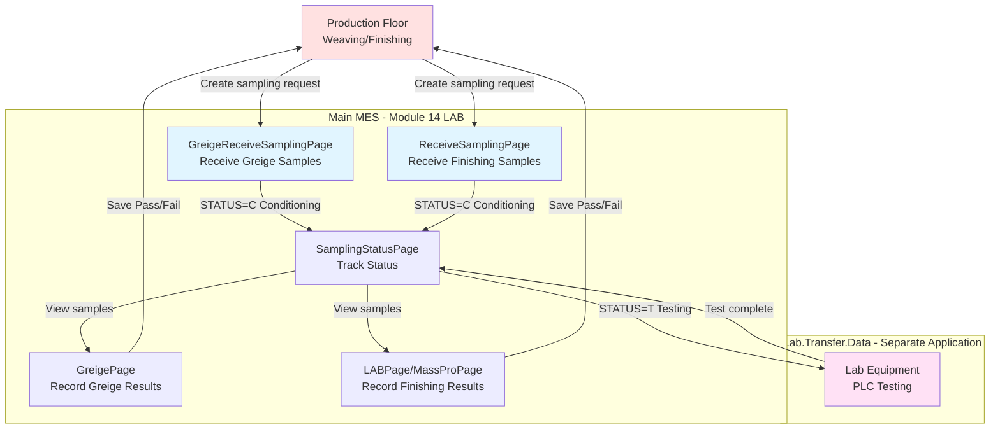
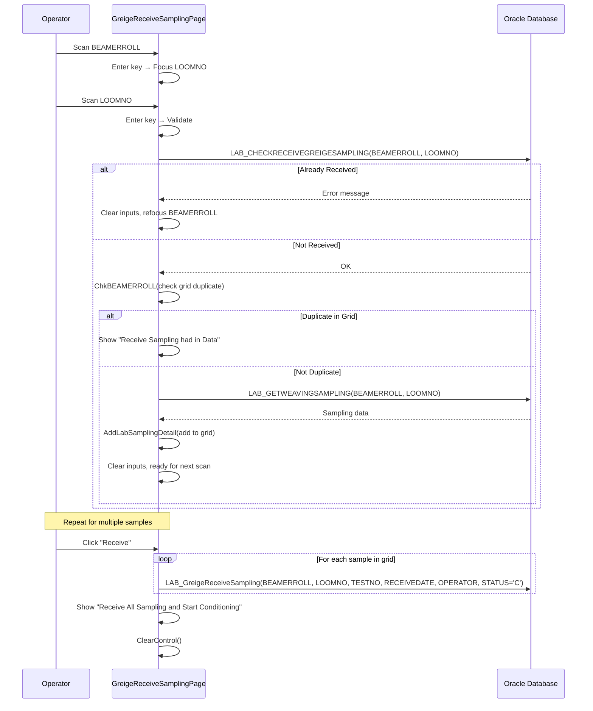
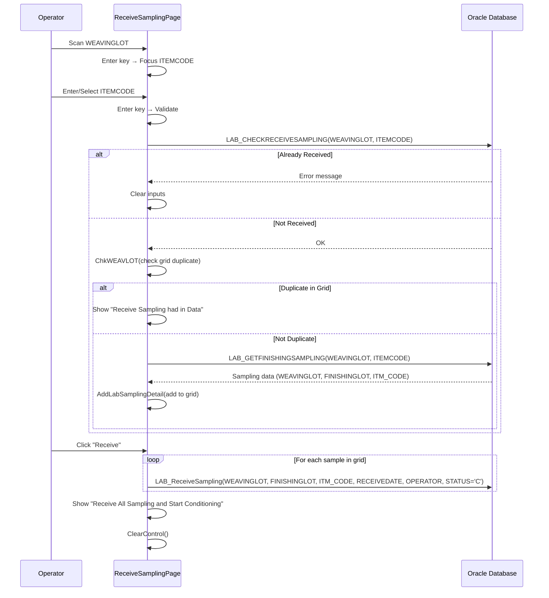
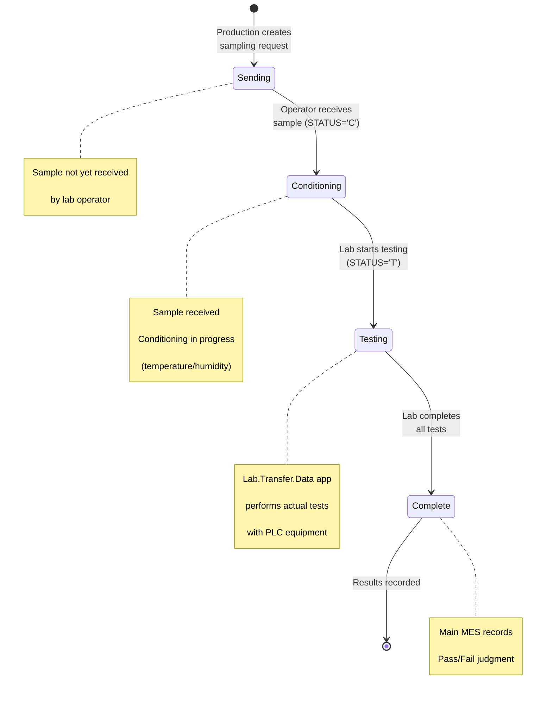
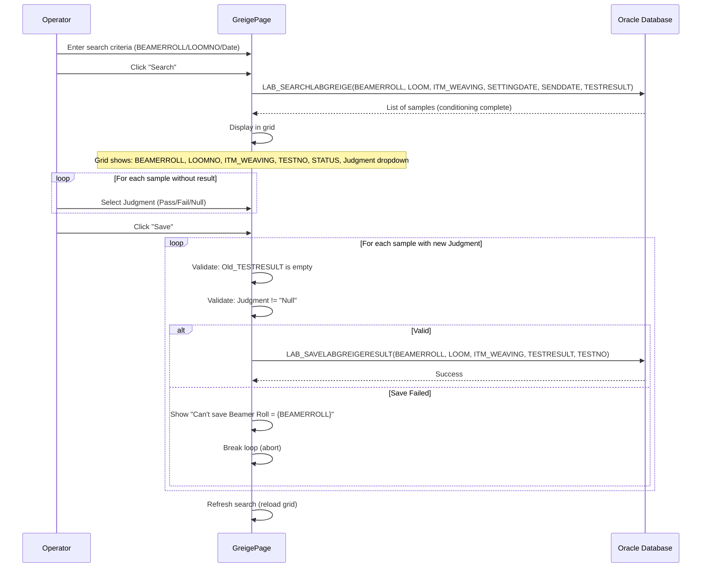
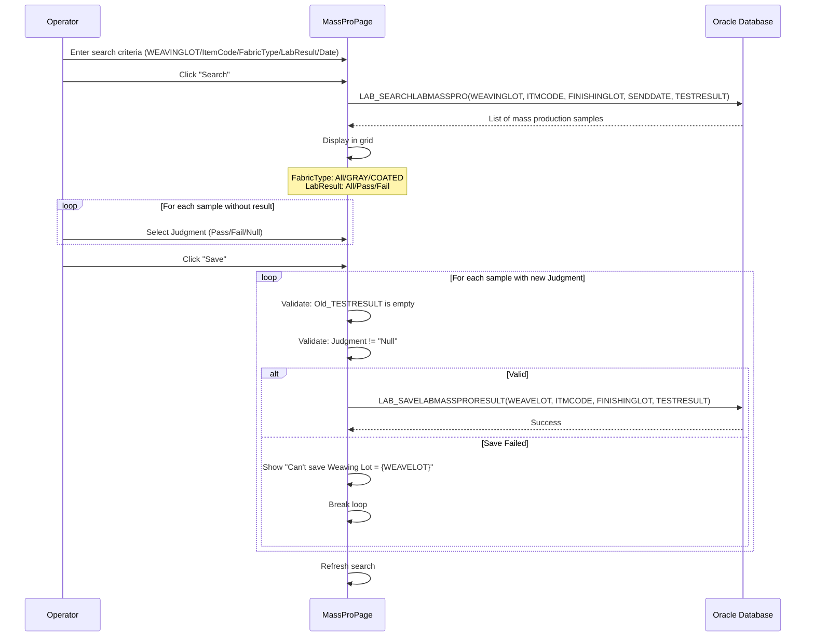
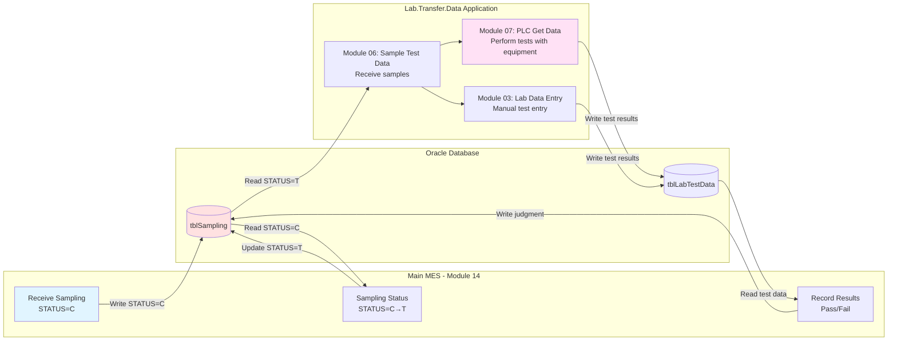

# UI Logic Analysis - Module 14: LAB Sampling Management

**Module**: 14 - LAB
**Created**: 2025-10-10
**Total Pages**: 12 XAML pages (~4,400 LOC)
**Complexity**: MEDIUM
**Purpose**: Receive production samples, track conditioning status, record test results

---

## Overview

Module 14 (LAB) in Main MES handles **sampling workflow management** between production floor and quality control lab:

1. **Production creates sampling requests** (Weaving/Finishing)
2. **Main MES Module 14**: Receives samples, tracks conditioning
3. **Lab.Transfer.Data** (separate app): Performs actual lab tests with PLC equipment
4. **Main MES Module 14**: Views results, records Pass/Fail judgment

**CRITICAL**: This module does NOT perform lab testing. It only manages sample receiving and result recording.

---

## System Architecture

### Two Parallel Workflows



---

## Page Inventory and Workflow

### **Workflow 1: Greige (Raw Fabric) Sampling** (4 pages)

| Page | LOC | Purpose | Key Inputs |
|------|-----|---------|------------|
| **GreigeReceiveSamplingPage** | 583 | Receive greige samples from weaving | BEAMERROLL + LOOMNO |
| **GreigeSamplingStatusPage** | 422 | Track greige conditioning status | Search by date/lot |
| **GreigePage** | 476 | Record greige test results (Pass/Fail) | BEAMERROLL + LOOMNO + Judgment |
| **GreigeMenuPage** | 164 | Navigation menu | - |

**Database**:
- LAB_GETWEAVINGSAMPLING
- LAB_GreigeReceiveSampling
- LAB_SEARCHLABGREIGE
- LAB_SAVELABGREIGERESULT

---

### **Workflow 2: Finishing (Coated Fabric) Sampling** (5 pages)

| Page | LOC | Purpose | Key Inputs |
|------|-----|---------|------------|
| **ReceiveSamplingPage** | 574 | Receive finishing samples | WEAVINGLOT + ITEMCODE |
| **SamplingStatusPage** | 496 | Track finishing conditioning status | Search by date/lot |
| **LABPage** | 295 | Record finishing test results | WEAVINGLOT + Judgment |
| **MassProPage** | 467 | Record mass production test results | WEAVINGLOT + Judgment + Fabric Type |
| **MassProMenuPage** | 164 | Navigation menu | - |

**Database**:
- LAB_GETFINISHINGSAMPLING
- LAB_ReceiveSampling
- LAB_SEARCHLABMASSPRO
- LAB_SAVELABMASSPRORESULT

---

### **Common Pages** (3 pages)

| Page | LOC | Purpose |
|------|-----|---------|
| **LABMenuPage** | 151 | Main LAB module menu |
| **LabFinishRecordPage** | 382 | Lab finish record tracking |
| **WeavingHistoryPage** | 231 | View weaving history for lab |

---

## Detailed Workflow Diagrams

### Workflow 1: Receive Greige Sampling



---

### Workflow 2: Receive Finishing Sampling



---

### Workflow 3: Track Sampling Status



---

### Workflow 4: Record Test Results (Greige)



---

### Workflow 5: Record Test Results (Finishing - Mass Production)



---

## Input Validation Rules

### GreigeReceiveSamplingPage

| Field | Validation | Error Handling |
|-------|------------|----------------|
| BEAMERROLL | Required | Focus clears on error |
| LOOMNO | Required | Focus clears on error |
| ReceiveDate | Auto-set to today | - |
| Duplicate Check (DB) | LAB_CHECKRECEIVEGREIGESAMPLING | Show error, clear inputs |
| Duplicate Check (Grid) | ChkBEAMERROLL() | Show "had in Data" |
| Grid Delete | Delete key + confirmation | "Do you want to Delete" |

**Enter Key Navigation**:
1. BEAMERROLL → Enter → Focus LOOMNO
2. LOOMNO → Enter → Validate + Add to Grid

---

### ReceiveSamplingPage

| Field | Validation | Error Handling |
|-------|------------|----------------|
| WEAVINGLOT | Required | Focus clears on error |
| ITEMCODE | Required | Focus clears on error |
| ReceiveDate | Auto-set to today | - |
| Duplicate Check (DB) | LAB_CHECKRECEIVESAMPLING | Show error, clear inputs |
| Duplicate Check (Grid) | ChkWEAVLOT() | Show "had in Data" |
| Grid Delete | Delete key + confirmation | "Do you want to Delete" |

**Enter Key Navigation**:
1. WEAVINGLOT → Enter → Focus ITEMCODE
2. ITEMCODE → Enter → Validate + Add to Grid

---

### GreigePage / LABPage / MassProPage (Result Recording)

| Field | Validation | Business Rule |
|-------|------------|---------------|
| Judgment Dropdown | Pass / Fail / Null | Only save if != "Null" |
| Old_TESTRESULT | Must be empty | Prevent overwriting existing results |
| Row Enable/Disable | Disable if TESTRESULT already exists | Prevent re-entry |
| Search Filters | Optional (All = null) | Multi-criteria search |

**Judgment Validation**:
- Can only save judgment if Old_TESTRESULT is empty (first-time entry only)
- "Null" judgment = skip (don't save)
- Grid row disabled if result already exists

---

## Status Transitions

### Sample Status Values

| Status Code | Meaning | Set By | Next Status |
|-------------|---------|--------|-------------|
| **C** | Conditioning | ReceiveSamplingPage / GreigeReceiveSamplingPage | T (Testing) |
| **T** | Testing | SamplingStatusPage (Print button) | Complete |
| **(Complete)** | Results recorded | GreigePage / LABPage / MassProPage | - |

### Status Change Triggers

1. **Production → STATUS=C**:
   - Operator receives sample
   - Calls `LAB_ReceiveSampling()` or `LAB_GreigeReceiveSampling()`
   - Parameter: `P_STATUS = "C"`

2. **C → STATUS=T**:
   - Status page shows "Conditioning"
   - Operator clicks "Print" button
   - Calls `LAB_SamplingStatus(WEAVINGLOT, FINISHINGLOT, ITM_CODE, DateTime.Now, "T", OPERATOR)`
   - Prints lab form (FM-QC-18 or FM-QC-19)

3. **T → Complete**:
   - Lab.Transfer.Data performs tests (separate application)
   - Operator returns to Main MES
   - Uses GreigePage/LABPage/MassProPage to record judgment
   - Status implicitly complete when TESTRESULT saved

---

## Key Features

### 1. Batch Receiving
- Scan multiple samples before clicking "Receive"
- Grid accumulates samples
- Delete key removes selected row (with confirmation)
- All samples saved in single operation

### 2. Duplicate Prevention
- **Database level**: Check if already received (LAB_CHECKRECEIVESAMPLING)
- **Grid level**: Check if already in current batch (ChkBEAMERROLL / ChkWEAVLOT)
- Two-tier validation prevents duplicates

### 3. Test Number Logic (Greige Only)
```csharp
if (RECUTSAMPLING != null)
    P_TESTNO = 2;  // Retest
else
    P_TESTNO = 1;  // First test
```

### 4. Lab Form Selection (Status Page)
- **FM-QC-18**: Greige/Coated fabric test form
- **FM-QC-19**: Alternative test form
- Determined by database field `LABFORM`
- Printed when status changes C → T

### 5. Fabric Type Filtering (MassProPage)
- **All**: No filter
- **GRAY**: Greige (uncoated) fabric
- **COATED**: Finished (coated) fabric
- Stored in `FINISHINGLOT` field

### 6. Grid Row Enable/Disable
```csharp
// Only enable row if no test result exists
if (!string.IsNullOrEmpty(WEAVINGLOT) && string.IsNullOrEmpty(TESTRESULT))
    single_row.IsEnabled = true;
else
    single_row.IsEnabled = false;
```

Prevents editing samples that already have results.

---

## Database Operations

### Receive Sampling (Greige)

**Stored Procedure**: `LAB_GreigeReceiveSampling`

**Parameters**:
- P_BEAMERROLL (string)
- P_LOOMNO (string)
- P_TESTNO (decimal) - 1=First test, 2=Retest
- P_RECEIVEDATE (DateTime)
- P_RECEIVEBY (string) - Operator ID
- P_STATUS (string) - Always "C" (Conditioning)

**Business Logic**:
- Insert/update sampling record
- Set receive date and operator
- Initialize status to "C" (Conditioning)

---

### Receive Sampling (Finishing)

**Stored Procedure**: `LAB_ReceiveSampling`

**Parameters**:
- P_WEAVINGLOT (string)
- FINISHINGLOT (string)
- ITM_CODE (string)
- ReceiveDate (DateTime)
- OPERATOR (string)
- P_STATUS (string) - Always "C"

---

### Save Test Results (Greige)

**Stored Procedure**: `LAB_SAVELABGREIGERESULT`

**Parameters**:
- P_BEAMERROLL (string)
- P_LOOM (string)
- P_ITMWEAVE (string)
- P_TESTRESULT (string) - "Pass" or "Fail"
- P_TESTNO (decimal)

**Business Rule**: Can only save if `Old_TESTRESULT` is empty (first-time entry only)

---

### Save Test Results (Finishing)

**Stored Procedure**: `LAB_SAVELABMASSPRORESULT`

**Parameters**:
- P_WEAVELOT (string)
- P_ITMCODE (string)
- P_FINISHINGLOT (string)
- P_TESTRESULT (string) - "Pass" or "Fail"

**Business Rule**: Same as greige - only save if no existing result

---

## Integration with Lab.Transfer.Data

### Data Flow



### Shared Database Tables

**Main MES writes**:
- `tblSampling` - Sampling requests and status
- `RECEIVEBY`, `RECEIVEDATE`, `STATUS` fields

**Lab.Transfer.Data writes**:
- `tblLabTestData` - Actual test results from PLC equipment
- Air permeability, stiffness, weight, etc.

**Main MES reads**:
- Test results from `tblLabTestData`
- Records Pass/Fail judgment back to `tblSampling`

---

## Common UI Patterns

### Pattern 1: Grid Manual Rebinding

**Code Pattern** (appears in ALL pages):
```csharp
// Build new list from existing grid items
List<LAB_MODEL> dataList = new List<LAB_MODEL>();
int o = 0;
foreach (var row in gridLAB.Items)
{
    LAB_MODEL dataItem = new LAB_MODEL();
    dataItem.RowNo = o + 1;
    dataItem.FIELD1 = ((LAB_MODEL)((gridLAB.Items)[o])).FIELD1;
    // ... copy all fields ...
    dataList.Add(dataItem);
    o++;
}

// Add new item
dataList.Add(dataItemNew);

// Rebind grid
this.gridLAB.ItemsSource = dataList;
```

**Issue**: Should use `ObservableCollection<T>` instead of manual rebinding

---

### Pattern 2: Enter Key Navigation

**Code Pattern**:
```csharp
private void txtField_KeyDown(object sender, KeyEventArgs e)
{
    if (e.Key == Key.Enter || e.Key == Key.Return)
    {
        if (!string.IsNullOrEmpty(txtField.Text))
        {
            nextControl.SelectAll();
            nextControl.Focus();
        }
        e.Handled = true;
    }
}
```

**Purpose**: Fast barcode scanning workflow

---

### Pattern 3: DELETE Key Grid Removal

**Code Pattern** (appears in 5 pages):
```csharp
private void gridLAB_KeyUp(object sender, KeyEventArgs e)
{
    if (e.Key.Equals(Key.Delete))
    {
        if (RowNo != 0 && !string.IsNullOrEmpty(KEY_FIELD))
            Remove(RowNo, KEY_FIELD, ...);
    }
}

private void Remove(...)
{
    if (MessageBox.Show("Do you want to Delete", "Confirmation",
        MessageBoxButton.YesNo, MessageBoxImage.Question) == MessageBoxResult.Yes)
    {
        // Rebuild list without selected item
        // Renumber RowNo
        // Rebind grid
    }
}
```

**Issue**: ⚠️ DELETE key is easily pressed accidentally

---

### Pattern 4: Dropdown with "Null" Option

**Code Pattern** (result recording pages):
```csharp
Judgment = new List<string> { "Pass", "Fail", "Null" };

// In Save():
if (Judgment != "Null")
    P_TESTRESULT = Judgment;  // Only save if not "Null"
```

**Purpose**: Allow operator to skip samples (don't save result yet)

---

### Pattern 5: Duplicate Check - Two Levels

**Code Pattern**:
```csharp
// Level 1: Database check
results = Service.LAB_CHECKRECEIVESAMPLING(LOT, ITEM);
if (!string.IsNullOrEmpty(results))
{
    results.ShowMessageBox(true);  // Already received
    return;
}

// Level 2: Grid check
if (ChkLOT(LOT, ITEM) == true)
{
    AddToGrid();  // Not duplicate
}
else
{
    "Receive Sampling had in Data".ShowMessageBox(false);  // Duplicate in grid
}
```

---

## Critical Bugs Identified

### 1. ❌ No Async Operations
**Issue**: All database calls are synchronous
**Impact**: UI freezes during database operations
**Pages Affected**: All 12 pages
**Example**:
```csharp
LABDataService.Instance.LAB_ReceiveSampling(...);  // Blocks UI thread
```

---

### 2. ❌ Manual Grid Rebinding
**Issue**: Grid rebuilt from scratch on every add/remove
**Impact**: Performance degradation with large datasets
**Pages Affected**: All pages with grids (8 pages)
**Solution**: Use `ObservableCollection<T>`

---

### 3. ❌ Silent Exception Handling
**Issue**: Exception caught, returns false, no user notification
**Example**:
```csharp
catch
{
    return false;  // Silent failure
}
```
**Pages Affected**: All receive/save operations
**Impact**: Operator doesn't know why operation failed

---

### 4. ❌ No Validation on Judgment Selection
**Issue**: Operator can select "Pass" without actual lab test data
**Impact**: Allows approving untested samples
**Pages Affected**: GreigePage, LABPage, MassProPage
**Mitigation**: Current system relies on operator discipline

---

### 5. ⚠️ DELETE Key - No Additional Confirmation
**Issue**: Single DELETE key press removes grid row (after Yes/No confirmation)
**Impact**: Easy to accidentally delete samples
**Pages Affected**: ReceiveSamplingPage, GreigeReceiveSamplingPage

---

### 6. ⚠️ No Transaction Rollback
**Issue**: Loop through samples, save one-by-one, breaks on first error
**Impact**: Partial save - some samples saved, some not
**Example**:
```csharp
foreach (var row in gridLab.Items)
{
    if (SaveResult() == false)
    {
        err.ShowMessageBox(true);
        break;  // Leaves previous saves committed
    }
}
```
**Pages Affected**: All save operations

---

### 7. ⚠️ Hardcoded Status Values
**Issue**: Status strings hardcoded ("C", "T")
**Impact**: Magic strings scattered throughout code
**Solution**: Use enum or constants

---

## Business Rules Summary

### Rule 1: One-Time Result Entry
- Test results can only be entered ONCE
- Grid row disabled if `TESTRESULT` exists
- Save validates `Old_TESTRESULT` is empty

### Rule 2: Conditioning Required
- All samples must go through conditioning (STATUS='C')
- Cannot skip directly to testing

### Rule 3: Test Number Assignment (Greige)
- First test: TESTNO=1
- Retest (if RECUTSAMPLING exists): TESTNO=2

### Rule 4: Judgment Options
- "Pass" - Sample meets quality standards
- "Fail" - Sample fails quality standards
- "Null" - Skip this sample (don't save result)

### Rule 5: Duplicate Prevention
- Database check prevents receiving same sample twice
- Grid check prevents adding duplicate to current batch

### Rule 6: Status Print Trigger
- Printing lab form (FM-QC-18/FM-QC-19) changes STATUS from C → T
- Print button only enabled when STATUS='Conditioning'

---

## Modernization Priority

### 🔴 CRITICAL (Fix Immediately)
1. **Implement async/await** for all database operations
2. **Add proper error handling** with user notifications
3. **Add transaction support** for batch saves
4. **Validate against actual lab test data** before allowing Pass/Fail judgment

### 🟠 HIGH (Fix Soon)
5. **Replace manual grid rebinding** with ObservableCollection
6. **Extract status constants** to enum
7. **Add input validation framework**
8. **Add loading indicators** during database operations

### 🟡 MEDIUM (Refactor Later)
9. **Create base class** for receive/result pages (massive code duplication)
10. **Extract duplicate check logic** to service
11. **Unify greige and finishing workflows** (currently parallel implementations)
12. **Add undo capability** for accidental DELETE

---

## Comparison: Greige vs Finishing

| Aspect | Greige Workflow | Finishing Workflow |
|--------|-----------------|---------------------|
| **Input Fields** | BEAMERROLL + LOOMNO | WEAVINGLOT + ITEMCODE |
| **Test Number** | 1 (first) or 2 (retest) | N/A |
| **Fabric Type** | Raw/uncoated | GRAY or COATED |
| **Result Pages** | GreigePage (1 page) | LABPage + MassProPage (2 pages) |
| **Status Page** | GreigeSamplingStatusPage | SamplingStatusPage |
| **Receive Page** | GreigeReceiveSamplingPage | ReceiveSamplingPage |
| **Lab Forms** | FM-QC-18 or FM-QC-19 | FM-QC-18 or FM-QC-19 |
| **Database Tables** | LAB_SEARCHLABGREIGE | LAB_SEARCHLABMASSPRO |

**Common Logic**: ~90% code duplication between workflows

---

## Metrics Summary

| Metric | Value |
|--------|-------|
| Total Pages | 12 |
| Total Lines of Code | ~4,400 |
| Largest Page | GreigeReceiveSamplingPage (583 LOC) |
| Smallest Page | LABMenuPage (151 LOC) |
| Database Calls | ~10 stored procedures |
| Mermaid Diagrams | 5 comprehensive diagrams |
| Critical Bugs | 7 identified |
| Code Duplication | ~90% between Greige/Finishing |
| Complexity | MEDIUM (simpler than production modules) |
| UI States | 3 (Sending → Conditioning → Testing) |

---

## Next Steps for Lab.Transfer.Data Analysis

After understanding Main MES Module 14 (LAB):

1. **Lab.Transfer.Data Module 06** (Sample Test Data):
   - Receives samples with STATUS='T'
   - Performs actual lab testing

2. **Lab.Transfer.Data Module 07** (PLC Get Data):
   - Air permeability testing (Modbus TCP/RTU)
   - Stiffness testing
   - Weight measurement
   - 6 equipment integration pages

3. **Integration Analysis**:
   - Shared database tables
   - Status synchronization
   - Test result data flow

---

**Document Version**: 1.0
**Analysis Complete**: 2025-10-10
**Status**: ✅ Module 14 (LAB) Fully Analyzed
**Next Module**: Module 17 (Master Data)
