# UI Logic Analysis: Customer and Loading Type Master Data

**Module**: 15 - CustomerAndLoadingType
**Page**: CustomerLoadingPage.xaml
**Code-Behind**: CustomerLoadingPage.xaml.cs (555 lines)
**Purpose**: Master data maintenance for customer types and associated loading types
**Complexity**: Medium (Master-Detail CRUD with dual-grid relationship)
**Created**: 2025-10-10

---

## 1. Overview

### Purpose
Manage master data for customer types and their associated loading types in a master-detail relationship. One customer type can have multiple loading types (1:N relationship).

### Key Features
- **Dual-Grid Interface**: Customer types (left) and loading types (right)
- **Master-Detail Relationship**: Selecting customer type filters loading types
- **CRUD Operations**: Add, Edit, Delete for both entities
- **Cascade Operations**: Can save customer type with or without loading type
- **"All Loading Type" Mode**: View all loading types across all customers
- **Confirmation Dialogs**: Delete confirmations for both entities

### UI Pattern
**Master-Detail CRUD** - Two synchronized grids with parent-child relationship

---

## 2. Screen Layout

### Layout Structure
```
┌─────────────────────────────────────────────────────────────┐
│  Customer and Loading type                     [Back]       │
├──────────────────────┬──────────────────────────────────────┤
│ [Add New] [________] │ Loading Type [___________________]   │
├──────────────────────┼──────────────────────────────────────┤
│ ┌──────────────────┐ │ ┌──────────────────────────────────┐ │
│ │ Customer Type    │ │ │ Loading Type                     │ │
│ │  grid            │ │ │  grid                            │ │
│ │  (left)          │ │ │  (right)                         │ │
│ │                  │ │ │                                  │ │
│ └──────────────────┘ │ └──────────────────────────────────┘ │
│ [Edit] [Delete]      │ [☐ All Loading Type] [Delete]       │
├──────────────────────┴──────────────────────────────────────┤
│ Operator [_______________]          [Clear] [Save]          │
└─────────────────────────────────────────────────────────────┘
```

### Controls Inventory

#### Top Input Section
| Control | Name | Type | Purpose | Initial State |
|---------|------|------|---------|---------------|
| Button | cmdAddNew | Button | Enable input fields for new entry | Enabled |
| TextBox | txtCUSTOMERTYPE | TextBox | Customer type input | Disabled, Empty |
| Label | - | TextBlock | "Loading Type" label | N/A |
| TextBox | txtLOADINGTYPE | TextBox | Loading type input | Disabled, Empty |

#### Left Grid Section (Customer Types)
| Control | Name | Type | Purpose |
|---------|------|------|---------|
| DataGrid | gridMASTER_CUSTOMERTYPELIST | DataGrid | Display all customer types |
| - Columns: CUSTOMERTYPE (550px, center-aligned)
| Button | cmdEdit | Button | Enable editing of selected customer type |
| Button | cmdDeleteCustomerType | Button | Delete selected customer type |

#### Right Grid Section (Loading Types)
| Control | Name | Type | Purpose |
|---------|------|------|---------|
| DataGrid | gridMASTER_GETLOADINGBYCUSTYPE | DataGrid | Display loading types for selected customer |
| - Columns: LOADINGTYPE (550px, center-aligned)
| CheckBox | chkAllLoadingType | CheckBox | Toggle between filtered/all loading types |
| Button | cmdDeleteLoadingType | Button | Delete selected loading type (enabled when "All" checked) |

#### Bottom Section
| Control | Name | Type | Purpose |
|---------|------|------|---------|
| TextBox | txtOperator | TextBox | Operator name (read-only) |
| Button | cmdClear | Button | Clear all fields and reload data |
| Button | cmdSave | Button | Save customer type and/or loading type |
| Button | cmdBack | Button | Navigate back to menu |

---

## 3. Data Flow & Relationships

### Master-Detail Relationship

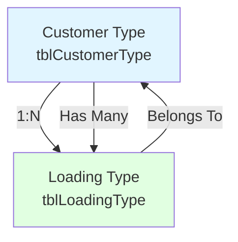

### Grid Synchronization Logic

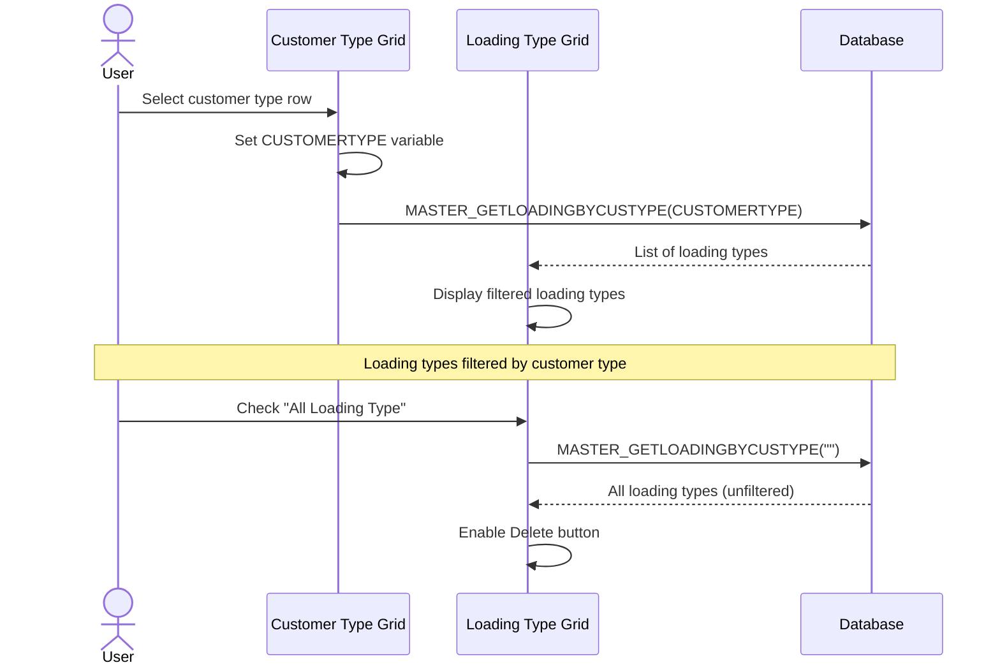

---

## 4. UI State Machine

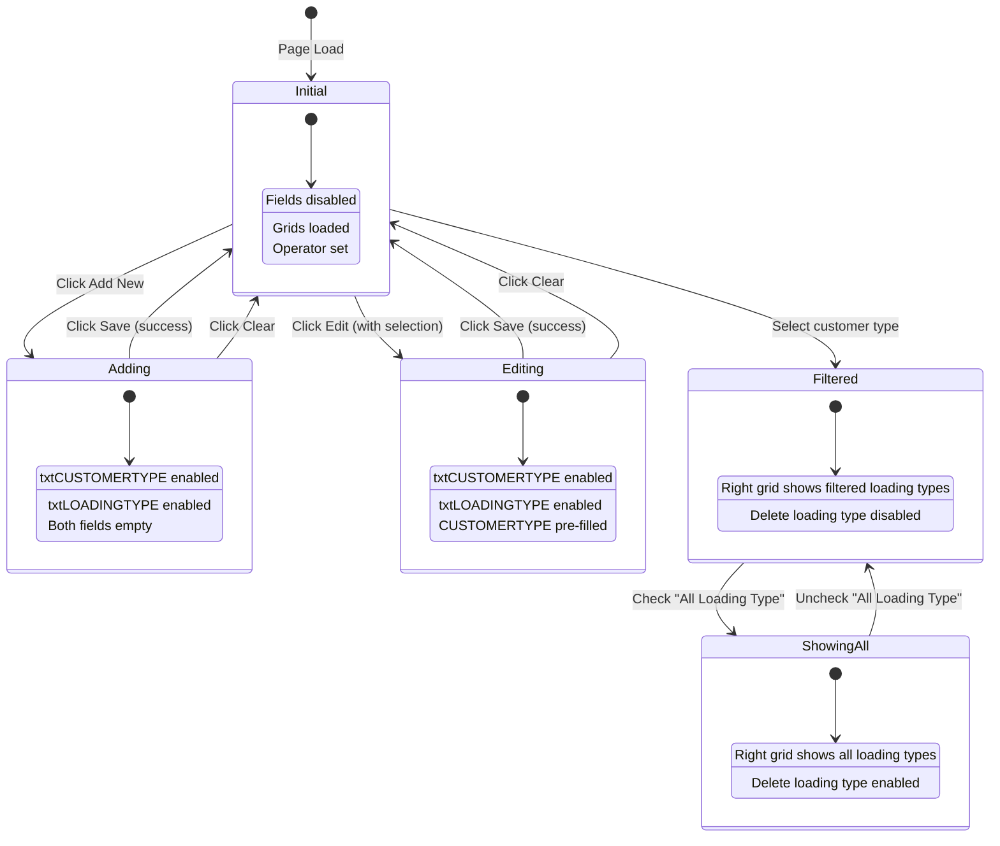

---

## 5. Input Validation Logic

### Save Validation Flowchart

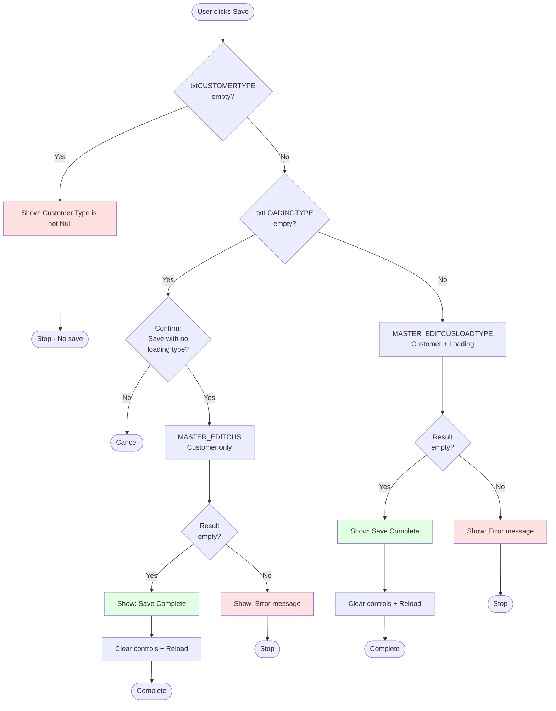

### Validation Rules

| Field | Rule | Error Message |
|-------|------|---------------|
| txtCUSTOMERTYPE | Required (not null/empty) | "Customer Type isn't Null" |
| txtLOADINGTYPE | Optional (can be empty) | Confirmation: "Want to Save this Customer Type With No Type Loading?" |
| - | No duplicate checking | (Handled by database constraint) |
| - | No format validation | (Any text allowed) |

**Key Insight**: Customer type is mandatory, but loading type is optional. System allows saving customer type without associated loading type.

---

## 6. Delete Operations

### Delete Customer Type Flow

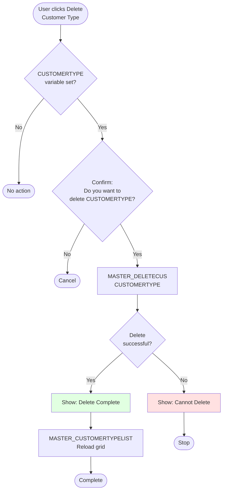

### Delete Loading Type Flow

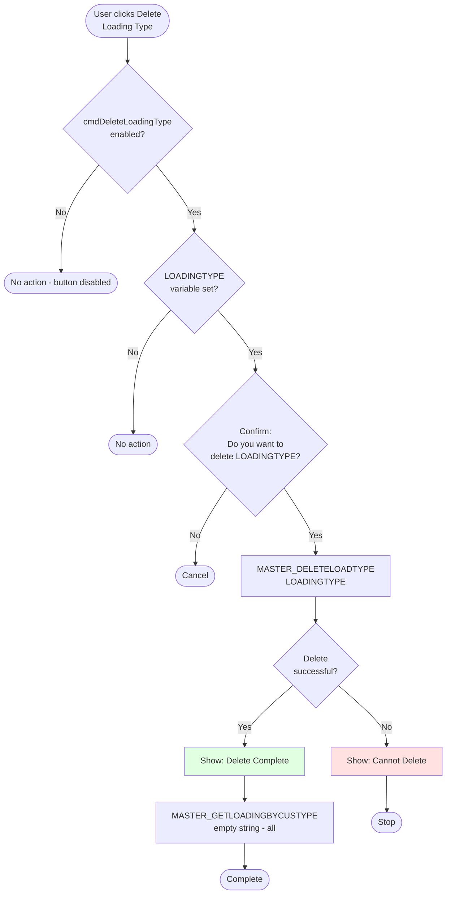

**Key Difference**:
- Delete Customer Type → Reloads customer type grid (MASTER_CUSTOMERTYPELIST)
- Delete Loading Type → Reloads loading type grid in "All" mode (MASTER_GETLOADINGBYCUSTYPE(""))

---

## 7. Grid Selection Logic

### Left Grid Selection (Customer Types)

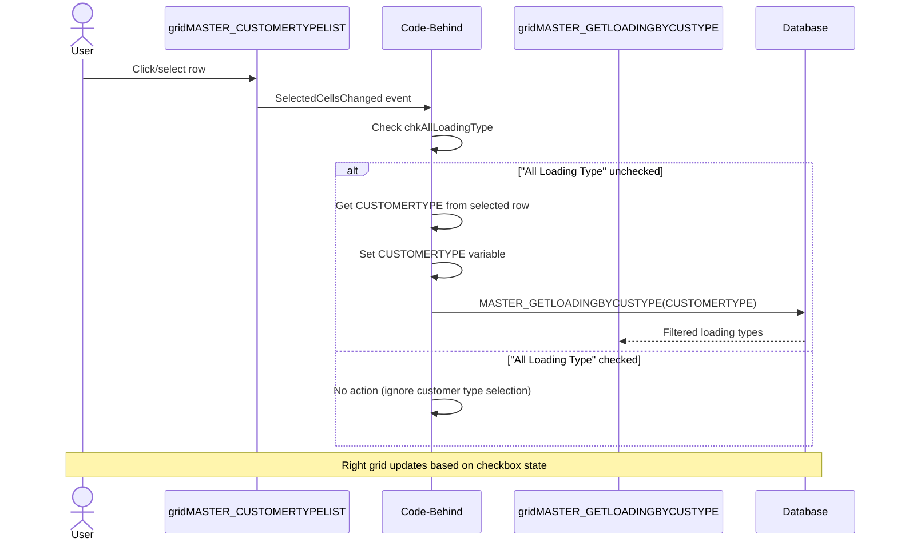

### Right Grid Selection (Loading Types)

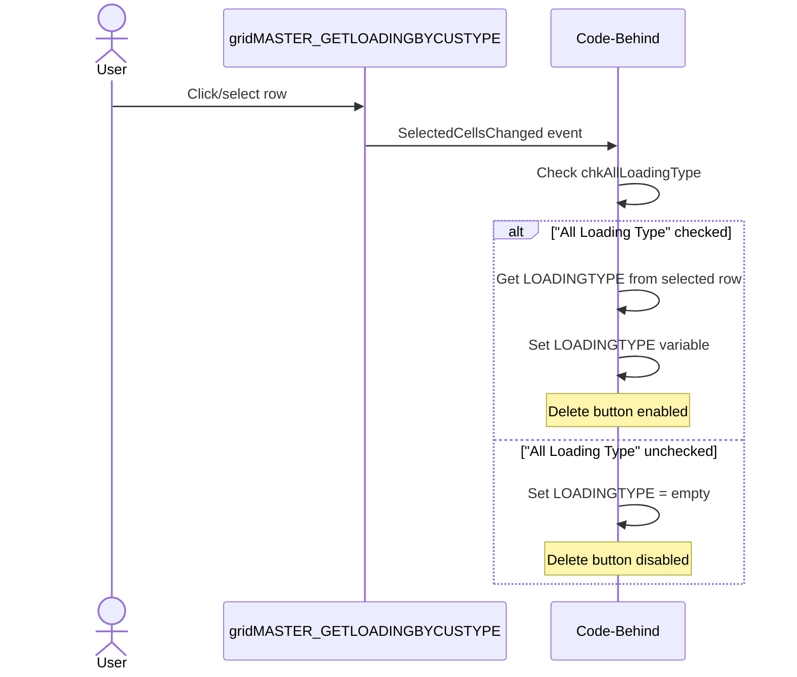

**Business Rule**: Loading type can only be deleted when viewing "All Loading Types" (checkbox checked).

---

## 8. Checkbox Behavior ("All Loading Type")

### Checkbox State Diagram

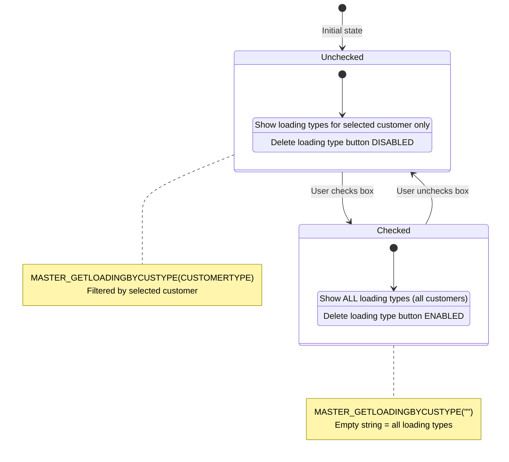

### Checkbox Event Logic

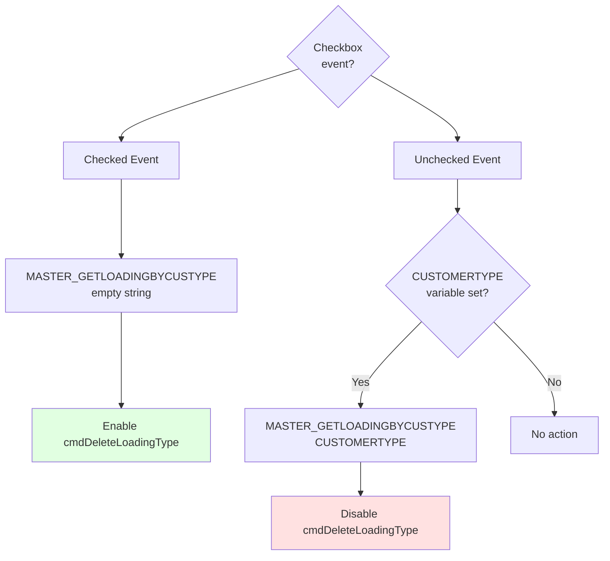

---

## 9. Keyboard Navigation

### Enter Key Handling

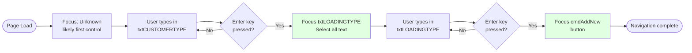

**Keyboard Shortcuts**:
- `txtCUSTOMERTYPE` + Enter → Focus `txtLOADINGTYPE`
- `txtLOADINGTYPE` + Enter → Focus `cmdAddNew` button

---

## 10. Database Operations

### Stored Procedures

| Procedure | Purpose | Parameters | Returns | Tables |
|-----------|---------|------------|---------|--------|
| **MASTER_CUSTOMERTYPELIST** | Get all customer types | None | List\<MASTER_CUSTOMERTYPELIST> | tblCustomerType (SELECT) |
| **MASTER_GETLOADINGBYCUSTYPE** | Get loading types (filtered or all) | P_CUSTYPE (string) | List\<MASTER_GETLOADINGBYCUSTYPE> | tblLoadingType (SELECT) |
| **MASTER_EDITCUSLOADTYPE** | Insert/update customer + loading | P_CUSTYPE (string)<br/>P_LOADTYPE (string)<br/>P_OPERATOR (string) | string (error message or empty) | tblCustomerType (MERGE)<br/>tblLoadingType (MERGE) |
| **MASTER_EDITCUS** | Insert/update customer only | P_CUSTYPE (string)<br/>P_OPERATOR (string) | string (error message or empty) | tblCustomerType (MERGE) |
| **MASTER_DELETECUS** | Delete customer type | P_CUSTYPE (string) | bool (success/fail) | tblCustomerType (DELETE) |
| **MASTER_DELETELOADTYPE** | Delete loading type | P_LOADTYPE (string) | bool (success/fail) | tblLoadingType (DELETE) |

### MASTER_GETLOADINGBYCUSTYPE Behavior

**Special Parameter Handling**:
- `P_CUSTYPE = ""` (empty string) → Returns ALL loading types across all customers
- `P_CUSTYPE = "ABC"` (non-empty) → Returns loading types for customer "ABC" only

```sql
-- Pseudo-SQL logic
IF P_CUSTYPE = '' THEN
    SELECT LOADINGTYPE FROM tblLoadingType -- All
ELSE
    SELECT LOADINGTYPE FROM tblLoadingType
    WHERE CUSTOMERTYPE = P_CUSTYPE -- Filtered
END IF
```

---

## 11. Business Logic Sequence

### Complete Add/Edit/Save Workflow

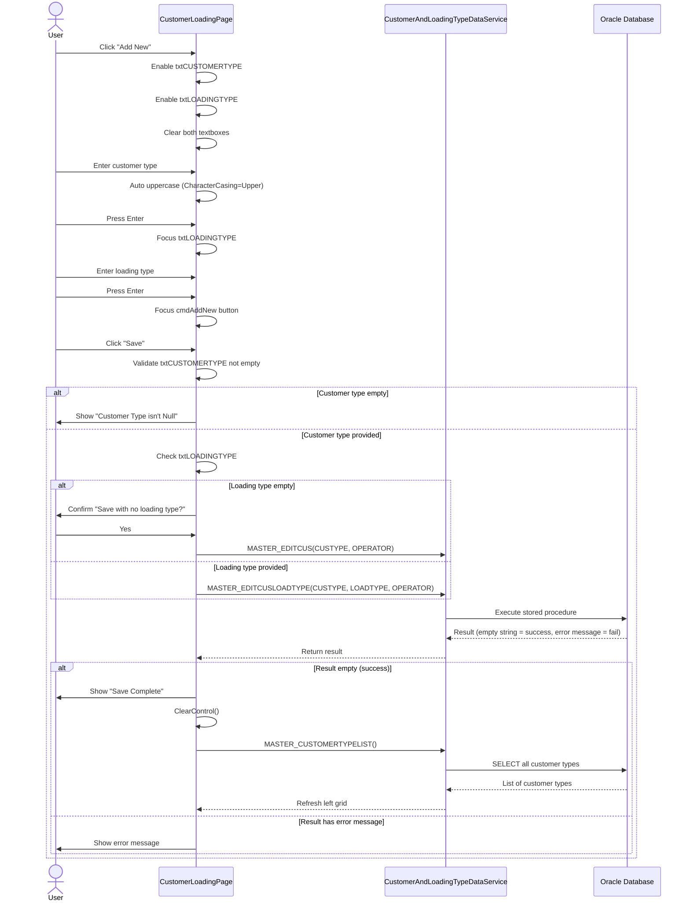

---

## 12. Control Enable/Disable Logic

### Field State Management

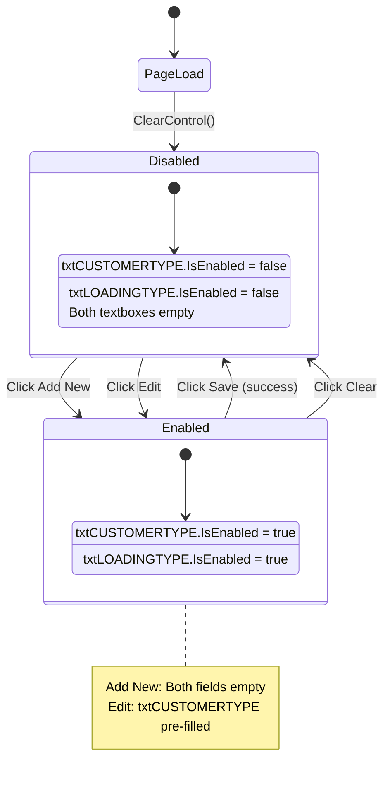

### cmdDeleteLoadingType Enable Logic

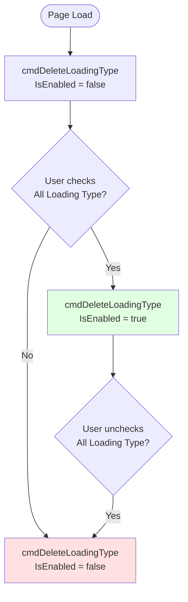

---

## 13. Data Binding & Grid Population

### Grid Data Binding Pattern

**Issue**: Manual list creation instead of direct binding

```csharp
// Current implementation (inefficient)
List<MASTER_CUSTOMERTYPELIST> result = Service.MASTER_CUSTOMERTYPELIST();
List<MASTER_CUSTOMERTYPELIST> dataList = new List<MASTER_CUSTOMERTYPELIST>();

foreach (var row in result)
{
    MASTER_CUSTOMERTYPELIST dataItemNew = new MASTER_CUSTOMERTYPELIST();
    dataItemNew.CUSTOMERTYPE = row.CUSTOMERTYPE; // Same data copied
    dataList.Add(dataItemNew);
}

gridMASTER_CUSTOMERTYPELIST.ItemsSource = dataList; // Binding
```

**Problem**:
- Unnecessary loop copying data to new list
- `result[i].CUSTOMERTYPE` should be `row.CUSTOMERTYPE` (using loop variable but indexing)
- No actual transformation happening

**Better approach**:
```csharp
// Direct binding
var result = Service.MASTER_CUSTOMERTYPELIST();
gridMASTER_CUSTOMERTYPELIST.ItemsSource = result;
```

---

## 14. Exception Handling

### Error Handling Pattern

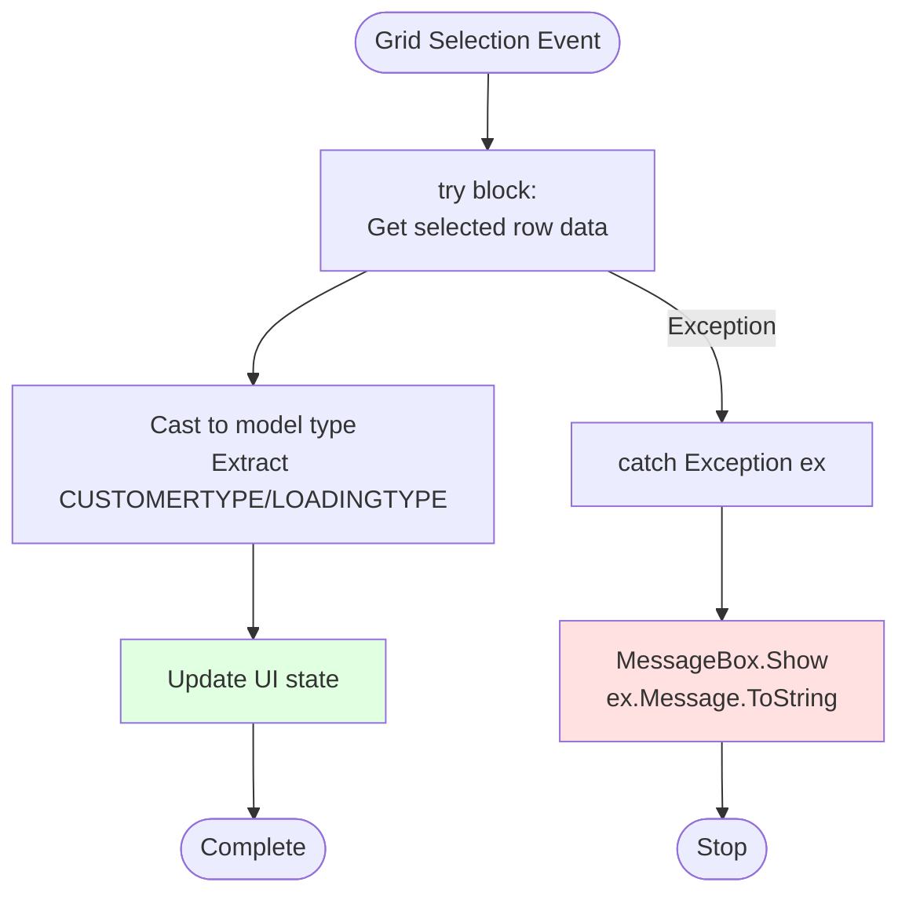

**Exception Handling**:
- Grid selection events wrapped in try-catch
- Only displays exception message (no logging)
- No retry logic
- User must manually retry

---

## 15. Critical Bugs & Issues

### 🔴 Critical Issues

1. **Inefficient Data Binding**
   - Location: `MASTER_CUSTOMERTYPELIST()`, `MASTER_GETLOADINGBYCUSTYPE()`
   - Issue: Unnecessary foreach loop copying data to new list
   - Impact: Performance degradation, memory waste
   - Fix: Direct binding `gridMASTER_CUSTOMERTYPELIST.ItemsSource = result;`

2. **No Async Operations**
   - Location: All database calls
   - Issue: UI freezes during database queries
   - Impact: Poor user experience
   - Fix: Implement async/await pattern

3. **Silent Failures**
   - Location: Delete operations
   - Issue: Shows "Can't Delete" but doesn't explain why
   - Impact: User confusion
   - Fix: Return detailed error messages from stored procedures

### 🟠 High Priority Issues

4. **Operator Field Never Validated**
   - Location: `cmdSave_Click`
   - Issue: `txtOperator` can be empty (no validation)
   - Impact: Records saved without operator tracking
   - Fix: Add operator validation

5. **Redundant Grid Clearing Code**
   - Location: `ClearControl()`, `MASTER_CUSTOMERTYPELIST()`, `MASTER_GETLOADINGBYCUSTYPE()`
   - Issue: Same grid clearing code repeated 6+ times
   - Impact: Code duplication, maintenance burden
   - Fix: Extract to helper method

6. **Thai Comments Mixed with English**
   - Location: Lines 355, 363, 404, 412, 451
   - Comment: `// ใช้สำหรับ clear ค่าที่เลือกใน DataGrid`
   - Impact: Internationalization issue
   - Fix: Standardize to English

### 🟡 Medium Priority Issues

7. **No Loading Indicator**
   - Location: All database operations
   - Issue: No visual feedback during data loading
   - Impact: User doesn't know if operation is processing
   - Fix: Add loading spinner/progress bar

8. **No Input Length Limits**
   - Location: `txtCUSTOMERTYPE`, `txtLOADINGTYPE`
   - Issue: No MaxLength property set
   - Impact: User can enter arbitrarily long text (database will truncate)
   - Fix: Set MaxLength based on database column size

9. **Unused Variable**
   - Location: Line 56 `string opera = string.Empty;`
   - Issue: Variable declared but logic check `opera != ""` always false
   - Impact: Operator setup never works correctly
   - Fix: Remove variable or fix initialization logic

---

## 16. Business Rules Summary

| Rule | Description | Enforcement |
|------|-------------|-------------|
| **Customer Type Required** | Cannot save without customer type | UI validation (line 160) |
| **Loading Type Optional** | Can save customer type without loading type | UI confirmation (line 168) |
| **1:N Relationship** | One customer type can have multiple loading types | Database design + filtering |
| **Delete Loading Type Restriction** | Can only delete loading type in "All" mode | UI button enable/disable |
| **Auto Uppercase** | Customer and loading types auto-converted to uppercase | XAML CharacterCasing="Upper" |
| **Operator Tracking** | Every save includes operator name | Passed to stored procedures |
| **Reload After Save** | Grid refreshes after successful save | ClearControl() + MASTER_CUSTOMERTYPELIST() |
| **Delete Confirmation** | User must confirm before deleting | MessageBox confirmation dialogs |

---

## 17. Modernization Recommendations

### Priority 1: Critical Refactoring

1. **Extract Service Layer**
   ```csharp
   public interface ICustomerLoadingTypeService
   {
       Task<List<CustomerTypeModel>> GetAllCustomerTypesAsync();
       Task<List<LoadingTypeModel>> GetLoadingTypesByCustomerAsync(string customerType);
       Task<ServiceResult> SaveCustomerAndLoadingTypeAsync(string customerType, string loadingType, string operatorId);
       Task<ServiceResult> SaveCustomerOnlyAsync(string customerType, string operatorId);
       Task<bool> DeleteCustomerTypeAsync(string customerType);
       Task<bool> DeleteLoadingTypeAsync(string loadingType);
   }
   ```

2. **Implement MVVM Pattern**
   - Create `CustomerLoadingTypeViewModel`
   - Use `ObservableCollection` for grids
   - Implement `INotifyPropertyChanged`
   - Use commands instead of click events

3. **Add Input Validation**
   ```csharp
   public class CustomerTypeValidator : AbstractValidator<CustomerTypeModel>
   {
       public CustomerTypeValidator()
       {
           RuleFor(x => x.CustomerType)
               .NotEmpty().WithMessage("Customer Type is required")
               .MaximumLength(50).WithMessage("Customer Type cannot exceed 50 characters");

           RuleFor(x => x.LoadingType)
               .MaximumLength(50).When(x => !string.IsNullOrEmpty(x.LoadingType));

           RuleFor(x => x.Operator)
               .NotEmpty().WithMessage("Operator is required");
       }
   }
   ```

### Priority 2: Performance Optimization

4. **Implement Async/Await**
   - Convert all database calls to async
   - Add loading indicators
   - Prevent UI freezing

5. **Direct Data Binding**
   - Remove unnecessary foreach loops
   - Bind service results directly to grids

### Priority 3: User Experience

6. **Add Success/Error Feedback**
   - Show success notifications
   - Display detailed error messages
   - Add loading spinners

7. **Keyboard Navigation Improvements**
   - Add Tab order management
   - Implement Enter key on Save button
   - Add Escape key to clear/cancel

### Priority 4: Code Quality

8. **Remove Code Duplication**
   - Extract grid clearing to helper
   - Create reusable confirmation dialog
   - Standardize error handling

9. **Fix Language Consistency**
   - Convert Thai comments to English
   - Standardize variable naming

---

## 18. Testing Checklist

### Functional Testing

- [ ] **Add New Customer Type Only**
  - [ ] Click Add New → Enter customer type → Leave loading type empty
  - [ ] Click Save → Confirm dialog appears
  - [ ] Confirm Yes → Save succeeds → Grid refreshes

- [ ] **Add New Customer Type + Loading Type**
  - [ ] Click Add New → Enter both fields
  - [ ] Click Save → Save succeeds immediately (no confirmation)

- [ ] **Edit Existing Customer Type**
  - [ ] Select customer type from left grid
  - [ ] Click Edit → Field pre-filled
  - [ ] Modify value → Save → Grid refreshes

- [ ] **Delete Customer Type**
  - [ ] Select customer type
  - [ ] Click Delete → Confirmation dialog
  - [ ] Confirm Yes → Deleted → Grid refreshes

- [ ] **Filter Loading Types by Customer**
  - [ ] Select customer type from left grid
  - [ ] Right grid shows only related loading types

- [ ] **View All Loading Types**
  - [ ] Check "All Loading Type" checkbox
  - [ ] Right grid shows all loading types
  - [ ] Delete button enabled

- [ ] **Delete Loading Type**
  - [ ] Check "All Loading Type"
  - [ ] Select loading type from right grid
  - [ ] Click Delete → Confirmation → Deleted → Grid refreshes

- [ ] **Clear Function**
  - [ ] Enter data in fields
  - [ ] Click Clear → All fields cleared → Grids reloaded

- [ ] **Keyboard Navigation**
  - [ ] txtCUSTOMERTYPE + Enter → Focus moves to txtLOADINGTYPE
  - [ ] txtLOADINGTYPE + Enter → Focus moves to cmdAddNew

- [ ] **Auto Uppercase**
  - [ ] Type lowercase letters → Automatically converted to uppercase

### Edge Case Testing

- [ ] **Empty Grids**
  - [ ] Database empty → Grids show no data → No errors

- [ ] **Duplicate Customer Type**
  - [ ] Try to save existing customer type → Error from database

- [ ] **Delete in Use**
  - [ ] Try to delete customer type with loading types → "Can't Delete" message

- [ ] **Long Text Input**
  - [ ] Enter very long customer/loading type name → Behavior?

- [ ] **Special Characters**
  - [ ] Enter special characters (@#$%^&*) → Accepted or rejected?

- [ ] **Rapid Clicking**
  - [ ] Click Save multiple times rapidly → Duplicate saves?

- [ ] **Grid Selection While Empty**
  - [ ] Click on empty grid → No errors

### Data Integrity Testing

- [ ] **Database Consistency**
  - [ ] Check tblCustomerType records after add
  - [ ] Check tblLoadingType records after add
  - [ ] Verify operator name recorded correctly
  - [ ] Verify timestamps (if any)

- [ ] **Referential Integrity**
  - [ ] Customer type with loading types cannot be deleted
  - [ ] Loading types orphaned when customer deleted (should fail)

---

## 19. Metrics

| Metric | Value | Notes |
|--------|-------|-------|
| **Lines of Code** | 555 | Code-behind only |
| **XAML Lines** | 269 | UI definition |
| **Total LOC** | 824 | Both files |
| **Methods** | 20 | Event handlers + helpers |
| **Database Calls** | 6 | All synchronous |
| **Grids** | 2 | Master-detail relationship |
| **Buttons** | 8 | Add, Edit, Delete (2), Clear, Save, Back |
| **TextBoxes** | 3 | Customer type, loading type, operator |
| **Complexity** | Medium | Master-detail CRUD |
| **Code Duplication** | ~30% | Grid clearing repeated |
| **Exception Handlers** | 2 | Grid selection events only |
| **Validation Rules** | 1 | Customer type not empty |

---

## 20. Dependencies

### Service Layer
- **CustomerAndLoadingTypeDataService.Instance**
  - Singleton pattern
  - 6 methods (list, get, edit×2, delete×2)

### External Libraries
- **NLib** - Custom framework (PageManager, ShowMessageBox extension)
- **LuckyTex.Services** - Data services
- **LuckyTex.Models** - Entity models

### Database Tables
- **tblCustomerType** - Customer type master
- **tblLoadingType** - Loading type master (references tblCustomerType)

---

**Document Version**: 1.0
**Analysis Completed**: 2025-10-10
**Analyst Notes**: Simple master-detail CRUD page with moderate complexity. Main issues are lack of async operations and inefficient data binding. Good candidate for MVVM refactoring.
