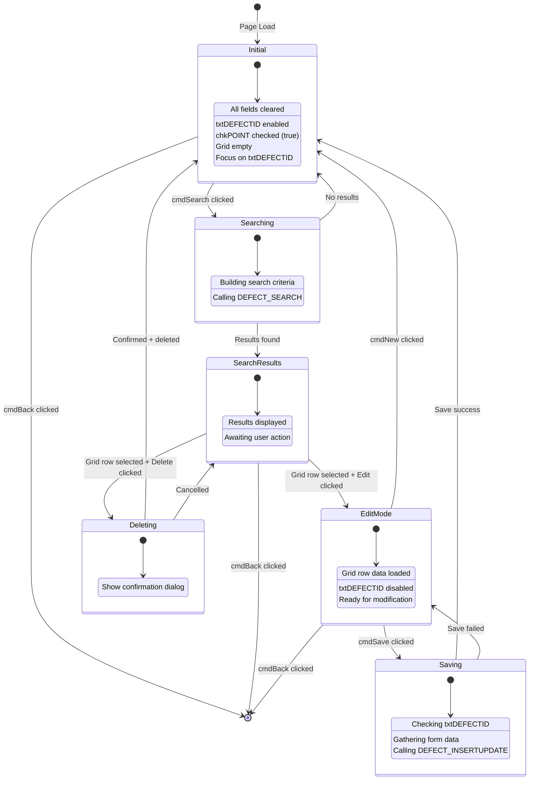
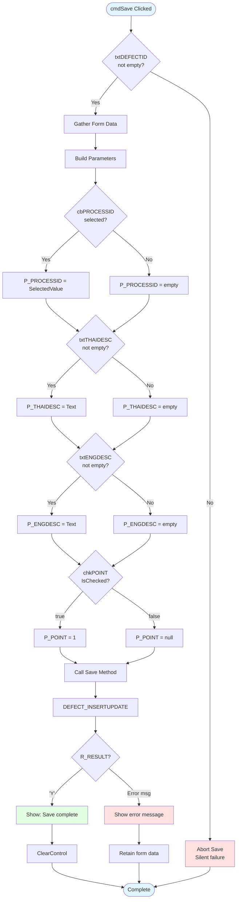
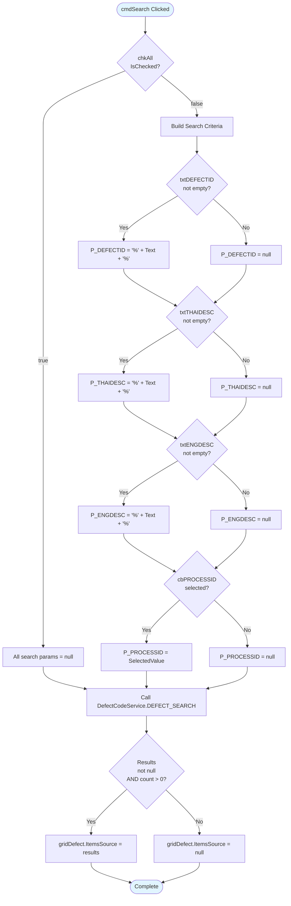
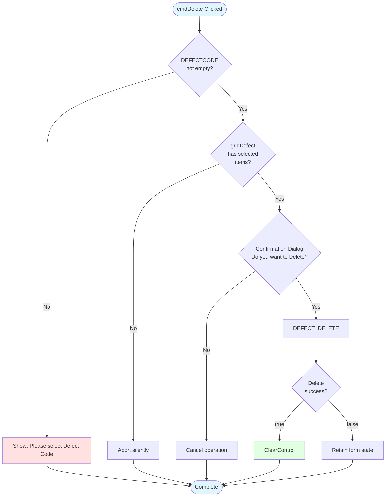
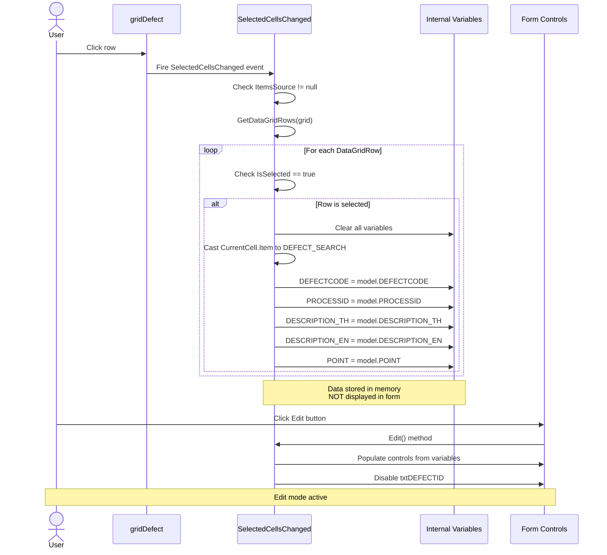
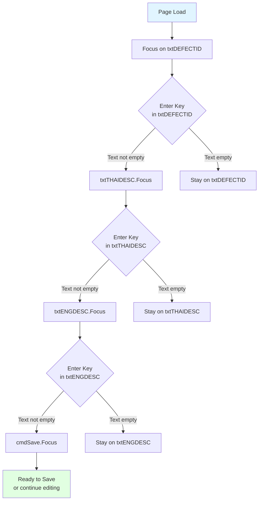
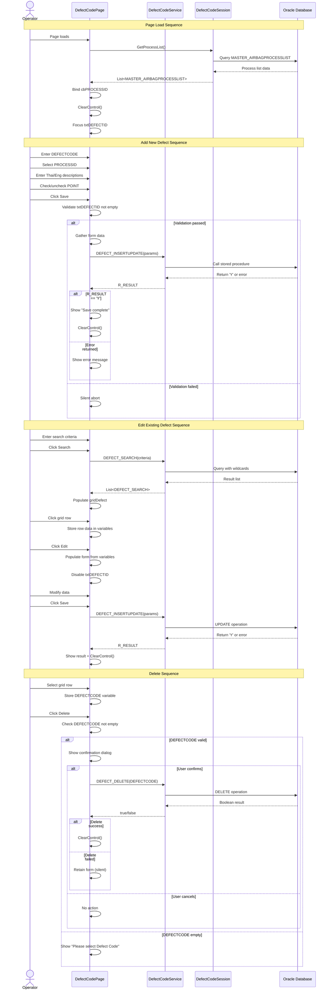
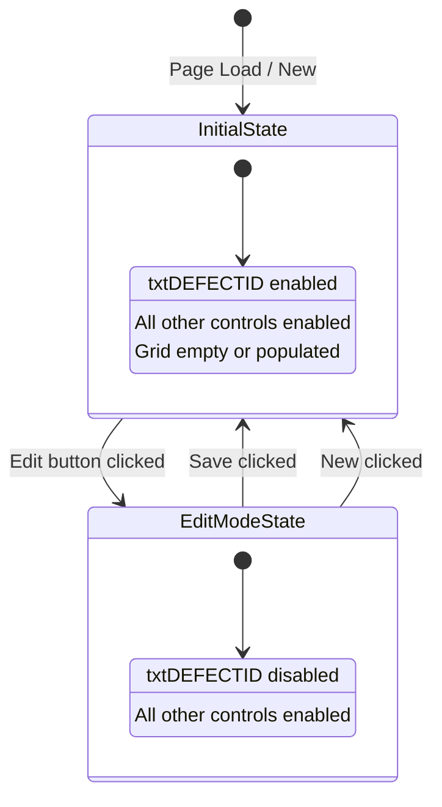

# UI Logic Analysis: Defect Code Master Data

**Module**: 16 - Defect Code
**Page**: DefectCodePage.xaml
**Type**: Master Data CRUD
**Analysis Date**: 2025-10-10
**Document ID**: 043

---

## 1. Overview

### 1.1 Purpose
Master data management page for defect code configuration. Allows users to create, edit, search, and delete defect codes used throughout the production system for quality tracking and defect classification.

### 1.2 Key Features
- Defect code CRUD operations (Create, Read, Update, Delete)
- Process type association (dropdown from MASTER_AIRBAGPROCESSLIST)
- Bilingual defect descriptions (Thai and English)
- Point indicator (boolean flag for defect scoring)
- Wildcard search with "All" override option
- Grid-based search results display
- Edit mode with primary key protection

### 1.3 UI Pattern
**Classic Master Data CRUD Pattern**:
- Input form at top (5 fields)
- Action buttons row (Search, Save, New, Edit, Delete)
- Results grid at bottom (read-only display)
- Grid selection populates edit mode
- New button clears form
- Back button for navigation

---

## 2. Screen Layout

### 2.1 ASCII Layout

```
+------------------------------------------------------------------+
|                         DEFECT CODE                              |
+------------------------------------------------------------------+
| Defect Code: [________]  [x] All     Process: [Dropdown___▼]    |
|                                                                   |
| Thai Description: [_____________________________________]         |
|                                                                   |
| Eng Description:  [_____________________________________]         |
|                                                                   |
| [x] Point                                                         |
|                                                                   |
| [Search] [Save] [New] [Edit] [Delete]                           |
|                                                                   |
| +--------------------------------------------------------------+ |
| |   DEFECT CODE  |  PROCESS  |  THAI DESC  |  ENG DESC  | PT | |
| +--------------------------------------------------------------+ |
| | D001           | WEAVING   | ผ้าหลุด      | Dropped    | ✓  | |
| | D002           | FINISHING | คราบน้ำมัน   | Oil Stain  | ✓  | |
| | ...                                                          | |
| +--------------------------------------------------------------+ |
|                                                                   |
+------------------------------------------------------------------+
|                                            [Back]                 |
+------------------------------------------------------------------+
```

### 2.2 Controls Inventory

| Control Name | Type | Purpose | Binding/Source | Validation |
|--------------|------|---------|----------------|------------|
| `txtDEFECTID` | TextBox | Defect code input | User input | Required for save |
| `chkAll` | CheckBox | Search all records override | User input | Nullifies search criteria |
| `cbPROCESSID` | ComboBox | Process type selection | MASTER_AIRBAGPROCESSLIST | Optional |
| `txtTHAIDESC` | TextBox | Thai description | User input | Optional |
| `txtENGDESC` | TextBox | English description | User input | Optional |
| `chkPOINT` | CheckBox | Point indicator | User input | Converts to decimal (1/null) |
| `cmdSearch` | Button | Execute search | Event: cmdSearch_Click | None |
| `cmdSave` | Button | Save record | Event: cmdSave_Click | Requires txtDEFECTID |
| `cmdNew` | Button | Clear form | Event: cmdNew_Click | None |
| `cmdEdit` | Button | Edit mode | Event: cmdEdit_Click | Requires grid selection |
| `cmdDelete` | Button | Delete record | Event: cmdDelete_Click | Requires grid selection |
| `gridDefect` | DataGrid | Search results | DEFECT_SEARCH model | Read-only |
| `cmdBack` | Button | Navigate back | Event: cmdBack_Click | None |

---

## 3. UI State Machine



---

## 4. Input Validation Logic

### 4.1 Validation Flowchart



### 4.2 Validation Rules Table

| Field | Rule | Validation Type | Error Handling | Business Logic |
|-------|------|-----------------|----------------|----------------|
| DEFECTCODE | Required | Pre-submit check | Silent abort if empty | Primary key field |
| PROCESSID | Optional | None | Accepts null | Foreign key to MASTER_AIRBAGPROCESSLIST |
| DESCRIPTION_TH | Optional | None | Accepts empty | Bilingual support |
| DESCRIPTION_EN | Optional | None | Accepts empty | Bilingual support |
| POINT | Optional | Boolean conversion | Converts to decimal (1/null) | 1 = defect has point value, null = no point |

**Critical Issue**: No visible error message when txtDEFECTID is empty on save attempt. Silent failure is poor UX.

---

## 5. Search/Filter Logic

### 5.1 Search Flowchart



### 5.2 Search Pattern Analysis

**Wildcard Behavior**:
- All text fields use `"%{input}%"` pattern (LIKE operator)
- Enables partial matching (contains search)
- Process dropdown uses exact match (no wildcard)

**"All" Checkbox Override**:
- When `chkAll.IsChecked == true`: All search parameters set to null
- Database returns ALL records (no filtering)
- Useful for viewing complete defect code list

---

## 6. Delete Operations

### 6.1 Delete Flowchart



### 6.2 Delete Operation Details

**Pre-Delete Validation**:
1. Check internal variable `DEFECTCODE` (populated by grid selection)
2. Verify `gridDefect.SelectedItems.Count > 0`
3. Show confirmation dialog

**Critical Bug**: Double-check logic is redundant. If DEFECTCODE is empty, grid selection check becomes meaningless.

**Delete Service Call**:
```csharp
DefectCodeService.Instance.DEFECT_DELETE(DEFECTCODE)
```
- Returns boolean (true/false)
- No error message returned from service
- Success: Clears form automatically
- Failure: Silent (no user feedback)

---

## 7. Grid Selection Logic

### 7.1 Selection Sequence Diagram



### 7.2 Grid Selection Behavior

**Important Pattern**: Grid selection stores data in **internal variables** ONLY:
- `DEFECTCODE`
- `PROCESSID`
- `DESCRIPTION_TH`
- `DESCRIPTION_EN`
- `POINT`

**Form controls are NOT populated** until user clicks **Edit button**.

**Data Model**: `DEFECT_SEARCH` (from LuckyTex.Models)
- Contains 5 fields + PROCESSDESCRIPTION for display

---

## 8. Keyboard Navigation

### 8.1 Keyboard Flow Diagram



### 8.2 Enter Key Handlers

| Control | Method | Condition | Target | Notes |
|---------|--------|-----------|--------|-------|
| txtDEFECTID | txtDEFECTID_KeyDown | Text != "" | txtTHAIDESC | SelectAll() + Focus() |
| txtTHAIDESC | txtTHAIDESC_KeyDown | Text != "" | txtENGDESC | SelectAll() + Focus() |
| txtENGDESC | txtENGDESC_KeyDown | Text != "" | cmdSave | Focus() only |

**Bug**: No keyboard navigation for:
- `chkAll` checkbox
- `cbPROCESSID` dropdown
- `chkPOINT` checkbox

Users must use mouse to interact with these controls.

**Best Practice**: Keyboard flow skips optional fields (Process, Point), focusing on core data entry path.

---

## 9. Database Operations

### 9.1 Stored Procedures

| Procedure Name | Purpose | Parameters | Returns | Service Method |
|----------------|---------|------------|---------|----------------|
| DEFECT_SEARCH | Search defect codes | P_DEFECTID, P_PROCESSID, P_THAIDESC, P_ENGDESC | List&lt;DEFECT_SEARCH&gt; | DefectCodeService.Instance.DEFECT_SEARCH() |
| DEFECT_INSERTUPDATE | Insert or update defect code | P_DEFECTID, P_PROCESSID, P_THAIDESC, P_ENGDESC, P_POINT | String (Y/error msg) | DefectCodeService.Instance.DEFECT_INSERTUPDATE() |
| DEFECT_DELETE | Delete defect code | DEFECTCODE | Boolean | DefectCodeService.Instance.DEFECT_DELETE() |
| (Process list) | Load process dropdown | None | List&lt;MASTER_AIRBAGPROCESSLIST&gt; | _session.GetProcessList() |

### 9.2 Service Layer

**Service Class**: `DefectCodeService` (Singleton pattern)
- Accessed via: `DefectCodeService.Instance`
- Wraps Oracle stored procedure calls

**Session Class**: `DefectCodeSession`
- Used for auxiliary data loading (process list)
- Separate from main service

### 9.3 Data Models

**DEFECT_SEARCH** (Search Results):
- DEFECTCODE (string)
- PROCESSID (string)
- PROCESSDESCRIPTION (string) - for display only
- DESCRIPTION_TH (string)
- DESCRIPTION_EN (string)
- POINT (decimal?)

**MASTER_AIRBAGPROCESSLIST** (Process Dropdown):
- PROCESSID (string) - value
- PROCESSDESCRIPTION (string) - display

---

## 10. Business Logic Sequence

### 10.1 Add/Edit/Save Sequence



---

## 11. Control Enable/Disable Logic

### 11.1 State Diagram



### 11.2 Enable/Disable Rules

| State | txtDEFECTID | Other Controls | Trigger |
|-------|-------------|----------------|---------|
| Initial (New) | Enabled | Enabled | Page load, cmdNew click |
| Edit Mode | **Disabled** | Enabled | Grid selection + cmdEdit click |
| After Save Success | Enabled | Enabled | Save returns 'Y' |

**Key Business Rule**: Primary key field (DEFECTCODE) cannot be modified in edit mode. This prevents accidental key changes and maintains referential integrity.

**No control state changes for**:
- Search operation
- Delete operation
- Grid selection (without Edit click)

---

## 12. Exception Handling

### 12.1 Exception Handling Pattern

**Try-Catch Locations**:
1. `gridDefect_SelectedCellsChanged` (lines 218-273)
   - Catches: All exceptions during grid row data extraction
   - Handling: `MessageBox.Show(ex.Message.ToString(), "Error", ...)`
   - Recovery: None (state remains inconsistent)

2. `LoadProcessList` (lines 459-474)
   - Catches: All exceptions during process list loading
   - Handling: `"Please Check Data".ShowMessageBox(true)`
   - Recovery: None (dropdown remains empty)

3. Numeric parsing in Save method (lines 159-205)
   - Catches: Parse exceptions for WIDTH, WEAVEWIDTH, COREWEIGHT
   - Handling: Sets value to 0
   - Recovery: Continues save with default value

**Missing Exception Handling**:
- Service calls (DEFECT_SEARCH, DEFECT_INSERTUPDATE, DEFECT_DELETE)
- Database connection failures
- Network timeouts

### 12.2 Error Message Patterns

| Error Source | Message | User Visibility | Recovery Action |
|--------------|---------|-----------------|-----------------|
| Empty DEFECTCODE on save | None (silent) | Not visible | User must notice nothing happened |
| Grid selection error | ex.Message | MessageBox | None - user confused |
| Process list load error | "Please Check Data" | MessageBox | Dropdown unusable |
| Save operation error | Database error message | MessageBox | User can retry |
| Delete - no selection | "Please select Defect Code" | MessageBox | Select row first |
| Delete confirmation | "Do you want to Delete" | Confirmation dialog | User chooses Yes/No |

---

## 13. Critical Bugs & Issues

### 13.1 Critical Issues (High Priority)

#### 🔴 CRITICAL-001: Silent Save Failure
- **Location**: cmdSave_Click (line 103)
- **Issue**: If txtDEFECTID is empty, save silently aborts with no user feedback
- **Impact**: User clicks Save, nothing happens, confusion ensues
- **Fix**: Add validation message: `"Defect Code is required".ShowMessageBox()`

#### 🔴 CRITICAL-002: Missing Delete Failure Feedback
- **Location**: Delete method (line 426)
- **Issue**: If `DEFECT_DELETE` returns false, no error message shown
- **Impact**: User thinks delete succeeded when it actually failed
- **Fix**: Add error handling for false return

#### 🔴 CRITICAL-003: Inconsistent Save Success Logic
- **Location**: Save method (line 440-450)
- **Issue**: Success check is `if (!string.IsNullOrEmpty(R_RESULT))` then `if (R_RESULT == "Y")`
  - This means empty string is treated as success (incorrect)
  - Should check for "Y" first, then handle errors
- **Impact**: Database errors might be mishandled
- **Fix**: Reverse logic - check R_RESULT == "Y" first

### 13.2 High Priority Issues

#### 🟠 HIGH-001: No Process List Error Recovery
- **Location**: LoadProcessList (line 469)
- **Issue**: If process list fails to load, dropdown is empty and page is unusable
- **Impact**: Cannot associate defects with processes
- **Fix**: Retry mechanism or fallback data

#### 🟠 HIGH-002: Redundant Delete Validation
- **Location**: cmdDelete_Click (line 143-151)
- **Issue**: Checks DEFECTCODE variable AND grid selection count (redundant)
- **Impact**: Code complexity, potential logic errors
- **Fix**: Single validation point - prefer grid selection check

#### 🟠 HIGH-003: No Empty Search Results Message
- **Location**: Search method (line 369-377)
- **Issue**: If search returns no results, grid is cleared but no message shown
- **Impact**: User doesn't know if search worked or found nothing
- **Fix**: Add "No records found" message

### 13.3 Medium Priority Issues

#### 🟡 MEDIUM-001: Incomplete Keyboard Navigation
- **Location**: KeyDown handlers
- **Issue**: No Tab order or Enter key handling for checkboxes/dropdowns
- **Impact**: Power users must use mouse
- **Fix**: Add keyboard navigation for all controls

#### 🟡 MEDIUM-002: Numeric Field Parsing Defaults to Zero
- **Location**: This page doesn't have numeric fields
- **Note**: Pattern exists in ItemCode page (see document 044)

#### 🟡 MEDIUM-003: No Duplicate Defect Code Check
- **Location**: Save method
- **Issue**: No client-side check for duplicate DEFECTCODE before save
- **Impact**: Database constraint violation error instead of friendly message
- **Fix**: Add pre-save duplicate check

---

## 14. Business Rules Summary

| Rule ID | Business Rule | Enforcement | Validation Point |
|---------|---------------|-------------|------------------|
| BR-001 | DEFECTCODE is mandatory | Client-side (weak) | cmdSave_Click (silent check) |
| BR-002 | DEFECTCODE is primary key | Database | Edit mode disables field |
| BR-003 | PROCESSID is optional | None | Accepts null |
| BR-004 | Descriptions (TH/EN) are optional | None | Accepts empty strings |
| BR-005 | POINT is boolean (1 or null) | Client-side | Checkbox converts to decimal |
| BR-006 | Search supports wildcards | Service-side | Appends % to inputs |
| BR-007 | "All" checkbox overrides search | Client-side | Sets all params to null |
| BR-008 | Delete requires confirmation | Client-side | MessageBox.Show confirmation |
| BR-009 | Edit mode prevents key modification | Client-side | txtDEFECTID.IsEnabled = false |
| BR-010 | Process list loads on page init | Constructor | LoadProcessList() call |

---

## 15. Modernization Recommendations

### 15.1 Priority 1 (Critical - Fix First)

1. **Add Input Validation Framework**
   - Replace silent failures with validation messages
   - Use FluentValidation or IDataErrorInfo pattern
   - Show validation errors inline (not MessageBox)

2. **Implement Proper Error Handling**
   - Wrap all service calls in try-catch
   - Log exceptions to file/database
   - Show user-friendly error messages
   - Add retry capability for transient failures

3. **Fix Save Success Logic**
   - Correct the R_RESULT checking logic
   - Standardize on consistent return value pattern across all services

### 15.2 Priority 2 (High - Improve UX)

4. **Add MVVM Architecture**
   - Create DefectCodeViewModel
   - Implement INotifyPropertyChanged
   - Move business logic out of code-behind
   - Enable proper unit testing

5. **Implement Command Pattern**
   - Replace button Click events with ICommand
   - Enable/disable buttons based on state
   - Centralize can-execute logic

6. **Enhance Search UX**
   - Add "No results found" message
   - Add loading indicator during search
   - Add result count display
   - Add clear search button

### 15.3 Priority 3 (Medium - Enhance Functionality)

7. **Improve Keyboard Navigation**
   - Add full Tab order support
   - Implement Enter key for all controls
   - Add keyboard shortcuts (Ctrl+S for Save, etc.)
   - Add Escape key to cancel edit mode

8. **Add Data Binding**
   - Bind form controls to model properties
   - Eliminate manual data gathering code
   - Use two-way binding for edit mode

9. **Implement Async Operations**
   - Make all database calls async (await Task)
   - Add progress indicators
   - Improve responsiveness

### 15.4 Priority 4 (Low - Nice to Have)

10. **Add Client-Side Duplicate Check**
    - Check DEFECTCODE uniqueness before save
    - Query database or cache existing codes
    - Show friendly message instead of DB error

11. **Add Audit Trail**
    - Track who created/modified defect codes
    - Add operator field to DEFECT_INSERTUPDATE
    - Display last modified date in grid

12. **Improve Delete Operation**
    - Add "Delete success" confirmation message
    - Add undo capability (soft delete)
    - Show referential integrity errors (if defect code is in use)

---

## 16. Testing Checklist

### 16.1 Functional Testing

- [ ] **Add New Defect Code**
  - [ ] Enter all fields, save successfully
  - [ ] Enter only required field (DEFECTCODE), save successfully
  - [ ] Save with empty DEFECTCODE - verify error message (FAILS - silent)
  - [ ] Save with duplicate DEFECTCODE - verify error handling
  - [ ] Verify chkPOINT checked converts to decimal 1
  - [ ] Verify chkPOINT unchecked converts to null

- [ ] **Search Defect Codes**
  - [ ] Search by DEFECTCODE (partial match)
  - [ ] Search by PROCESSID (exact match)
  - [ ] Search by Thai description (partial match)
  - [ ] Search by English description (partial match)
  - [ ] Search with multiple criteria (AND logic)
  - [ ] Search with "All" checkbox - returns all records
  - [ ] Search with no results - verify empty grid
  - [ ] Verify wildcard pattern: %input%

- [ ] **Edit Existing Defect Code**
  - [ ] Search and select a record
  - [ ] Click Edit button
  - [ ] Verify txtDEFECTID is disabled
  - [ ] Modify other fields
  - [ ] Save successfully
  - [ ] Verify update in database

- [ ] **Delete Defect Code**
  - [ ] Select record from grid
  - [ ] Click Delete button
  - [ ] Verify confirmation dialog appears
  - [ ] Confirm deletion - verify record removed
  - [ ] Cancel deletion - verify record retained
  - [ ] Click Delete with no selection - verify error message
  - [ ] Delete defect code in use - verify referential integrity error

- [ ] **Keyboard Navigation**
  - [ ] Tab through all controls in correct order
  - [ ] Enter key on txtDEFECTID moves to txtTHAIDESC (if not empty)
  - [ ] Enter key on txtTHAIDESC moves to txtENGDESC (if not empty)
  - [ ] Enter key on txtENGDESC focuses cmdSave (if not empty)
  - [ ] Enter key with empty field stays on same control

- [ ] **Process Dropdown**
  - [ ] Verify process list loads on page init
  - [ ] Select process from dropdown
  - [ ] Save with selected process
  - [ ] Save with no process selected (null)
  - [ ] Verify process description displays in grid

- [ ] **New Button**
  - [ ] Click New - verify all fields cleared
  - [ ] Click New - verify grid cleared
  - [ ] Click New - verify txtDEFECTID enabled
  - [ ] Click New - verify focus on txtDEFECTID
  - [ ] Click New - verify chkPOINT checked (default true)

- [ ] **Grid Selection**
  - [ ] Click grid row - verify internal variables populated
  - [ ] Click grid row - verify form controls NOT populated (until Edit)
  - [ ] Click different rows - verify variables update
  - [ ] Click Edit after selection - verify form populated

### 16.2 Error Handling Testing

- [ ] **Database Errors**
  - [ ] Disconnect database - verify error handling
  - [ ] Trigger constraint violation - verify error message
  - [ ] Trigger timeout - verify error handling

- [ ] **Service Errors**
  - [ ] DEFECT_SEARCH returns null - verify handling
  - [ ] DEFECT_INSERTUPDATE returns error message - verify display
  - [ ] DEFECT_DELETE returns false - verify handling (FAILS - silent)

- [ ] **Process List Load Failure**
  - [ ] Simulate process list load error
  - [ ] Verify error message: "Please Check Data"
  - [ ] Verify dropdown remains empty

- [ ] **Grid Selection Errors**
  - [ ] Trigger exception in SelectedCellsChanged
  - [ ] Verify error message displays
  - [ ] Verify application doesn't crash

### 16.3 UI State Testing

- [ ] **Control States**
  - [ ] Initial state: All controls enabled
  - [ ] Edit mode: txtDEFECTID disabled, others enabled
  - [ ] After save: All controls enabled
  - [ ] After delete: All controls enabled

- [ ] **Button States**
  - [ ] All buttons enabled at all times (current implementation)
  - [ ] Verify buttons respond correctly in all states

### 16.4 Data Validation Testing

- [ ] **DEFECTCODE Field**
  - [ ] Enter valid code - save succeeds
  - [ ] Empty code - save fails silently (BUG)
  - [ ] Special characters - verify allowed
  - [ ] Very long code - verify max length handling

- [ ] **Description Fields**
  - [ ] Thai characters - verify support
  - [ ] English characters - verify support
  - [ ] Special characters - verify support
  - [ ] Very long descriptions - verify max length
  - [ ] Empty descriptions - verify allowed

- [ ] **POINT Checkbox**
  - [ ] Checked - verify saves as decimal 1
  - [ ] Unchecked - verify saves as null
  - [ ] Edit mode - verify checkbox reflects stored value (1 = checked, null = unchecked)

### 16.5 Integration Testing

- [ ] **Multi-User Scenarios**
  - [ ] User A edits while User B edits same record
  - [ ] User A deletes while User B edits same record
  - [ ] Verify optimistic concurrency handling

- [ ] **Defect Code Usage**
  - [ ] Create defect code
  - [ ] Use defect code in production module (e.g., Inspection)
  - [ ] Attempt to delete defect code in use
  - [ ] Verify referential integrity protection

- [ ] **Process Association**
  - [ ] Create defect code with process
  - [ ] Use defect code in associated process
  - [ ] Verify process filter works correctly

---

## 17. Metrics

### 17.1 Code Metrics

| Metric | Value | Notes |
|--------|-------|-------|
| Total LOC (C#) | 495 | Code-behind file |
| Total LOC (XAML) | 280 | UI definition |
| **Total LOC** | **775** | Combined |
| Number of methods | 15 | Including event handlers |
| Number of event handlers | 12 | Button clicks + keyboard events |
| Number of private methods | 7 | Business logic methods |
| Number of public methods | 1 | Setup(string user) |
| Cyclomatic complexity (avg) | Low-Medium | Mostly linear flows |
| Max method length | 107 lines | cmdSave_Click (nested validation) |
| Number of database calls | 3 | SEARCH, INSERTUPDATE, DELETE |
| Number of input controls | 5 | 3 TextBox, 1 ComboBox, 2 CheckBox |
| Number of action buttons | 6 | Search, Save, New, Edit, Delete, Back |

### 17.2 UI Complexity

| Element | Count | Complexity |
|---------|-------|------------|
| Input fields | 5 | Low (simple text/boolean inputs) |
| Validation rules | 1 | Low (only required check) |
| State transitions | 5 | Medium (Initial, Search, Edit, Save, Delete) |
| Grid columns | 5 | Low (read-only display) |
| Keyboard handlers | 3 | Low (simple Enter key forwarding) |
| External data sources | 1 | Low (process list dropdown) |

### 17.3 Maintainability Score

| Aspect | Score (1-10) | Rationale |
|--------|--------------|-----------|
| Code readability | 6 | Clear but verbose, missing comments |
| Separation of concerns | 4 | Business logic mixed with UI code |
| Error handling | 3 | Minimal, missing critical cases |
| Testability | 3 | Tight coupling, hard to unit test |
| Documentation | 2 | No inline comments, no XML docs |
| **Overall** | **3.6** | **Needs significant refactoring** |

---

## 18. Dependencies

### 18.1 External Services

| Service | Type | Purpose | Location |
|---------|------|---------|----------|
| DefectCodeService | Singleton | Database operations | LuckyTex.Services |
| DefectCodeSession | Instance | Process list loader | Local instantiation |
| PageManager | Singleton | Navigation | NLib or LuckyTex framework |

### 18.2 Data Models

| Model | Namespace | Usage |
|-------|-----------|-------|
| DEFECT_SEARCH | LuckyTex.Models | Grid binding, search results |
| MASTER_AIRBAGPROCESSLIST | LuckyTex.Models | Process dropdown binding |

### 18.3 Framework Dependencies

| Library | Purpose | Version |
|---------|---------|---------|
| NLib | Utility framework | Unknown |
| System.Windows.Controls | WPF controls | .NET Framework 4.7.2 |
| System.Collections.Generic | List&lt;T&gt; support | .NET Framework 4.7.2 |

### 18.4 Database Dependencies

| Table/SP | Type | Purpose |
|----------|------|---------|
| MASTER_AIRBAGPROCESSLIST | Table | Process master data |
| tblDefect (assumed) | Table | Defect code master data |
| sp_DEFECT_SEARCH | Stored Proc | Search defect codes |
| sp_DEFECT_INSERTUPDATE | Stored Proc | Insert/update defect code |
| sp_DEFECT_DELETE | Stored Proc | Delete defect code |

---

## 19. Additional Notes

### 19.1 Implementation Observations

1. **Operator Tracking Absent**: Unlike CustomerLoadingType page (document 042), this page has `opera` variable but never uses it. The Setup(string user) method sets the variable but DEFECT_INSERTUPDATE doesn't accept operator parameter.

2. **Default Point Value**: On page load/clear, `chkPOINT.IsChecked = true` (line 286). This means defects default to having point values.

3. **Process Dropdown Loading**: Loads in constructor (line 53), before page is visible. If load fails, user sees empty dropdown with no obvious reason.

4. **Grid Interaction Pattern**: Two-step edit process (select row, then click Edit) is consistent with other master data pages but not most user-friendly. Direct row click to populate form would be faster.

5. **No Delete Button State Management**: Delete button is always enabled, even when no record is selected. Should be disabled until valid selection exists.

### 19.2 Comparison to Similar Pages

**Similarities with CustomerLoadingType (042)**:
- Same CRUD pattern
- Same keyboard navigation approach (Enter key progression)
- Same grid selection with Edit button pattern
- Same "All" checkbox search override
- Same ClearControl pattern

**Differences from CustomerLoadingType (042)**:
- No operator tracking in database operations
- No dual-grid layout (simpler single grid)
- No barcode/auto-increment field
- No complex conditional validation
- Simpler data model (5 fields vs 7+ fields)

**Conclusion**: DefectCode is a simplified version of the CustomerLoadingType pattern, suitable as a refactoring template for other simple master data pages.

---

## 20. Refactoring Recommendations Summary

### Quick Wins (1-2 days):
1. Add validation error messages (replace silent failures)
2. Fix save success logic (reverse R_RESULT checking)
3. Add "No results found" message for empty searches
4. Add delete failure feedback

### Medium Effort (1 week):
1. Extract business logic to separate service class
2. Implement MVVM pattern with ViewModel
3. Add comprehensive error handling and logging
4. Improve keyboard navigation

### Long Term (2-3 weeks):
1. Convert to async/await pattern
2. Add unit tests (requires dependency injection)
3. Implement validation framework
4. Add audit trail and soft delete

---

**END OF DOCUMENT 043**
