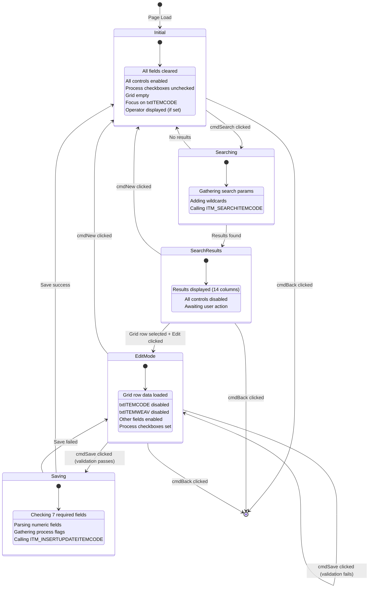
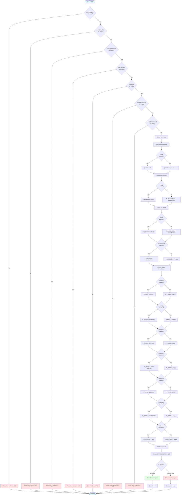
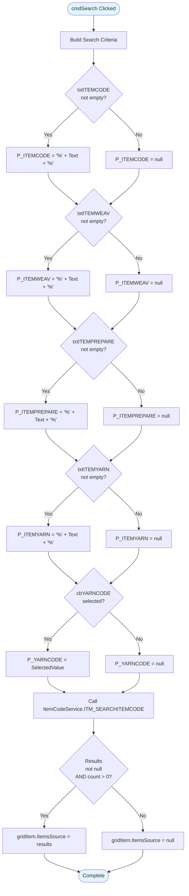
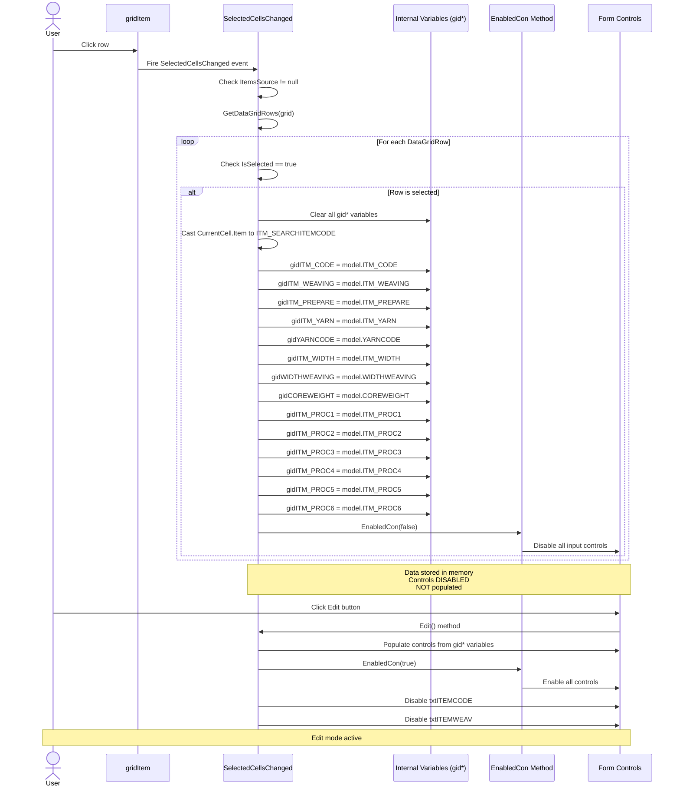
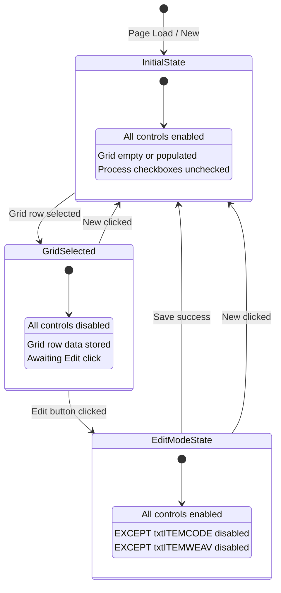

# UI Logic Analysis: Item Code Master Data

**Module**: 17 - Item Code
**Page**: ItemCodePage.xaml
**Type**: Master Data CRUD (Complex)
**Analysis Date**: 2025-10-10
**Document ID**: 044

---

## 1. Overview

### 1.1 Purpose
Master data management page for item code configuration. Item codes define product specifications including dimensions, yarn composition, and required manufacturing process steps. This is a critical configuration that affects production planning, material requirements, and process routing throughout the entire manufacturing system.

### 1.2 Key Features
- Item code CRUD operations (Create, Read, Update)
- Multiple item code variants (Item Code, Item Weaving, Item Prepare, Item Yarn)
- Yarn code association (dropdown: T, J, CHN)
- Dimensional specifications (Width, Weaving Width, Core Weight)
- Process step configuration (6 checkboxes: DRYER, SCOURING, DRYING, HEAT SETTING, COATING, INSPECTION)
- Wildcard search across multiple fields
- Operator tracking (displays current operator)
- Edit mode with dual primary key protection (ITM_CODE + ITM_WEAVING)
- No delete functionality (data preservation)

### 1.3 UI Pattern
**Complex Master Data CRUD Pattern**:
- Multi-field input form (11 input controls)
- Three action buttons (Search, Save, New, Edit - NO Delete)
- Results grid at bottom (14 columns)
- Grid selection + Edit button to populate form
- Comprehensive validation (7 required fields)
- Operator tracking display
- Numeric validation for dimensional fields
- Process configuration via checkboxes

---

## 2. Screen Layout

### 2.1 ASCII Layout

```
+------------------------------------------------------------------------------+
|                              ITEM CODE                                       |
+------------------------------------------------------------------------------+
| Item Code: [______]  Item Weaving: [_________]  Yarn Code: [Dropdown_▼]   |
|                                                                              |
| Item Prepare: [______]  Item Yarn: [_________]  [Search]                   |
|                                                                              |
| Width: [______]  Weaving Width: [______]  Core Weight: [______]            |
|                                                                              |
| [x] DRYER  [x] SCOURING  [x] DRYING  [x] HEAT SETTING  [x] COATING  [ ] INSPECTION |
|                                                                              |
|                        [Save] [New] [Edit]                                   |
|                                                                              |
| +--------------------------------------------------------------------------+ |
| | ITM_CODE | ITM_WEAVING | ITM_PREPARE | ITM_YARN | YARNCODE | WIDTH | ... | |
| +--------------------------------------------------------------------------+ |
| | ABC-001  | WV-001      | PR-001      | YN-001   | T        | 1200  | ... | |
| | ABC-002  | WV-002      | PR-002      | YN-002   | J        | 1500  | ... | |
| | ...                                                                      | |
| +--------------------------------------------------------------------------+ |
|                                                                              |
| Operator: [OPERATOR001]                                                      |
+------------------------------------------------------------------------------+
|                                                  [Back]                      |
+------------------------------------------------------------------------------+
```

### 2.2 Controls Inventory

| Control Name | Type | Purpose | Binding/Source | Validation |
|--------------|------|---------|----------------|------------|
| `txtITEMCODE` | TextBox | Primary item code | User input | Required (R1) |
| `txtITEMWEAV` | TextBox | Item weaving code | User input | Required (R2) |
| `cbYARNCODE` | ComboBox | Yarn type selection | Static: T, J, CHN | Optional |
| `txtITEMPREPARE` | TextBox | Item prepare code | User input | Required (R3) |
| `txtITEMYARN` | TextBox | Item yarn code | User input | Required (R4) |
| `txtWIDTH` | TextBox | Fabric width | User input (numeric) | Required (R5) |
| `txtWEAVEWIDTH` | TextBox | Weaving width | User input (numeric) | Required (R6) |
| `txtCOREWEIGHT` | TextBox | Core weight | User input (numeric) | Required (R7) |
| `chkPROC1_DRYER` | CheckBox | Process step 1 | User input | Optional |
| `chkPROC2_SCOURING` | CheckBox | Process step 2 | User input | Optional |
| `chkPROC3_DRYING` | CheckBox | Process step 3 | User input | Optional |
| `chkPROC4_HEATSETTING` | CheckBox | Process step 4 | User input | Optional |
| `chkPROC5_COATING` | CheckBox | Process step 5 | User input | Optional |
| `chkPROC6_INSPECTION` | CheckBox | Process step 6 | User input | Optional |
| `cmdSearch` | Button | Execute search | Event: cmdSearch_Click | None |
| `cmdSave` | Button | Save record | Event: cmdSave_Click | Complex validation |
| `cmdNew` | Button | Clear form | Event: cmdNew_Click | None |
| `cmdEdit` | Button | Edit mode | Event: cmdEdit_Click | Requires grid selection |
| `gridItem` | DataGrid | Search results | ITM_SEARCHITEMCODE model | Read-only |
| `txtOperator` | TextBox | Operator display | Setup(user) method | Read-only |
| `cmdBack` | Button | Navigate back | Event: cmdBack_Click | None |

---

## 3. UI State Machine



---

## 4. Input Validation Logic

### 4.1 Validation Flowchart



### 4.2 Validation Rules Table

| Field | Rule | Order | Error Message | Data Type | Business Logic |
|-------|------|-------|---------------|-----------|----------------|
| ITM_CODE | Required | 1st | "Item Code isn't Null" | String | Primary key (part 1 of 2) |
| ITM_WEAVING | Required | 2nd | "Item Weaving isn't Null" | String | Primary key (part 2 of 2) |
| ITM_PREPARE | Required | 3rd | "Item Prepare isn't Null" | String | Process planning code |
| ITM_YARN | Required | 4th | "Item Yarn isn't Null" | String | Material specification |
| ITM_WIDTH | Required | 5th | "Width isn't Null" | Decimal | Fabric dimension |
| WIDTHWEAVING | Required | 6th | "Weaving Width isn't Null" | Decimal | Loom width setting |
| COREWEIGHT | Required | 7th | "Core Weight isn't Null" | Decimal | Material weight spec |
| YARNCODE | Optional | - | None | String | Yarn type: T, J, CHN |
| ITM_PROC1-6 | Optional | - | None | String | Process step flags |
| OPERATOR | Optional | - | None | String | Audit trail |

### 4.3 Numeric Field Validation

**PreviewKeyDown Handler**: `Common_PreviewKeyDown` (line 292-295)
```csharp
private void Common_PreviewKeyDown(object sender, KeyEventArgs e)
{
    e.Handled = !this.IsNumericInput(e);
}
```

**Applied to**: txtWIDTH, txtWEAVEWIDTH, txtCOREWEIGHT
- Restricts input to numeric characters only
- Prevents non-numeric characters from being entered
- Uses `IsNumericInput` extension method (likely from NLib framework)

**Parse Handling**:
- Parse exceptions caught and default to 0
- **CRITICAL BUG**: Zero value is invalid for dimensions but silently accepted
- Should show error message instead of defaulting to zero

---

## 5. Search/Filter Logic

### 5.1 Search Flowchart



### 5.2 Search Pattern Analysis

**Wildcard Behavior**:
- Text fields (4 fields): Use `"%{input}%"` pattern (LIKE operator)
- ComboBox (1 field): Exact match (no wildcard)
- Enables partial matching on all text criteria
- All criteria combined with AND logic (database-side)

**No "All" Checkbox**:
- Unlike DefectCode page, no override to return all records
- Empty search returns empty grid (safer approach)
- Forces user to provide at least one criterion

**Search Performance Consideration**:
- 5 potential search parameters
- All text searches use wildcards (can be slow on large datasets)
- No indexed search optimization mentioned

---

## 6. Delete Operations

### 6.1 No Delete Functionality

**Observation**: This page intentionally **excludes Delete button**.

**Rationale**:
- Item codes are critical master data referenced throughout production
- Deleting item codes would break referential integrity
- Historical production data depends on item codes
- Soft delete or deactivation would be preferred (not implemented here)

**Comparison**: DefectCode page (043) has Delete functionality, but ItemCode page does not.

**Best Practice**: For critical master data with extensive references, delete functionality should be:
1. Disabled/removed (current approach)
2. Replaced with "Active/Inactive" flag
3. Protected with referential integrity checks
4. Requires elevated permissions

---

## 7. Grid Selection Logic

### 7.1 Selection Sequence Diagram



### 7.2 Grid Selection Behavior

**Unique Pattern**: Grid selection **disables all controls** (`EnabledCon(false)` on line 507).

**Variables Stored** (14 internal variables with `gid` prefix):
- gidITM_CODE
- gidITM_WEAVING
- gidITM_PREPARE
- gidITM_YARN
- gidYARNCODE
- gidITM_WIDTH
- gidWIDTHWEAVING
- gidCOREWEIGHT
- gidITM_PROC1 through gidITM_PROC6

**Edit Mode Activation**:
1. User clicks Edit button
2. Form populated from gid* variables
3. All controls re-enabled via `EnabledCon(true)`
4. Primary keys disabled: txtITEMCODE, txtITEMWEAV

**Data Model**: `ITM_SEARCHITEMCODE`
- 14 fields total (11 data fields + 6 process flags)
- Decimal fields formatted with `#,##0.##` pattern on display

---

## 8. Keyboard Navigation

### 8.1 Keyboard Flow Diagram

```mermaid
flowchart TD
    PageLoad[Page Load] --> FocusItem[Focus on txtITEMCODE]

    FocusItem --> ItemEnter{Enter Key<br/>in txtITEMCODE}

    ItemEnter -->|Text not empty| MoveWeav[txtITEMWEAV.Focus]
    ItemEnter -->|Text empty| StayItem[Stay on txtITEMCODE]

    MoveWeav --> WeavEnter{Enter Key<br/>in txtITEMWEAV}

    WeavEnter -->|Text not empty| MovePrep[txtITEMPREPARE.Focus]
    WeavEnter -->|Text empty| StayWeav[Stay on txtITEMWEAV]

    MovePrep --> PrepEnter{Enter Key<br/>in txtITEMPREPARE}

    PrepEnter -->|Text not empty| MoveYarn[txtITEMYARN.Focus]
    PrepEnter -->|Text empty| StayPrep[Stay on txtITEMPREPARE]

    MoveYarn --> YarnEnter{Enter Key<br/>in txtITEMYARN}

    YarnEnter -->|Text not empty| MoveWidth[txtWIDTH.Focus]
    YarnEnter -->|Text empty| StayYarn[Stay on txtITEMYARN]

    Note right of YarnEnter: BUG: Checks txtITEMWEAV<br/>instead of txtITEMYARN

    MoveWidth --> WidthEnter{Enter Key<br/>in txtWIDTH}

    WidthEnter -->|Text not empty| MoveWeaveW[txtWEAVEWIDTH.Focus]
    WidthEnter -->|Text empty| StayWidth[Stay on txtWIDTH]

    MoveWeaveW --> WeaveWEnter{Enter Key<br/>in txtWEAVEWIDTH}

    WeaveWEnter -->|Text not empty| MoveCore[txtCOREWEIGHT.Focus]
    WeaveWEnter -->|Text empty| StayWeaveW[Stay on txtWEAVEWIDTH]

    MoveCore --> CoreEnter{Enter Key<br/>in txtCOREWEIGHT}

    CoreEnter -->|Text not empty| MoveProc1[chkPROC1_DRYER.Focus]
    CoreEnter -->|Text empty| StayCore[Stay on txtCOREWEIGHT]

    Note right of CoreEnter: BUG: Checks txtWEAVEWIDTH<br/>instead of txtCOREWEIGHT

    MoveProc1 --> Ready[Ready to configure<br/>process checkboxes]

    style PageLoad fill:#e1f5ff
    style Ready fill:#e1ffe1
    style YarnEnter fill:#ffe1e1
    style CoreEnter fill:#ffe1e1
```

### 8.2 Enter Key Handlers

| Control | Method | Condition | Target | Bug? |
|---------|--------|-----------|--------|------|
| txtITEMCODE | txtITEMCODE_KeyDown | Text != "" | txtITEMWEAV | No |
| txtITEMWEAV | txtITEMWEAV_KeyDown | Text != "" | txtITEMPREPARE | No |
| txtITEMPREPARE | txtITEMPREPARE_KeyDown | Text != "" | txtITEMYARN | No |
| txtITEMYARN | txtITEMYARN_KeyDown | **txtITEMWEAV** != "" | txtWIDTH | **YES - Wrong field checked** |
| txtWIDTH | txtWIDTH_KeyDown | Text != "" | txtWEAVEWIDTH | No |
| txtWEAVEWIDTH | txtWEAVEWIDTH_KeyDown | Text != "" | txtCOREWEIGHT | No |
| txtCOREWEIGHT | txtCOREWEIGHT_KeyDown | **txtWEAVEWIDTH** != "" | chkPROC1_DRYER | **YES - Wrong field checked** |

### 8.3 Keyboard Navigation Bugs

#### 🔴 CRITICAL-001: Wrong Field Check in txtITEMYARN_KeyDown
**Location**: Line 348
```csharp
if (txtITEMWEAV.Text != "")  // WRONG! Should check txtITEMYARN.Text
```
**Impact**: If txtITEMYARN is empty but txtITEMWEAV has value, Enter key moves focus anyway (incorrect behavior)

#### 🔴 CRITICAL-002: Wrong Field Check in txtCOREWEIGHT_KeyDown
**Location**: Line 393
```csharp
if (txtWEAVEWIDTH.Text != "")  // WRONG! Should check txtCOREWEIGHT.Text
```
**Impact**: If txtCOREWEIGHT is empty but txtWEAVEWIDTH has value, Enter key moves focus anyway (incorrect behavior)

**No keyboard navigation for**:
- cbYARNCODE dropdown
- Process checkboxes (except final focus on chkPROC1_DRYER)
- cmdSearch button
- cmdSave button

---

## 9. Database Operations

### 9.1 Stored Procedures

| Procedure Name | Purpose | Parameters | Returns | Service Method |
|----------------|---------|------------|---------|----------------|
| ITM_SEARCHITEMCODE | Search item codes | P_ITEMCODE, P_ITEMWEAV, P_ITEMPREPARE, P_ITEMYARN, P_YARNCODE | List&lt;ITM_SEARCHITEMCODE&gt; | ItemCodeService.Instance.ITM_SEARCHITEMCODE() |
| ITM_INSERTUPDATEITEMCODE | Insert or update item code | P_ITEMCODE, P_ITEMWEAV, P_ITEMPREPARE, P_ITEMYARN, P_WIDTH, P_WEAVEWIDTH, P_COREWEIGHT, P_YARNCODE, P_PROC1-6, P_OPERATOR | String (empty=success, msg=error) | ItemCodeService.Instance.ITM_INSERTUPDATEITEMCODE() |

### 9.2 Service Layer

**Service Class**: `ItemCodeService` (Singleton pattern)
- Accessed via: `ItemCodeService.Instance`
- Wraps Oracle stored procedure calls

**Session Class**: `ItemCodeSession`
- Created but not actively used in code
- Potential for future auxiliary operations

### 9.3 Data Models

**ITM_SEARCHITEMCODE** (Search Results):
```csharp
- ITM_CODE (string) - Primary key 1
- ITM_WEAVING (string) - Primary key 2
- ITM_PREPARE (string)
- ITM_YARN (string)
- YARNCODE (string) - T, J, or CHN
- ITM_WIDTH (decimal?)
- WIDTHWEAVING (decimal?)
- COREWEIGHT (decimal?)
- ITM_PROC1 (string) - Process step flags
- ITM_PROC2 (string)
- ITM_PROC3 (string)
- ITM_PROC4 (string)
- ITM_PROC5 (string)
- ITM_PROC6 (string)
- PROC1 (bool?) - Computed for grid display
- PROC2 (bool?)
- PROC3 (bool?)
- PROC4 (bool?)
- PROC5 (bool?)
- PROC6 (bool?)
```

**Note**: Model has both string fields (ITM_PROC1-6) and computed boolean fields (PROC1-6) for checkbox display in grid.

---

## 10. Business Logic Sequence

### 10.1 Add/Edit/Save Sequence

```mermaid
sequenceDiagram
    actor Operator
    participant UI as ItemCodePage
    participant Service as ItemCodeService
    participant DB as Oracle Database

    Note over Operator,DB: Page Load Sequence

    Operator->>UI: Page loads
    UI->>UI: LoadYARNCODE()
    UI->>UI: Set cbYARNCODE.ItemsSource = [T, J, CHN]
    UI->>UI: ClearControl()
    UI->>UI: Check opera variable
    alt opera not empty
        UI->>UI: txtOperator.Text = opera
    end
    UI->>UI: Focus txtITEMCODE

    Note over Operator,DB: Add New Item Code Sequence

    Operator->>UI: Enter ITM_CODE (required)
    Operator->>UI: Press Enter
    UI->>UI: Move to txtITEMWEAV

    Operator->>UI: Enter ITM_WEAVING (required)
    Operator->>UI: Press Enter
    UI->>UI: Move to txtITEMPREPARE

    Operator->>UI: Enter ITM_PREPARE (required)
    Operator->>UI: Press Enter
    UI->>UI: Move to txtITEMYARN

    Operator->>UI: Enter ITM_YARN (required)
    Operator->>UI: Press Enter (buggy check)
    UI->>UI: Move to txtWIDTH

    Operator->>UI: Enter WIDTH (required numeric)
    Operator->>UI: Press Enter
    UI->>UI: Move to txtWEAVEWIDTH

    Operator->>UI: Enter WEAVING WIDTH (required numeric)
    Operator->>UI: Press Enter
    UI->>UI: Move to txtCOREWEIGHT

    Operator->>UI: Enter CORE WEIGHT (required numeric)
    Operator->>UI: Press Enter (buggy check)
    UI->>UI: Focus chkPROC1_DRYER

    Operator->>UI: Select yarn code (optional)
    Operator->>UI: Check process checkboxes (optional)
    Operator->>UI: Click Save

    UI->>UI: Validate field 1: txtITEMCODE

    alt txtITEMCODE empty
        UI->>Operator: Show "Item Code isn't Null"
        Note over Operator,UI: Validation stops
    else txtITEMCODE valid
        UI->>UI: Validate field 2: txtITEMWEAV
    end

    alt txtITEMWEAV empty
        UI->>Operator: Show "Item Weaving isn't Null"
    else Continue validation
        UI->>UI: Validate fields 3-7 (same pattern)
    end

    alt All 7 validations passed
        UI->>UI: Gather form data
        UI->>UI: Parse numeric fields (try-catch)

        loop For each numeric field
            alt Parse success
                UI->>UI: Set parameter value
            else Parse exception
                UI->>UI: Default to 0 (BUG)
            end
        end

        UI->>UI: Check cbYARNCODE selection
        UI->>UI: Check 6 process checkboxes
        UI->>UI: Get operator from txtOperator

        UI->>Service: ITM_INSERTUPDATEITEMCODE(15 parameters)
        Service->>DB: Call stored procedure
        DB-->>Service: Return empty or error message
        Service-->>UI: R_RESULT

        alt R_RESULT is empty
            UI->>Operator: Show "Save complete"
            UI->>UI: ClearControl()
            UI->>UI: EnabledCon(true)
            UI->>UI: Focus txtITEMCODE
        else R_RESULT has error message
            UI->>Operator: Show error message
            Note over UI: Form data retained
        end
    end

    Note over Operator,DB: Search and Edit Sequence

    Operator->>UI: Enter search criteria (any fields)
    Operator->>UI: Click Search

    UI->>UI: Build search parameters with wildcards
    UI->>Service: ITM_SEARCHITEMCODE(criteria)
    Service->>DB: Query with LIKE operators
    DB-->>Service: Result list
    Service-->>UI: List<ITM_SEARCHITEMCODE>

    alt Results found
        UI->>UI: gridItem.ItemsSource = results
    else No results
        UI->>UI: gridItem.ItemsSource = null
    end

    Operator->>UI: Click grid row
    UI->>UI: Extract row data
    UI->>UI: Store in gid* variables (14 fields)
    UI->>UI: EnabledCon(false) - Disable all controls

    Operator->>UI: Click Edit button
    UI->>UI: Populate form from gid* variables

    loop For each field
        UI->>UI: txtControl.Text = gid_Variable
    end

    loop For each process checkbox
        alt gidITM_PROCn not empty
            UI->>UI: chkPROCn.IsChecked = true
        else gidITM_PROCn empty
            UI->>UI: chkPROCn.IsChecked = false
        end
    end

    UI->>UI: Format decimals with #,##0.## pattern
    UI->>UI: EnabledCon(true) - Enable all controls
    UI->>UI: txtITEMCODE.IsEnabled = false
    UI->>UI: txtITEMWEAV.IsEnabled = false

    Note over UI: Edit mode active<br/>Primary keys protected

    Operator->>UI: Modify data fields
    Operator->>UI: Click Save
    UI->>Service: ITM_INSERTUPDATEITEMCODE(params)
    Service->>DB: UPDATE operation
    DB-->>Service: Return result
    Service-->>UI: R_RESULT
    UI->>Operator: Show result message
    UI->>UI: ClearControl() if success
```



---

## 11. Control Enable/Disable Logic

### 11.1 State Diagram



### 11.2 EnabledCon Method Analysis

**Method Signature**: `private void EnabledCon(bool ena)` (lines 806-824)

**Controls Managed**:
```csharp
txtITEMCODE.IsEnabled = ena;
txtITEMWEAV.IsEnabled = ena;
txtITEMPREPARE.IsEnabled = ena;
txtITEMYARN.IsEnabled = ena;
cbYARNCODE.IsEnabled = ena;
txtWIDTH.IsEnabled = ena;
txtWEAVEWIDTH.IsEnabled = ena;
txtCOREWEIGHT.IsEnabled = ena;
chkPROC1_DRYER.IsEnabled = ena;
chkPROC2_SCOURING.IsEnabled = ena;
chkPROC3_DRYING.IsEnabled = ena;
chkPROC4_HEATSETTING.IsEnabled = ena;
chkPROC5_COATING.IsEnabled = ena;
chkPROC6_INSPECTION.IsEnabled = ena;
```

**Called From**:
1. `gridItem_SelectedCellsChanged` (line 507): `EnabledCon(false)` - Disable all
2. `ClearControl` (line 597): `EnabledCon(true)` - Enable all
3. `Edit` (line 796): `EnabledCon(true)` - Enable all, then manually disable primary keys

### 11.3 Enable/Disable State Table

| State | All Controls | txtITEMCODE | txtITEMWEAV | Trigger |
|-------|-------------|-------------|-------------|---------|
| Initial | Enabled | Enabled | Enabled | Page load, New click |
| Grid Selected | **Disabled** | Disabled | Disabled | Grid row selection |
| Edit Mode | Enabled | **Disabled** | **Disabled** | Edit button click |
| After Save | Enabled | Enabled | Enabled | Save success |

**Key Business Rule**: Dual primary key protection (ITM_CODE + ITM_WEAVING) prevents modification of composite key in edit mode.

---

## 12. Exception Handling

### 12.1 Exception Handling Locations

**Try-Catch Blocks**:

1. **gridItem_SelectedCellsChanged** (lines 420-533)
   - Catches: All exceptions during grid row data extraction
   - Handling: `MessageBox.Show(ex.Message.ToString(), "Error", ...)`
   - Recovery: None (variables may be in inconsistent state)

2. **Numeric Parsing in Save** (lines 163-203)
   - Catches: `decimal.Parse()` exceptions for WIDTH, WEAVEWIDTH, COREWEIGHT
   - Handling: Defaults to 0
   - Recovery: Continues save with zero value (INCORRECT - should error)
   - **CRITICAL BUG**: Zero dimensions are invalid but silently accepted

### 12.2 Missing Exception Handling

**No try-catch for**:
- Service calls (ITM_SEARCHITEMCODE, ITM_INSERTUPDATEITEMCODE)
- Database connection failures
- Network timeouts
- LoadYARNCODE method (simple array assignment, unlikely to fail)

### 12.3 Error Message Patterns

| Error Source | Message | User Visibility | Recovery Action |
|--------------|---------|-----------------|-----------------|
| Field 1 validation | "Item Code isn't Null" | MessageBox | Enter required field |
| Field 2 validation | "Item Weaving isn't Null" | MessageBox | Enter required field |
| Field 3 validation | "Item Prepare isn't Null" | MessageBox | Enter required field |
| Field 4 validation | "Item Yarn isn't Null" | MessageBox | Enter required field |
| Field 5 validation | "Width isn't Null" | MessageBox | Enter required field |
| Field 6 validation | "Weaving Width isn't Null" | MessageBox | Enter required field |
| Field 7 validation | "Core Weight isn't Null" | MessageBox | Enter required field |
| Numeric parse failure | None (silent) | **Not visible** | **Continues with 0 (BUG)** |
| Grid selection error | ex.Message | MessageBox | None - confusing |
| Save operation error | Database error | MessageBox | User can retry |
| Save success | "Save complete" | MessageBox | Form cleared |

### 12.4 Validation Message Issues

**Grammar Error**: All validation messages use incorrect English grammar
- Current: "Width isn't Null"
- Should be: "Width is required" or "Width cannot be empty"
- "Null" is programming terminology, not user-friendly

---

## 13. Critical Bugs & Issues

### 13.1 Critical Issues (Highest Priority)

#### 🔴 CRITICAL-001: Numeric Parse Defaults to Zero
- **Location**: Save method, lines 163-203
- **Code**:
```csharp
try {
    P_WIDTH = decimal.Parse(txtWIDTH.Text);
} catch {
    P_WIDTH = 0;  // WRONG! Should show error
}
```
- **Impact**: Invalid dimensions (zero) silently saved to database
- **Fix**: Show error message and abort save: `"Width must be a valid number".ShowMessageBox()`

#### 🔴 CRITICAL-002: Wrong Field Check in Keyboard Navigation (txtITEMYARN)
- **Location**: txtITEMYARN_KeyDown, line 348
- **Code**: `if (txtITEMWEAV.Text != "")` should be `if (txtITEMYARN.Text != "")`
- **Impact**: Incorrect navigation behavior, user confusion
- **Fix**: Change to check current field instead of previous field

#### 🔴 CRITICAL-003: Wrong Field Check in Keyboard Navigation (txtCOREWEIGHT)
- **Location**: txtCOREWEIGHT_KeyDown, line 393
- **Code**: `if (txtWEAVEWIDTH.Text != "")` should be `if (txtCOREWEIGHT.Text != "")`
- **Impact**: Incorrect navigation behavior, user confusion
- **Fix**: Change to check current field instead of previous field

#### 🔴 CRITICAL-004: Inconsistent Save Success Logic
- **Location**: Save method, line 840-849
- **Issue**: Empty string R_RESULT treated as success, but logic is inverted
  - `if (string.IsNullOrEmpty(R_RESULT))` means success
  - Non-empty means error
  - Different from DefectCode page which checks for "Y"
- **Impact**: Inconsistent patterns across codebase, confusion
- **Fix**: Standardize return value pattern (recommend "Y" for success)

### 13.2 High Priority Issues

#### 🟠 HIGH-001: No Empty Search Results Feedback
- **Location**: Search method, line 668-675
- **Issue**: If search returns no results, grid is cleared silently
- **Impact**: User doesn't know if search worked or found nothing
- **Fix**: Add "No records found" message

#### 🟠 HIGH-002: Yarn Code Hardcoded Values
- **Location**: LoadYARNCODE, line 545
- **Code**: `string[] str = new string[] { "T", "J", "CHN" };`
- **Issue**: Should load from database (master data)
- **Impact**: Cannot add new yarn types without code change
- **Fix**: Load from MASTER_YARNCODE table (if exists)

#### 🟠 HIGH-003: Grid Selection Disables All Controls
- **Location**: gridItem_SelectedCellsChanged, line 507
- **Issue**: Selecting grid row disables ALL controls (unintuitive)
- **Impact**: User must click Edit to see data (extra step)
- **Fix**: Either auto-populate form OR show info tooltip

#### 🟠 HIGH-004: No Duplicate Item Code Check
- **Location**: Save method
- **Issue**: No client-side check for duplicate composite key (ITM_CODE + ITM_WEAVING)
- **Impact**: Database constraint violation error instead of friendly message
- **Fix**: Add pre-save duplicate check

### 13.3 Medium Priority Issues

#### 🟡 MEDIUM-001: Validation Messages Use Poor Grammar
- **Location**: All validation messages
- **Issue**: "isn't Null" is programmer terminology
- **Impact**: Confusing to end users
- **Fix**: Change to "is required" or "cannot be empty"

#### 🟡 MEDIUM-002: No Operator Tracking in Constructor
- **Location**: Constructor, line 52
- **Issue**: `opera` variable initialized but never set in constructor
- **Impact**: txtOperator empty on page load unless Setup() called externally
- **Fix**: Add operator parameter to constructor or get from session

#### 🟡 MEDIUM-003: Unused Session Instance
- **Location**: Line 60
- **Code**: `private ItemCodeSession _session = new ItemCodeSession();`
- **Issue**: Created but never used (dead code)
- **Impact**: Wasted memory allocation
- **Fix**: Remove if truly unused, or implement session-based operations

#### 🟡 MEDIUM-004: No Keyboard Navigation for Process Checkboxes
- **Location**: KeyDown handlers
- **Issue**: After reaching chkPROC1_DRYER, no further keyboard navigation
- **Impact**: User must mouse-click remaining checkboxes
- **Fix**: Add Tab order and Enter key handling for all checkboxes

---

## 14. Business Rules Summary

| Rule ID | Business Rule | Enforcement | Validation Point |
|---------|---------------|-------------|------------------|
| BR-001 | ITM_CODE is mandatory | Client-side | Nested if (1st check) |
| BR-002 | ITM_WEAVING is mandatory | Client-side | Nested if (2nd check) |
| BR-003 | ITM_PREPARE is mandatory | Client-side | Nested if (3rd check) |
| BR-004 | ITM_YARN is mandatory | Client-side | Nested if (4th check) |
| BR-005 | ITM_WIDTH is mandatory (numeric) | Client-side | Nested if (5th check) |
| BR-006 | WIDTHWEAVING is mandatory (numeric) | Client-side | Nested if (6th check) |
| BR-007 | COREWEIGHT is mandatory (numeric) | Client-side | Nested if (7th check) |
| BR-008 | ITM_CODE + ITM_WEAVING = composite primary key | Database | Edit mode disables both |
| BR-009 | YARNCODE is optional enum (T/J/CHN) | Client-side | Dropdown selection |
| BR-010 | Process steps (PROC1-6) are optional strings | None | Checkbox → string conversion |
| BR-011 | Search supports wildcards | Service-side | Appends % to text inputs |
| BR-012 | Numeric fields accept decimals only | Client-side | PreviewKeyDown handler |
| BR-013 | Edit mode prevents key modification | Client-side | Dual IsEnabled = false |
| BR-014 | Operator tracking required | Client-side (weak) | Optional parameter |
| BR-015 | No delete functionality | N/A | Delete button omitted |

---

## 15. Modernization Recommendations

### 15.1 Priority 1 (Critical - Fix Immediately)

1. **Fix Numeric Parse Exception Handling**
   - Replace `catch { value = 0; }` with proper validation
   - Show user-friendly error message
   - Prevent save with invalid numeric data
   - Add input masking for numeric fields

2. **Fix Keyboard Navigation Bugs**
   - Correct txtITEMYARN_KeyDown to check txtITEMYARN.Text
   - Correct txtCOREWEIGHT_KeyDown to check txtCOREWEIGHT.Text
   - Add comprehensive keyboard navigation testing

3. **Standardize Save Return Logic**
   - Align with DefectCode pattern (check for "Y")
   - Document expected return values
   - Implement consistent error handling across all pages

### 15.2 Priority 2 (High - Improve Quality)

4. **Add Comprehensive Input Validation**
   - Replace nested if statements with validation framework
   - Use FluentValidation or IDataErrorInfo
   - Show all validation errors at once (not one at a time)
   - Add min/max value checks for numeric fields

5. **Implement MVVM Architecture**
   - Create ItemCodeViewModel
   - Move all business logic out of code-behind
   - Implement INotifyPropertyChanged
   - Enable proper unit testing
   - Use data binding instead of manual property setting

6. **Improve User Experience**
   - Add "No results found" message
   - Show loading indicator during search/save
   - Auto-populate form on grid selection (remove Edit step)
   - Add result count display
   - Improve validation message grammar

### 15.3 Priority 3 (Medium - Enhance Functionality)

7. **Enhance Search Functionality**
   - Add "Clear Search" button
   - Add search history/favorites
   - Add export to Excel feature
   - Add pagination for large result sets
   - Add column sorting in grid

8. **Improve Keyboard Navigation**
   - Complete Tab order for all controls
   - Add keyboard shortcuts (Ctrl+S, Ctrl+N, etc.)
   - Add Escape key to cancel edit mode
   - Implement full checkbox navigation

9. **Add Data Validation Enhancements**
   - Client-side duplicate key check
   - Range validation for numeric fields
   - Cross-field validation (e.g., WIDTH < WEAVEWIDTH)
   - Real-time validation feedback

### 15.4 Priority 4 (Low - Nice to Have)

10. **Implement Async Operations**
    - Convert all database calls to async/await
    - Add progress indicators
    - Improve UI responsiveness
    - Add cancellation tokens

11. **Add Audit Trail**
    - Track create/modify timestamps
    - Track user who made changes
    - Add change history log
    - Display last modified info in grid

12. **Load Yarn Codes from Database**
    - Replace hardcoded array with database table
    - Make yarn codes configurable
    - Add yarn code master data page

13. **Add Soft Delete / Deactivation**
    - Add ACTIVE flag to table
    - Filter inactive codes from searches
    - Allow reactivation of deactivated codes
    - Show inactive codes in separate view

---

## 16. Testing Checklist

### 16.1 Functional Testing

- [ ] **Add New Item Code**
  - [ ] Enter all 7 required fields, save successfully
  - [ ] Try to save with each required field empty individually (7 tests)
  - [ ] Verify each validation message appears correctly
  - [ ] Enter valid numeric values for WIDTH, WEAVEWIDTH, COREWEIGHT
  - [ ] Enter invalid numeric values - verify error handling (FAILS - defaults to 0)
  - [ ] Select yarn code from dropdown
  - [ ] Check various process checkboxes
  - [ ] Verify operator name appears in txtOperator
  - [ ] Verify data saved correctly to database

- [ ] **Search Item Codes**
  - [ ] Search by ITM_CODE (partial match)
  - [ ] Search by ITM_WEAVING (partial match)
  - [ ] Search by ITM_PREPARE (partial match)
  - [ ] Search by ITM_YARN (partial match)
  - [ ] Search by YARNCODE (exact match)
  - [ ] Search with multiple criteria (AND logic)
  - [ ] Search with no criteria - verify empty grid
  - [ ] Search with no results - verify empty grid (FAILS - no message)
  - [ ] Verify wildcard pattern: %input%
  - [ ] Verify all 14 columns display correctly

- [ ] **Edit Existing Item Code**
  - [ ] Search and select a record
  - [ ] Verify all controls disabled after selection
  - [ ] Click Edit button
  - [ ] Verify form populated with correct data
  - [ ] Verify txtITEMCODE disabled
  - [ ] Verify txtITEMWEAV disabled
  - [ ] Verify other fields enabled
  - [ ] Verify process checkboxes reflect saved data
  - [ ] Modify data fields
  - [ ] Save successfully
  - [ ] Verify update in database

- [ ] **Keyboard Navigation**
  - [ ] Enter key on txtITEMCODE moves to txtITEMWEAV (if not empty)
  - [ ] Enter key on txtITEMWEAV moves to txtITEMPREPARE (if not empty)
  - [ ] Enter key on txtITEMPREPARE moves to txtITEMYARN (if not empty)
  - [ ] Enter key on txtITEMYARN moves to txtWIDTH (BUGGY - checks wrong field)
  - [ ] Enter key on txtWIDTH moves to txtWEAVEWIDTH (if not empty)
  - [ ] Enter key on txtWEAVEWIDTH moves to txtCOREWEIGHT (if not empty)
  - [ ] Enter key on txtCOREWEIGHT moves to chkPROC1_DRYER (BUGGY - checks wrong field)
  - [ ] Tab through all controls in correct order
  - [ ] Tab includes checkboxes and buttons

- [ ] **Process Checkboxes**
  - [ ] Check all 6 process checkboxes, save successfully
  - [ ] Check no process checkboxes, save successfully (all empty strings)
  - [ ] Check partial checkboxes, save successfully
  - [ ] Edit record - verify checkboxes reflect saved state
  - [ ] Verify checkbox states converted to strings correctly:
    - Checked = process name (e.g., "DRYER")
    - Unchecked = empty string

- [ ] **Yarn Code Dropdown**
  - [ ] Verify dropdown contains: T, J, CHN
  - [ ] Select each yarn code, save successfully
  - [ ] Save with no yarn code selected (null)
  - [ ] Verify yarn code displays in grid after search

- [ ] **New Button**
  - [ ] Click New - verify all fields cleared
  - [ ] Click New - verify all controls enabled
  - [ ] Click New - verify grid cleared
  - [ ] Click New - verify process checkboxes unchecked
  - [ ] Click New - verify focus on txtITEMCODE
  - [ ] Click New during edit mode - verify state reset

- [ ] **Grid Selection and Edit**
  - [ ] Select grid row - verify controls disabled
  - [ ] Select grid row - verify internal variables populated
  - [ ] Select grid row - verify form NOT populated (until Edit)
  - [ ] Click Edit - verify form populated
  - [ ] Click Edit - verify primary keys disabled
  - [ ] Select different rows - verify variables update

- [ ] **Operator Tracking**
  - [ ] Verify txtOperator populated on page load (if Setup called)
  - [ ] Verify operator name saved with record
  - [ ] Verify operator name persists during edit

### 16.2 Error Handling Testing

- [ ] **Validation Errors**
  - [ ] Empty ITM_CODE - verify "Item Code isn't Null"
  - [ ] Empty ITM_WEAVING - verify "Item Weaving isn't Null"
  - [ ] Empty ITM_PREPARE - verify "Item Prepare isn't Null"
  - [ ] Empty ITM_YARN - verify "Item Yarn isn't Null"
  - [ ] Empty WIDTH - verify "Width isn't Null"
  - [ ] Empty WEAVEWIDTH - verify "Weaving Width isn't Null"
  - [ ] Empty COREWEIGHT - verify "Core Weight isn't Null"

- [ ] **Numeric Field Errors**
  - [ ] Enter non-numeric in WIDTH - verify PreviewKeyDown blocks input
  - [ ] Paste non-numeric into WIDTH - verify parse error (FAILS - defaults to 0)
  - [ ] Enter negative number - verify handling
  - [ ] Enter very large number - verify handling
  - [ ] Enter decimal with many places - verify rounding

- [ ] **Database Errors**
  - [ ] Disconnect database - verify error handling
  - [ ] Duplicate composite key - verify constraint violation error
  - [ ] Trigger timeout - verify error handling
  - [ ] Invalid yarn code - verify handling

- [ ] **Service Errors**
  - [ ] ITM_SEARCHITEMCODE returns null - verify handling
  - [ ] ITM_INSERTUPDATEITEMCODE returns error - verify message display
  - [ ] Service throws exception - verify error handling

- [ ] **Grid Selection Errors**
  - [ ] Trigger exception in SelectedCellsChanged
  - [ ] Verify error message displays
  - [ ] Verify application doesn't crash

### 16.3 UI State Testing

- [ ] **Control States**
  - [ ] Initial state: All controls enabled
  - [ ] Grid selected: All controls disabled
  - [ ] Edit mode: Most controls enabled, primary keys disabled
  - [ ] After save: All controls enabled

- [ ] **Button States**
  - [ ] All buttons enabled at all times (current implementation)
  - [ ] Verify buttons respond correctly in all states

- [ ] **EnabledCon Method**
  - [ ] Verify EnabledCon(true) enables all 14 controls
  - [ ] Verify EnabledCon(false) disables all 14 controls
  - [ ] Verify Edit method overrides primary key enables

### 16.4 Data Validation Testing

- [ ] **Required Fields**
  - [ ] All 7 required fields validated in correct order
  - [ ] Validation stops at first missing field
  - [ ] User can correct and retry without losing other data

- [ ] **Numeric Fields**
  - [ ] WIDTH accepts positive decimals
  - [ ] WEAVEWIDTH accepts positive decimals
  - [ ] COREWEIGHT accepts positive decimals
  - [ ] All numeric fields format correctly in grid (#,##0.##)

- [ ] **String Fields**
  - [ ] ITM_CODE accepts alphanumeric
  - [ ] ITM_WEAVING accepts alphanumeric
  - [ ] ITM_PREPARE accepts alphanumeric
  - [ ] ITM_YARN accepts alphanumeric
  - [ ] Special characters handled correctly
  - [ ] Very long strings - verify max length

- [ ] **Process Flags**
  - [ ] Checkbox to string conversion correct
  - [ ] Empty string for unchecked
  - [ ] Process name for checked
  - [ ] All 6 process flags independent

### 16.5 Integration Testing

- [ ] **Multi-User Scenarios**
  - [ ] User A edits while User B edits same record
  - [ ] User A searches while User B modifies
  - [ ] Verify optimistic concurrency handling

- [ ] **Item Code Usage**
  - [ ] Create item code
  - [ ] Use item code in production module (e.g., Warping)
  - [ ] Verify item code propagates correctly
  - [ ] Attempt to modify item code in use
  - [ ] Verify referential integrity

- [ ] **Yarn Code Association**
  - [ ] Create item code with each yarn type (T, J, CHN)
  - [ ] Verify yarn type affects material planning
  - [ ] Search by yarn code filter

### 16.6 Performance Testing

- [ ] **Search Performance**
  - [ ] Search with wildcard on large dataset (10,000+ records)
  - [ ] Search with multiple wildcards
  - [ ] Measure response time
  - [ ] Verify timeout handling

- [ ] **Grid Performance**
  - [ ] Display 1,000+ records in grid
  - [ ] Scroll through grid
  - [ ] Measure UI responsiveness
  - [ ] Verify no memory leaks

---

## 17. Metrics

### 17.1 Code Metrics

| Metric | Value | Notes |
|--------|-------|-------|
| Total LOC (C#) | 872 | Code-behind file |
| Total LOC (XAML) | 440 | UI definition |
| **Total LOC** | **1,312** | **Combined - LARGEST master data page** |
| Number of methods | 18 | Including event handlers |
| Number of event handlers | 14 | Button clicks + keyboard + grid selection |
| Number of private methods | 7 | Business logic methods |
| Number of public methods | 1 | Setup(string user) |
| Cyclomatic complexity (avg) | Medium-High | Deep nested validation (7 levels) |
| Max method length | 160 lines | cmdSave_Click (lines 114-274) |
| Number of database calls | 2 | SEARCH, INSERTUPDATE |
| Number of input controls | 14 | 8 TextBox, 1 ComboBox, 6 CheckBox |
| Number of action buttons | 4 | Search, Save, New, Edit (no Delete) |
| Number of internal variables | 14 | All with gid prefix |

### 17.2 UI Complexity

| Element | Count | Complexity |
|---------|-------|------------|
| Input fields | 14 | High (11 data fields + 6 process flags) |
| Validation rules | 7 | High (nested if statements) |
| State transitions | 5 | High (Initial, Search, GridSelected, Edit, Save) |
| Grid columns | 14 | High (most complex grid in master data) |
| Keyboard handlers | 7 | Medium (linear flow with 2 bugs) |
| External data sources | 1 | Low (hardcoded yarn array) |

### 17.3 Maintainability Score

| Aspect | Score (1-10) | Rationale |
|--------|--------------|-----------|
| Code readability | 5 | Clear but overly verbose, deeply nested validation |
| Separation of concerns | 3 | Heavy business logic in code-behind |
| Error handling | 2 | Critical bugs in numeric parsing |
| Testability | 2 | Tight coupling, no dependency injection |
| Documentation | 2 | No inline comments, no XML docs |
| **Overall** | **2.8** | **Urgently needs refactoring** |

### 17.4 Complexity Comparison

| Page | Total LOC | Input Controls | Validation Rules | Complexity |
|------|-----------|----------------|------------------|------------|
| ItemCode (044) | 1,312 | 14 | 7 | **High** |
| DefectCode (043) | 775 | 5 | 1 | Low |
| CustomerLoadingType (042) | ~850 | 7 | 3 | Medium |

**Conclusion**: ItemCode is the **most complex** master data page analyzed so far.

---

## 18. Dependencies

### 18.1 External Services

| Service | Type | Purpose | Location |
|---------|------|---------|----------|
| ItemCodeService | Singleton | Database operations | LuckyTex.Services |
| ItemCodeSession | Instance | Unused (dead code) | Local instantiation |
| PageManager | Singleton | Navigation | NLib or LuckyTex framework |

### 18.2 Data Models

| Model | Namespace | Usage |
|-------|-----------|-------|
| ITM_SEARCHITEMCODE | LuckyTex.Models | Grid binding, search results (14 fields) |

### 18.3 Framework Dependencies

| Library | Purpose | Version |
|---------|---------|---------|
| NLib | Utility framework, IsNumericInput | Unknown |
| System.Windows.Controls | WPF controls | .NET Framework 4.7.2 |
| System.Collections.Generic | List&lt;T&gt; support | .NET Framework 4.7.2 |

### 18.4 Database Dependencies

| Table/SP | Type | Purpose |
|----------|------|---------|
| tblItemCode (assumed) | Table | Item code master data |
| sp_ITM_SEARCHITEMCODE | Stored Proc | Search item codes (5 params) |
| sp_ITM_INSERTUPDATEITEMCODE | Stored Proc | Insert/update item code (15 params) |

---

## 19. Additional Notes

### 19.1 Implementation Observations

1. **Most Complex Master Data Page**: With 14 input controls, 7 required fields, 6 process flags, and dual primary keys, this is significantly more complex than other master data pages.

2. **Nested Validation Hell**: The 7-level nested if-else structure (lines 116-273) is a classic anti-pattern. Makes code difficult to read, test, and maintain.

3. **Numeric Parsing Anti-Pattern**: Defaulting to 0 on parse error is dangerous. Zero dimensions make no physical sense for fabric products.

4. **Hardcoded Yarn Codes**: The yarn type array should be master data, not hardcoded. This violates data normalization principles.

5. **Unused Session Object**: `_session` variable created but never used. Either implement session-based operations or remove dead code.

6. **Operator Tracking Incomplete**: Operator field included but not consistently enforced. Should be required for audit trail.

7. **No Delete Functionality**: Intentionally omitted (good decision for critical master data), but no deactivation mechanism either.

8. **Dual Primary Key Complexity**: Composite key (ITM_CODE + ITM_WEAVING) adds complexity. Consider surrogate key for simplification.

### 19.2 Comparison to Similar Pages

**Similarities with DefectCode (043)**:
- Same CRUD pattern (except no Delete)
- Same keyboard navigation approach (Enter key progression)
- Same grid selection with Edit button pattern
- Same ClearControl pattern
- Same EnabledCon pattern for bulk control management

**Differences from DefectCode (043)**:
- 14 input controls vs 5
- 7 required fields vs 1
- Dual primary key vs single
- Numeric validation vs none
- Process configuration (6 flags) vs simple checkbox
- Grid disables controls vs no state change
- Operator tracking vs none
- Hardcoded dropdown vs database-loaded
- No "All" checkbox for search

**Differences from CustomerLoadingType (042)**:
- More complex (14 vs 7 controls)
- Dual primary key vs single
- Numeric fields with validation
- Process configuration unique to ItemCode
- No auto-increment field
- Operator display-only vs interactive

### 19.3 Process Configuration Analysis

**Process Flags** (PROC1-6):
- Represent manufacturing steps required for this item
- Saved as strings (process names) not booleans
- Empty string = process not required
- Process name = process required

**Process Names**:
1. DRYER - Pre-treatment drying
2. SCOURING - Fabric cleaning
3. DRYING - Post-scouring drying
4. HEAT SETTING - Dimensional stabilization
5. COATING - Surface treatment
6. INSPECTION - Final quality check

**Usage**: These flags likely control:
- Production routing (which machines/stations)
- Process time estimation
- Material requirements
- Quality checkpoints

---

## 20. Refactoring Recommendations Summary

### Immediate Fixes (1-2 days):
1. Fix numeric parse exception handling (show errors, don't default to 0)
2. Fix keyboard navigation bugs (2 wrong field checks)
3. Fix validation messages (remove "isn't Null", use "is required")
4. Add empty search results feedback

### Short Term (1 week):
1. Replace 7-level nested validation with validation framework
2. Extract business logic to separate service/validator classes
3. Implement MVVM pattern with ViewModel
4. Add comprehensive error handling and logging
5. Load yarn codes from database

### Medium Term (2-3 weeks):
1. Convert to async/await pattern
2. Add unit tests (requires dependency injection)
3. Implement cross-field validation
4. Add client-side duplicate key check
5. Enhance keyboard navigation
6. Add soft delete / deactivation

### Long Term (1-2 months):
1. Redesign UI for better usability (auto-populate on selection)
2. Add audit trail (created/modified timestamps and users)
3. Implement change history log
4. Add export/import functionality
5. Optimize search performance (indexed queries)
6. Consider surrogate key instead of composite primary key

---

**END OF DOCUMENT 044**
