# ASCII to Mermaid Diagram Conversion Guide

**Purpose**: Quick reference for converting ASCII/text diagrams to proper Mermaid diagrams
**Created**: 2025-10-09
**For**: UI Logic Analysis Documents

---

## Quick Decision Matrix

| ASCII Pattern | Use This Mermaid Type | Template # |
|---------------|------------------------|------------|
| Simple validation flow with if/else | **flowchart TD** | 1 |
| Button states (enabled/disabled) | **stateDiagram-v2** | 2, 12 |
| User → UI → DB interactions | **sequenceDiagram** | 3, 11 |
| Multi-step workflow (linear) | **flowchart TD or LR** | 5 |
| Branching decisions (if/switch) | **flowchart TD** | 8 |
| Grid operations (CRUD) | **flowchart TD** | 9 |
| Barcode/scanning logic | **flowchart TD** | 10 |
| Error handling with try/catch | **flowchart TD** | 7 |
| Control enable/disable sequence | **flowchart TD** | 6 |
| Database transaction flow | **sequenceDiagram** | 3 |

---

## Pattern Recognition Examples

### Pattern 1: Tree-Style Validation Logic

**ASCII Example**:
```
txtField_LostFocus:
├─ Input not empty?
│  ├─ Yes → Validate format
│  │  ├─ Valid → Save
│  │  └─ Invalid → Show error
│  └─ No → Clear field
```

**Convert to**: `flowchart TD` (Template 1)

**Why**: Tree structure = decision flow = flowchart

**Mermaid Example**:
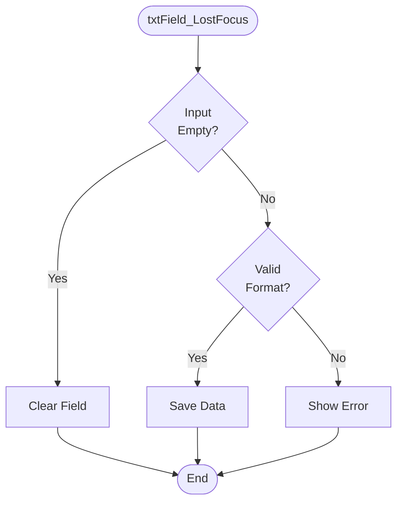

---

### Pattern 2: State Descriptions (Button Enable/Disable)

**ASCII Example**:
```
Initial State:
├─ cmdStart: Disabled
├─ cmdEnd: Disabled
└─ cmdBack: Enabled

After Load:
├─ cmdStart: Enabled
├─ cmdEnd: Disabled
└─ cmdBack: Enabled
```

**Convert to**: `stateDiagram-v2` (Template 2, 12)

**Why**: Describes different states of UI = state diagram

**Mermaid Example**:
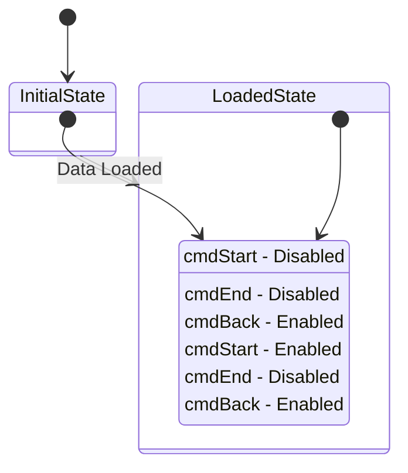

**⚠️ IMPORTANT**: Use dashes (`-`) not colons (`:`) after field names in state descriptions!

---

### Pattern 3: Process Flow with Actions

**ASCII Example**:
```
Suspend Workflow:
├─ Confirm with user (Yes/No dialog)
├─ Collect all current data
├─ Set STATUS = "S"
├─ Set SUSPENDDATE = DateTime.Now
├─ Call _session.Suspend()
└─ Navigate back to menu
```

**Convert to**: `flowchart TD` (Template 5)

**Why**: Sequential actions = workflow flowchart

**Mermaid Example**:
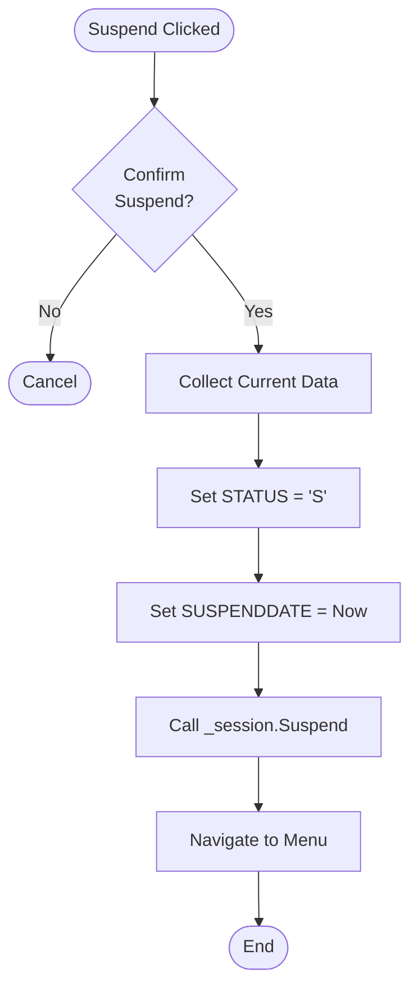

---

### Pattern 4: Validation Rules List

**ASCII Example**:
```
cmdEnd_Click Validation:
├─ txtLengthDetail not empty?
│  ├─ No → Error: "Cutting Length isn't Null"
│  └─ Yes → Continue
├─ txtTension not empty?
│  ├─ No → Error: "Tension isn't Null"
│  └─ Yes → Continue
└─ All pass → Call CUT_UPDATEDATA()
```

**Convert to**: `flowchart TD` (Template 1)

**Why**: Multiple validation checks = decision flowchart

**Mermaid Example**:
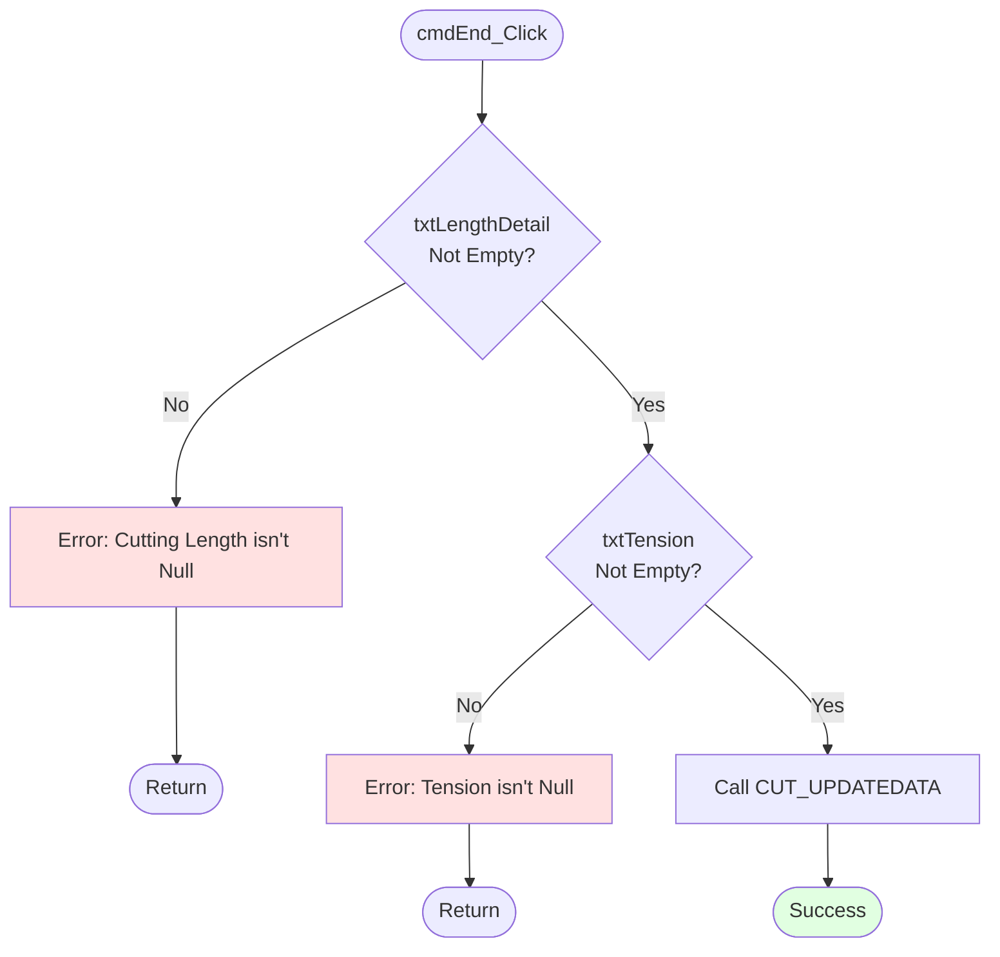

---

### Pattern 5: User Interaction Flow

**ASCII Example**:
```
User → UI: Enter data
UI → Logic: Validate
Logic → DB: Check exists
DB → Logic: Return result
Logic → UI: Show result
UI → User: Display
```

**Convert to**: `sequenceDiagram` (Template 3)

**Why**: Actor interactions over time = sequence diagram

**Mermaid Example**:
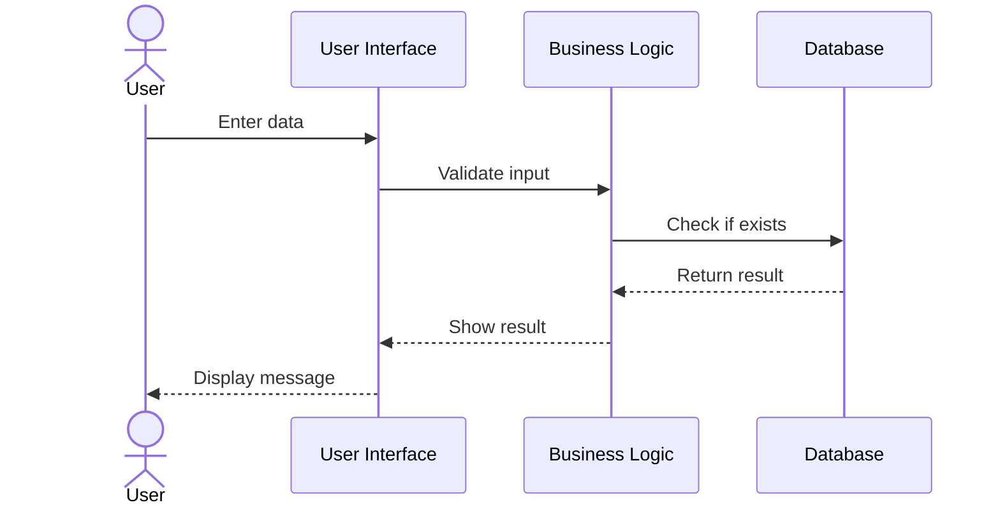

---

### Pattern 6: Authorization Flow

**ASCII Example**:
```
Clear Workflow:
├─ Show dialog (Username, Password, Remark)
├─ Validate credentials
├─ If authorized:
│  ├─ Set STATUS = "C"
│  ├─ Set CLEARBY = username
│  └─ Navigate back
└─ If unauthorized: Show error
```

**Convert to**: `flowchart TD` (Template 7 - Error Handling)

**Why**: Conditional authorization logic = decision flowchart

**Mermaid Example**:
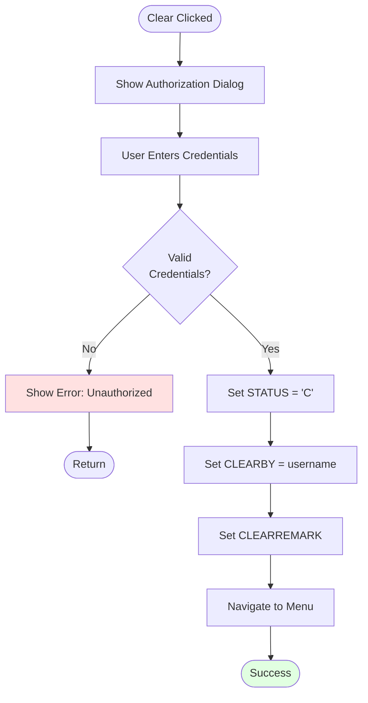

---

### Pattern 7: Barcode Validation

**ASCII Example**:
```
txtBEGINLINE1_LostFocus:
├─ Input empty? → Hide checkmark
└─ Input not empty?
   ├─ Trim whitespace
   ├─ Compare with expected
   │  ├─ Match → Show checkmark
   │  └─ No match → Confirm dialog
   │     ├─ Retry → Clear & refocus
   │     └─ Accept → Store value
```

**Convert to**: `flowchart TD` (Template 10 - Barcode Processing)

**Why**: Barcode-specific validation = specialized flowchart

**Mermaid Example**: See Template 10 in MERMAID_DIAGRAM_TEMPLATES.md

---

### Pattern 8: Grid/List Operations

**ASCII Example**:
```
Grid Operations:
├─ User selects row → Populate form
├─ User clicks Add → Clear form
├─ User clicks Delete
│  ├─ Confirm?
│  │  ├─ Yes → Delete & refresh
│  │  └─ No → Cancel
```

**Convert to**: `flowchart TD` (Template 9 - Grid Operations)

**Why**: CRUD operations on grid = grid operations flowchart

**Mermaid Example**: See Template 9 in MERMAID_DIAGRAM_TEMPLATES.md

---

### Pattern 9: Multi-Branch Decision (Switch/Case style)

**ASCII Example**:
```
Check Customer ID:
├─ ID = "08" → Apply special barcode logic
├─ ID = "05" → Apply premium logic
├─ ID = "03" → Apply standard logic
└─ Other → Show error
```

**Convert to**: `flowchart TD` (Template 8 - Multi-Branch)

**Why**: Multiple branches from one condition = multi-branch flowchart

**Mermaid Example**:
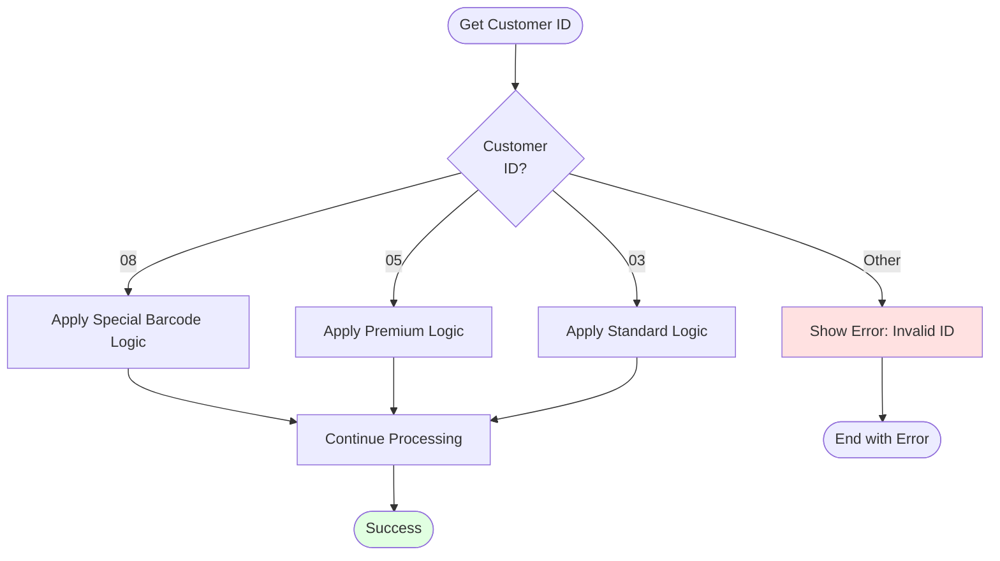

---

### Pattern 10: D365 Integration Sequential Steps

**ASCII Example**:
```
D365_CP():
├─ Step 1: BPO → Get PRODID
├─ Step 2: ISH → Get HEADERID
├─ Step 3: ISL → Insert lines
├─ Step 4: OPH → Get HEADERID
├─ Step 5: OPL → Insert lines
├─ Step 6: OUH → Get HEADERID
└─ Step 7: OUL → Insert lines
```

**Convert to**: `sequenceDiagram` (Template 11 - Complex Sequence)

**Why**: Sequential database operations = sequence diagram

**Mermaid Example**:
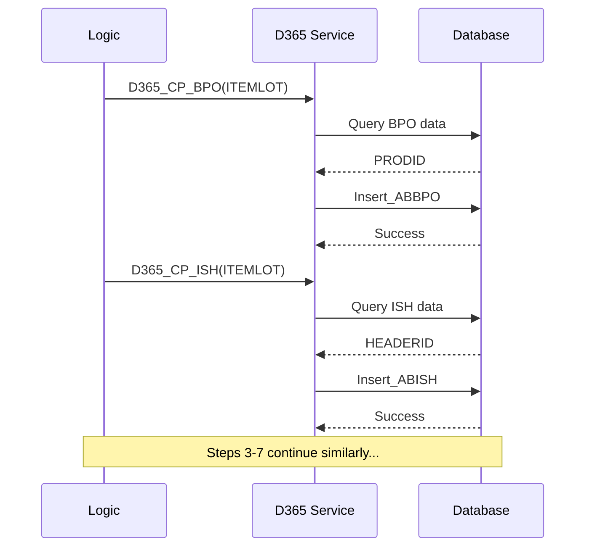

---

## Conversion Rules

### Rule 1: Tree Structure → Flowchart
- Any ASCII with `├─`, `│`, `└─` symbols
- Shows branching logic
- **Use**: `flowchart TD`

### Rule 2: State Descriptions → State Diagram
- Lists of "State: Description"
- Button/control enabled/disabled states
- **Use**: `stateDiagram-v2`
- **⚠️ Important**: Use `-` not `:` in state notes!

### Rule 3: Actor Interactions → Sequence Diagram
- Shows "A → B → C" interactions
- Database queries/responses
- **Use**: `sequenceDiagram`

### Rule 4: Linear Steps → Flowchart
- Sequential actions without branching
- Workflow steps
- **Use**: `flowchart TD` or `flowchart LR`

### Rule 5: Complex Branching → Flowchart
- Multiple if/else conditions
- Switch/case style logic
- **Use**: `flowchart TD`

---

## Common ASCII Patterns to Replace

### ❌ DON'T Use ASCII For:

1. **Validation Logic**
   ```
   ❌ Input not empty?
      ├─ Yes → Process
      └─ No → Error
   ```
   ✅ Use `flowchart TD` instead

2. **State Transitions**
   ```
   ❌ Initial State:
      ├─ Button A: Disabled
      └─ Button B: Enabled
   ```
   ✅ Use `stateDiagram-v2` instead

3. **User Flows**
   ```
   ❌ User → UI → DB → UI → User
   ```
   ✅ Use `sequenceDiagram` instead

4. **Workflow Steps**
   ```
   ❌ Step 1 → Step 2 → Step 3
   ```
   ✅ Use `flowchart LR` instead

### ✅ CAN Use Plain Text For:

1. **Simple Lists** (no branching)
   ```
   ✅ Fields affected:
      - txtWidth1
      - txtWidth2
      - txtWidth3
   ```

2. **Code Snippets** (actual code, not flow)
   ```csharp
   ✅ if (value != null)
      {
          Process(value);
      }
   ```

3. **Error Messages** (simple bullet lists)
   ```
   ✅ Error Messages:
      - "Field is required"
      - "Invalid format"
   ```

---

## Mermaid Syntax Cheat Sheet

### Flowchart Basics
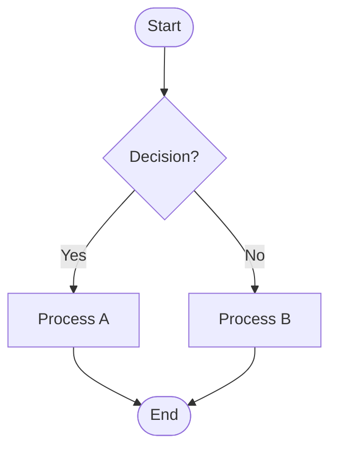

### State Diagram Basics
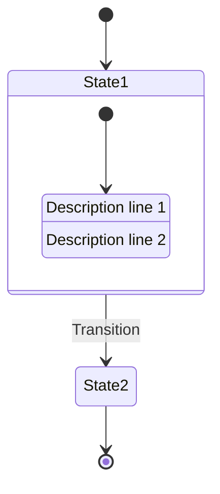

### Sequence Diagram Basics
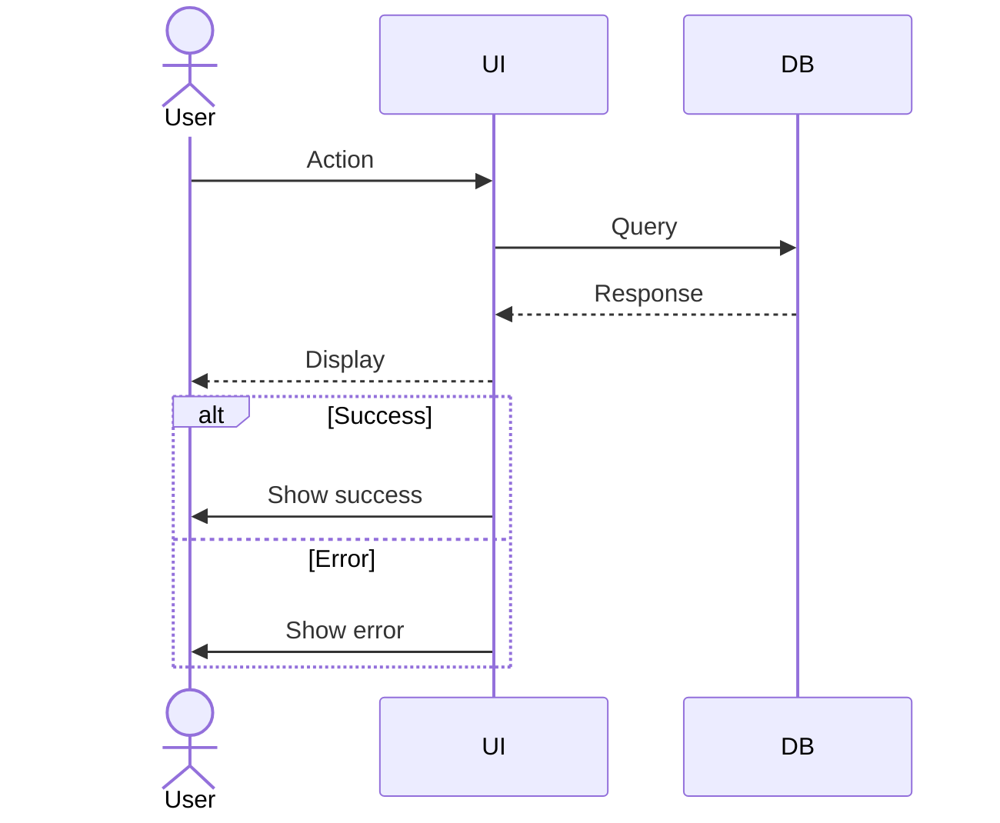

---

## Quick Reference: Which Template to Use?

| Your ASCII Shows... | Use Template | Type |
|---------------------|--------------|------|
| If/else validation | 1 | flowchart TD |
| Button states | 2, 12 | stateDiagram-v2 |
| User → UI → DB | 3, 11 | sequenceDiagram |
| Component layers | 4 | graph TD |
| Linear workflow | 5 | flowchart LR |
| Enable/disable flow | 6 | flowchart TD |
| Try/catch errors | 7 | flowchart TD |
| Switch/case logic | 8 | flowchart TD |
| Grid CRUD ops | 9 | flowchart TD |
| Barcode scanning | 10 | flowchart TD |

---

## Examples from Document 039

### Example 1: Section 4.3 (Barcode Validation)
**Original ASCII**:
```
txtBEGINLINE1_LostFocus:
├─ Input not empty?
│  ├─ Yes → Trim whitespace
│  │  ├─ Compare with txtBatchNo1
│  │  │  ├─ Match? → Show checkmark
│  │  │  └─ No match → Confirm dialog
```

**Converted to**: `flowchart TD` ✅ (See section 4.3 in document)

---

### Example 2: Section 4.1 (Main Workflow States)
**Original ASCII**:
```
Initial State:
├─ cmdStart: Disabled
├─ cmdEnd: Disabled
└─ cmdBack: Enabled
```

**Converted to**: `stateDiagram-v2` ✅ (See section 4.1 in document)

---

## Best Practices

1. **Always use Mermaid for logic/flow** (no ASCII trees)
2. **Use plain text for simple lists** (no need for diagrams)
3. **Choose diagram type based on content**:
   - Logic flow = flowchart
   - State changes = stateDiagram
   - Interactions = sequenceDiagram
4. **Add styling** for visual clarity:
   - `style Start fill:#e1f5ff` (blue for start)
   - `style Error fill:#ffe1e1` (red for errors)
   - `style Success fill:#e1ffe1` (green for success)
5. **Test diagram syntax** before committing (use Mermaid live editor)

---

**Status**: Complete conversion guide
**Templates Available**: 12 validated templates
**All Syntax**: Tested and working ✅
