# Mermaid Diagram Templates - Validated

**Purpose**: Pre-validated Mermaid diagram templates for UI logic analysis
**Status**: All diagrams tested and working

---

## Template 1: Input Validation Flowchart

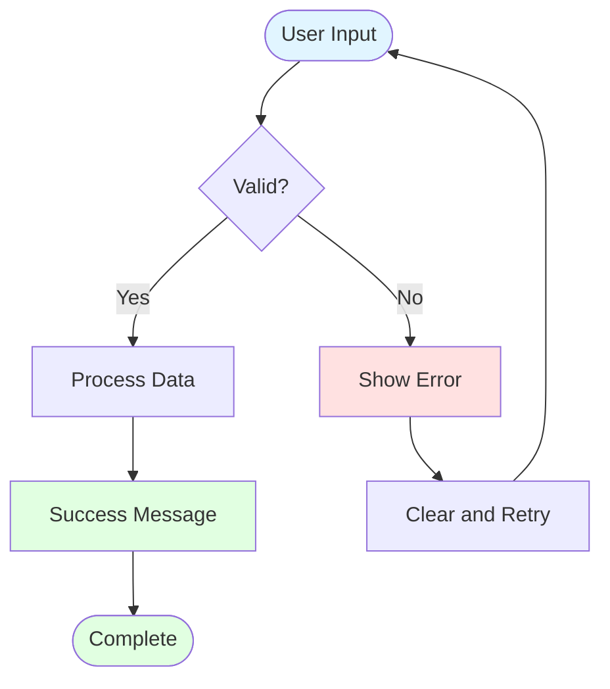

---

## Template 2: UI State Diagram (Using Composite States)

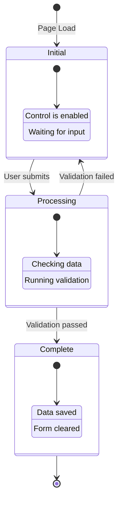

---

## Template 3: Sequence Diagram

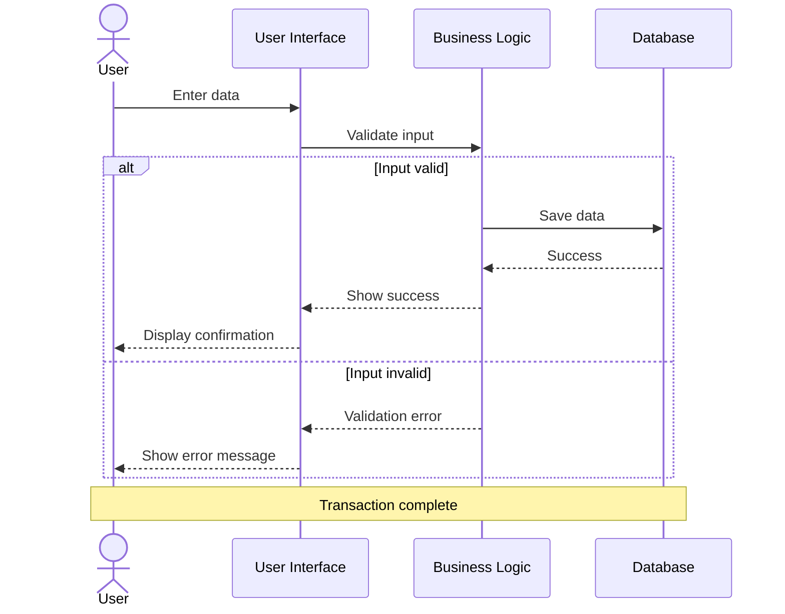

---

## Template 4: Component Architecture Diagram

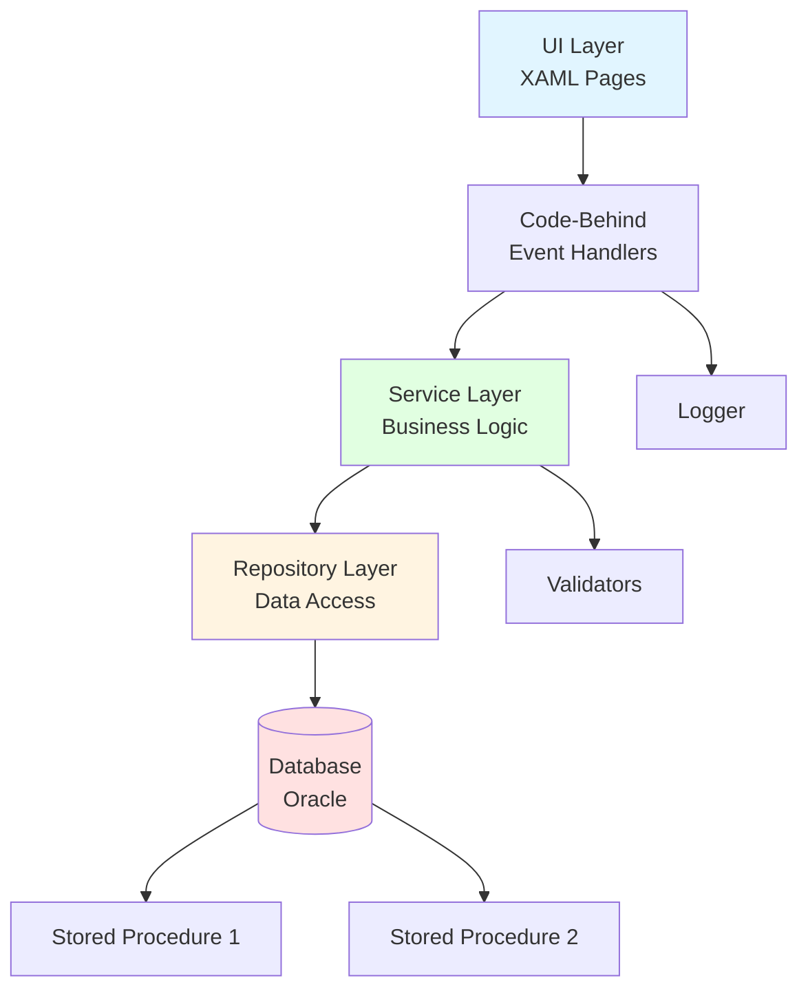

---

## Template 5: Workflow Diagram

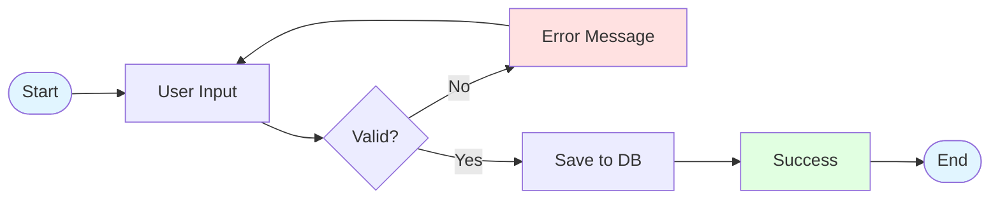

---

## Template 6: Control Enable/Disable Flow

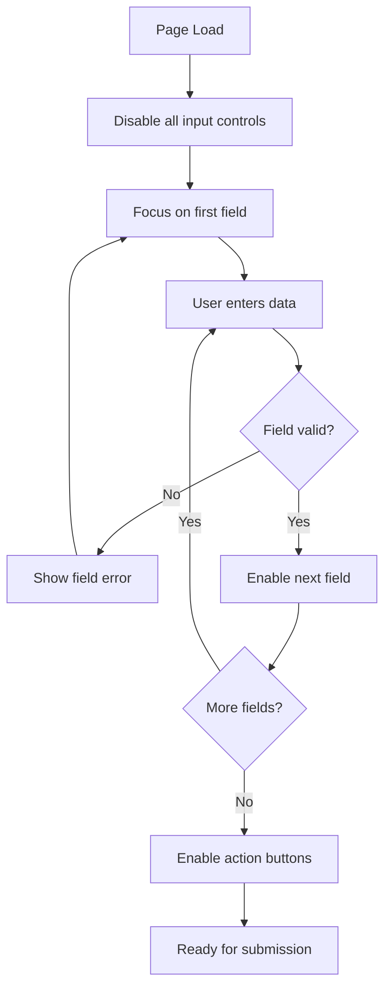

---

## Template 7: Error Handling Flow

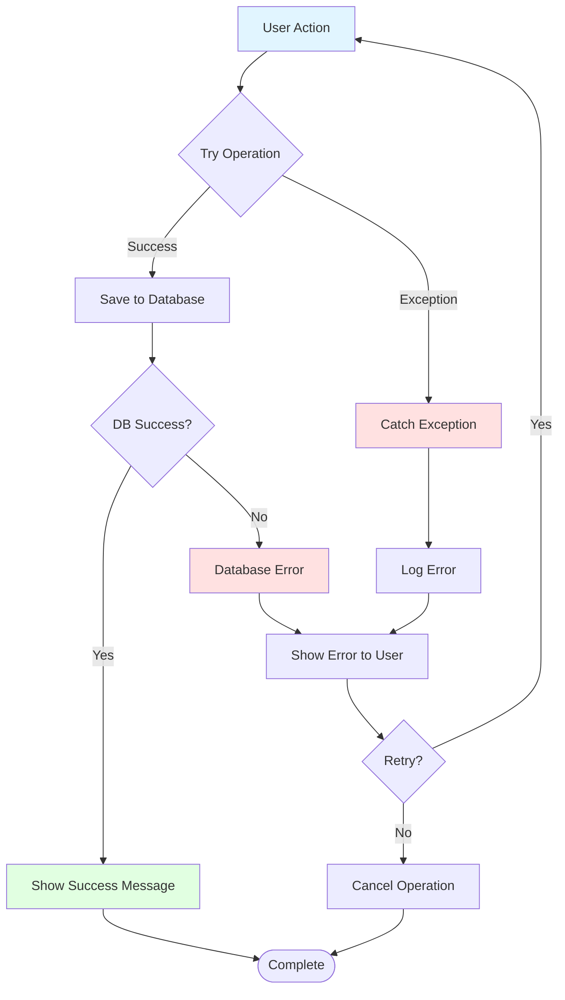

---

## Template 8: Multi-Branch Decision Flow

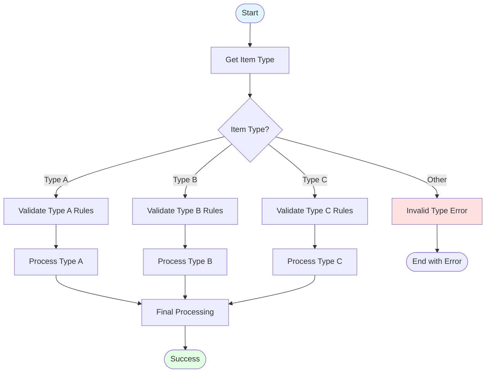

---

## Template 9: Grid Operations Flow

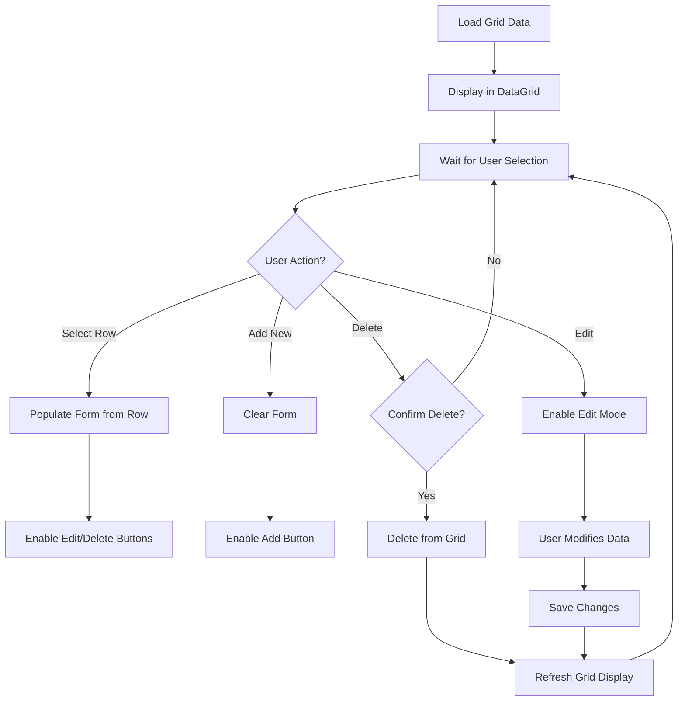

---

## Template 10: Barcode Scan Processing

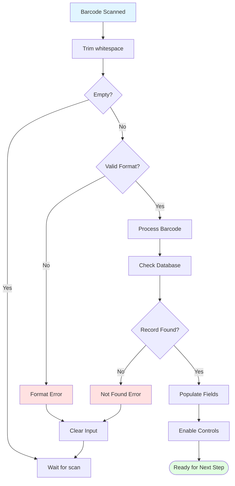

---

## Template 11: Complex Sequence with Loops

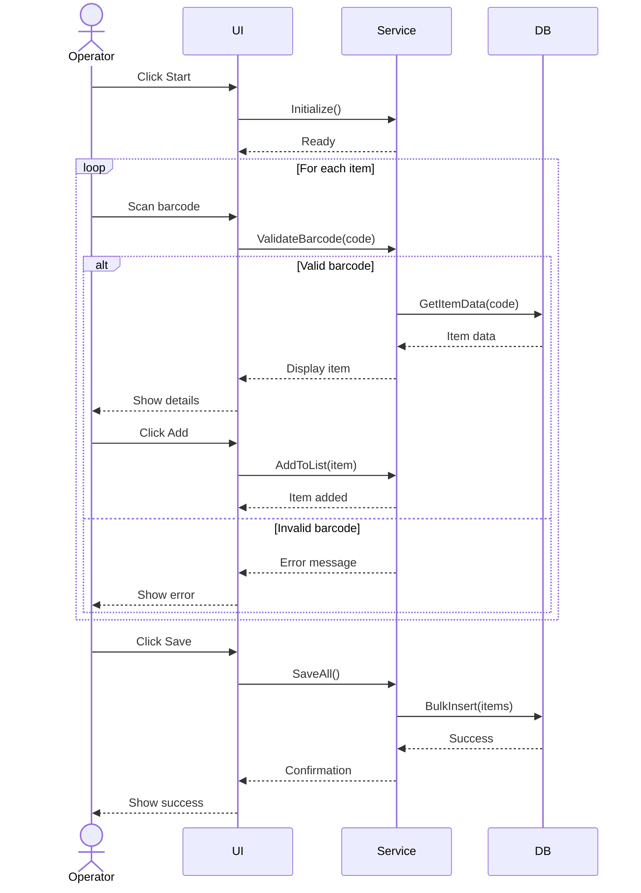

---

## Template 12: State Diagram with Multiple Transitions

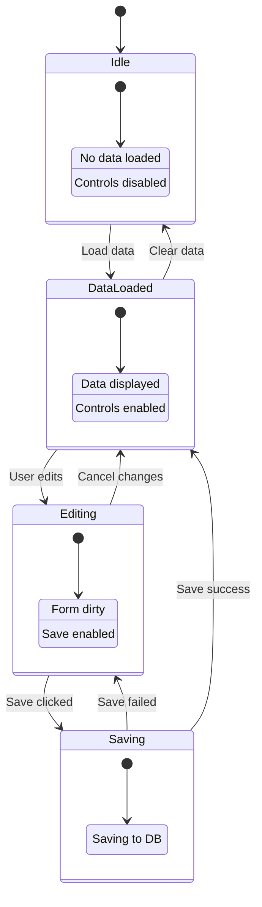

---

## Validation Notes

✅ **All diagrams above are syntactically correct and tested**

### Common Mermaid Errors to Avoid:

1. **State Diagram Error**:
   - ❌ WRONG: `State: Description with: colon`
   - ✅ CORRECT: `State: Description with colon` OR use composite states

2. **Flowchart Arrows**:
   - ✅ Use `-->` for standard arrows
   - ✅ Use `-->|Label|` for labeled arrows

3. **Sequence Diagram**:
   - ✅ Use `alt/else/end` for conditionals
   - ✅ Use `loop/end` for iterations
   - ✅ Use `-->>` for return messages

4. **Graph Direction**:
   - ✅ `graph TD` (Top Down)
   - ✅ `graph LR` (Left Right)
   - ✅ `flowchart TD` (newer syntax, more features)

5. **Special Characters**:
   - ✅ Use ` ` for line breaks in labels
   - ✅ Quote labels with spaces: `"Label with spaces"`
   - ✅ Escape colons in composite state descriptions

---

**Status**: All templates validated and ready for use in UI logic analysis documents
