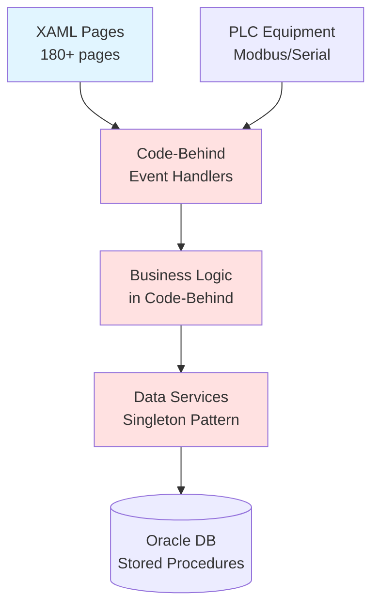
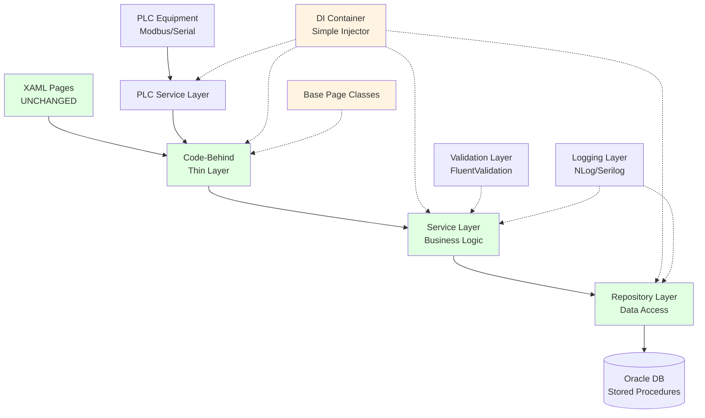
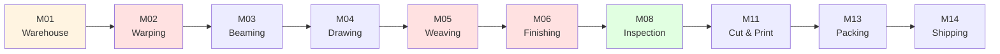

# LuckyTex AirBag MES - Modernization Project

## [!] CRITICAL CONSTRAINT

**MUST use .NET Framework 4.7.2 ONLY**
- NO .NET Core migration
- NO .NET 5+ features
- Maximum C# version: 7.3

See `DOTNET_FRAMEWORK_4.7.2_NOTES.md` for detailed compatibility information.

---

## Project Overview

This is a **large-scale modernization project** for the LuckyTex AirBag Manufacturing Execution System (MES). The goal is to refactor and optimize the codebase while maintaining 100% backward compatibility.

### Current State
- **21 production modules** (M00-M21)
- **~180 XAML pages**
- **21 data service classes** (singleton pattern)
- **Extensive Oracle stored procedures**
- **Multiple PLC integrations** (Modbus TCP/RTU)
- **Code duplication: 60-80%**
- **Testability: 0%** (untestable singletons)

### Target State
- **Code duplication: <20%**
- **Testability: >80% coverage**
- **Dependency injection** throughout
- **Clean separation of concerns** (Repository + Service layers)
- **Reusable base classes** for common patterns
- **Comprehensive logging**
- **XAML and RDLC files unchanged**

---

## Document Navigation

### [>>] Getting Started

**New to this project? Start here:**

1. **MODERNIZATION_QUICKSTART.md** (10-minute read)
   - Quick orientation
   - Key concepts
   - Do's and Don'ts
   - Success criteria

2. **This document** (you are here)
   - Project overview
   - Document navigation
   - Architecture overview

### [i] Understanding the System

**To understand what the application does:**

3. **MODERNIZATION_WORKFLOW.md** (business workflows)
   - Production flow for all 21 modules
   - Business logic sequence diagrams
   - PLC integration patterns (sequence diagrams)
   - Traceability chain
   - Cross-module dependencies

4. **MODERNIZATION_UI_NAVIGATION.md** (screen flows)
   - UI navigation diagrams for all 21 modules
   - Screen-to-screen flows (22 diagrams)
   - User interaction sequences
   - Common UI patterns with flows
   - Cross-module navigation

5. **MODERNIZATION_ANALYSIS.md** (pattern analysis)
   - Codebase inventory
   - Common UI patterns (7 patterns identified)
   - Data access patterns
   - Critical duplication areas (6 areas, 60-80% duplication)
   - Technology stack compatibility

### [*] Ready to Code

**For implementation strategy:**

6. **MODERNIZATION_REFACTORING.md** (8-phase strategy)
   - Phase 1: Foundation Setup (Week 1-2)
   - Phase 2: Data Access Layer (Week 3-6)
   - Phase 3: Service Layer (Week 7-12)
   - Phase 4: Base Page Classes (Week 13-15)
   - Phase 5-8: PLC/Reports/Testing/Deployment
   - Module refactoring order (low to high risk)

7. **DOTNET_FRAMEWORK_4.7.2_NOTES.md** (compatibility reference)
   - What IS available (C# 7.3, async/await, LINQ, etc.)
   - What is NOT available (Span<T>, System.Text.Json, etc.)
   - Recommended libraries with versions
   - DI container options (Simple Injector recommended)

### [#] Tracking Progress

**For session continuity:**

8. **MODERNIZATION_SESSION_TRACKER.md** (progress tracking)
   - Overall progress table (21 modules × 8 phases)
   - Module-by-module checklist (180+ pages)
   - Session log for continuity
   - Next session tasks

---

## Architecture Overview

### Current Architecture (Before Modernization)

**Issues**:
- Business logic mixed with UI logic
- Untestable singleton data services
- 60-80% code duplication across pages
- No dependency injection
- Tight coupling throughout

### Target Architecture (After Modernization)

**Benefits**:
- Clear separation of concerns
- Testable components (dependency injection)
- Minimal code duplication (base classes)
- Consistent patterns throughout
- Easy to maintain and extend

---

## Technology Stack

### Current Stack (Staying)
- .NET Framework 4.7.2
- WPF with XAML
- Oracle Database (System.Data.OracleClient)
- SQL Server (D365 integration)
- RDLC Reports (Microsoft Report Viewer)
- NModbus (PLC communication)
- Newtonsoft.Json

### Adding for Modernization
- Simple Injector (DI container)
- NLog or Serilog (logging)
- FluentValidation (validation framework)
- AutoMapper (object mapping)
- NUnit/xUnit (unit testing)
- Dapper (optional - micro-ORM for performance)

---

## Modernization Principles

### WILL Do
- [x] Create new classes alongside existing code
- [x] Implement dependency injection
- [x] Extract business logic to service layer
- [x] Create repository pattern for data access
- [x] Build reusable base classes
- [x] Add comprehensive logging
- [x] Write unit tests
- [x] Keep XAML files unchanged
- [x] Keep RDLC templates unchanged
- [x] Maintain backward compatibility

### WILL NOT Do
- [ ] Delete existing code (until new code proven)
- [ ] Modify XAML layouts
- [ ] Change database schema
- [ ] Alter stored procedure signatures
- [ ] Use .NET Core features
- [ ] Break existing functionality
- [ ] Rewrite everything at once

---

## Key Modules Overview

### Production Flow Sequence

### Module Complexity Classification

**Low Complexity** (Good starting points):
- M01 - Warehouse (simple CRUD)
- M17 - Master Data (reference data)
- M20 - User Management (isolated)
- M03 - Beaming (simple logic)
- M04 - Drawing (simple logic)

**Medium Complexity**:
- M02 - Warping (PLC integration)
- M11 - Cut & Print
- M12 - G3
- M13 - Packing
- M14 - Shipping
- M16 - Maintenance

**High Complexity** (Refactor later):
- M05 - Weaving (complex PLC, production-critical)
- M06 - Finishing (complex PLC, production-critical)
- M08 - Inspection (complex business rules)
- M15 - Quality Lab (complex calculations)
- M19 - D365 Integration (external dependency)

**System-Wide** (Refactor last):
- M00 - Dashboard (depends on all modules)
- M21 - System Config (system-wide impact)

---

## Common Patterns to Refactor

### Pattern 1: Barcode Scanning (45+ pages)
**Current**: Duplicated KeyDown event handlers
**Target**: BarcodePageBase class

### Pattern 2: CRUD Operations (85+ pages)
**Current**: Duplicated Add/Edit/Delete button handlers
**Target**: CrudPageBase<T> class

### Pattern 3: Production Entry (35+ pages)
**Current**: Duplicated machine/operator selection and status management
**Target**: ProductionEntryPageBase<T> class

### Pattern 4: Report Generation (40+ pages)
**Current**: Duplicated parameter collection and report binding
**Target**: ReportPageBase class

### Pattern 5: PLC Monitoring (12+ pages)
**Current**: Duplicated timer and Modbus/Serial communication
**Target**: PLCMonitorPageBase class

### Pattern 6: Traceability (15+ pages)
**Current**: Duplicated recursive tree building
**Target**: TraceabilityService class

---

## Project Timeline

### Phase-by-Phase (8 Phases, ~24 weeks)

| Phase | Duration | Focus | Risk Level |
|-------|----------|-------|------------|
| 1 - Foundation | Week 1-2 | DI container, logging, base classes | Low |
| 2 - Data Access | Week 3-6 | Repository pattern, entity models | Low-Medium |
| 3 - Service Layer | Week 7-12 | Business logic extraction | Medium |
| 4 - Base Pages | Week 13-15 | UI pattern consolidation | Medium |
| 5 - PLC Integration | Week 16-17 | PLC communication standardization | High |
| 6 - Reports | Week 18-19 | Report generation standardization | Low-Medium |
| 7 - Testing | Week 20-22 | Unit/integration tests, performance | Medium |
| 8 - Deployment | Week 23-24 | Staging, UAT, production rollout | High |

### Module-by-Module (Priority-Based)

**Priority 1** (Weeks 5-6): M01, M17, M20 (foundation modules)
**Priority 2** (Weeks 7-10): M03, M04, M09, M10 (simple production)
**Priority 3** (Weeks 11-14): M02, M11, M12, M13, M14 (medium complexity)
**Priority 4** (Weeks 15-18): M05, M06, M08, M15 (high complexity)
**Priority 5** (Weeks 19-20): M19, M16, M18 (integration modules)
**Priority 6** (Weeks 21-22): M00, M21 (system-wide)

---

## Success Metrics

### Code Quality
- Code duplication: **<20%** (currently 60-80%)
- Unit test coverage: **>80%** (currently 0%)
- Cyclomatic complexity: **<10** average
- Technical debt: **<5%** (measured by SonarQube)

### Performance
- Response time: **<= current performance**
- Memory usage: **<= current levels**
- PLC communication latency: **<100ms**
- Database query time: **<= current performance**

### Maintainability
- **Clear** separation of concerns (UI/Business/Data layers)
- **Consistent** coding patterns across all modules
- **Comprehensive** logging for troubleshooting
- **Updated** documentation for all changes

### Functionality
- **100%** backward compatibility
- **All** existing features working
- **Zero** database schema changes
- **Zero** XAML/RDLC file changes

---

## Session Continuity Strategy

### For Large Codebase Work

This modernization project spans multiple work sessions. To ensure continuity:

1. **Always start** with `MODERNIZATION_SESSION_TRACKER.md`
   - Review last session's work
   - Check overall progress
   - Identify next tasks

2. **During session**:
   - Update tracker as you complete tasks
   - Note any blockers encountered
   - Document decisions made

3. **Before ending session**:
   - Update "LAST SESSION" section
   - Update "NEXT SESSION TASKS"
   - Mark completed modules/phases
   - Commit changes to git

4. **Next session**:
   - Read session tracker
   - Review last session notes
   - Continue where you left off

---

## Quick Start Guide

### For Your First Session

1. **Read this document** (10 minutes)
2. **Read MODERNIZATION_QUICKSTART.md** (10 minutes)
3. **Skim MODERNIZATION_WORKFLOW.md** (20 minutes) - understand business logic
4. **Skim MODERNIZATION_ANALYSIS.md** (15 minutes) - understand current patterns
5. **Read MODERNIZATION_REFACTORING.md Phase 1** (15 minutes) - foundation setup
6. **Open MODERNIZATION_SESSION_TRACKER.md** - track your work

**Total orientation time: ~70 minutes**

### For Subsequent Sessions

1. **Open MODERNIZATION_SESSION_TRACKER.md** (5 minutes)
2. **Review last session notes** (5 minutes)
3. **Start working on next tasks** (as identified in tracker)
4. **Update tracker** as you progress

**Total startup time: ~10 minutes**

---

## Related Documentation

- **CLAUDE.md** (root folder) - Developer guide for Claude Code sessions
- **README.md** (if exists) - General project readme
- **.claude/rules** (if exists) - Project-specific rules

---

## Getting Help

### Documentation Structure Questions
- All workflow questions → `MODERNIZATION_WORKFLOW.md`
- All pattern questions → `MODERNIZATION_ANALYSIS.md`
- All strategy questions → `MODERNIZATION_REFACTORING.md`
- All compatibility questions → `DOTNET_FRAMEWORK_4.7.2_NOTES.md`

### Technical Questions
- .NET Framework limitations → `DOTNET_FRAMEWORK_4.7.2_NOTES.md`
- Business logic understanding → `MODERNIZATION_WORKFLOW.md`
- Architecture patterns → This document + `MODERNIZATION_REFACTORING.md`

### Progress Questions
- What's done? → `MODERNIZATION_SESSION_TRACKER.md`
- What's next? → `MODERNIZATION_SESSION_TRACKER.md` (Next Session Tasks)
- Blockers? → `MODERNIZATION_SESSION_TRACKER.md` (Blockers section)

---

**Document Version**: 1.0
**Last Updated**: 2025-10-05
**Project Status**: Documentation Complete - Ready to Begin Implementation
